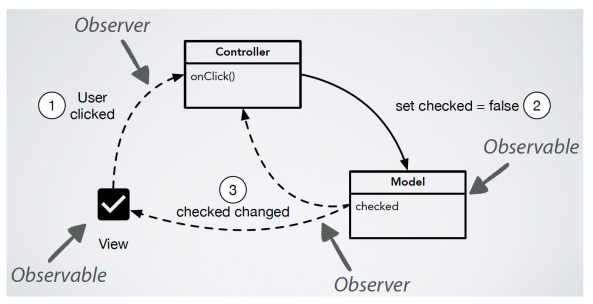
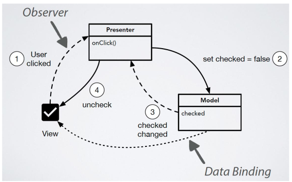
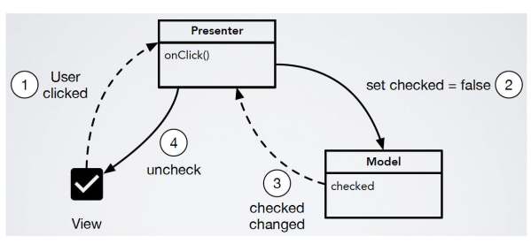
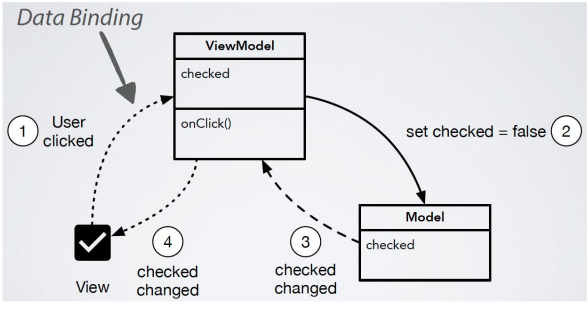

# GUI

## Patterns

### Presentation Model

The problem with a MVC-Model can be where to put calculated states (like if a button is activated or not). It can be worth to put those states in to a presentation model which interacts more with the view and controller, while connecting to the model with observers.

### MVC

### MVP

There are two variants of MVP: the supervising controller and the passive view.

In the MVP pattern, the controller is replaced by the presenter. 

#### MVP - Supervising Controller

In this variant of the MVP pattern, the presenter is allowed to change the view directly without interacting with the model. Another difference between MVC and MVP is that the view connects to the mode with data bindings instead of observers.

#### MVP - Passive View

In this variant, the view only interacts with the presenter, cannot update itself and is fully controlled by the controller. The presenter is connected with observers or properties with the model and the view to receive updates from them.

### MVVM

In the MVVM pattern the view model (aka the controller in MVC) is connected to the view with data bindings in both ways. The view model is also notified of changes in the model with data bindings.

