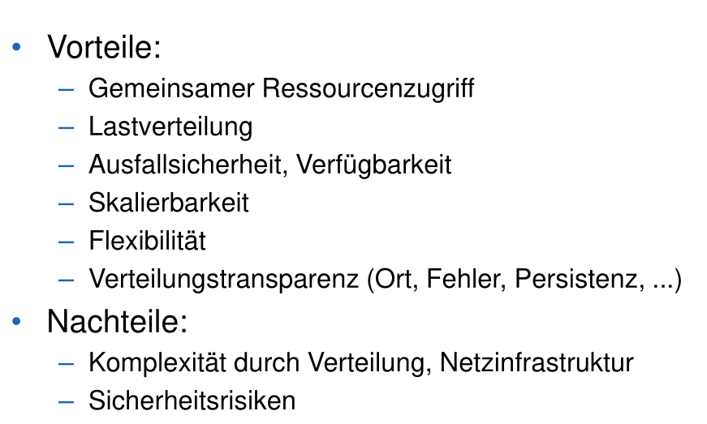
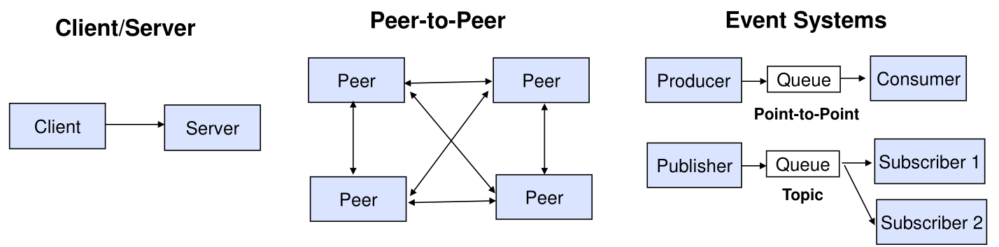
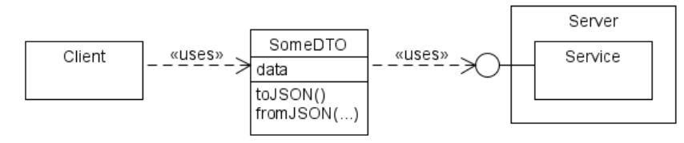
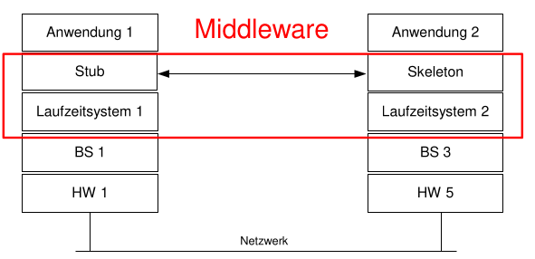
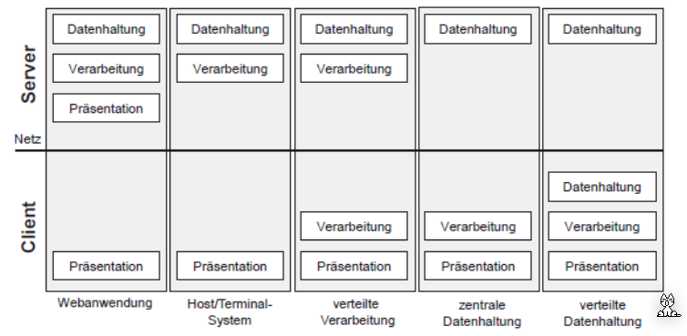
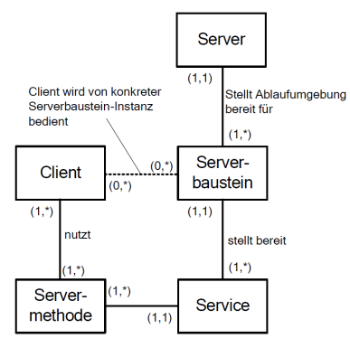
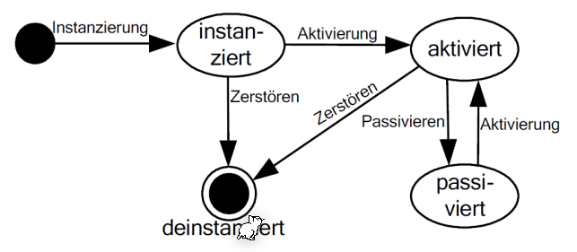

# Verteiltes System

Verteilte System haben typischerweisse folgende Merkmale:

* Sehr gross
* Datenorientierte Anwendung, meist mit Datenbank im Zentrum der Anwendung
* Extrem interaktiv
* Nebenläufig, Grosse Anzahl an parallele arbeitende Benutzen
* Hohe Konsistenzanforderungen

Folgendes sind populäre Architekturen für verteilte Systeme:

## Data Transfer Object (DTO)

## Heterogenität

Verschiedene Systeme haben verschiedene Standardt (Little vs Big Endian, Betriebsysteme, ...). Um dies zu bekämpfen gibt es Standarts, wie JSON, welche das versenden von Daten vereinfachen.

## Client-Server Anwendung

Wo bei einer Client-Server Anwendung die einzelnen Layern (DAtenhanltung, Verarbeitung, Presentation) lauft ist nicht fix, wie folgendes Diagramm demonstriert:

### Zusätzliche Fehlersituationen

* ein Auftrag (engl. request) verloren geht
* das Ergebnis (engl. reply) des Servers verloren
  geht
* der Server während der Ausführung des Auftrags
  abstürzt
* der Server für die Bearbeitung des Auftrags zu
  lange braucht
* der Client vor Ankunft des Ergebnisses abstürzt.

### Terminologie

* Ein Server ist die Platform von Serverbausteinen, welche in einem Server laufen
* Ein Serverbaustein ist ein Komponent/Klasse/Modul, welches bei einem Request einem Client zu geordnet wird
* Ein Service ist ein Dienst, welcher von einem Serverbaustein bereitgestellt wird
* Eine Servermethod (oder Serverprozedur) ist ein Teil eines Service und kann vom Client genutzt werden, in dem ein Request geschickt wird.

Im folgenden Diagramm sieht man den Lebenszyklus eines Serverbaustein:

