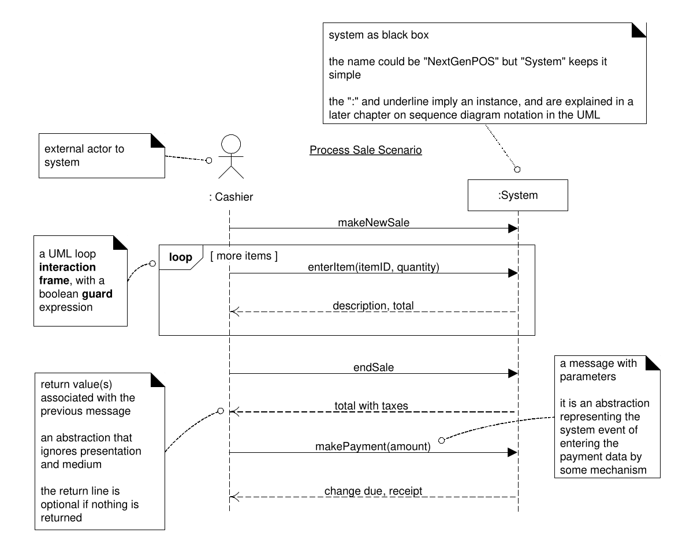
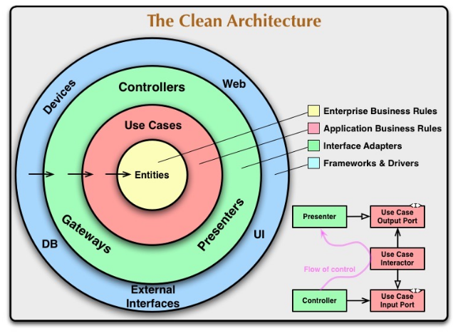

# SWEN1 Zusammenfassung

## Fragen

* Domainmodelierung
  * Ist es ok Klassen, wie "PaymentState" im  Domain-Modell zu haben? Dies klingt nach einer Software-Klasse.

## Todos

* Templates:
  * Persona
  * Use Case
  * Class Diagram
  * Domain Model
  * Stake Holder Map

## Anforderungsanalyse

### UX

Gute Usability einer Software:

* **Effekivität**: Der Nutzer kann die Aufgaben mit gewünschter Genauigkeit ausführen
* **Effizient**: Der Nutzer kann die Aufgaben mit minimalem Aufwand ausführen
* **Zufriedenheit**: *selbsterklärend...*

UX ist, wie gut sich die App anfühlt, Customer Experience, wie der Gesammteindruck der App, Marke und Firma ist.

Es gibt **sieben Anforderungsbereiche** der Usability (laut DIN EN ISO 9241-110). Je nach Applikation sind nicht alle wichtig oder treffen gar nicht zu.

1. Aufgabenangemessenheit
   Eine Aufgabe soll nur so viele Schritte benötigen, wie minimal nötig. Ebenfalls soll nur Informationen angezeigt werden, welche für die aktuelle Aufgabe relevant ist (z.B. Hilfe). 
   Jede Eingabe sollte nur einmal getätigt werden und Eingabefelder sollen Standartwerte oder/und Liste von vordefinierten Werte habe (z.B. Länder). Zudem sollen ableitbare Eingaben vorgeschlagen werden.
2. Lernförderlichkeit
   Die Software soll Informationen über Konzepte und Regeln anbieten, wenn der Nutzer dies wünscht. Dies kann beispielsweise über Tool-Tipps oder Hilfssystem bewerkstelligt werden.
3. Individualisierbarkeit
   Die Applikationen soll sich dem Benutzer anpassen. Dies kann getan werden über Tipps, Tool-Tips, Wizards oder auch Tastaturkürzel für Experten.
4. Erwartungskonformität
   Die Applikation soll strickt interne Regeln anwenden. Die Konsistenz von der Terminologie, Reihenfolgen von Knöpfen und Informationsdarstellung sind wichtig und helfen dem Nutzer.
5. Selbstbeschreibungsfähigkeit
   Der Benutzer soll ausreichend informiert werden, wo er ist, was er tun soll und kann, wie er dies zu tun hat (z.B. Formate) und was das System macht.
   Dabei können Dinge wie Labels und Fehlermeldung hilfreich sein.
6. Steuerbarkeit/Kontrolle
   Der Benutzer soll das Tempo und Dialogfluss steuern können. Ebenfalls soll der Benutzer zwischen verschiedenen Inputsmodalitäten (Maus, Tastatur, Touch, ...) wechseln können. Darstellungsformate (Miles vs Kilometer) sollen einstellbar sein.
7. Fehlertoleranz
   Die Applikation soll dem Nutzer klar mitteilen, welche Werte als Input erwartet werded. Benutzeraktionen sollen zudem vor Aktionen überprüft werden. Bei Korrekturen und Fehlermeldungen dürfen **nie** Daten verloren gehen.

### User-Centered Design

#### User & Domain Research

In dieser Phase geht es darum die Nutzer, ihr Umfeld und die Domäne zu verstehen. Dafür sollten folgende Fragen beantwortet werden:

* Über den Nutzer:
  * Wer sind die Benutzer?
  * Was sind ihre Arbeit, ihre Aufgaben und Ziele?
  * Wie sieht ihre Umgebung aus?
  * was brauchen sie, um ihre Ziele zu erreichen
  * Welche Begriffe verwenden sie?
  * Welche Normen sind wichtig für sie (organisatorisch, kulturell, sozial)?
  * Was sind Pain-Points in ihrer Arbeit?
* Über die Domäne
  * Wie funktioniert das Geschäft der Firma?
  * Was sind wichtige Konzepte, und Prozesse der Domäne?
* Bei mobile Apps:  Wo, wann und warum wird das App benützt?

Um diese Fragen zu beantwortet können mehrere Tools benutzt werden: Contextual Inquiry, Interviews, Beobachtung, Fokusgruppen, Umfragen, Nutzungsauswertungen, Dokumentenstudium & Mitbewerber studieren.

Folgende Artifakte sollten nach diesem Schritt vorhanden sein: Personas, Usage-Szenarien, Mentales Moddel, Domänenmodell (Siehe [Domainmodellierung](Domänemodellierung.md)), Stackeholder Map, Service Blueprint / Geschäftsprozessmodell, UI-Skizzen, Wireframes

##### Contextual Inquiry

In diesem Verfahren wird ein Nutzer, welcher sein Job erledigt, von einem Experten beobachtet. Der Experte kann während des Beobachtens Fragen stellen.  Der Nutzen davon ist, dass Nutzer ihre Arbeit demonstrieren können.

##### Contextual Interview

Wird in Strukturierte(geschlossene Fragen, vollständige vorbereitet, aka. mündlichen Fragebogen), Semi-struturierte (geschlossene und offene Fragen, davon einige vorbereitet, der Rest abhängig von der Situation) und unstrukturierte Interviews (keine vorbereitete Fragen, nur grobe Ziele definiert) unterteilt. 

##### Persona

Folgendes sollte aufgeschrieben werden:

* Name, Alter, Geschlecht, Herkunft
* Beruf, Ausbildung, Erfahrung
* Verantwortlichkeiten, Aufgaben, Persönliche Ziele
* 1 - 2 Usage Szenarien
* Haltung, Aktivitäten, Bedürfnisse
* Umgebung
* Pain-Points und Frustrationen
* Erwartungen an neue Lösung
* Foto, Kernaussage

##### Usage- & Context-Szenario

Ein Szenario ist eine kurze Geschichte, welche beschreibt, wie ein Benutzer (Persona) das Produkt in einer konkreten Situation benützt, um eine bestimmte Aufgabe zu erledigen.

Dabei wird zwischen einer **Usage-Szenario**, was beschreibt, wie das Problem bis her gelöst wurde, und einem **Context-Szenario**, was beschreibt, wie das Problem in der Zukunft gelöst wird, unterschieden.

Typischerweise ist folgendes enhalten:

* Motivation/Trigger: Was löst das Szenario aus?
* Persona und ihre Ziele
* Aktionen und Interaktionen
* Kontext
  * Wo findet das Szenario statt?
  * Wer/was ist sonst noch involviert?
  * (für Context-Szenario) Ändert der Kontext?
* Probleme und wie damit umgegangen wird

Ein Szenario kann auch als Storyboard umgesetzt werden.

##### Stakeholder Map

##### Service Blueprint / Geschäftsprozess

### Use-Case

Der **Boss-Test** besagt, falls dein Boss dich frag, was du den ganzen Tag gemacht hast und du sagst, du hast die ganze Zeit den einen Use-Case ausgeführt, sollte er zufrieden sein.

Der **Elementary Business Process Test** (EBP-Test) besagt, dass ein Use Case eine Aufgabe, die von einer Person und einem Ort zu einer bestimmten Zeit ausgeführt wird, als Reaktion auf einen Business Event.

**Wichtig bei Use-Cases:** Das Ping-Pong zwischen den Akteure und dem System gut herausarbeiten.

Checkliste:

* Muss ein konkreten Nutzen für den Akteur erzeugen

* Title folgt dem Schema `Kasse eröffnen`

* Beschreibung beschreibt die Logik, **nicht** die konkrete Umsetzung ("Kassier tippt die Produkt-ID ein." vs "Kassier erfasst das Produkt.")

* Keine kann-Formulierungen

* Alternative Interaktionen sind unter Erweiterungen aufgeführt

  

Use-Case finden: 

1. Systemgrenzen definieren
2. Primärakteure identifizieren
3. Jobs (Ziele, Aufgaben) der Primärakteure identifizieren

#### Brief Use-Case

Ein Brief Use-Case wird meistens zu Beginn erstellt. In ein Brief Use-Case kommt folgendes enhalten werden:

* Nur Erfolgsszenario
* Trigger des Use-Case
* Akteure
* Summarischen Ablauf des Use-Case

#### Casual Use-Case

Ein Casual Use-Case wird ebenfalls zu Beginn der Analyse verwendet und enthält folgendes:

* Erfolgsszenario & wichtigste Alternativszenarien
* Trigger des Use-Case
* Akteure
* Summarischen Ablauf des Use-Case

#### Fully-dressed Use-Case

* Use-Case-Name

  Aktiv formulieren (ev. Objekt + Verb)

* Umfang (Scope)
  Beschreibung des zu entwickelnde System

* Ebene (Level)

* Primärakteur (Primary Actor)
  Die Primärakteure und wer den Use-Case initiert

* Stakeholders und Interessen
  Für wen den Use-Case sonst noch relevant ist und welche Interesse diese haben

* Vorbedingungen (Preconditions)
  Voraussetzungen, damit der Use-Case ablaufen kann

* Erfolgsgarantie/Nachbedingungen (Success
  Guarantee)
  Was nach der Ausführung gewährleistet werden muss

* Standardablauf (Main Sucess Scenario)
  Der "normale" Ablauf in einer nummerierten Liste, aber keine Lösungsdetails

* Erweiterungen (Extensions)

  Alternative Erfolgs- und Misserfolgsszenarien

* Spezielle Anforderungen (Special
  Requirements)

* Liste der Technik und Datavariationen
  (Technology and Data Variations)

* Häufigkeit des Auftretens (Frequency of
  Occurance

* Verschiedenes (Miscellaneous)

### Zusätzliche Anforderungen

Anforderungen (funktional, wie nicht funktional) , welche nicht in Use-Cases passen, werden in Anforderungsspezifikationen formuliert. 

* Schema: "Das System soll/muss mindestens/darf nicht..."
* Muss messbar und verifizierbar sein
* **KEINE** Lösungsideen (aka. Das System muss eine Web-App sein)

#### FURPS+

### Systemsequenzdiagram

Ziel: Wichtigsten Systemoperationen zu identifizieren

Um Systemoperationen zu finden: Jeden Schritt des Akteurs analysieren, welche Systemoperationen benötigt werden. Checkliste:

* Systemoperation sind aus sicht des Akteur geschrieben.
* Zeitform ist presenz

### Operation Contract

Präzisierung einer (System) Operation mit: Name, Parameterliste, Vorbedingungen, Nachbedinungen

Vorbedingungen müssen zwingend erfüllt sein, bevor die Systemoperation aufgerufen werden kann. Nachbedingungen müssen erfüllt sein, nach der Ausführung der Systemoperation.

## Domänenmodellierung

## Anleitung

1. Konzept identifizieren (Jedes Substantiv in vorherigen Artifakten überprüfen)
2. Attribute zu Konzepte hinzufügen 
   Nur primitiven Typen sollten verwendet werden
3. Komplexe Attribute zu Konzepte hinzufügen
   Komplexe Datentypen sollten als separate Konzepte erstellt werden und mit einer Assoziation verbunden werden
4. Konzepte verbinden

Dabei ist wichtig daran zu decken, dass unwichtige Konzepte weggelassen werden können. Ebenfalls ist das Domänenmodell nicht repräsentativ der endgültig Klassen.

Folgende Antipattern sollten vermieden werden:

* Keine komplexe Datentype als Attribute
* Keine "Software" Klassen (z.B. `SalesDatabase`)
* Keine Methoden auf den Konzepte

#### Tipps

* Wenn Attribute für viele/alle Objekte gleich sind, dann in ein separates Konzept extrahieren

* Sepzialisieren und Generalisierung

  * Alle Instanzen eines spezialisierten Konzept müssen auch Instanzen des generalisierten Konzept sein

  * Spezialisiertes Konzept `is a` generalisiertes Konzept

    

* Komposition und Komposition

  

* Zustände (Separate Hierarchie für die Zustände, ähnlich wie das State-Pattern)

  

* Rollen
  Möglichkeiten: Einzelnes Konzept (wie Person), welches mit verschiedenen Assoziationen (wie emplys-to-manage, ...) verbunden ist. Zweite Möglichkeite: Anstelle von einem Konzept gibt es für jede Rolle ein eigenes Konzept
  

* Assoziationsklassen
  

* Einheiten
  Oft sinnvoll Masseinheiten als Konzept zu modelieren

## Software Engineering

> **Modulkonzept**:
> Jedes Modul hat eine möglichst kleine Kopplung, eine klare minimale Schnittstelle und enthält alle benötigten Funktionen und Datenstrukturen. Ein Modul kann ein Paket, Programmierkonstrukt, LIbrary, ... sein.
>
> Zwischen den Modulen gibt es eine schwache Kopplung. Innerhalb eines Moduls gibt es hingegen eine starke Kopplung und hohe Kohäsion.

### Clean Architeture

Entites kapseln die Business Rules, Use-Cases orchestriert die Verwendung von den Entities, Interface Adapters übersetzen externe Bibliotheken zu den internen Strukturen.

### N+1 View Model

* Logical View: Welche Funktionalität wird gegen aussen angeboten? (Sequenzdiagram, Interaktionsdiagram, Klassendiagram, Zustandsdiagram)
* Process View: Welche Prozesse laufen wo und wie ab? (Klassendiagram, Interaktionsdiagram, Aktivitätsdiagram)
* Development View: Wie wurde die logische Struktur umgesetzt? (Packetdiagram, Komponentdiagram)
* Physical View: Auf welcher Infrastruktur wir ein System augeliefert/betrieben? (Deployment Diagram)
* +1: Welches sind die wichtigsten Use-Cases und ihre nichtfunktionalen Anforderungen? Wie wurden sie umgesetzt? (UC-Diagram,  Sequenzdiagram)

### Schichtenkonzept

Je weiter oben, desto anwendungs-spezifischer, je weiter unten, desto algeimeiner. Komplung **immer von oben nach unten**.

### GRASP (General REsponsibility Assignment Software Patterns)

## Implementierung

* Code-Driven Development: Zuerst die Klasse implementieren
* TDD: Test-Driven Development: Zuerst Tests für Klassen/Komponenten schreiben, dann den Code entwickeln
* BDD: Behavior-Driven Development: Tests aus Benutzersicht beschreiben

## Refactoring

