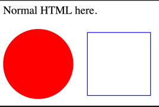

# 	DOM

## Event Handling

An event handler can be registered with any DOM element.

One caveat of  the `onclick` property is that only one `onclick` listener can be register per elements. No such restriction exists with `addEventListener`

```js
const listener = e => console.log(`button clicked at ${e.x}/${e.y}`)
button.addEventListener("click", listener)
// or
button.onclick = () => console.log("button clicked 2")

// to remove the listener
button.removeEventListener("click", listener)

```

| Event Type     | Explanation                                                  | Event-Obj           |
| -------------- | ------------------------------------------------------------ | ------------------- |
| `click`        | When a DOM element was clicked by a mouse/touch              | `x`,  `y`, `button` |
| `dblclick`     | When an DOM element was double clicked                       |                     |
| `mousedown`    | When a mouse button is pressed over the DOM element          | `x`, `y`, `button`  |
| `mouseup`      | When the mouse button was released                           |                     |
| `touchstart`   | When a touch event was started.                              |                     |
| `touchmove`    | When while touching the screen, the finger moves             |                     |
| `touchend`     | When the touch gesture ends                                  |                     |
| `keydown`      | When a key was pressed                                       |                     |
| `keyup`        | When a key was lifted                                        |                     |
| `input`        | When a character was inputted into a textfield               |                     |
| `scroll`       | When the page is being scrolled                              |                     |
| `focus`        | When focusing an element. This event is not propagated.      |                     |
| `blur`         | When the registered element looses focus. This event is not propagated. |                     |
| `load`         | When the registered element finished loading. Is emitted for `window`,  `document.body` and elements with external resources (like `img` tags). This event is not propagated. |                     |
| `beforeunload` | Before the user leaves the page.This event is not propagated. |                     |

### Event Object

*MDM-Documentation:* https://developer.mozilla.org/en-US/docs/Web/API/Event

The event objects contains multiple properties which can be usefull:

| Event-Typ | Property        | Explanation                                         |
| --------- | --------------- | --------------------------------------------------- |
| general   | `target`        | The element which caused the event                  |
| general   | `currentTarget` | The element on which the listener was registered on |
|           |                 |                                                     |

### Event Bubbling

An event "bubbles up" until it reaches the `window` object or a handler calls `event.stopPropagation()`. With `event.preventDefault()` the default behaviour of an DOM element can be prevented.

```js

document.querySelector("p").addEventListener("mousedown", () => console.log("Handler for paragraph."))

document.querySelector("button").addEventListener("mousedown", event => { 
	console.log("Handler for button.")
	if (event.button == 2) event.stopPropagation()
}
                                                  
                                                 document.querySelector("a").addEventListener("click", event => { 
	console.log("Handler for a link.")
	event.preventDefault() // prevents the link from working
}
```

### Animation

`requestAnimationFrame(function)` will call the given function shortly before the browser draws the next frame. This enables animation to be created in javascript.

```js
function animate (time, lastTime) {
    /* calculate new position */
    /* ... */
	requestAnimationFrame(newTime => animate(newTime, time))
}

requestAnimationFrame(animate)
```

## SVG

SVG can be directly written in HTML with the `svg` tag and can be styled with css. SVGs can also be loaded with the `img` tag.

```html
<p>Normal HTML here.</p>
<svg xmlns="http://www.w3.org/2000/svg">
    <circle r="50" cx="50" cy="50" fill="red"/>
    <rect x="120" y="5" width="90" height="90"
    stroke="blue" fill="none"/>
</svg>
```



JavaScript can access and modify SVG graphics (when loaded with `svg`), like:

```javascript
let circle = document.querySelector("circle")
circle.setAttribute("fill", "cyan")
```

## Canvas

With a canvas, JavaScript can render graphics.

```html
<p>Before canvas.</p>
<canvas width="120" height="60"></canvas>
<p>After canvas.</p>
<script>
    let canvas = document.querySelector("canvas")
    let context = canvas.getContext("2d")
    context.fillStyle = "red"
    context.fillRect(10, 10, 100, 50)
</script>
```

With canvas, there are turtle-like graphics:

```javascript
let cx = document.querySelector("canvas").getContext("2d")
cx.beginPath()
cx.moveTo(50, 10)
cx.lineTo(10, 70)
cx.lineTo(90, 70)
cx.fill()
```


An image can be loaded like this:

```js
let cx = document.querySelector("canvas").getContext("2d")
let img = document.createElement("img")
img.src = "img/hat.png"
img.addEventListener("load", () => {
    for (let x = 10; x < 200; x += 30) {
    	cx.drawImage(img, x, 10)
    }
})
```


There are a lot more you can do with a `canvas` tag, like `quadraticCurveTo`, `bezierCurveTo`, `arc`, text, `scale`, `translate`, `rotate` and a stack infrastructure with `save` and `restore`.

## Local Storage and Session Storage

With `localStorage` and `sessionStorage`, data can be stored on the browser.

```javascript
let user = {name: "Hans", highscore: 234}
localStorage.setItem("user", JSON.stringify(user))
console.log(localStorage.getItem("user"))
```

## History

## Web Workers

With web workers, JavaScript can run code in a separate thread. However, the web worker has to communicate with the frontend code over events to avoid locking.

```js
// squareworker.js
addEventListener("message", event => {
	postMessage(event.data * event.data)
})
// main script
let squareWorker = new Worker("code/squareworker.js")
squareWorker.addEventListener("message", event => {
	console.log("The worker responded:", event.data)
})
squareWorker.postMessage(10)
squareWorker.postMessage(24)
```

