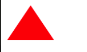
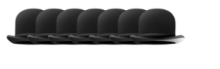
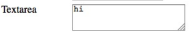
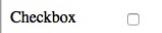
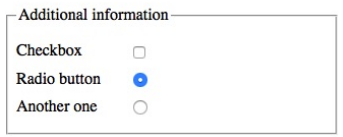

# 	DOM

The DOM is a tree structure. Every node has a `nodeType` attribute.

| Node Type | Constant            | Explaination  |
| --------- | ------------------- | ------------- |
| 1         | `Node.ELEMENT_NODE` | "normal" tags |
| 3         | `Node.TEXT_NODE`    | Text nodes    |
| 8         | `Node.COMMENT_NODE` | Comment nodes |

The children of a node can be retrieved by either `node.childNodes` which returns a `NodeList` or by `node.children` which returns an `HTMLCollection`. The `HTMLCollection` only contains element nodes.

## Find Elements

```js
let aboutus = document.getElementById("aboutus")
let aboutlinks = aboutus.getElementsByTagName("a")
let aboutimportant = aboutus.getElementsByClassName("important")
let navlinks = document.querySelectorAll("nav a")
```

## Modifiy the DOM

The DOM can be modified with the methods `parent.appendChild(node)`, `parent.insertBefore(node, sibling)` and `node.remove()` (removes itself).

To create a new node, methods like `document.createElement(type)`, `document.createAttribute(name)`, `element.setAttributeNode(attributeObj)` are useful.


```js
```


## Event Handling

An event handler can be registered with any DOM element.

One caveat of  the `onclick` property is that only one `onclick` listener can be register per elements. No such restriction exists with `addEventListener`

```js
const listener = e => console.log(`button clicked at ${e.x}/${e.y}`)
button.addEventListener("click", listener)
// or
button.onclick = () => console.log("button clicked 2")

// to remove the listener
button.removeEventListener("click", listener)

```

| Event Type     | Explanation                                                  | Event-Obj           |
| -------------- | ------------------------------------------------------------ | ------------------- |
| `click`        | When a DOM element was clicked by a mouse/touch              | `x`,  `y`, `button` |
| `dblclick`     | When an DOM element was double clicked                       |                     |
| `mousedown`    | When a mouse button is pressed over the DOM element          | `x`, `y`, `button`  |
| `mouseup`      | When the mouse button was released                           |                     |
| `touchstart`   | When a touch event was started.                              |                     |
| `touchmove`    | When while touching the screen, the finger moves             |                     |
| `touchend`     | When the touch gesture ends                                  |                     |
| `keydown`      | When a key was pressed                                       |                     |
| `keyup`        | When a key was lifted                                        |                     |
| `input`        | When a character was inputted into a textfield               |                     |
| `scroll`       | When the page is being scrolled                              |                     |
| `focus`        | When focusing an element. This event is not propagated.      |                     |
| `blur`         | When the registered element looses focus. This event is not propagated. |                     |
| `load`         | When the registered element finished loading. Is emitted for `window`,  `document.body` and elements with external resources (like `img` tags). This event is not propagated. |                     |
| `beforeunload` | Before the user leaves the page.This event is not propagated. |                     |

### Event Object

*MDM-Documentation:* https://developer.mozilla.org/en-US/docs/Web/API/Event

The event objects contains multiple properties which can be usefull:

| Event-Typ | Property        | Explanation                                         |
| --------- | --------------- | --------------------------------------------------- |
| general   | `target`        | The element which caused the event                  |
| general   | `currentTarget` | The element on which the listener was registered on |

### Event Bubbling

An event "bubbles up" until it reaches the `window` object or a handler calls `event.stopPropagation()`. With `event.preventDefault()` the default behaviour of an DOM element can be prevented.

```js

document.querySelector("p").addEventListener("mousedown", () => console.log("Handler for paragraph."))

document.querySelector("button").addEventListener("mousedown", event => { 
	console.log("Handler for button.")
	if (event.button == 2) event.stopPropagation()
}
                                              
                                                 document.querySelector("a").addEventListener("click", event => { 
	console.log("Handler for a link.")
	event.preventDefault() // prevents the link from working
}
```

### Animation

`requestAnimationFrame(function)` will call the given function shortly before the browser draws the next frame. This enables animation to be created in javascript.

```js
function animate (time, lastTime) {
    /* calculate new position */
    /* ... */
	requestAnimationFrame(newTime => animate(newTime, time))
}

requestAnimationFrame(animate)
```

## SVG

SVG can be directly written in HTML with the `svg` tag and can be styled with css. SVGs can also be loaded with the `img` tag.

```html
<p>Normal HTML here.</p>
<svg xmlns="http://www.w3.org/2000/svg">
    <circle r="50" cx="50" cy="50" fill="red"/>
    <rect x="120" y="5" width="90" height="90"
    stroke="blue" fill="none"/>
</svg>
```


JavaScript can access and modify SVG graphics (when loaded with `svg`), like:

```javascript
let circle = document.querySelector("circle")
circle.setAttribute("fill", "cyan")
```

## Canvas

**TODO: insert better examples**

With a canvas, JavaScript can render graphics.

```html
<p>Before canvas.</p>
<canvas width="120" height="60"></canvas>
<p>After canvas.</p>
<script>
    let canvas = document.querySelector("canvas")
    let context = canvas.getContext("2d")
    context.fillStyle = "red"
    context.fillRect(10, 10, 100, 50)
</script>
```

With canvas, there are turtle-like graphics:

```javascript
let cx = document.querySelector("canvas").getContext("2d")
cx.strokeStyle = "blue" // sets the outline to blue
cx.fillStyle = "red" // sets the color of the object to red
cx.beginPath()
cx.moveTo(50, 10)
cx.lineTo(10, 70)
cx.lineTo(90, 70)
cx.fill()
```



An image can be loaded like this:

```js
let cx = document.querySelector("canvas").getContext("2d")
let img = document.createElement("img")
img.src = "img/hat.png"
img.addEventListener("load", () => {
    for (let x = 10; x < 200; x += 30) {
    	cx.drawImage(img, x, 10)
    }
})
```



There are a lot more you can do with a `canvas` tag, like `quadraticCurveTo`, `bezierCurveTo`, `arc`, text, `scale`, `translate`, `rotate` and a stack infrastructure with `save` and `restore`.

The coordinate system of a canvas starts in the top left corner at `(0/0)`

## Form

```html
<form method="post" action="/form1">
    <label for="nameid">Name: </label>
    <input type="text" id="nameid">
    <label for="ageid">Age: </label>
    <input type="text" id="ageid" name="age">
    <input type="submit" value="Send">
</form>

<form>
    <label>Name: <input type="text"></label>
    <label>Age: <input type="text"></label>
    <input type="submit" value="Send">
    <button disabled>disabled button</button>
</form>
```

The `form`s above define a form in HTML. Both define the same form but the first one uses `for` to specify which `label` belongs to which `input`-element. In the second example this done by nesting the `input`-element in the `label`-element.

When the `submit`-button has been pressed then the form will be sent to the server except if `preventDefault()` is called on the `submit`-event.

Form elements can be disabled by adding a `disabled` attribute to the form-tag.

The following attributes are useful to know:

* attribute `method`: if the form should be sent with a `post` request or a `get` request(like `/form1?nameid=...&age=...`). But with `get` request the data is limited as it needs to be sent over the address line (often limited to 1000 chars)
  
* attribute `action`: To where the form result should be sent 
* attribute `name`: The name of form elements. If present it is used to name the parameter else the `id` is used in the get or post request

| Form     | Example                                                      | Screenshot                                                  |
| -------- | ------------------------------------------------------------ | ----------------------------------------------------------- |
| text     | `<input type="text">`                                        |  |
| password | `<input type="password">`                                    |  |
| date     | `<input type="date">`                                        |                                                             |
| number   | `<input type="number">`                                      |                                                             |
| email    | `<input type="email">`                                       |                                                             |
| range    | `<input type="range">`                                       |                                                             |
| search   | `<input type="search">`                                      |                                                             |
| color    | `<input type="color">`                                       |                                                             |
| textarea | `<textarea></textarea>`                                      |  |
| radio    | `<input type="radio" checked>`                               |  |
| checkbox | `<input type="checkbox" checked>`                            |  |
| select   | `<select><option value="1">one</option></select>`            |  |
| fieldset | `<fieldset><legend>description</legend>...form...</fieldset>` |  |
| file     | `<input type="file" multiple>`                               |                                                             |

### Focus

With `document.activeElement` JS can retrieve the currently active focus. To focus (or blur) programaticly use the `focus()` and `blur()` methods on the DOMElement

### Events

* `change`: If a form element actually changed
* `input`: Input in a text field
* `keydown`, `keypress`, `keyup`: Key presses on an active form-tag
* `submit`: When the `submit`-input-tag has been pressed

### Read files

```html
<input type="file" multiple>
<script>
let input = document.querySelector("input")
input.addEventListener("change", () => {
    for (let file of Array.from(input.files)) {
        let reader = new FileReader()
        reader.addEventListener("load", () => {
        	console.log("File", file.name, "starts with",
        	reader.result.slice(0, 20))
        })
        reader.readAsText(file)
    }
})
</script>
```

