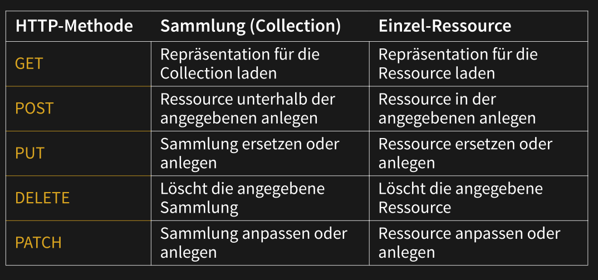

# Express

## HTTP Request Methods

* `GET`: Retrieve resource
* `POST`: Create a new resource
* `PUT`: Update an already existing resource
* `PATCH`: Partly update an already existing resource (e.g. only sending the first name if only this field is modified)
* `DELETE`: Delete a resource



### Simple HTTP Server & Client

The simple server:

```js
const {createServer} = require("http")
let server = createServer((request, response) => {
    response.writeHead(200, {"Content-Type": "text/html"})
    response.write(`
    <h1>Hello!</h1>
    <p>You asked for <code>${request.url}</code></p>`)
    response.end()
})
server.listen(8000)
console.log("Listening! (port 8000)")
```

And the client:

```js
const {request} = require("http")
let requestStream = request({
        hostname: "eloquentjavascript.net",
        path: "/20_node.html",
        method: "GET",
        headers: {Accept: "text/html"}
    }, response => {
    	console.log("Server responded with status code", response.statusCode)
	}
)
requestStream.end()
```


## Post and Get Requests

The following code extracts get requests

```js
const express = require('express')
const app = express()
const port = 3000

app.post('/shoes', function (req, res, next) {
    // GET /shoes?order=desc&shoe[color]=blue&shoe[type]=converse
    console.dir(req.query.order)
    // => 'desc'
    console.dir(req.query.shoe.color)
    // => 'blue'
    console.dir(req.params.name)
}
         
app.post('/user/:name', function (req, res, next) {
    // GET /user/tj
    console.dir(req.params.name)
    // => 'tj'
})

app.listen(port, () => {
	console.log(`Example app listening at http://localhost:${port}`)
})
```

The following code extracts post requests:

```js
const express = require('express')
const app = express()
const port = 3000
// for parsing application/json
app.use(express.json())
// for parsing application/x-www-form-urlencoded
app.use(express.urlencoded({ extended: true }))
app.post('/profile', function (req, res, next) {
    console.log(req.body)
    res.json(req.body)
})

app.listen(port, () => {
	console.log(`Example app listening at http://localhost:${port}`)
})
```

To serve static content the `express.static` middleware can be used:

```js
app.use(express.static('public'))
// http://localhost:3000/css/style.css
// Pfad zur Datei: public/css/style.css

app.use('/static', express.static('public'))
// http://localhost:3000/static/css/style.css
// Pfad zur Datei: public/css/style.css
```

## Middle Ware

Express is a sequence of middle wares. Some do error handling, some handle the actual request. Middle wares can also forward information to the next middle ware.

```js
app.use(function (req, res, next) {
    console.log('Time:', Date.now())
    req.currentTime = Date.now()
    next()
})

app.use('/user/:id', function (req, res, next) {
    console.log("Time: ", req.currentTime)
    console.log('Request Type:', req.method)
    next()
})
```

## Cookies

Designed as a stateless protocol to store data on the browser. It can be set with the `Set-Cookie` header and can be read from JS (except if `HttpOnly` is set) with `document.cookie`. The client will send the cookie back with the `Cookie` Header.


## Sessions

Sessions can be realised with cookies, but sessions can be hijacked when the session id can be stolen (e.g. when using http)


```js
// "npm install express-session" to install the express-session package
var express = require('express')
var cookieParser = require('cookie-parser')
var session = require('express-session')

var app = express();

app.use(cookieParser())
app.use(session({secret: "Shh, its a secret!"}))

app.get('/', function(req, res){
    if(req.session.page_views){
        req.session.page_views++
        res.send("You visited this page " + req.session.page_views + " times")
    } else {
        req.session.page_views = 1
        res.send("Welcome to this page for the first time!")
    }
})

app.listen(3000)
```

