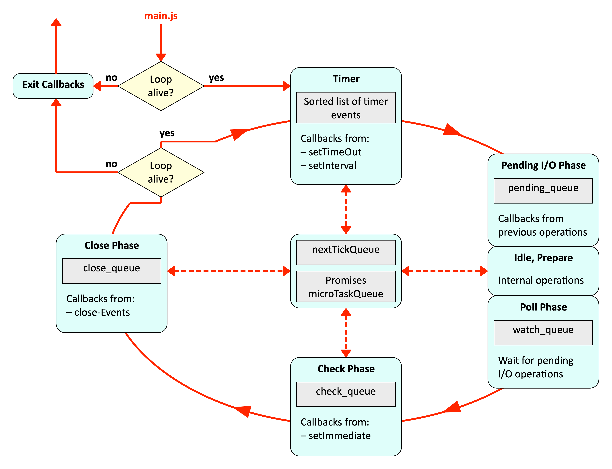

# JavaScript

## Strings

Strings in JavaScripts are a sequence of 16-bit Unicode characters. In `"..."` and `'...'` strings, the backslash (`\`) is as an escape sequence. In template strings (`` `...` ``) strings a `\` is rendered. Additionally, string interpolation can be done with `` `...${var}...` ``.

## Objects

`delete obj.name`  deletes the `name` property of the object `obj`.

With `"name" in obj` the program can check if the property `name` is in the object `obj`. `in` checks the object itself, as well as the prototype chain.

Methods of interest:

* `Object.keys(obj)`
  Returns the keys of an object
* `Object.values(obj)`
  Returns the values of an object
* `Object.assign(obj, ...otherObjects)`
  Returns `obj` but with the properties of the `otherObjects`.

## Arrays

```js
for(let key in myArray) {
    doSomethingWith(myArray[key])
}

for (let entry of myArray) {
	doSomethingWith(entry)
}

myArray.forEach((entry, key, array) => doSomethingWith(entry))
```

Methods of interest:

* `Array.isArray(obj)`
  Checks if the given `obj` is an array.
* `arr.length`
  Returns the number of keys with a number key. Other properties are ignored

## Reference and Value Data Types

`string`, `number`, `boolean` are value data types. `object`, array and `function` are reference data types.

* value data types
  * When comparing their value is compared (except `NaN` which is always `false`)
  * Cannot be modified (`numVar.hi = "hello world"` won't add the key `hi` to `numVar`)
* reference data types
  * Compared by reference
  * Can be modified

## Modules

Before other module systems:

```js
(function(){
    // module code goes here
})()
```

CommonJS:

```js
const {Wheel} = require('./steering')
const car = {
    brand: 'Ford',
    model: 'Fiesta',
    steering: new Wheel()
}
module.exports = {car} //would be importat as const {car} = require('./car-lib')
```

ES6 module system:

```js
/* square.js */
const name = 'square'
function draw (ctx, length, x, y, color) { ... }
function reportArea () { ... }
export { name, draw, reportArea }

/* other js file */
import { name, draw, reportArea } from './modules/square.js'
```

## `this`

`this` refers to the caller's object. However, every function can be called without an object. In this case, `this` refers to the global object or is `undefined` if `"use strict"` is specified at the beginning of the file or function.

`this` can be bound to a function using `Function.prototype.bind(thisObj, ...args)`, which will return a new wrapper function.

With `Function.prototype.call(thisObj, ...args)` can a function be called immediately. Likewise with `Function.prototype.apply(thisObj, argsArray)`, but `apply` takes an array instead of a var-arg.

## Prototype

With `Object.getPrototypeOf(obj)` the prototype object of `obj` can be returned. Types (like `Object`, or `String`) have a property `prototype`. `Object.prototype` will return the prototype of the "class".

An object with a specific prototype can be created using `Object.create(protoObj)`. The returned object will have the given prototype object.

The constructor of a prototype is stored in `Object.prototype.constructor`.

### Classes

```js
function Person (name) {
	this.name = name
}

Person.prototype.toString = function () {
	return `Person with name '${this.name}'`
}

console.log(Person.prototype.constructor == Person) // will return 'true'

let p35 = new Person("John")
```

```js
class Employee extends Person {
    constructor (name, salary) {
    	super(name)
    	this.salary = salary
    }
    
    toString () {
    	return `${super.toString()} and salary ${this.salary}`
    }
    
    get salary100 () { return this.salary * 100 / this.percentage}
	set salary100 (amount) { this.salary = amount * this.percentage / 100 }
}

let e17 = new Employee("Mary", 7000);
console.log(e17.toString()) /* → Person with name 'Mary' and salary 7000 */
console.log(e17.salary) 	/* → 7000 */
```

## Event Loop



`const id = setImmediate(() => ...)` works like `setTimeout(fun, timeoutInMillis)` or `setInterval(fun, intervalInMillis)`

Promises and tasks in the `nextTickQueue` (in the middle) are processed between phases (in node since version 11). The `nextTickQueue` is processed before promises.

```js
Promise.resolve().then(() => console.log('promise resolved'))
setImmediate(() => console.log('set immediate'))
process.nextTick(() => console.log('next tick'))
setTimeout(() => console.log('set timeout'), 0)

setTimeout(() => {
  console.log("start timeout")
  process.nextTick(() => console.log("in nextTick() in setTieout()"))
  console.log("end timeout")
}, 0)
//next tick
//promise resolved
//set timeout
//start timeout
//end timeout
//in nextTick() in setTieout()
//set immediate
```

## `Promise`

The function given to the `Promise` constructor is executed synchronously. Only the first `resolve(...)`, `reject(...)` or `throw ...` has an effect on future stages.

```js
const promise = new Prommise((resolve, reject) => {
	throw Error('fail')
	resolve()
});

promise
    .then (() => console.log('step1')) // is skipped because of `throw Error('fail')`
    .then (() => { throw Error('fail') }) // skipped
    .then (() => console.log('step2')) // skipped
    .catch(() => console.log('catch1')) // will be printed
    .then (() => console.log('step3')) // will be printed
    .catch(() => console.log('catch2')) // skippped
    .then (() => console.log('step4')) // printed
/*
printed:
catch1
step3
step4
*/
```

`Promise.all(promises)` returns a new promise which waits for all given promises to finish. `Promise.reace(promises)` returns a promise, which resolves to the result of the first resolving or rejecting promise.
