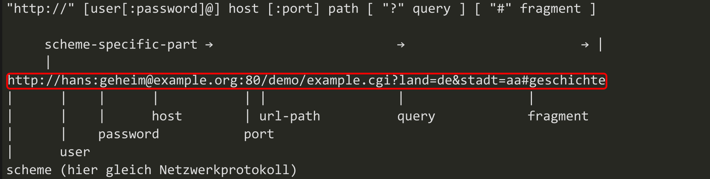
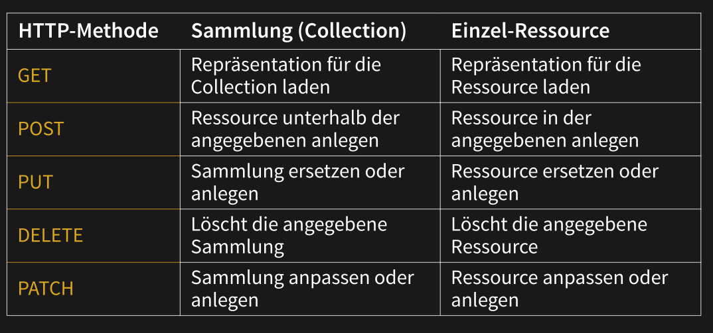

 # Tools

## Falsy List

* `0`/ `-0`/`0n`
* empty strings 
* `null`|
* `undefined`
* `NaN`
* `document.all`

All other values are truthy.

## `typeof` Table

| Type             | Expression           | Result        |
| ---------------- | -------------------- | ------------- |
| Undefined        | `typeof undefined`   | `"undefined"` |
| Null (Object)    | `typeof null`        | `"object"`    |
| Boolean          | `typeof true`        | `"boolean"`   |
| Number           | `typeof 0`           | `"number"`    |
| BigInt           | `typeof  0n`         | `"bigint"`    |
| String           | `typeof "test"`      | `"string"`    |
| Symbol           | `typeof `            | `"symbol"`    |
| Function         | `typeof console.log` | `"function"`  |
| Any other object | `...`                | `"object"`    |

## URL

## HTTP Request Methods

* `GET`: Retrieve resource
* `POST`: Create a new resource
* `PUT`: Update an already existing resource
* `PATCH`: Partly update an already existing resource (e.g. only sending the first name if only this field is modified)
* `DELETE`: Delete a resource

