Zürcher Fachhochschule
22Implementing Files - Indexed AFile System

## File Attributes


## Master Boot Record (MBR)

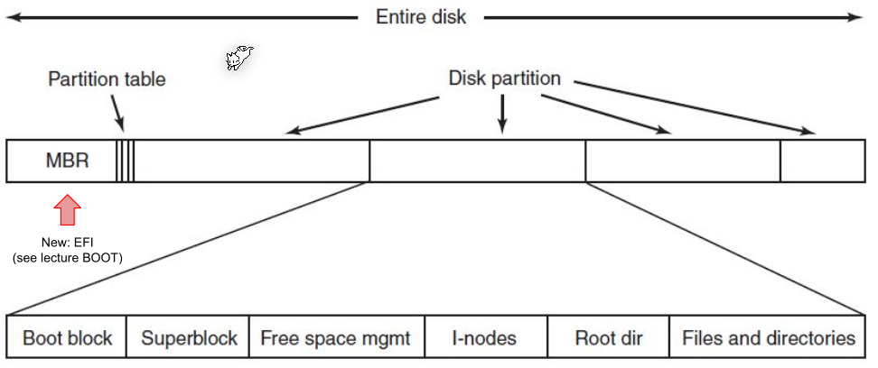

MBR contains a partition table, where the location and size of all partitions are listed.

## Implementation

### Block Size

The block size dictates how many bytes are in one block.

* Small block size: 
  There are many blocks per file which leads to slow access time. However, there is a small internal fragemention
* Big block size
  There are fewer blocks per file which means faster access time, but more internal fragmentation.

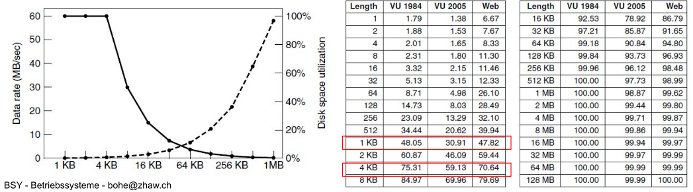

### Block Allocation

Which blocks are allocated to which file can be stored in multiple ways:

It can be stored in a linked list.


Another possibility is indexed allocation...


### File Names

A big problem with names is that their name is not limited in size. Either the file entry structure has a big empty space for potential names. Another approach is to store a link to a heap space, but this introduces fragmentation to the heap. 

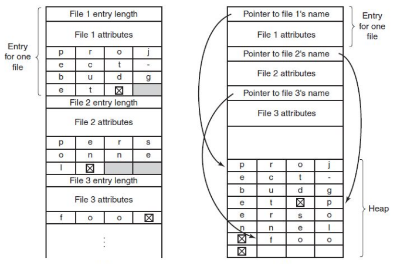

### Blocked Used

To store which blocks are used or not, one can store a list of all unused blocks. An alternative approach is to store a bitmap field for all blocks.

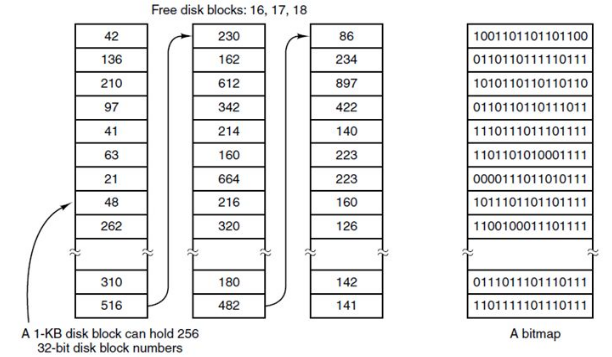

### Consistency

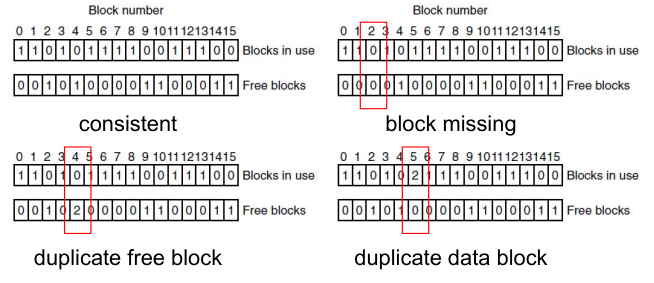

Consistency problems can start to occur if before flushing, the system crashes or stick gets unplugged. There are two tables to identify such inconsistencies: the free block table and the used block table.

With the `fsck` command, one can check the consistency of a device.

### Journaling

The idea of a journal is that the file system write a log of all operations. When the disk is interrupted while writing, the transaction can be reconstruction from the journal. However, this can be a big overhead.

For example when deleting a file, the following operations are written into the journal:

1. Remove the file from its directory
2. Release the i-node to the pool of the of free i-nodes
3. Return all the disk blocks to the pool of free disk blocks

If during deleting a file an error occurred, the file system can rollback to a consistent state and redo the operation.

## Virtual File System (VFS)

Goal: Integration of heterogeneous file systems into a single structure. As long as a concrete system supplies the functions the VFS requires, the VFS does not care what or where the underlying file system is.

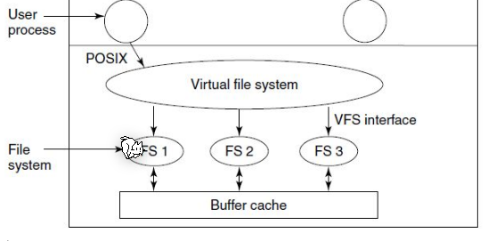

## Links

Hardlinks share the same i-node as the target file. This means that even when the target file is moved (in the same partition) the link still works. This comes with the draw back that 

* a hard-link cannot point to a directory
* a hard-link cannot span across multiple partitions

Soft links on the other hand contain a path to another file. Because of this moving the target file won't update the soft link, but it can span across multiple file systems.

## ExtX

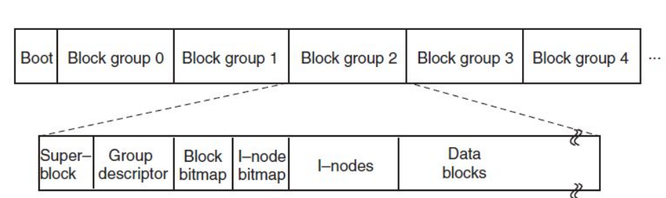

Ext2 subdivides a partition in multiple block groups with separate management data. If the first block is corrupted then the other blocks can still be read as the management is local to block groups.

Ext3 added journaling, and ext4 separated the journal into a seperate

## Copy on Write (COW)

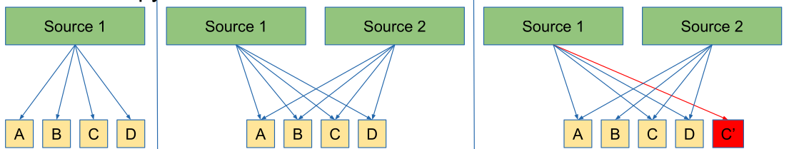

If multiple user access the same data (in the screenshot above A, B, C and D) they all access the same bits. As soon as one user write to it, the data is actually copied (as seen in the third picture above).

### Snapshots

COW can allow creating snapshots without disabling write access. 

When creating snapshot, the snapshotting utility will "copy" all the data. If the source 1 modifies the data, a new copy is created.

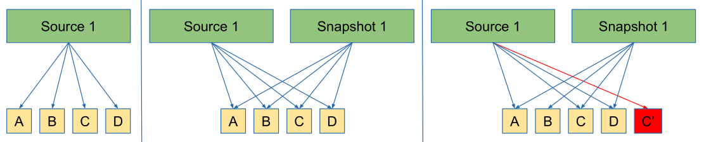

## B-Tree File System (BtrFS)

BtrFS is a copy-on-write file system, implemented with a b-tree, which consolidates many advanced features from other file system  utilities (like copy on write, snapshot, logical volume management, built-in data and metadata integrity
with checksums, RAID, compression capabilities, inplace conversion from ext2/3/4 and
ReiserFS, quota groups, online expansion and reduction of filesystem size, integrated
device management, ...).

* Tree Items and Keys
  Items are BtrFS keys with additioinal offset and size field held in leaf nodes. A key describes an object address.
* Subvolume
  In BtrFS a subvolume works just like a directory, but has its own file tree, which can be mounted separately.
* Extend
  A mapping fro a logical area in a file, to a contiguous phyical area on disk
* Physical and logical chunks
  BtrFS splits each device into physical chunks which are logically grouped. This allows a logical chunk to contain physical chunks from different disks.

The following diagram shows the above terminology:

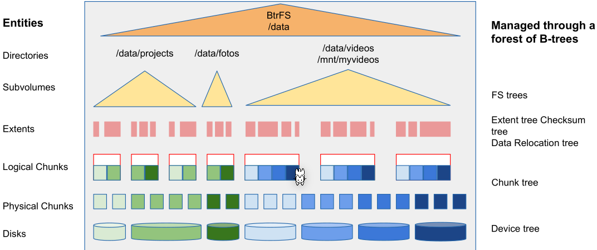

BtrFS constructs a forest of COW friendly b-trees, a tree for each management structures.


B-trees have the advantage that filesystem modifications, like deleting, adding, ..., can be implemented in a atomic fashion. To this, the modifications are done in a separate sub-tree and once all modifications are done, the sub-trees are exchanged.

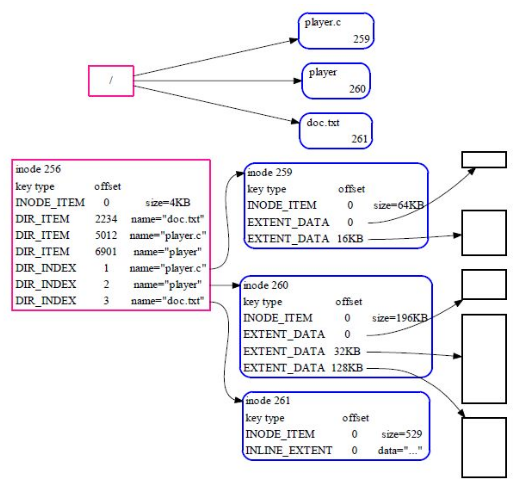

In the tree above, the two big files point to an EXTENT data structure in which the actual content of the file is stored. However, for a smaller file, data can be stored in a INLINE_EXTEND. In this case, the data is stored in the management structure itself.

### COW Basics

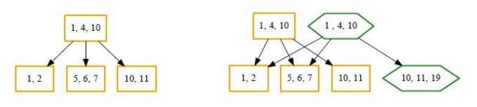

In the above diagram a new element `19` is added in the bottom-right cell. To do the copy operation, the root is copied with a new node with `10, 11, 19`. At the end the new root replaces the old root.

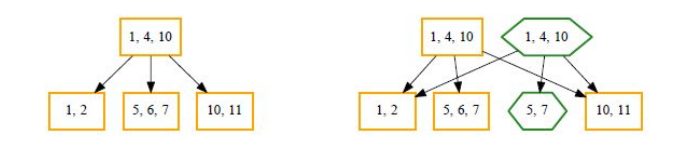

The same is done for deleting an item, in this case `6` in the middle entry. First the root node is copied again, after which a new node with just `5, 7` is being created and linked to the new root. Finally, the new root replaces the old root.

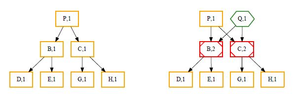

Cloning is simple, since the node which should be cloned, needs to be duplicated and the reference counter incremented (red).

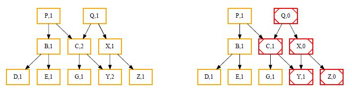

Similarly, if `Q` should be deleted, the reference counters have to be decremented (in red).

The following shows how to relocate a chunk:

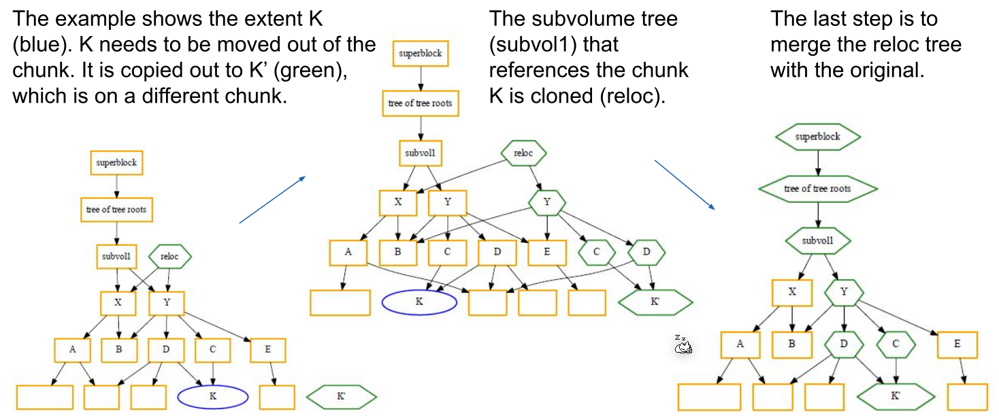

If a file should grow or shrink, new extends have to be allocated or deallocated. However, changes like this can propagate to different trees.

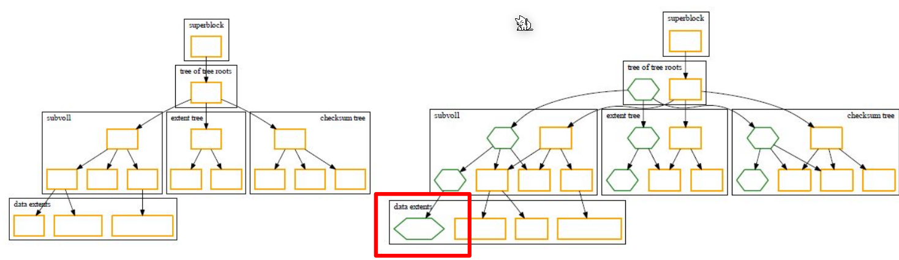

### Example

```sh
# create new partition, format it with btrfs and mount it
parted --script /dev/vdb “mklabel gpt”
parted --script /dev/vdb “mkpart primary 1 30%”
mkfs.btrfs /dev/vdb1
btrfs filesystem show /dev/vdb1
mount /dev/vdb1 /mnt/mymntpoint

# create a second partition and add it to the existing btrfs
parted --script /dev/vdb “mkpart primary 30% 60%”
btrfs filesystem show /dev/vdb2
btrfs device add /dev/vdb2 /mnt/mymntpoint

# balance the two paritions
btrfs balance start -d -m /mnt/mymntpoint

# create a new btrfs raid 10
# the individual drives don't need a gpt or mbr table
sudo mkfs.btrfs -m raid10 -draid10 /dev/vdb /dev/vdc /dev/vdd /dev/vde -f

```

### RAID with BtrFS


## Redundant Array of Independent Disk (RAID)

The following diagrams shows a level 5 raid which does striping:

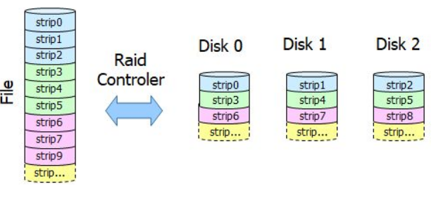

The next diagram shows other raid levels:

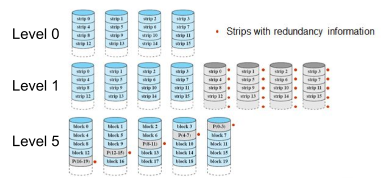

## Overlayfs

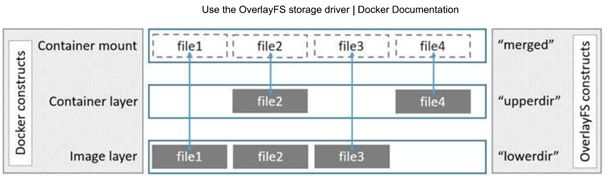

The following command creates a new overlay fs. It combines all files set in the `lowerdir` option. If a file in the overlay file system is changed then a new file is written in the `uppderdir`. The overlayfs file system does copy-on-write. The working directory is used for management for the overlayfs.

```sh
mount -t overlay overlay -o lowerdir=/dir1:/dir2,upperdir=/upper,workdir=/work /merged
```


## Linux

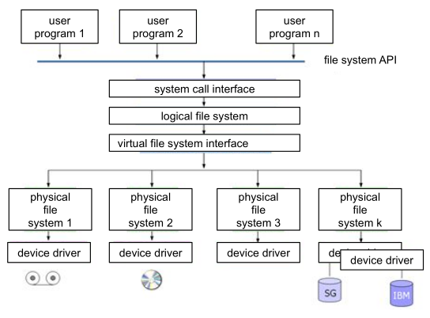

In linux the physical file system is abstracted. This allows things like LLVM.

There are the following file types in Linux:

* Normal files
* Directories
* Character and block device files
  These represent IO device 
* Other types: link files, socket files, named pipe files, ...

### Linux File System Convention

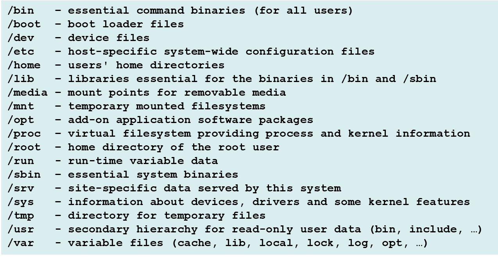

### Logical Volume Manager (LVM)

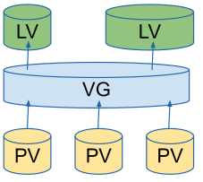

LVM can group different physical volumes (PV) into a volume group (VG) from which logical volumes (LV) can be created.

One thing LVM can do is thin-provisioning, in which the physically occupied size is the actual size and then grows until it reaches the volume size.

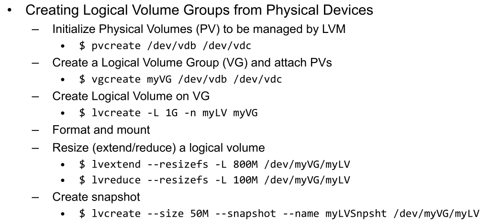