# Networking

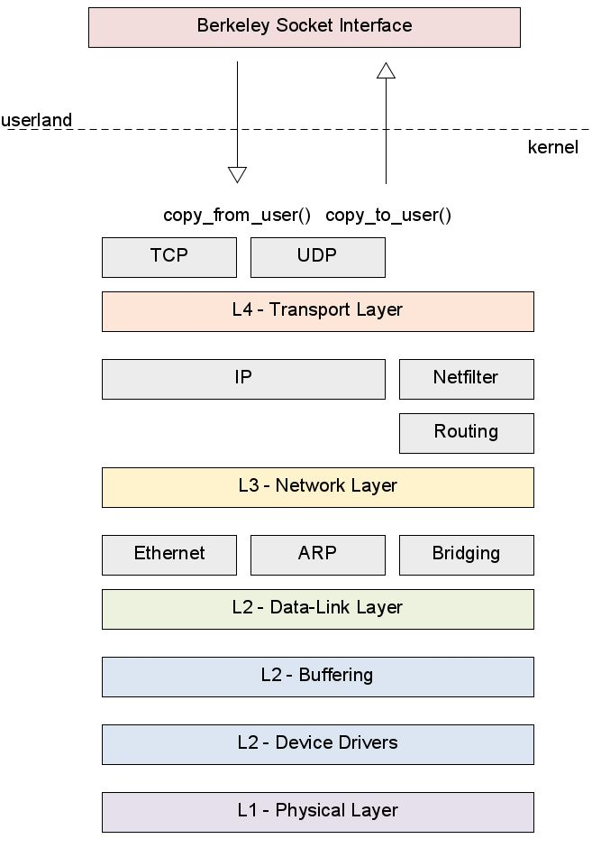

## OSI-Layers

### Layer 1 - Physical Layer

### Layer 2 - Data-Link Layer

The following is how a naive network stack would implement the layering.

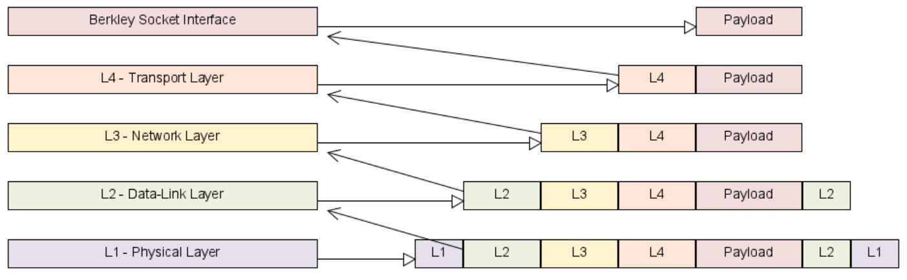

A much smarter approach is to give the upper layer just a memory pointer to content instead of copying the entire frames. This is also called a zero-copy stack.

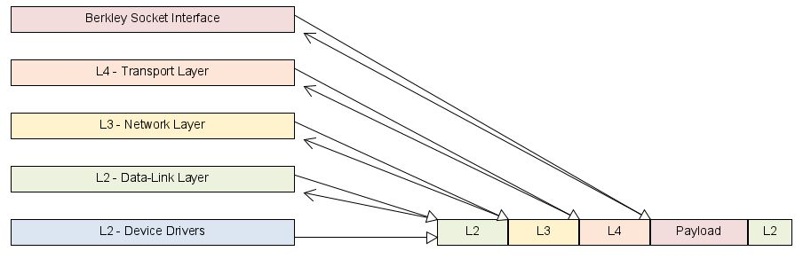

Linux defines the struct `sk_buff` to store the network frames. To do the actual sharing DMA is used.

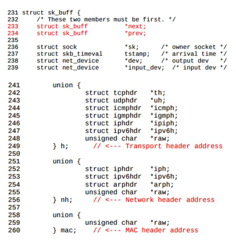

The following diagram shows how the data travels from the NIC to the application.

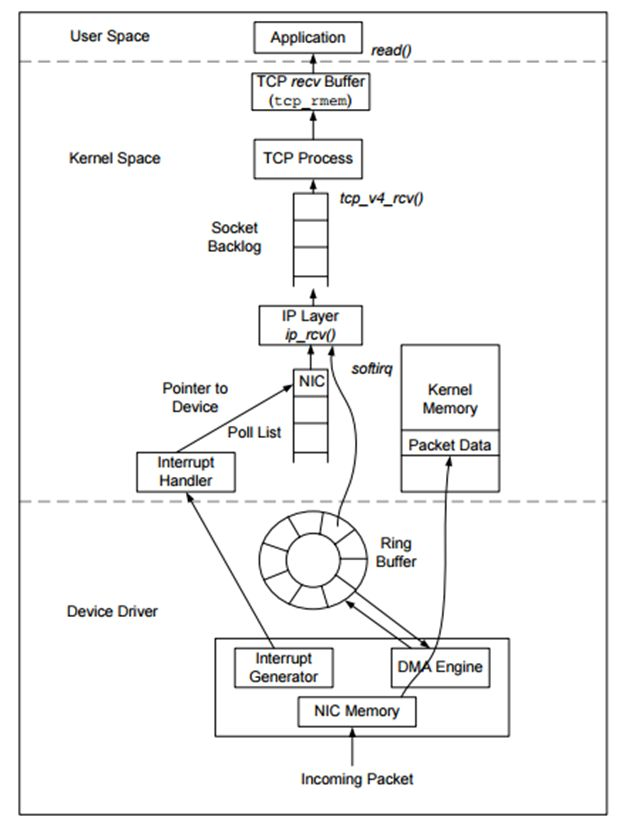

The following is how Linux actually implements the ip stack. The payload isn't copied. However, the headers are copied, since layers sometimes modify the headers  (e.g. TTL in IP).

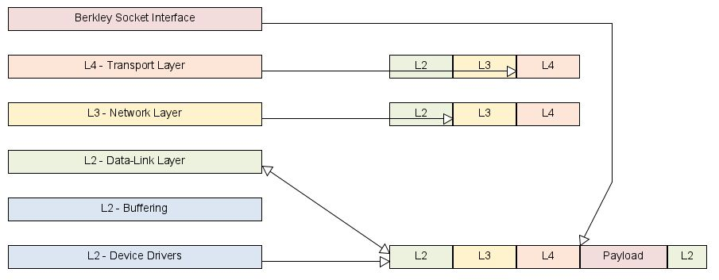

Things like ARP, and briding is implemented in the kernel.

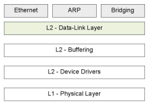

### Layer 3 - Networking Layer

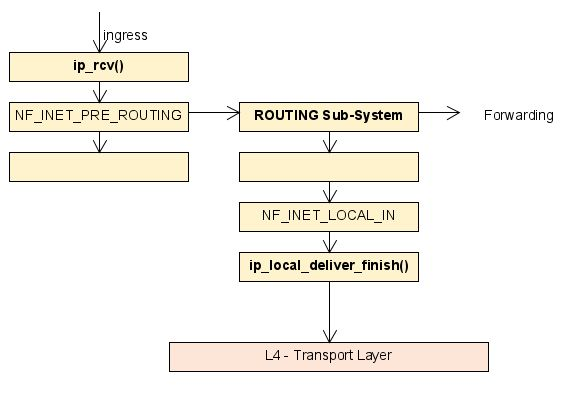

The diagram above shows how an IP packet flows through netfilter...

### Layer 4 - Transport Layer

* Flow-Control: That the receiver doesn't get overwhelmed (e.g. when the receiver is a raspberry pi)
* Congestion-Control: That the network itself doesn't get overwhelmed (e.g. when a router is a raspberry pi)

Netfilters a

What is trafic engineering?

### Layer 7 - Application Layer

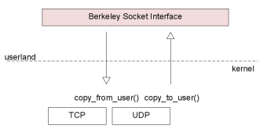

## Layer 2 Briding

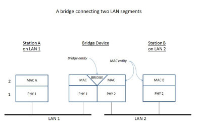

## Netfilter

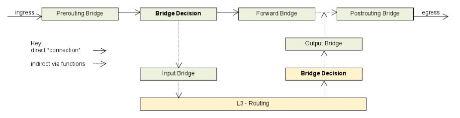

Netfilter structures how a frame traverses layer 2 and lever 3.