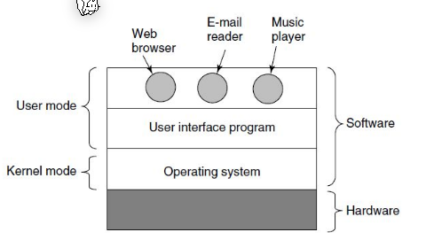
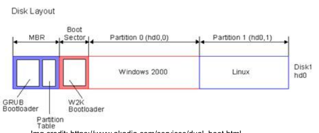

# Operating System

> The job of the operating system is to create good abstractions and then implement and manage the abstract objects thus created

The OS is split up into the user mode and kernel mode. The kernel mode has a northbound interface, which is towards the user mode (the API), and a southbound interface towards the hardware.

## Basic Input Output System (BIOS)

The BIOS is loaded when booting from the ROM of the motherboard.

It does the following steps:

1. Performs the Power-On-Self-Test (POST)
2. Discover devices by scanning PCI busses and initializing those devices
3. Chooses a boot device from a list in the CMOS
4. Reads the MBR master boot record in to memory and executs it

The BIOS has the following disadwantages:

* It runs in 16-bit mode
* It relies on the MBR, which limits the number and size of partitions (max 2 TB.)
* It is not extensible
* It suffers from rootkit and bootkit attacks

### MBR master boot record

The master boot record is the first partition 

## Unified Extensible Firmware Interface (UEFI)

UEFI uses GPT (GUID Partitioning Table), which allos an arbitrary number of partition. It also is engineered with a modular design.

When starting, UEFI starts a architecture-independent virtual machine which executes `*.efi` files. The OS provides an efi-file, which will bootstrap the OS. EFI binars are stored in the EFI System Parition (ESP), which is FAT formatted.

## Boot Process

1. The OS queries the BIOS and/or the bus system for HW information and then intializes each device
2. Loads hardware specific assembler instructions 
3. The OS initialze the managment structure (like  a process table)
4. Creates the system services (system calls, IPC, signals, ...)
5. Spawns a (user) interface 

The root process has the pid `1`.

### RAMDISK

A ramdisk contains additional drivers and files required to bootstrap the kernel. This is the solution for the chicken-and-egg problem, when having to load the driver of a disk from that disk.

The bootloader can read the kernel and ramdisk as it is stored on the efi parition which is FAT formatted.

## Init System

### Original Unix

The original Unix just ran all shell files in `/etc/rc`

### System V

System V introduces runlevels, where each runlevel have a number of scripts associated with it. This is used to start only the services needed.

