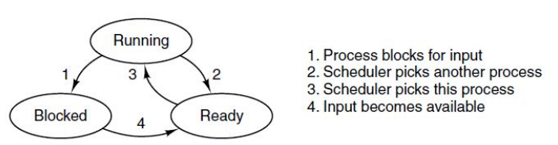
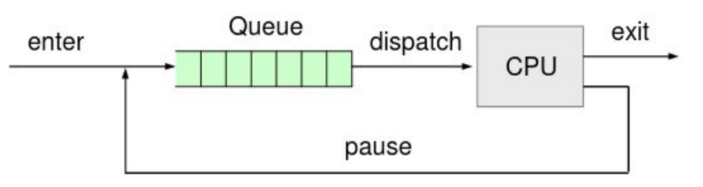
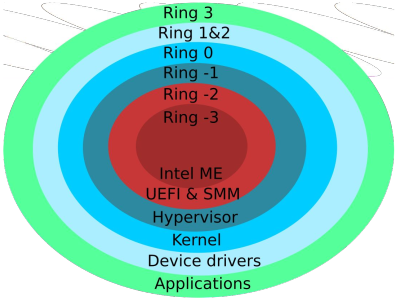
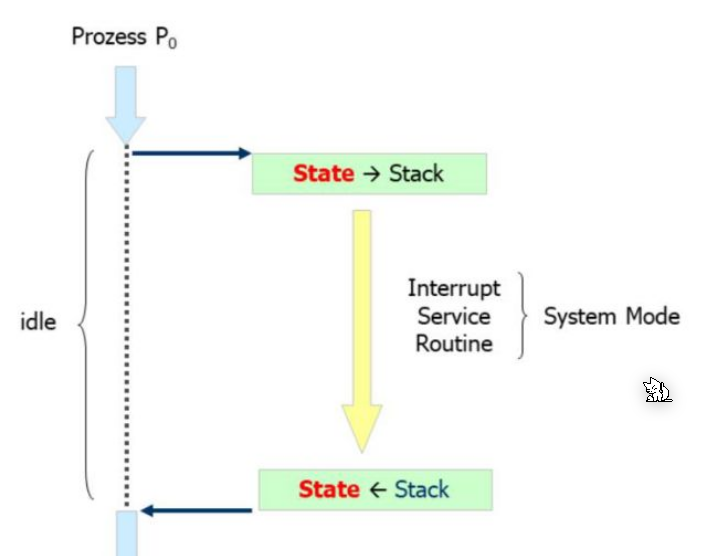
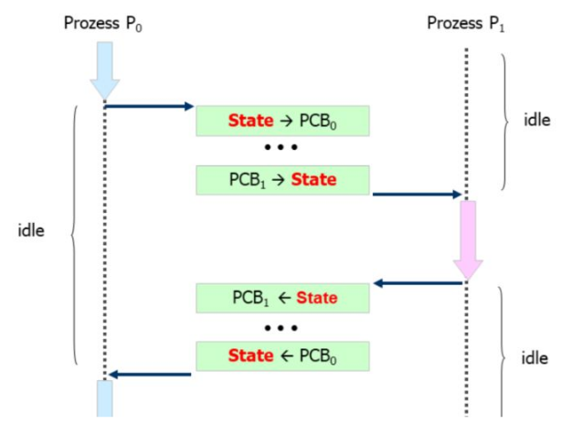
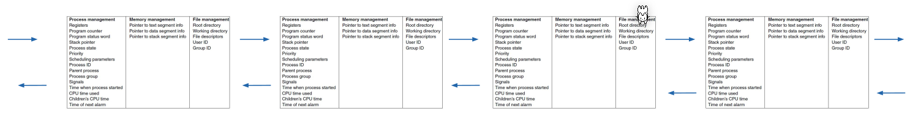
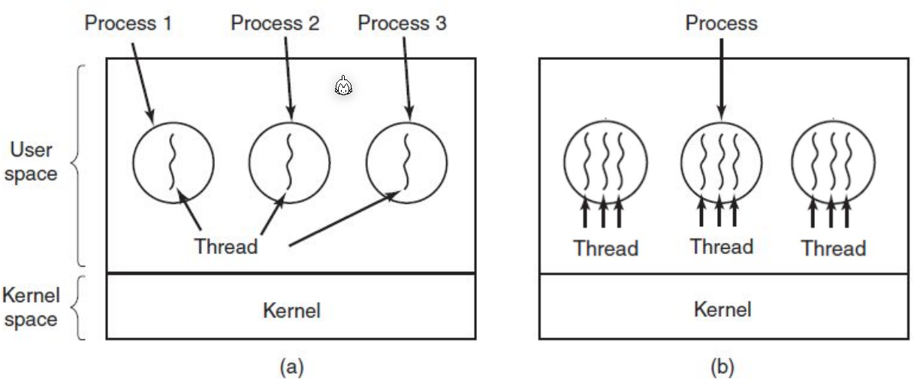
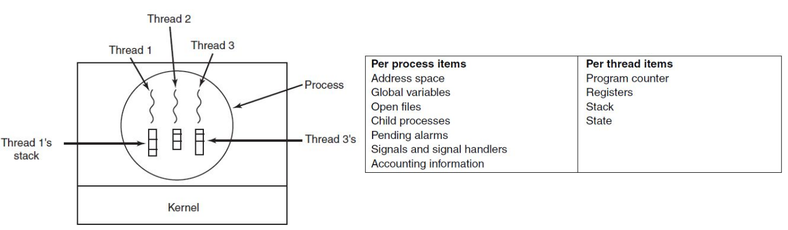
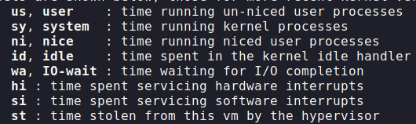

# Processes

Each program can have many processes. These run in user mode, while the kernel itself runs in kernel mode.

## Creation

When the parent-process requests the creation of a new child processes, the Linux kernel will create a new child process with an exact copy of parent's memory map. 

This can be either be done with:

* Distinct Address Space
  The memory for the child is a copy in a different memory area
* Copy-on-Write
  When spawning the child, nothing is copied. As long as the child only reads, nothing is copied, but as soon as the child tries to write, then the required memory is copied.

## Termination

A process can terminate in multiple ways:

* The process is done and exists voluntary
* An error occurred in the process (like a resource doesn't exist) and it exists voluntary
* An error occurred in the process (like a segmentation fault, or divide by zero) and exists involuntary
* The process was murdered/killed by the OS 

## Process State

If the process is `ready`, then it is put in to the queue for the kernel to be scheduled. Once the kernel picks the process, the state of the process is `running`. If the process needs access to resources (like a busy hard drive), the state is set to `blocked`. In this state, the process is not ran and not dispatched.

The process' state might change because:

* The CPU allocated time expired
* An interrupt happend and the CPU needs to handle it
* A page fault happen
* The process requests a system call and the kernel takes over

## User Mode vs System Mode

All applications run in user mode, where there have access to a limited set of instructions. When a process wants to do something, they use a system call to request this from the kernel.

The kernel runs in system mode (or kernel mode), where it has access to the complete set of instructions.

### Mode vs Context Switch

The process might call a system call or an hardware interrupt happend, the kernel needs to switch to kernel mode, execute something, an then the context of $P_0$ is restored.

On a multi-processor, the scheduler tries to only give out time slices to different processes. If the slice expires, first a mode switch happens. Afterwards, a context switch happens, where the kernel switches the environment to the other process. This needs to be done in kernel mode, which is why the mode switch is necessary. 

After the context switch, the mode is reverted to user mode and the new process receives control over the CPU.

## Process Control Blocks and Process Table

The kernel maintains a linked list of process control blocks, named for process tables, for all processes.

## Threads vs Processes

The difference between processes and threads, is that threads share the same context, while processes have different contexts, which needs to be switched.

Each thread has its own program counter, registers and stack, but share the other process resources. Because of this, threads are a lot lighter than process,  as creating threads and switching between them is a lot cheaper.

Threads can be managed by the process itself or the kernel. However, if the threads are managed by the process and a system call in invoked then the process will be blocked and suspended. This negates the usefulness of threads.

#### POSIX Threads

The POSIX Thread library implements threads managed by the process.

* Advantage
  * The software is portable
  * Less overhead for thread management
  * No mode switching
* Disadvantage
  * All threads can only run on one execution unit
  * System call release the rest of the remaining time slice

#### Kernel Supported Threads

With kernel supported threads, the kernel manages threads as if they were processes (The kernel doesn't actually has a concept of threads) with shared resources. Which resources are actually shared is configurable.

* Advantages:
  * IO blocking is no issue
  * Can run on multiple execution unites simultaneously
* Disatvantages:
  * The kernel has more overhead
  * The creation and removal is slower
  * The kernel needs to mode switch to switch between threads
  * The software is less portable

#### Kernel Threads

A kernel thread runs in system mode and is part of the kernel itself. This thread also has an entry in the process table, but is flagged as a "Kernel Thread".

Kernel thread is scheduled and dispatched by the scheduler, does not need a mode switch, and cannot be interrupted.

Kernel threads are used with a thread pool of the kernel. This pool is dynamically managed by the kthreadd kernel thread.

## Top

