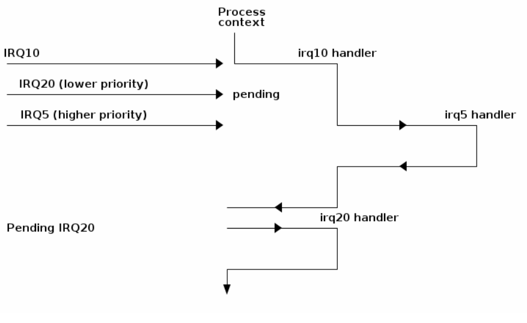

# IO

IO devices can be categorised into two categories. **Block-level devices** operate on fixed size blocks with a certain size. Block operations are independent of each other. Examples are disks, but also Ethernet. On the other hand, **character-level devices** operate on a character and can be compared to Java's `CharacterStream` class.


On the software side, an OS usually implements an IO controller, which has IO interfaces which are developed by the device driver developers. An IO port interacts with the bus.

## X86


There are different ways how IO is addressed. X86 uses version *(c)*, where there are buffers in memory, but the IO is addressed in a separate address space. Because of this, there are separate instructions to move memory to the IO ports. 

This behaviour, however, is mostly there for legacy reasons. Today, IO is mapped to memory, like in *(b)*.

With `/proc/iomem` one can check the memory-bound IO devices (like with *(b)*). With `/proc/ioports` all IO ports can be listed. (like with *(c)*)

## Direct Memory Access (DMA)


The DMA controller is there to off-load work from the CPU.

When the CPU encounters an IO operation, it tells the DMA controller to get it done. When the DMA controller is done, it sends an interrupt when its done.

The DMA controller usually works only on a specific memory area, where the devices need to be mapped into. 

If a device isn't DMA enabled, the CPU has to handle itself.

## Logical vs Physical Device


A physical device is the actual device that exists in the real world. A logical device is the software representation of this device. However, in for example a VM might have multiple logical network cards which map to one physical memory card.

## IO Access


On the right side, the CPU is doing continues IO access, where the kernel is continuously polling the device. However, this is a synchronous process.

On the left side, the CPU is doing event-based IO access, where the kernel is sending an event to the hardware and then is interrupted by the hardware later. During this time the kernel can do other stuff. When the interrupt occurs, the CPU  decides whether to handle the interrupt, and if it handles, it suspends the current flow of execution and deals with the interrupt.

## Exclusive vs Shared Access


Shared devices are shared by many processes while an exclusive access device can only be accessed by one process. Exclusive access device are rare (an example could be a camera or microphone).

With `iostat`, one can check the statistics of shared IO devices.


## Sequential vs Random Access


There are data sources where the kernel can only read the next byte. Examples include include network cards.

On the other hand, there are data spaces, like a SSD or RAM.

## Blocking vs Non-Blocking Device


A blocking device needs time to process a request (displayed by the orange arrow). An non-blocking device is a device which responds immediately (displayed by the green arrow).

This is a property of the producer, aka the device.

## Buffered vs Direct IO


A buffer can be used for:

* rate control
  When the buffer overflows, it will leak (also called a leaky bucket)
* data verification
  Data verification can be done on a buffer (CRC, ...)
* data manipulation
  E.g. reordering TCP packets

## Error Handling


## Interrupts


Interrupts are handles by the programmable interrupt controller (PIC). The PIC will pull up a line connected to the CPU if an interrupt occured.

Interrupt can be categorised into:

* Synchronous Interrupt:
  Generated by executing an instruction, like divide by zero, segfault, ...
* Asynchronous Interrupt:
  Generated by an external event, like IO device, ....

In the following diagram the handling of multiple interrupts can be seen:



Some interrupts are maskable, which enables the CPU to deal with them later.

With `/proc/interrupts`, the kernel reports the occurred interrupts.


## Linux


The kernel maintains a list information about each device, like

* the physical connected device
* the driver which handles the device
* the bus to which the device is connected
* the class, which group together devices with similar functionality
* the subsystem 

### `/sys` FS


Elements maintained under sysfs:
* block - block devices available in the system (disks, partitions)
* bus - types of bus to connect physical devices (pci, ide, usb)
* class - drivers classes in the system (net, sound, usb)
* devices - hierarchical structure of devices connected to the system
* firmware - information from system firmware (ACPI)
* fs - information about mounted file systems
* kernel - kernel status information (logged-in users, hotplug)
* module - the list of modules (drivers) currently loaded
* power - information related to the power management subsystem

The sysfs information is found in files that contain attributes:
* dev - Major and minor device identifier. It can be used to automatically create entries in the /dev directory
* device - a symbolic link to the directory containing devices
* driver - a symbolic link to the driver directory (located in /sys/bus/*/drivers )

### UDEV

```bash
# device nodes in /dev and list the properties of the root partition
ls -al /dev/
sudo fdisk -l
ls -al /dev/vda1
# Print all sysfs properties of /dev/vda1
# These properties are used in Udev rules to match the device
udevadm info --attribute-walk /dev/vda1
# Query the Udev database for all device information for /dev/vda1
udevadm info --query=all --name=/dev/vda1
# write random noise to the sound device /dev/audio (run on machine with speakers)
cat /dev/urandom | padsp tee /dev/audio > /dev/null
sudo cat mouse0 | hexdump
```

