# Memory

## Framentation

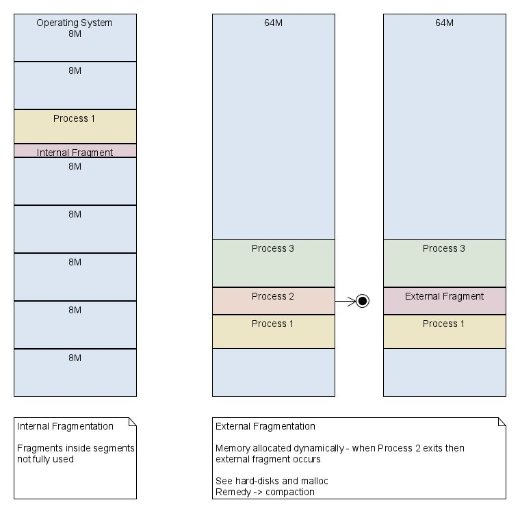

Internal fragmentation is seen on the left side and happens if a process requires less memory than the kernel allocated. On the other hand, external fragmentation is when a process terminates and leaves behind an unused area of memory the size of the process. To fully being able to use this memory, a process with the same memory requirements needs to come along (which almost never happens).

## Buddy Algorithm

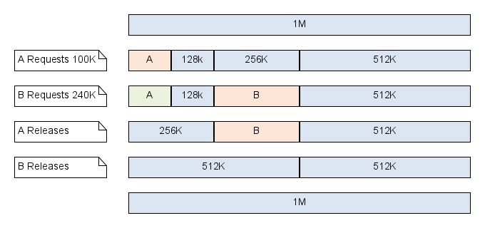

The buddy algorithm divides the memory in halve to find the smallest possible match (1M -> 512K -> 256K -> 128K -> ~~64K~~). This match is then allocated for the process.

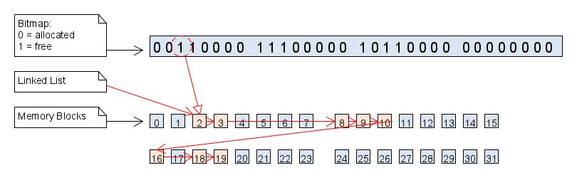

The algorithm can keep track of the occupied memory is either a bit map (e.g. a bit for every 8-bit word) or a linked list

### Linux's Buddy Algorithm

Linux uses a modified buddy algorithm. Pages are used as the smallest unit. A list with free pages chunks is kept up to `MAX_ORDER - 1`.

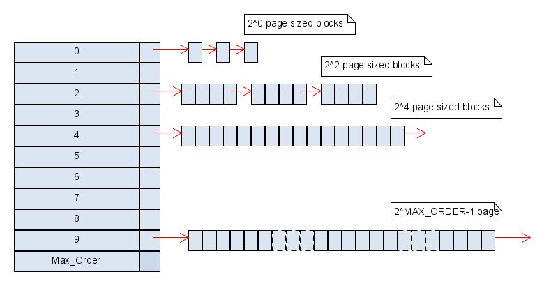

The Linux implementation can only only allocate continuous area larger then `MAX_ORDER`. 

Linux uses `kcompactd` daemon to defragment the area.

The kernel often uses small memory chunks. This would result in a lot of internal fragmentation. To battle this, the kernel uses a SLAB allocator manage memory in pages.

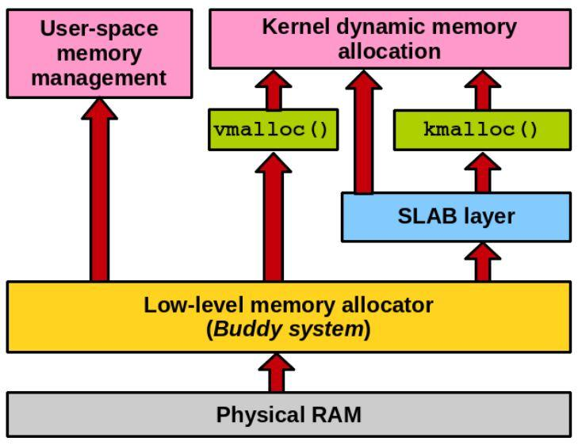

## SLAB Allocator

Because the kernel uses a lot of small memory (e.g. for a struct) chunks, an additional allocator is used which manages pages. This is only used for the kernel as it uses additional CPU power and memory.

If the kernel asks for memory, first the SLAB allocator checks if there is space available in an already allocated page. If a page is found, the memory is allocated in the memory. If  no page was found, a new page is allocated.

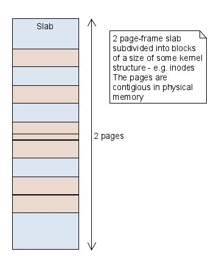

## Swapping

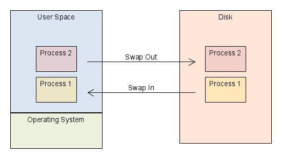

When there is no memory left, part of the memory can be swapped out to the disk and loaded back in if required.

## Virtual Memory

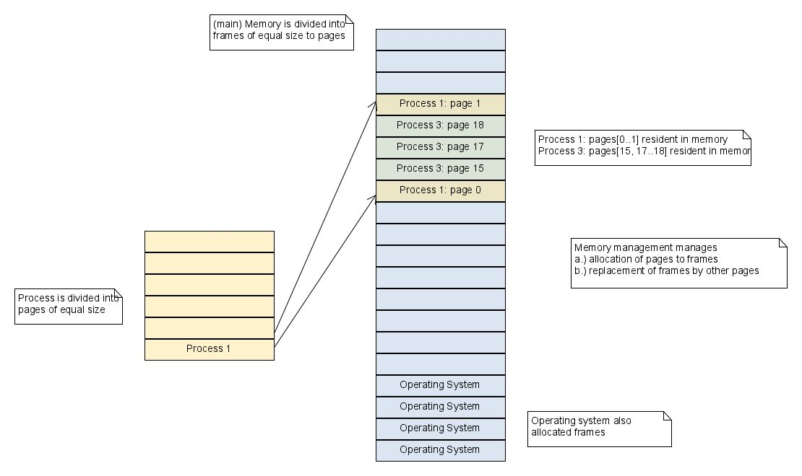

The OS subdivides a process into pages of equal size. Pages are then in turn loaded into memory frames. Frames and Pages have the same size.

Pages can be loaded everywhere in the memory.

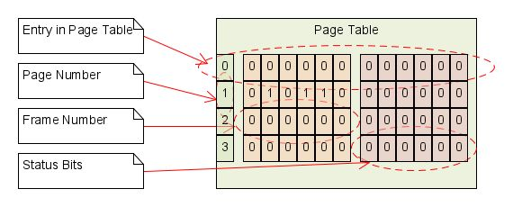

The kernel maintains a page table with the page number and the associated frame number, along with some status bits.

The diagram below shows how addresses are translated from the logical/virtual address to the physical address.

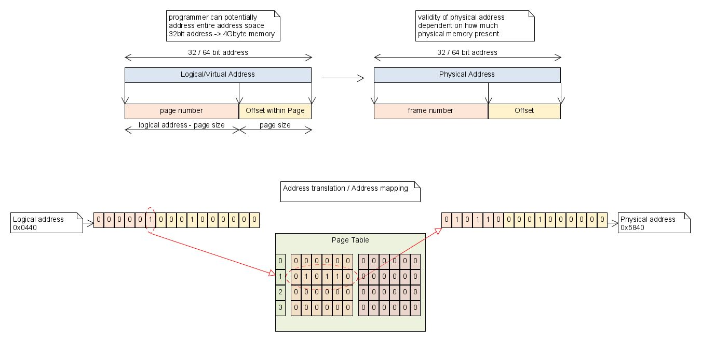

The status bit has the following fields:

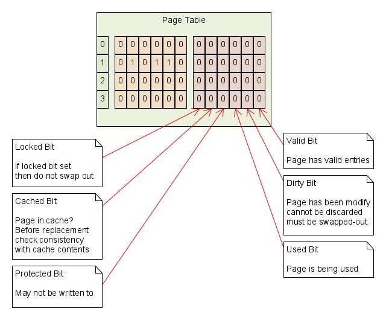

Virtual memory is usually managed by the memory management unity (MMU) by the CPU. In addition, the CPU checks within the memory production unit if a programmed tried to read memory not allocated by it.

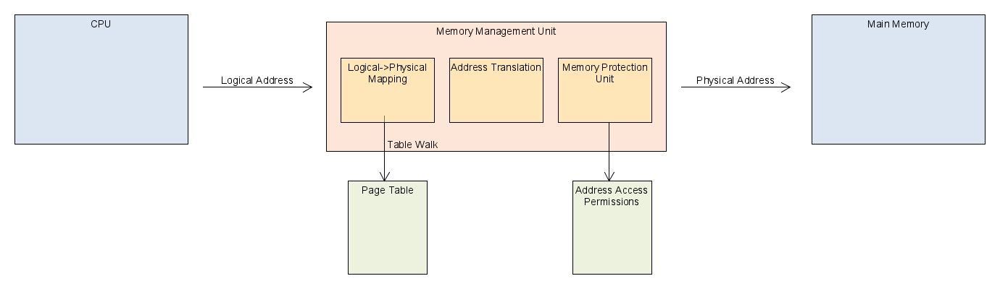

To optimise this, the translation lookaside buffer (TLB) caches ~64 entries (on a 32bit system).

### Linux

Linux uses the following process:

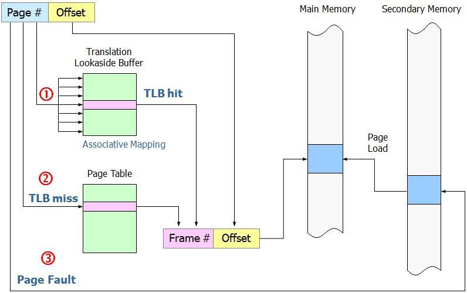

### Reclaim Frames

If a process requires an additional frame in a memory constraint scenario, the kernel can either do:

* Global strategy
  Take a frame from an other process, ideally, the one which is the least needed
* Local strategy
  If a process needs an additional frame, it also needs to give one up

The optimal frame to take away from another process would be the frame which is used the latest, but this would require fortune telling. Linux takes the least recently used.

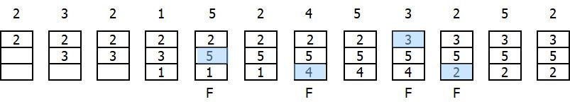

Another way would be First-in First-out, but this is not very effective:

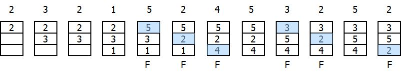

Linux tracks the pages in use, the working set, and the pages in memory, the resident set. The working set is smaller or equal to the size of the resident set.

The reclaim active is a two stage least recently used algorithm. It maintains two lists of page-frames: actives and inactive frames. 

If however, 

### Huge Page Frames

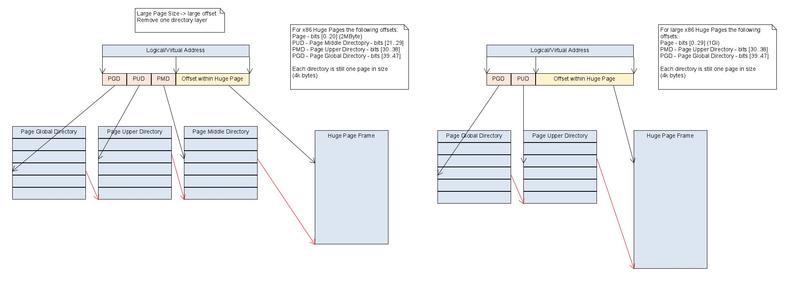

Linux puts pages into a folder structure. This yields an speed advantage and also makes the frame sizes more flexible by using less of the address for the folder structure and more for the offset. This results in bigger pages, which can be advantages for certain application.

