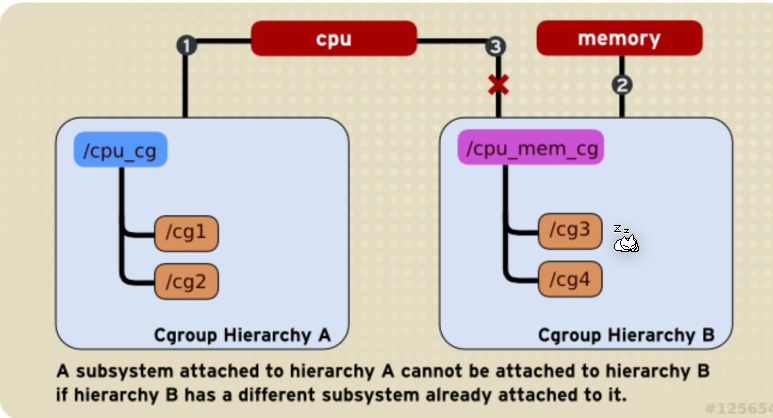
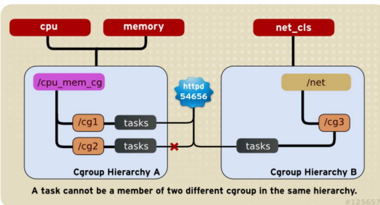
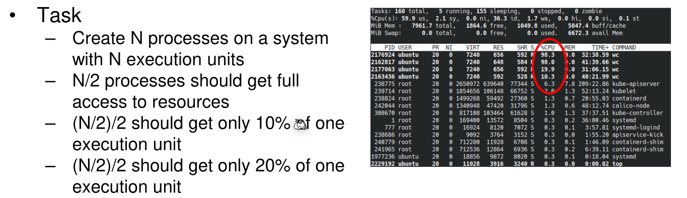
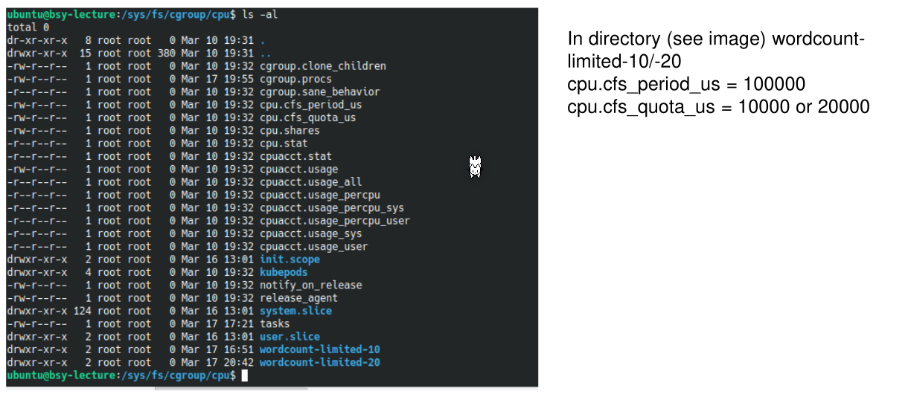
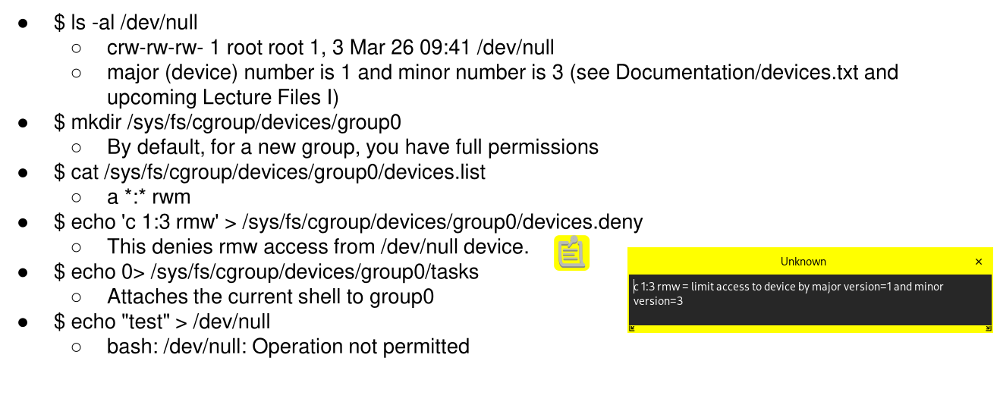

# Resources

Cgroups can be used to organise tasks into groups whose usage of various types of resources can then be **strictly** controlled.

To control cgroups, one creates a tempfs (optionally), creates a directory in it and mounts a resource control interface into that directory. Magically, configuration file associated with the resource type appear in the config directory. Later a PID needs to be associated with a controll configuration.

## Termonology

* **Cgroup**
  A collection of processes that are bound to a set of limits
* **Subsystem/Resource Controllers**
  A kernel component related to a resource type
* **Hierarchy**
  Controllers are arranged in a hierarchy. A process cannot exceed the limits placed by the related cgroup and all its parent cgroups.  Cgroups higher in the hierarchy means that less restrictions are placed up on it.

## Setup Up

1. Create a temp file system
   `sudo mount -t tmpfs -o size=10M tmpfs /mnt/mytmpfs`

2. Mount the resource control interface in the tempfs
   `mount -t cgroup -o cpu,cpuacct none /mnt/mytempfs/cpu,cpuacct`

3. A new cgroup can be created by creating a directory

   `mkdir /mnt/mytempfs/cpu/cg1`

4. To associate a PID with a cgroup, it needs to be appended
   `echo $$ > /mnt/mytempfs/cpu/cg1/cgroup.procs`

5. To remove the configuration, unmount the tmpfs
   `umount /mnt/mytempfs/`

## Limitations

A controller can only be associated with one directory structure.

A processes cannot be associated with two cgroups on the same hierarchy for the same controller.

## Controllers

Usually, an lower limit can be configured to guarantee an amount of resource and an upper limit to limit the amount of resource.

* CPU
  The time share
  * 
* Cpuset
  A specific set of cpus
* Memory
  The process memory, kernel memory and swap used
* Blkio (block-io device)
  
* 

## Example

`100'000` was written into `cpu.cfs_period_us`  and `cpu.cfs_quota_us` to `10'000` and `20'000` respectively.

The following steps is an example to deny the access to the device `/dev/null`. `echo 0 > sys/fs/cgroup/devices/group0/tasks` will deny access for the current process, in this case the current shell.

