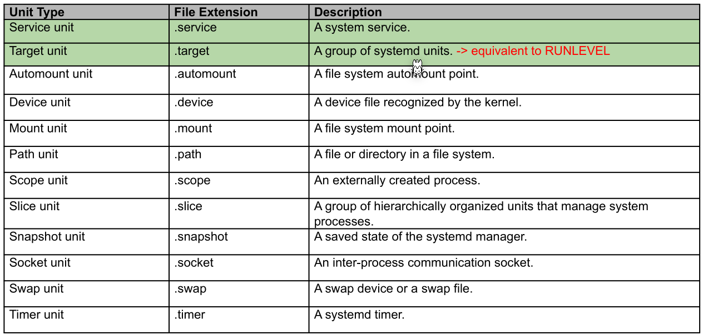

# Systemd

Systemd manages the system in a holistic way.

## Unit

Systemd manages services in units. 

Units have a state:

* **active**: The unit is started,bound, etc. depending on the type
* **inactive**: The unit is stopped, unbound, etc. depending on the type
* **activating/deactivating**: In the process of being activated/deactivated
* **failed**: The unit failed in some way, while activating/deactivating or while running

There are different types of units:


A **target unit** (.target) is the equivalent of run levels in system v, but additionally, Systemd maintains that level. Target units are also called `synchronization points`. (Details can be viewed in `man systemd.target`)

The following is an example for a Systemd unit:

The following needs to be in the example:

* positive and negative dependencies
* ordering of dependencies

```ini
[Unit]
Description=Docker Application Container Engine
Documentation=https://docs.docker.com
After=network-online.target docker.socket firewalld.service containerd.service time-set.target
Wants=network-online.target containerd.service
Requires=docker.socket

[Service]
Type=notify
ExecStart=/usr/bin/dockerd -H fd:// --containerd=/run/containerd/containerd.sock
ExecReload=/bin/kill -s HUP $MAINPID
TimeoutStartSec=0
RestartSec=2
Restart=always

[Install]
WantedBy=multi-user.target
```

Units are usually placed in `/lib/systemd/system/`.

## Slice Unit

A slice is a hierarchical way to group units and constraint resources.