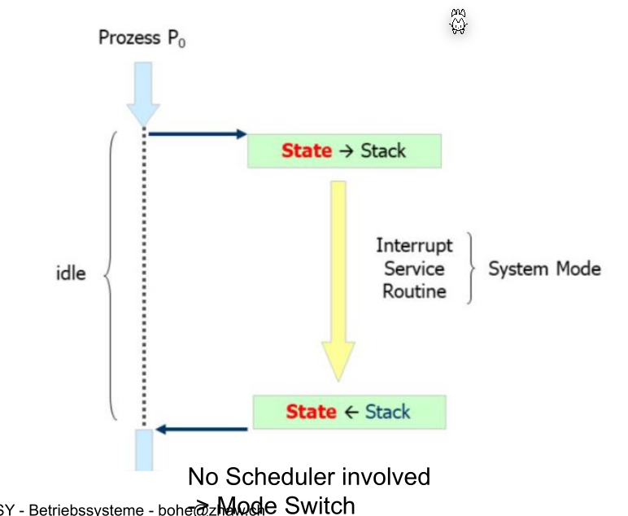
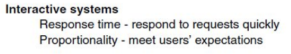
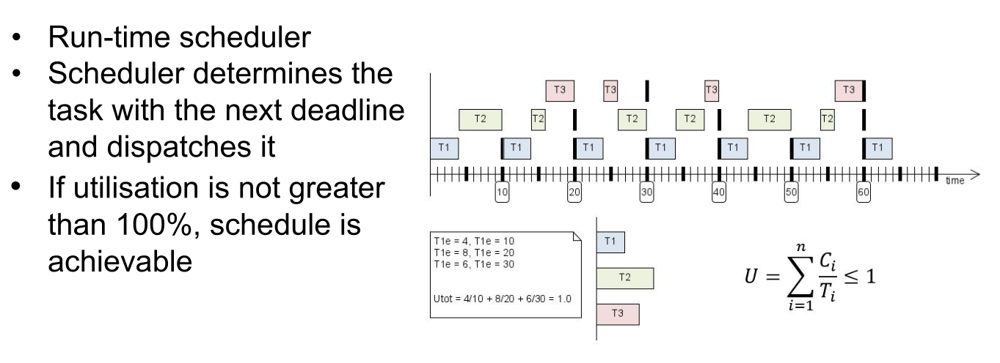
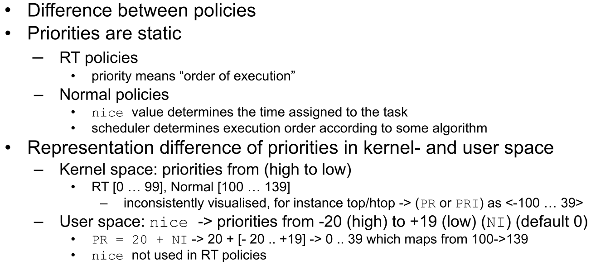
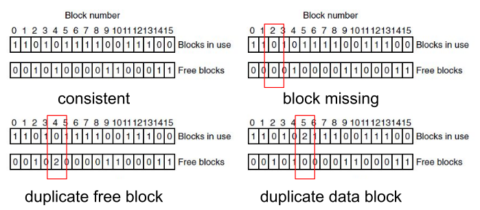

# Test

* Are copied pictures of slides allowed?
* PROC1
  * 
    Why is with a mode switch no scheduler involved since a system mode triggers the processor to be blocked. This should require the scheduler to reschedule the process
* Scheduling
  - what is the propritionality property of the interactive system? (p. 8)
    
* Kernel threads are at the same time uninterruptable and and work with the same execution/priority scheme as other threads. This seems contradicting? 
* How does Earliest Deadline First Scheduler works? When is a task interrupted?
  
* Priorities are static?
  
* Static Priority vs Execution Order Priority? (Slides: Schedulers p.30)
* What is the difference between Index Allocation and Linked-List Allocation? Both have a list of blocks (Files 1/p.24)
* How can page tables be swapped in an out (Mem/p.17)
* Page Table Entry: How does linux store that a page table entry is used by multiple processes? Wouldn't this require a reference-count? (Mem/p.14)
* Page Table Entry: Do both the locked bit and protected/read-only bit prevent the block from being swapped? (Mem/p.14)
* Where and when is are the following list written? Are these on the fs itself and are updated by the fs?
  * In the same graphics, aren't these bit maps? 
  * How are free blocks found? Are there lists of free bl
  * How can two free blocks exist? 
  * Can both blocks free and blocks in use be `1`?
* Can Logical Groups contain both logical and physical volumes? What are volume groups?
* What exactly are extends?
