# Analog and Digital

**LSB** is the smalest possible voltage which is noticable in the digital world. It can be calculated with $1 LSB = \frac{V_{REF}}{2^N}$. 

$V_{REF}$ is never reached, only $V_{FSR}$, which is **Full Scale Ranger**. It is defined as $V_{REF}- LSB$

## Analog to Digital Converter (ADC)

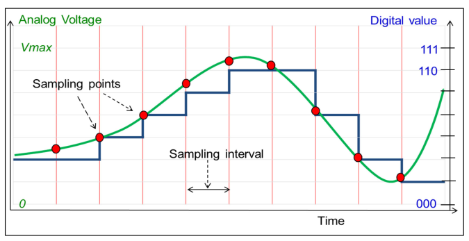

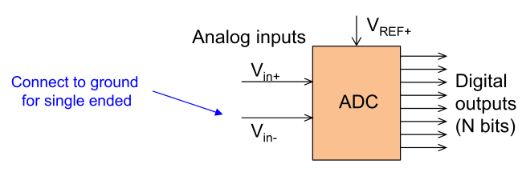

$V_{REF+}$ is the max. voltage for $V_{in+}$ and $V_{in-}$

Because analog signals are often differential, the ADC needs two inputs. If there is only one (single ended), $V_{in-}$ can be seet to GND and $V_{in+}$ can be used as the actuall input.

Characteristics of ADC:

* **Conversion Time**
  The time needed when the analog signal is sampled to when the digital signal is available
* **Quantization Error**
  Because an ADC quantises the ADC might have an quantisation error up to $\pm 1 LSB$
* **Offset Error**
  An ADC might be offseted resuling in an offset error
  
* **Gain Error**
  
* **Full-Scale Error**
  The full-scale-error is defined als `offset error` + `gain error` and is the total error without the quantisiation error.

### Flash DC

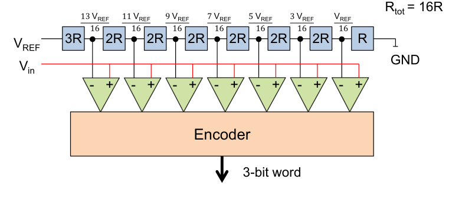

These things 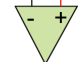 will output `1` if `+` > `-` and outputs `0`, if `+` < `-`.

If for example $V_{REF}=8V$ and $V_{in}=2.3V$.

#### Successiv Approximation Register ADC (SAR-ADC)

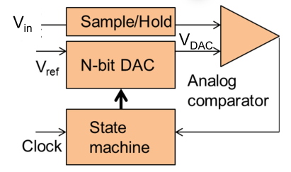

A SAR-ADC does a binary search to find the digital value of $V_{in}$. To do this, it guesses a number, generates the analog value for it by using a DAC and compares $V_{DAC}$ to $V_{in}$.

The `Sample/Hold` block reads $V_{in}$ and holds it for a specified time. This is needed since the input against, which the state machines tests against, shouldn't change. Additionally, it also decouples the SAR-ADC from the input resulting the input not being loaded.

SAR-ADCs are a lot cheaper, as it uses a cheap DAC. For each additionall bit of resolution an additional clock cycle is needed for the SAR-ADC.

### STM32F429

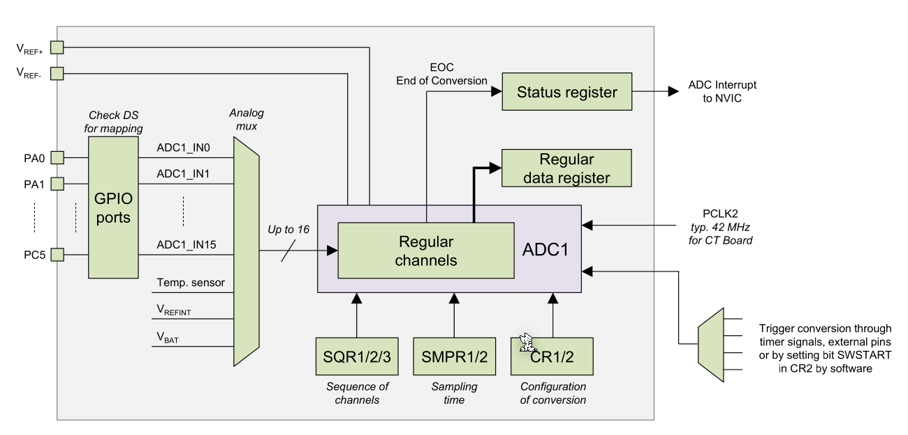

`SQR1/2/3` specifies **TODO**.

When the ADC is done then the `EOC` signal is set in the status register. There is also an EOC interrupt available.

In single channel mode, the ADC only samples one signal.

The sampling rate depends on the internal sampling rate and the conversion time: $T_{total}=T_{sample} + T_{conv}$

$T_{sample}$ can be between 3 and 480 cycles and is set in `ADC_SMPR1` and `ADC_SMPR2`. `T_{conv}` depends on the resolution:

* 12 bits 12 ADCCLK cycles
* 10 bits 10 ADCCLK cycles
* 8 bits 8 ADCCLK cycles
* 6 bits 6 ADCCLK cycles

The sampling rate is $f=\frac 1 {T_{total}}$

There is also a watch dog available, which can check a specific chanel for a high and log threashold and interrupts the CPU if the signal trips the watch dog.

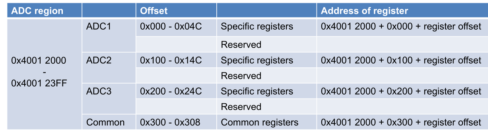

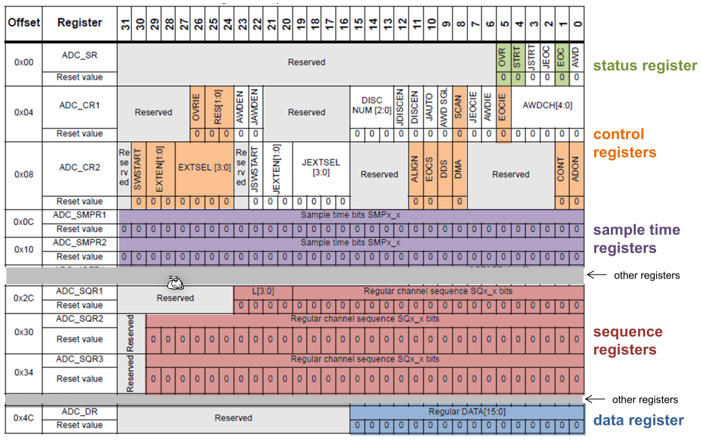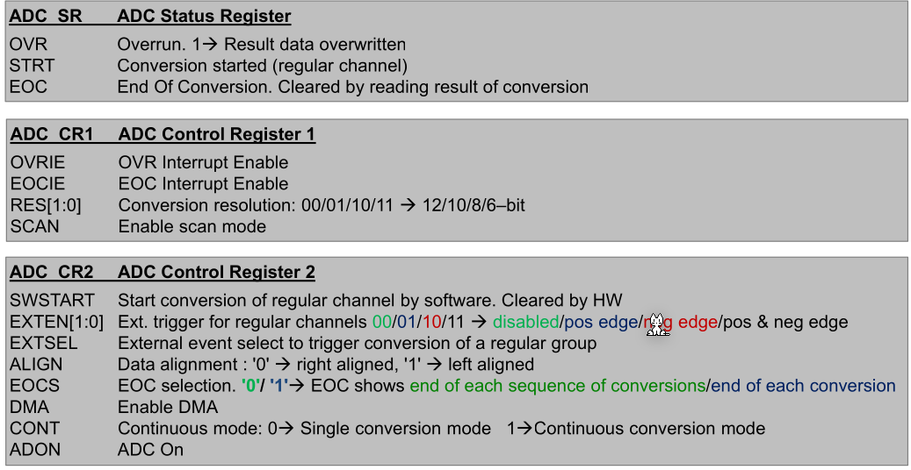

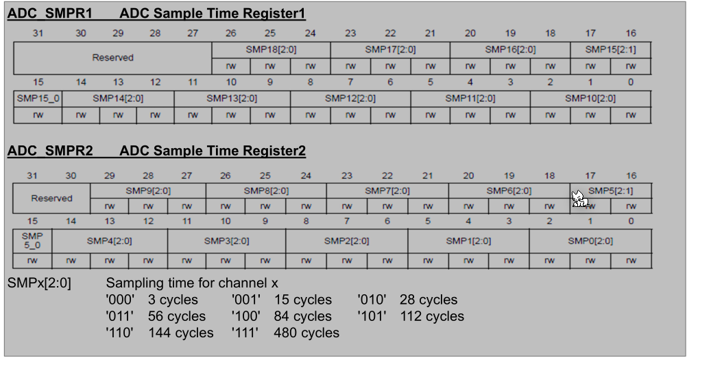

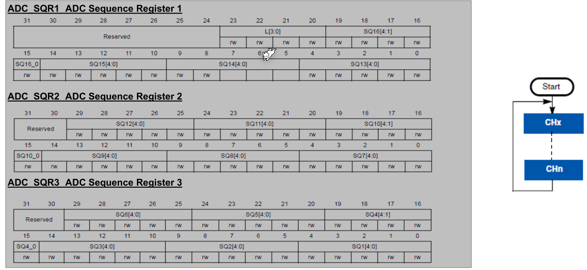

`L` specifies the number of chanels to sample. `0` => 1 chanel, `1` => 2 chanels, ...

## Digital to Analog Converter (DAC)

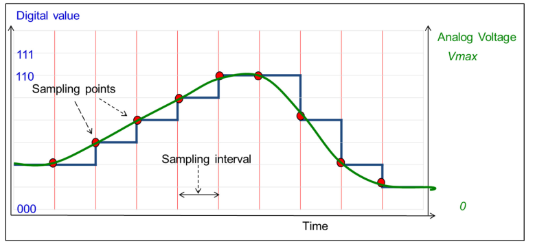

The following shows an potential implementation of a DAC:

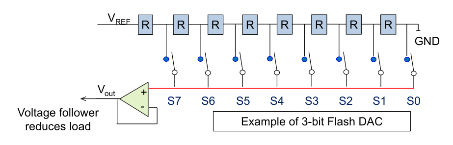

`R`s are resistors. Depending on which switch ($S7-S0$) is enabled, $V_{REF}$ is lowered or not.

The following component is a follower. It outputs whatever signal it sees on the `+` input. This is needed to decouple the internals from $V_{OUT}$

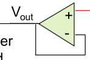

