# Cache

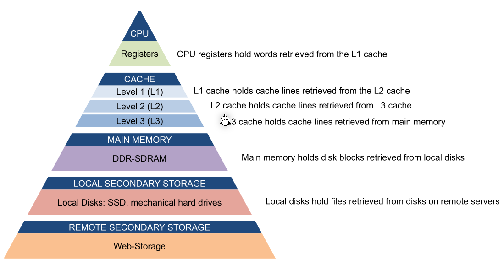

The L1-cache can be split into data and instruction cache which would represent a Harvard architecture.

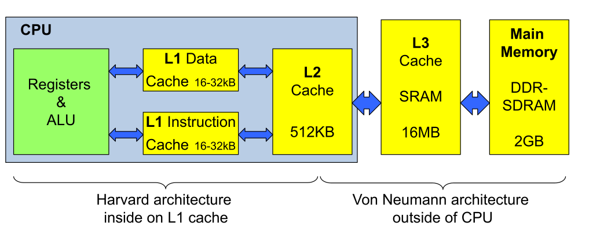

## Principle of Locality

* Spacial Locality
  If one byte is read, it is probable that the next few bytes will read as well
  This is archived by having a cache which works in blocks.
* Temporal Locality
  If one byte is read, it will probably be read again
  This is automatically archived by a cache.

```c
for(int i = 0; i < 10000; i++) {
    a[i] = b[i]; // spatial locality
}

if(a[1234] == a[4321]) { // temporal locality
    a[1234] = 0;
}
```

## Cache Mechanism

The cache works with blocks of data. This satisfies both spacial and temporal locality.

If the CPU requests a block, which currently is not in the cache, then this is a cache miss. A cache miss is expensive since the CPU has to wait for a slower cache or RAM. If a requested block is cached, then this is a cache hit.

One way to improve performance is to optimise for higher hit rates.

## Cache Organisation

The `tag` specifies which block in memory is cached, `v` is a bit which indicates the cache line is valid, and in the `data` bytes the actual cached data is stored. 

From a memory block id, its corresponding memory address can be calculated. 

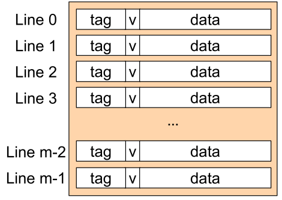

In the following example, such a table is used. Each block is the size of 4 bytes.

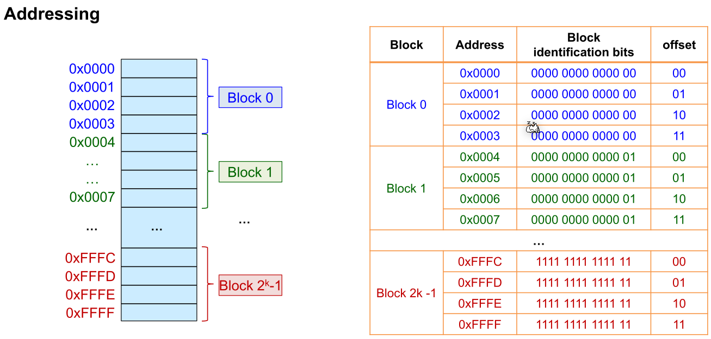

### Fully Associative

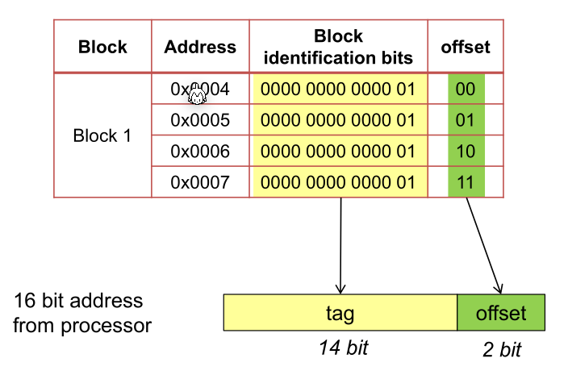

To check and retrieve data from the cache, the controller cuts of the offset and compares the tag with each cache line tag. If a matching tag line is found and its valid bit is set then the CPU can read from the byte selector.

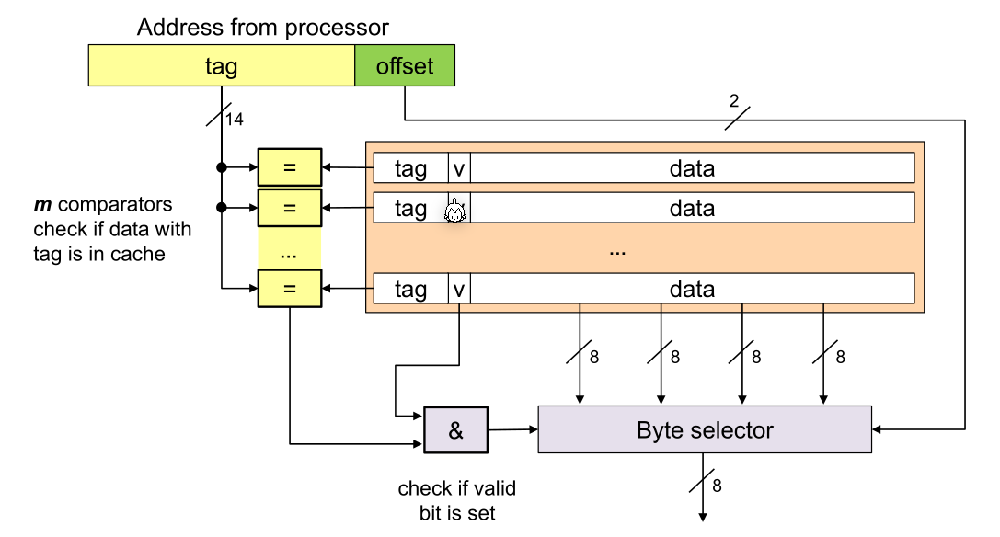

This organisation schema has a few disadvantages:

* If the cache is full there needs to be a replacement logic built in hardware
* A lot of comparators are needed

### Direct Mapped

In a direct mapped cache each block can be at exactly one place. E.g. block `0`, `256`, `512`, ... can only be placed in the cache line `0`. 

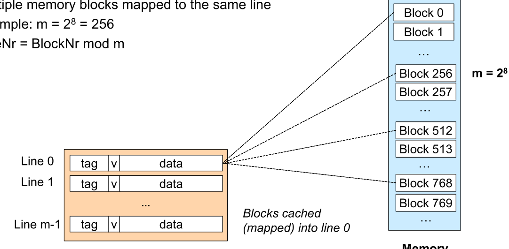

To read from the cache, only one comparator is needed since the cache line can be calculated by the requested address. The cache only has to validate that the stored block in the cache line is the actually requested address.

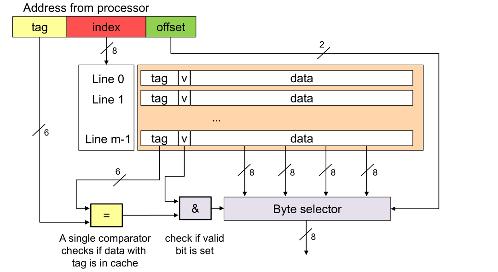

To find the cache line, the index is used. Because of this, less memory has to be used to store which memory has been cached.

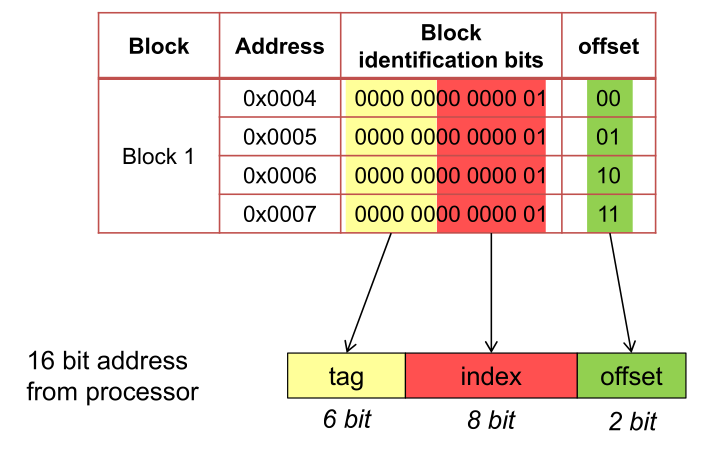

The advantage of this is:

* The replacement strategy, if the cache is full, is already built in
* Only one comparator is needed
* Less memory is needed for management

### N-Way Set Associative

N-way set associative is a compromise between direct mapped and full associative.

Compared to direct mapped, a block can only be in exactly one set, which consists of multiple cache line.

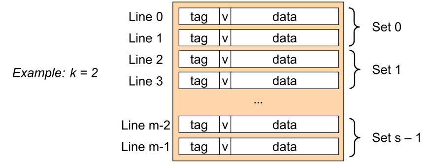

The following shows how block addresses are split up:

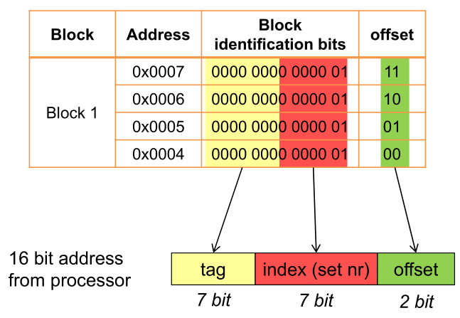

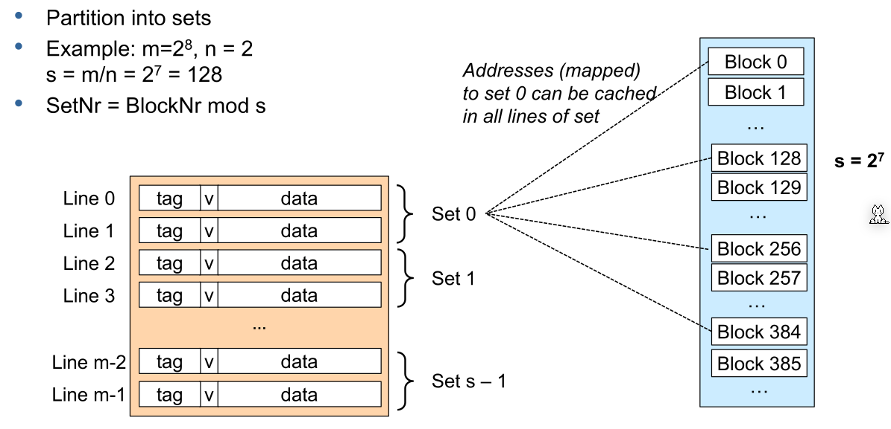

This shows the logic to read from the cache:

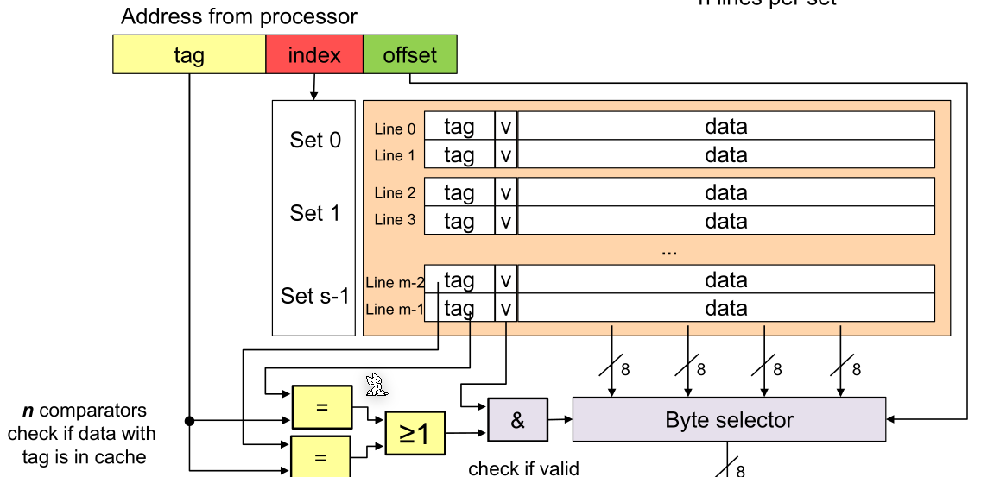

### Comparison

The following table $m$ is the number of lines, $n$ is the number of lines per set

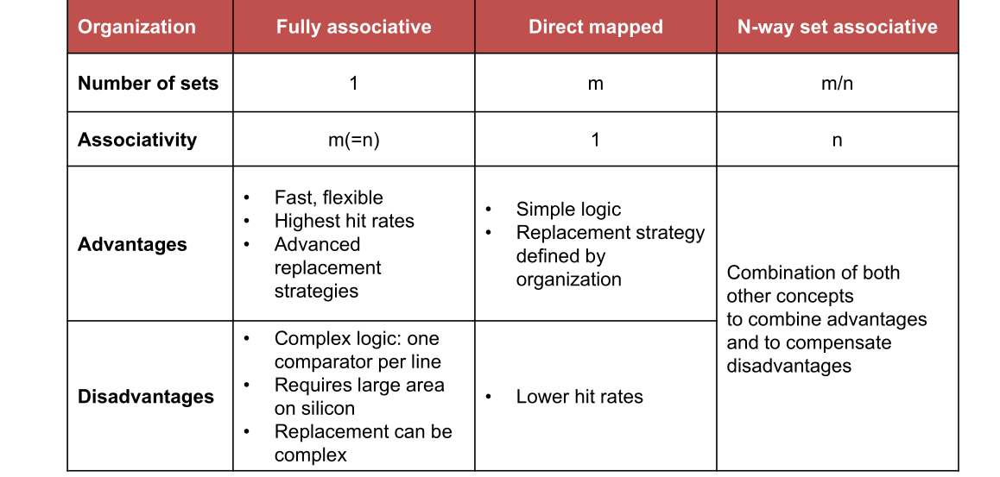

## Cache Miss

A **cold miss** happens on the first access of a block.

A **capacity miss** happens when a block was already read but was purged due to the capacity of the cache.

A **conflict miss** happens when a block was purged because another block associated with the set has been cached in the set.

There are a number of performance metrics:

**Hit Rate** is the number of hits per total number of accesses, while the **miss rate** is the number of misses per total number of accesses.

The **hit time** is the time required to access a cached block. The **miss penalty** is the time needed to access a byte which was not cached.

The average access time is calculated with: $Access Time=HitTime + MissRate\cdot MissPenality $

## Replacement Strategy

* LRU: Least recently used
* LFU: Least frequently used
* FIFO: First In–First Out (= oldest)
* Random Replace: randomly chosen

For all, except random replace, needs additional memory for the required statistics for the replacement strategy.

## Write Strategy

If a byte is written and there is a cache entry, there are two potential strategies:

* Write-through: Write immediately to memory and clear the cache
* Write-back: Delay writing to memory. Instead write to the cache and write it back, once the block is replaced.

If there is no cache entry, these strategies are possible:

* Write-allocate: Load line into cache (from memory) and update the line in the cache
* No-write-allocate: Write immediately to memory

## Optimisations

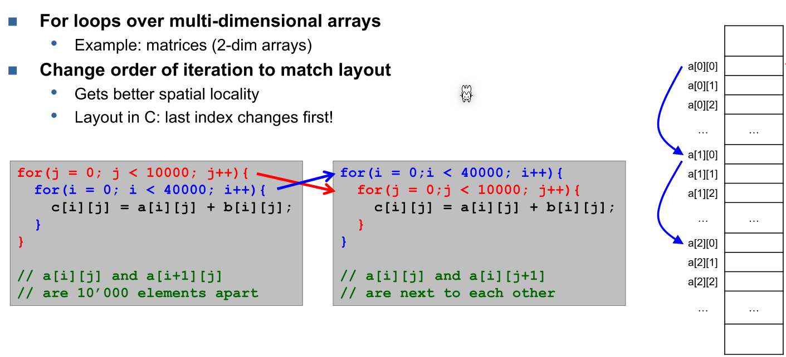

