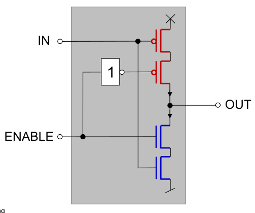
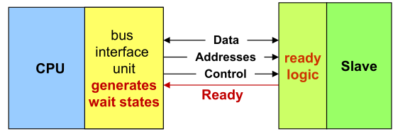
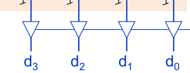

# Fragen

Bei folgendem Tri-State Inverter, wieso ist ein Inverter vor dem zweiten p-type , anstelle von einem n-type?

Bei folgendem Diagramm (Basics/p.35), werden wait states generiert bis der Slave `ready` aktiviert?

In PROM was sind diese Bauteile? Tri-State Inverters oder Tri-State Buffers? (Memory/p.9)

