# GPIO

GPIO refers to general purpose input/output and are used to map internal chips to the "outside" of the chip. 

The gpio pins are organised in banks, named from `A` to `K`, each containing 16 pins. 

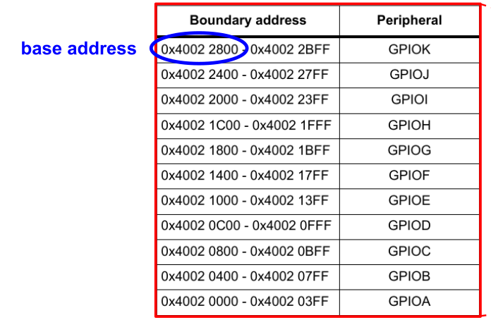

Each bank has reserved `1024` bytes. 

## Pin Sharing

Because the chip doesn't have enough pins for all internal periphery, the programmer can choose which pins are mapped to the GPIO pins.

This makes it configurable which pins need to be accessible from the outside of the chip.

## GPIO Structure

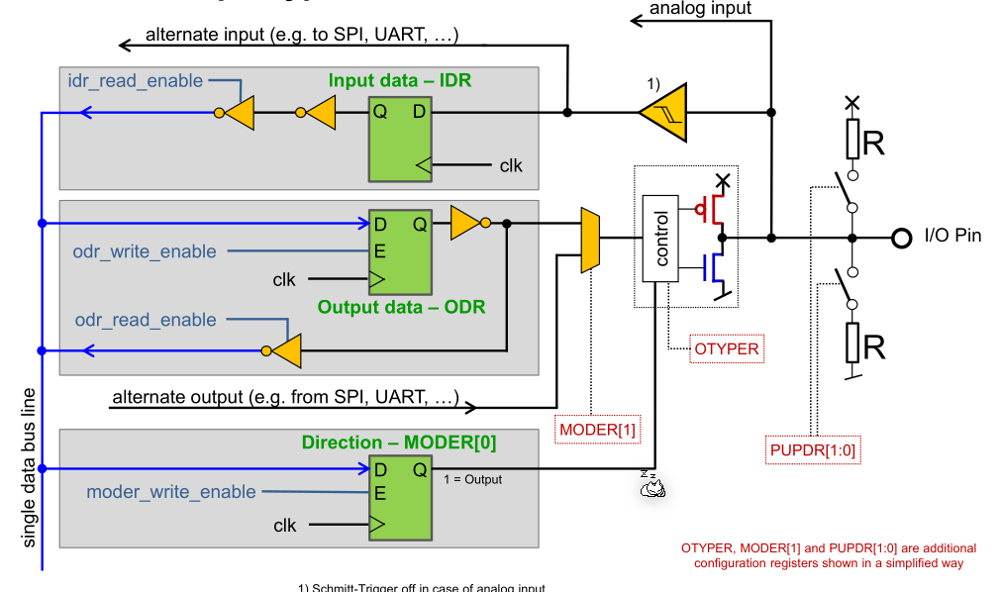

The IO pin is, after passing through a schmitt-trigger, received by a data cell (input data - IDR). This data cell is only readable if the `idr_read_enable` register is set.

If the pin is used as an output then the second data cell (output data - ODR) is used. To switch between the output and input data cell, the control tri-state driver is used. It is controlled by the `MODER` register.

If a pin should be driven by an internal chip, then the "alternate output" route is used.

A pin can also be configured to have a pull-up or pull-down resistor.

## GPIO Register

When wanting to set a bit, it is important to only change the target bits to not affect other functionality.

In C, this can be done with:

```c
GPIO->MODER &= (~0x00c000000); 	//0x00c0'00000
GPIO->MODER |= 0x00400000; 		//0x0040'0000
```

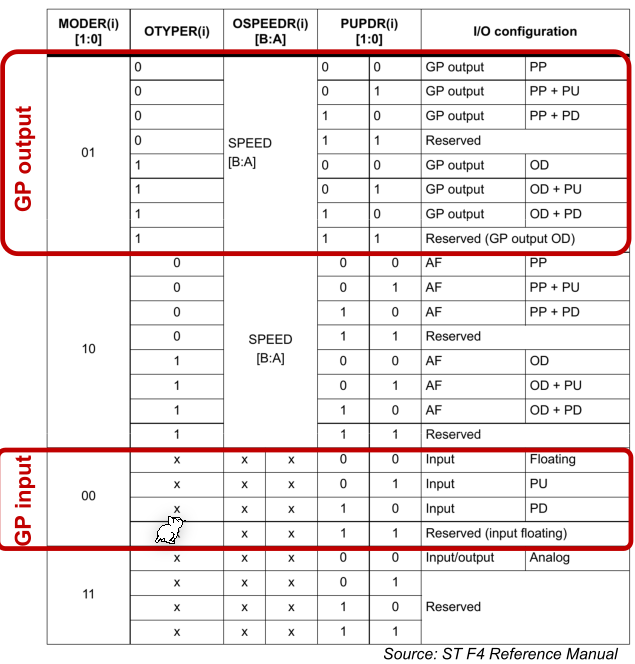

The following graphics shows all register and their default values.

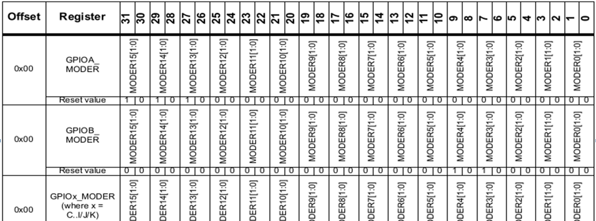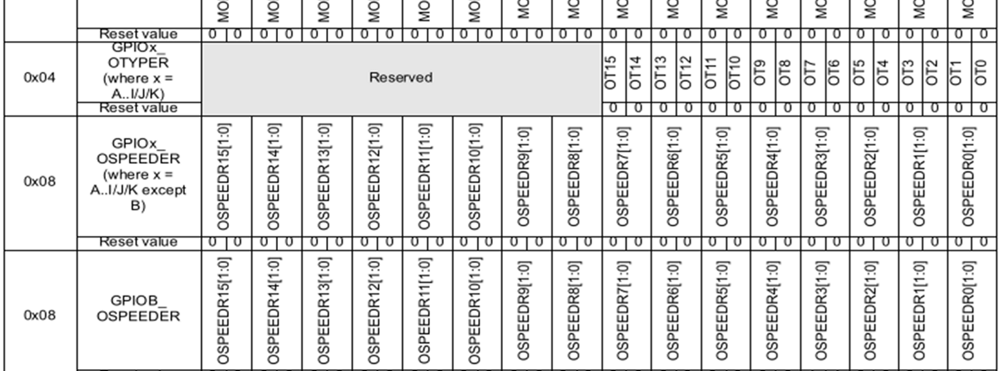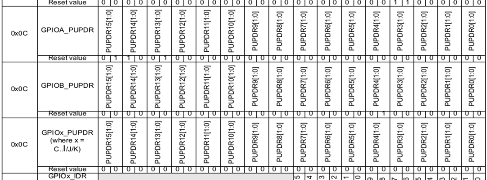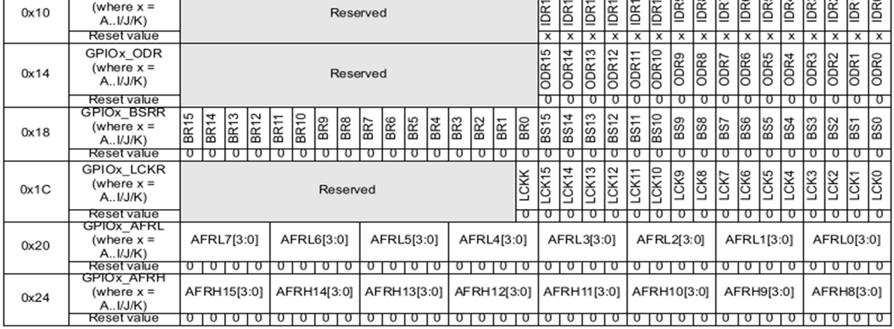

### `GPIOx_MODER`

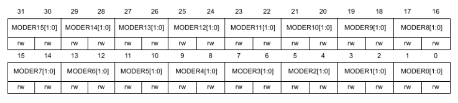

The `MODER` register sets the output mode of a GPIO pin and each pin has two bits.

* `00`: Input
* `01`: General purpose output mode
* `10`: Alternate function mode when mapping other internal chips to a GPIO pin
* `11`: Analog mode 

### `GPIOx_OTYPER`

GPIOx_OTYPER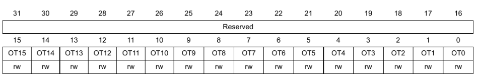

The `OTYPER` (output type register) register controls the output type. When `MODER` is set to input then this register doesnt't affect anything.

* `0`: Output push pull
* `1`: Open Drain

#### Push-pull vs. Open-drain

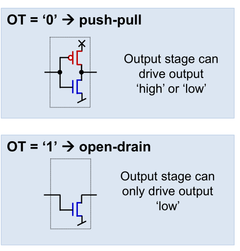

When push-pull is activated then the output behaves as a normal output which can be set to high or low. 

When open-drain is activated, then the pin can either be low or a floating pin. This is useful when multiple device run on the same bus.

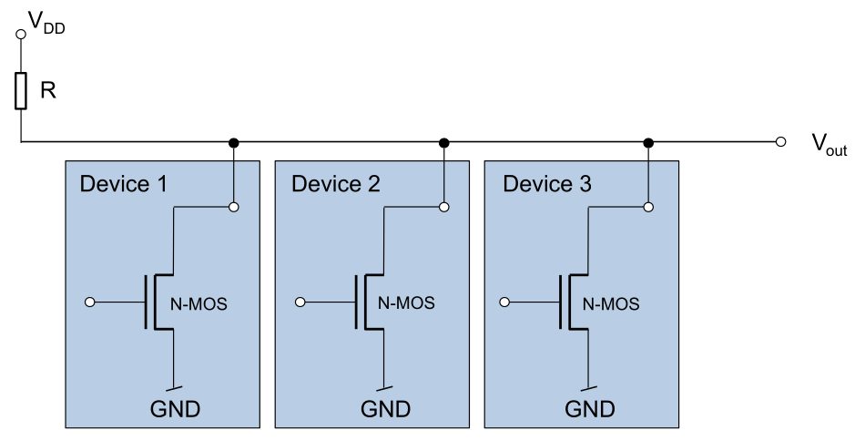

### `GPIOx_PUPDR`

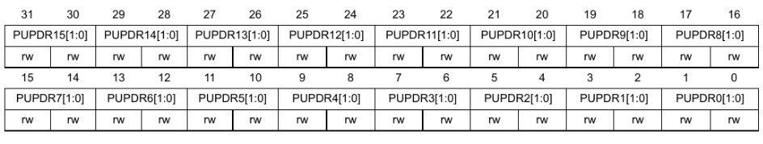

The `PUPDR` (pull-up pull-down register) controls whether a pull-up or pull-down register should be connected to the pin.

* `00`: No pull-up, no pull-down
* `01`: pull-up
* `10`: pull-down
* `11`: reserved

### `GPIOx_OSPEEDR`

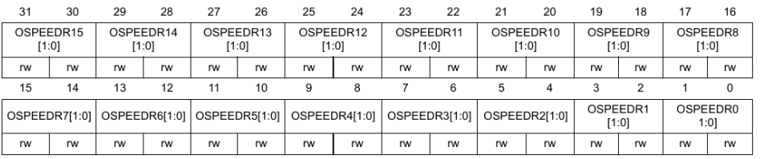

The `OSPEEDR` (output speed register) register controls how fast an output pin changes from `0` to `1` and from `1` to `0`.

* `00`: Low speed
* `01`: Median speed
* `10`: Fast speed
* `11`: High speed

### `GPIOx_IDR`

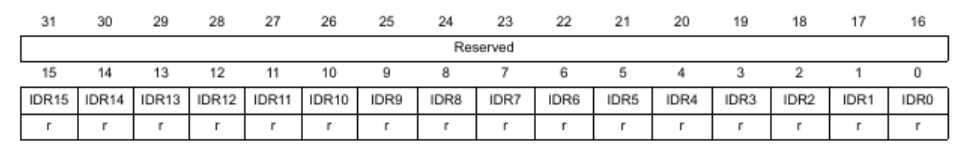

The `IDR` register contains the input value of the pin and is read only and only relevant if `MODER` is set to input.

### `GPIOx_ODR`

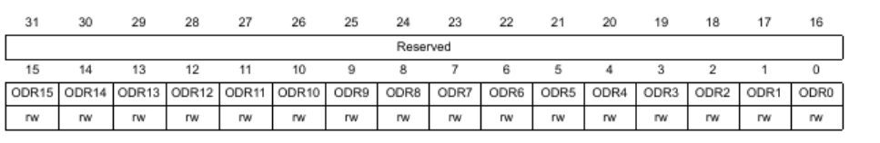

The `ODR` register can be read and written to by the software and is only relevant if `MODR` is set to general purpose output.

### `GPIOx_BSRR`

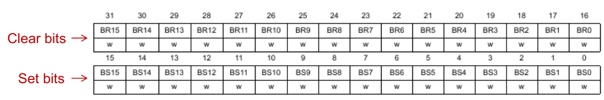

The `BSRR` (bit set and reset register) is a workaround to not having to read and write the `ODR` register. 

The `set` bit can be used to set the bits where `1` is set. The `clear` bits can be used to clear the bits where `1` is set. The clear bit have the same index as the set bit but shifted by 16.

## HAL Abstraction of Registers

To create an abstracts, a structure is created with the relevant fields. This structure is pinned to the base address by cleverly casting a pointer to the structure.

```c
#define GPIOA ((reg_gpio_t) *) 0x40020000
#define GPIOB ((reg_gpio_t) *) 0x40020400
#define GPIOC ((reg_gpio_t) *) 0x40020800
#define GPIOD ((reg_gpio_t) *) 0x40020c00
#define GPIOE ((reg_gpio_t) *) 0x40021000
#define GPIOF ((reg_gpio_t) *) 0x40021400
#define GPIOG ((reg_gpio_t) *) 0x40021c00
#define GPIOH ((reg_gpio_t) *) 0x40022000
#define GPIOI ((reg_gpio_t) *) 0x40022400
#define GPIOJ ((reg_gpio_t) *) 0x40022800
#define GPIOK ((reg_gpio_t) *) 0x40022c00

//TODO

```

