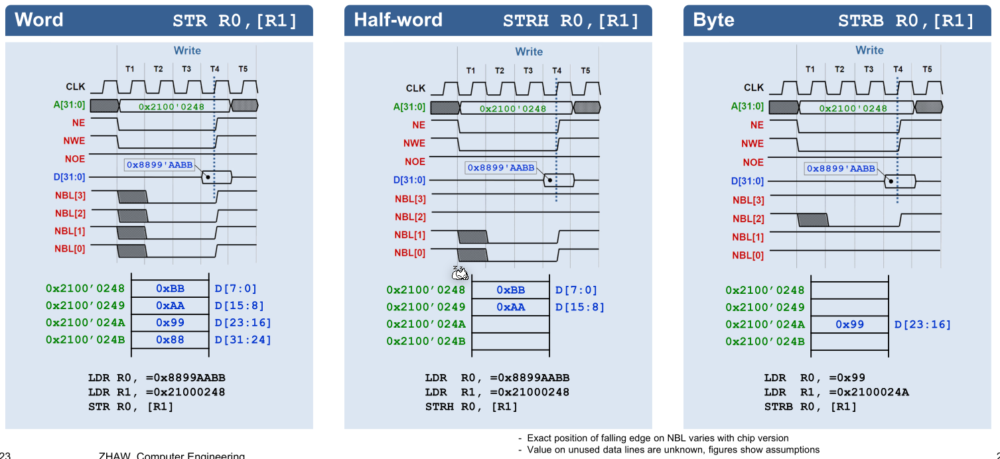

# Hardware

## System Bus

The signal bus has address lines, data lines and control signals.

Address lines are unidirectional from the master to the slave. The master dictates on which address is operated upon. The number of lines is equal to the size of the address space.

The data lines are 8, 16, 32 or 64 parallel lines which transports the data. The data lines are bidirectional as data can be read or written.

The control signals provide the current command, like read or write, as well as timing information. There are four control signals:

* `CLK`: The clock signal
* `NE`: Not Enable
  Indicates the start and end of a read or write cycle
* `NWE`: Not Write Enabled
  Indicates that the CPU will write
* `NOE`: Not Output Enabled
  Indicates that the CPU will read

*Note: the N-prefix means that connected to ground means `1`,  connected to 5V means `0`. In other words, the line is active-log*

The slave is allowed to read and write data from and to the data lines on the fourth rising flank after NE was enabled.

The following diagram shows an example read and write operation.

Note: The signals, like `NE`, or `NOE`, fall on the falling edge of the clock and rise on the rising edge of the clock.

*(This  symbol stands for all the data lines)*

To also support the half-word and byte version of `LDR` and `STR`, there are four `NBL` lines, which communicates to the slave which data lines are active. If one or two bytes are stored or loaded, the data lines used aren't necessary the first and second (as also seen in the byte example).

### Example Slave

*Notes: The Flip-Flops write the `D` to the `Q` output, if `E` is set and `CLK` is a rising edges.*

`OE cycle counter` and `WE cycle counter` count the number of rising edges in the clock and output `1` after counting four.

The second row of inverters are tri-state inverters. If `read_enable` is cleared than the output is floating.

The address decoding can be built by cleverly combining inverters and a big and-gate:

The address decoder can be categorised in two categories:

### Slow Slaves

The CPU reads the data lines after 4 `T`s. To still be able to integrate slower slaves, there two possibilities:

* **Introduce additional wait states**
  Configure the CPU to generate wait state. The CPU will read the data later
* **Slaves informs the CPU when ready**
  The slave has a ready signal which it sets when its ready. As soon as the CPU receive this signal, it will read the data. This variant is not supported on the CT-Board.

### Control and Status Bits

A status bit is written by the slave and cannot be written by the CPU. The CPU can use these status to monitor the slave.

Control bits are written by the CPU but control the slave (like turning on and off a LED). Control bits can also be read by CPU.

### Synchronous vs Asynchronous

The system bus is a synchronouse bus and has one clock which provides the clock signal on the bus with the control signals.

All devices on the system bus are connected with a tri-state inverter

An asynchronous bus is a bust where every device has its own clock. 

 

### Driver: Tri-State Inverter

A tri-state-inverter has one input and an enable line. When the enable line is set, then the inverter functions normally. If the enable line is cleared, then the tri-state inverter is not set or floating.

A CMOS Inverter is build in the following way: A n-type conducts if the gate is `1`, a p-type conducts if the gate is `0`.

This can be extended to allow an additional enable state to disable the inverter:

