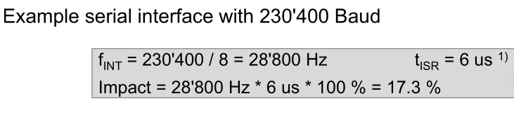

# Math

## Timer

$$
f_{end}=\frac{f_{initial}}{PreScaler \cdot (f_{ARR})}\\
f_{ARR}=\frac 1 {ARR + 1}
$$

## ADC

$$
\begin{flalign}
&1 LSB = \frac{V_{REF}}{2^N}\\
&\text{Full Scale Range (FSR): } V_{FSR}=V_{REF}- LSB \\
&\text{Max Sample Rate: } f_{max}=\frac{f_{ADC}}{PreScaler}
\end{flalign}
$$

## Cache

$$
Access Time=HitTime + MissRate\cdot MissPenality
$$

$$
\begin{align}
HitRate &= \frac{NrOfHits}{NrOfAccess}\\
MissRate &= \frac{NrOfMiss}{NrOfAccess}=1 - HitRate\\
\end{align}
$$

## Performance

$$
impact=f_{int}\cdot t_{ISR}\cdot 100\%
$$



## C Code

```c
// read from address
uint8_t a = *((volatile uint8_t*) (0x61000007));

// or
#define A_REG (*((volatile uint8_t*) (0x61000007)))
uint8_t a2 = A_REG;

// set a specific bit (in this case the 16th bit starting at zero)
volatile uint16_t* reg = 0x61000010;
reg &= ~(1 << 16);
reg |= 1<<16;
```

