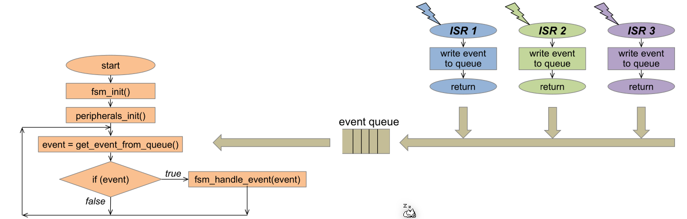

# Performance

## Numbers

$f_{int}$ the the frequency of an interrupt occuring.

$t_{ISR}$ is the time needed to handle a specific interrupt. This depends on the number of instructions in the IR, the required clock cycles per instruction, the CPU clock frequency and the time for switching and returning from the ISR. Of those factors, only the size of the ISR can be adjusted.

The `impact` is the percentage of the CPU time used by a service interrupt:
$$
impact=f_{int}\cdot t_{ISR}\cdot 100\%
$$
In the case of a keyboard with $f_{int}=20Hz$ and $t_{ISR}=6 us$, the impact is $20 Hz \cdot 6us \cdot 100\% = 0.012\%$.

## Interrupt Performance

A ISR needs to be short, not just short on average, since if the ISR takes longer and an interrupt for this ISR occures, then the interrupt is lost.

To implement this, the following can be done:

* Move tasks with relaxed time-constraints to the main loop
* Make ISR available for an other time-ciritical taks
* Feed the interrupt into a queue and dequeue in the main process.

## Interrupt Latency

$t_{latency}$ is the time needed to start executing the first "usful" instruction of the ISR. This can be relevant where guaranteed service time required (e.g. audio/video steaming).

The $t_{latency}$ can be influenced by hardware (pipelining, different execution time per instruction) or software code, like saving additional registers, higher prioritised interrupts, ...

While reducing this can be difficult, there are some tricks to improve it:

* Avoid saving additional register on the stack
* Change the prioritisation
* Disabling masked interrupts

## Polling Loops

Extremely short polling loops can be very fast and responsive, where invoking an ISR is a costly operation. Thus, if pure speed is the goal, a polling loop isn't necessarily a bad idea.

Additionally, consider that every interrupt is able to interrupt the main and take control away.

## Managing Latency

In the ISR above, there is a loop marked with the red bracket. Since this is a high priority ISR, this loop has the potential to block the whole system.

To remedy this, instead of letting the ISR write to the output directly, the ISR should write to a FIFO queue.

If there are multiple ISRs, the architecture will look like this. In this design, there is a polling main loop again, which effectively is the lowest prioritised "ISR".

This can be furthered enhanced, by combining all event queues together.

