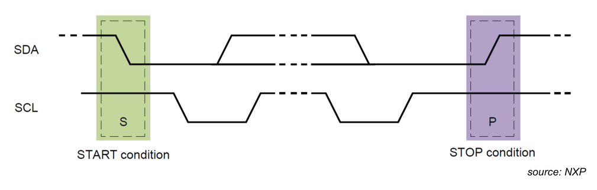
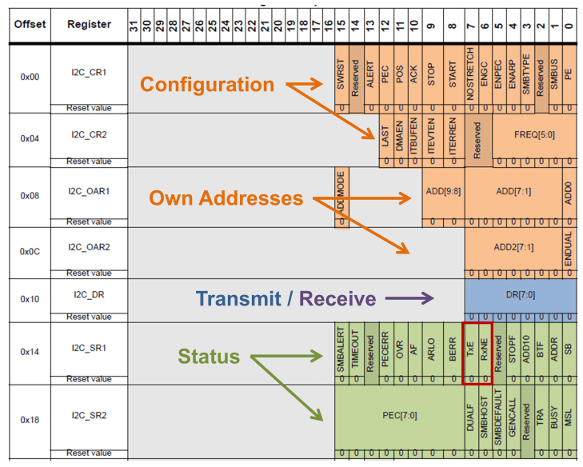

# I²C

## Start and Stop

The master initiates a transaction with a falling edge on `SDA` while the clock signal `SCL` is high. The transaction is ended with a rising edge on the data line `SDA` when the clock `SCL` is high.

## Addressing

The first 7bits when starting a transaction is the address of the slave.

| Bits | Content                                       | Sent By |
| ---- | --------------------------------------------- | ------- |
| 0-7  | Address send of slave (MSB is sent first)     | Master  |
| 8    | `1` = the master reads, `0` the master writes | Master  |
| 9    | `ACK` by slave                                | Slave   |

If the master wants to check if there is a slave with a given address, then the master can start a transaction and see if there is an acknowledgement.

## Data

While transmitting data, `SDA` only changes while the clock `SCL` is low. When the clock signal is high, `SDA` does not change, except when sending the start and stop condition.

When a byte is complete, then the slave pulls the line down. If nobody acknowledges the transaction, then no slave will pull down the line and will stay up.

The following diagrams show a read and write transaction.

When reading from a slave, the slave can never send data after a stop signal has been sent by the master. This is because the stop condition is sent when the clock signal is high.

## STM32F4xxx

