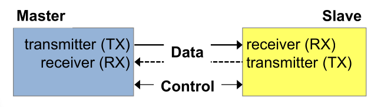
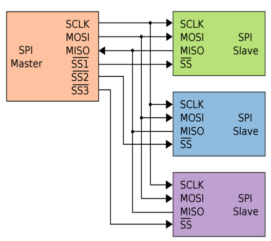
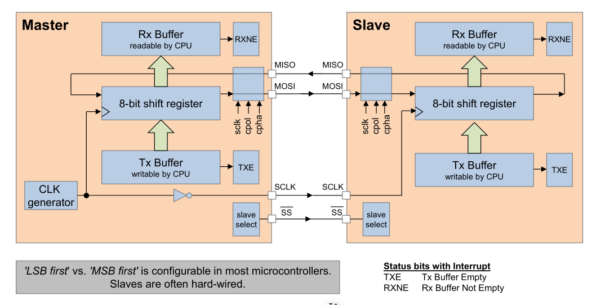
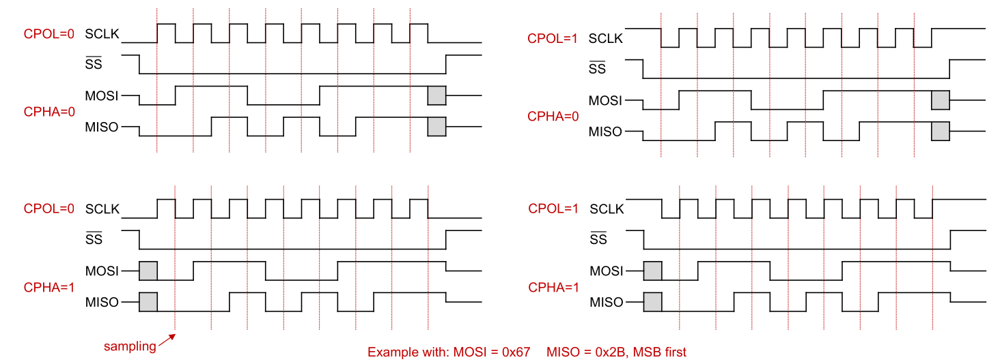
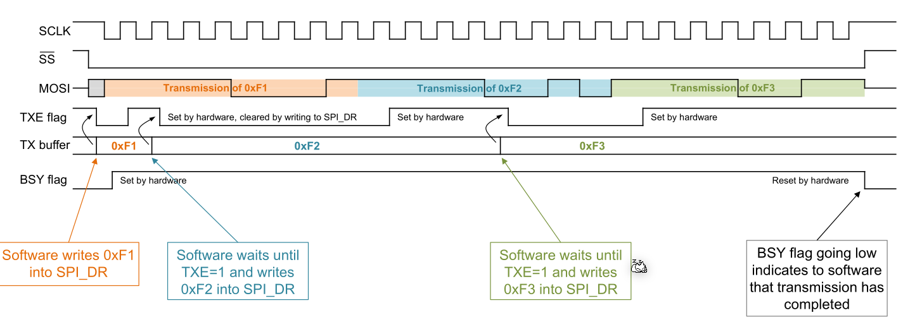
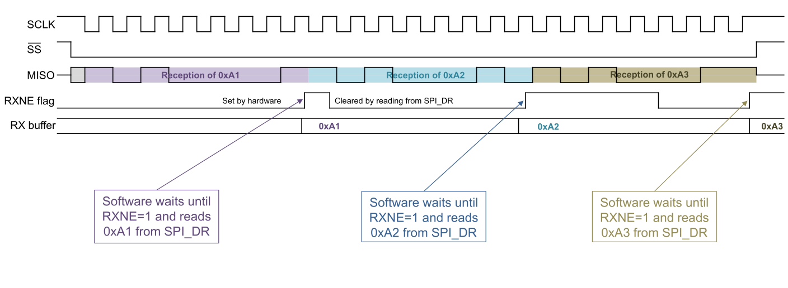
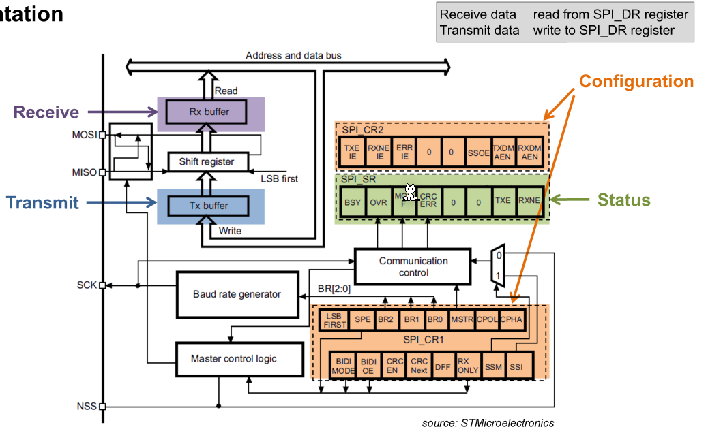

# SPI (Serial Data Transfer)

A SPI Interface can be:

* **Simplex**: Only unidirectional
* **Half-duplex**: Bidirectional, but only in one direction at a time
* **Full-duplex**: Bidirectional, both directions simultaneously

The timing component of an SPI bus can be:

* **Asynchronous**: Each node uses an individual clock
* **Synchronous**: All nodes use the same clock signal generated by the master

## Data Connections

SPI is full duplex and has to following lines:

* **MOSI** (Master-out-Slave-in): Data from master to slave
* **MISO** (Master-in-Slave-out): Data from slave to master
* **SSx** (Slave Select): The master sets the SS to `0` to initiate the data transfer. Each slave needs its own `SSx` line.

### Implementation

The shift register are 8 flip-flops which are chained together. Each clock cycle the input signal is stored in the first flip-flop, the data of the first flip-flip is written to the second flip-flip, etc. After 8 clock cycles the whole 8-bit shift register was overwritten. 

Importantly, data is always sent and received simultainously.

The clock signal of the master is inverted. This was done to help with the inherit timing issue that long lines can create. This way, the flanks are effectively sent a half-flank earlier.

For the CPU the Rx-Buffer and Tx-Buffer are at the same address.

## Flags

* **TXE**: TX-Buffer empty
  The CPU had wrote some data to the TX-Buffer which was sent out
* **RXNE**: RX-Buffer not empty
  Data was received and the CPU can access it

## Timing

The data is read on the sampling edge of the clock. The data can change on the toggling edge. Which edge (raising or falling) is which edge, can be configured in the CPU.

* **CPOL** (Clock Polarity): Where the clock rests, when nothing is transmitted
* **CPHA** (Clock Phase): If set to `0`, then the first edge (rasing or falling) is the sampling edge. On the other hand, if `CPHA` is set to `1`, then the second edge is the sampling edge.

In the following diagram, the internal communication in the CPU, when transmitting three bytes, is displayed. Interesting enough, the `TXE` flag is set to `1`  again way earlier than it is actually sent. This is done to relieve the CPU, because as soon the SPI chip copied the TR-buffer to its internal button, the CPU can write another byte into it.

It works similarly when the CPU receives data.

## Implementation on the STM32F4xxx

* Control Register
  * **MSTR** (Master): If set to `1` then the CPU is a master, otherwise a slave
  * **BR0-2**: Used to set the baud rate
  * **CPOL** (Clock Polarity): Where the clock rests, when nothing is transmitted
  * **CPHA** (Clock Phase): If set to `0`, then the first edge (rasing or falling) is the sampling edge. On the other hand, if `CPHA` is set to `1`, then the second edge is the sampling edge.
* Status Registers
  * **BSY** (Busy): If set, then the SPI chip is busy
  * **OVR** (Overrun): If the CPU doesn't read data fast enough and a new byte already arrived, then the data register is overwritten and the `OVR` bit is set.
  * **TXE** (TX-Buffer empty): The CPU had wrote some data to the TX-Buffer which was sent out
  * **RXNE** (RX-Buffer not empty): Data was received and the CPU can access it