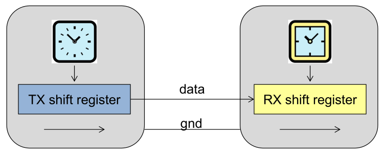
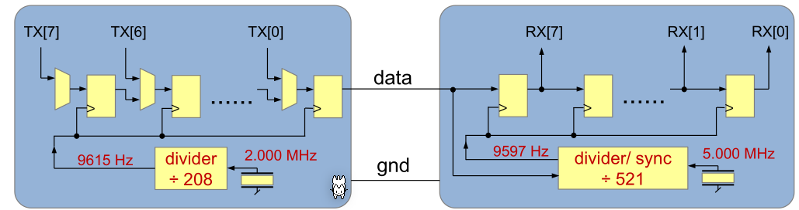
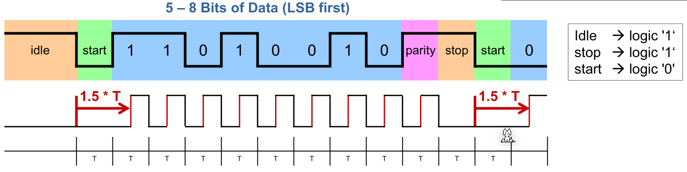
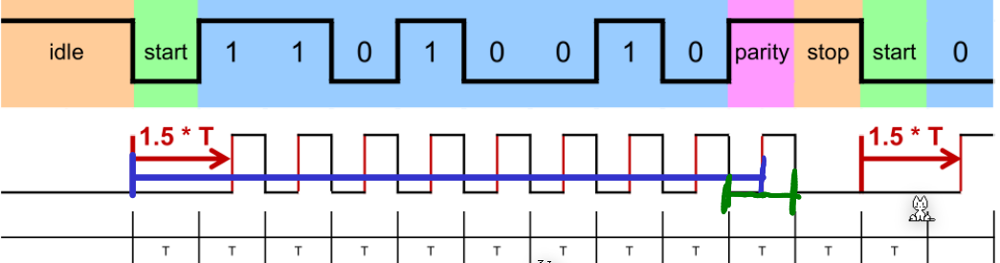
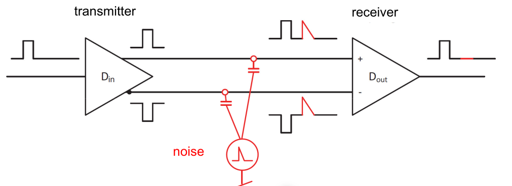
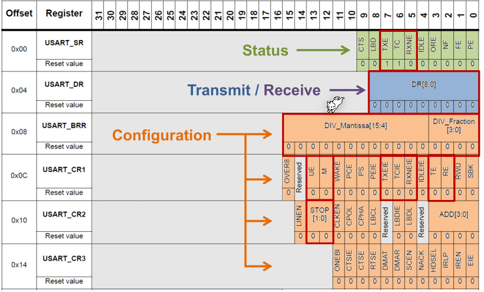
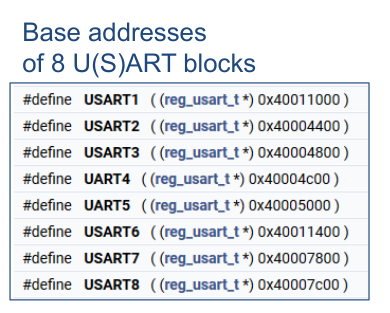
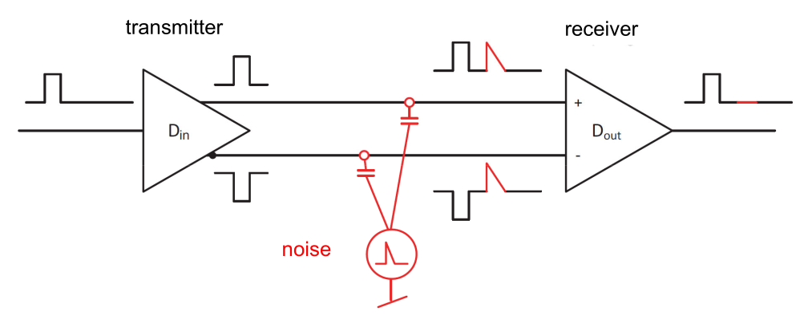
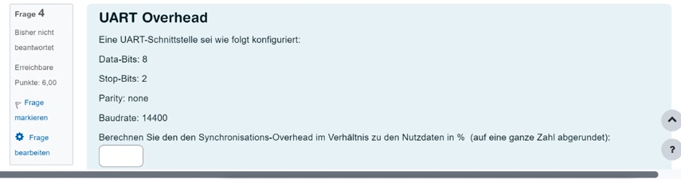
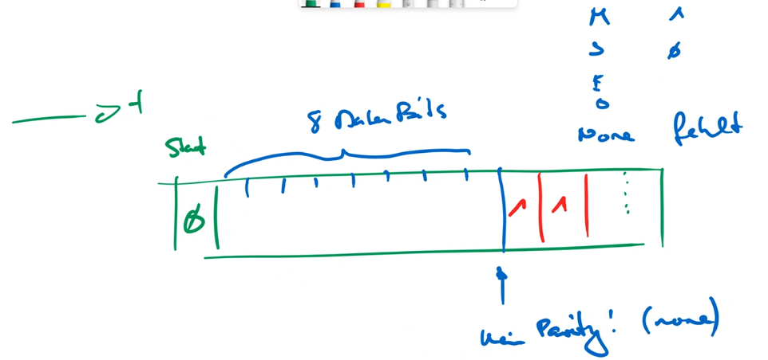

# UART

UART is an asynchronous protocol and requiring synchronisation at the start of each message. It allows for a cable up to 10m and uses $-3V$ to $-15V$ for `1` and $3V$ to $15V$ for `0`. This increases its reliability.

The diagram below shows an example implementation of a transmitter and receiver for a 9600 baud ($Baud=\frac {Bits} s$). To archive this baud rate with both a 2000 MHz and a 5000 MHz clock, dividers are used.

The clocks need to be close enough that the max deviation is $\pm 0.5 bits$

## Timing

UART starts with a start bit to synchronise the clocks. After the receiver reads the start bit, it waits for $1.5T$ before reading data. This is to ensure that the receiver reads in the middle of the clock signal.

Both clocks needs to in sync enough to stay synchronous for 10 bits by not drifting more than $\pm0.5$bit.

The diagram above shows the value $0b0100'1011$, meaning that the LSB is sent first.

This means, when 8 data bits are sent, the clock can shift $\pm 0.5$ over $8.5$ bits.

## Stop Bits

To make UART more reliable, the number of stop bits can configured to `1`, `1.5` or `2`. This helps the receiver to parse the start bit. However, even more non-data is sent, reducing the data-throughput even more.

## Parity Data

In UART there is parity-bit before the stop bit(s).

* none
  No parity bit will be sent and is missing entirely
* Mark
  The parity bit will always be `1`
* Space
  The parity bit will always be `0`
* Even
  If there is an even number of `1` (incl. the parity bit), then a `1` is sent, otherwise `0`
  (Without the parity bit, if there are an even number of `1` a `0` is sent)
* Odd
  If there is an odd number of `1` (incl. the parity bit), then a `1` is sent, otherwise `0`
  (Without the parity bit, if there are an odd number of `1` a `0` is sent)

## Differential Transmission

To futher improve the reliability, two cables per line can be used. In one cable the inverted signal is sent. Distortion will apply to both signals in the same way and can be later filtered out.

## STM32F4xxx

## RS-485

This protocol is based on UART, but adds diferential signal encoding. This enables it to carry a signal up to 100m.

## Calculations

UART Overhead:
$$
SentData = 1 + DataBits + ParityBits + StopBits\\
Overhead = \frac{DataBits}{1 + ParityBits + StopBits}
$$

The following is an example:

The solution is $\frac 3 8\cdot 100\%$ 