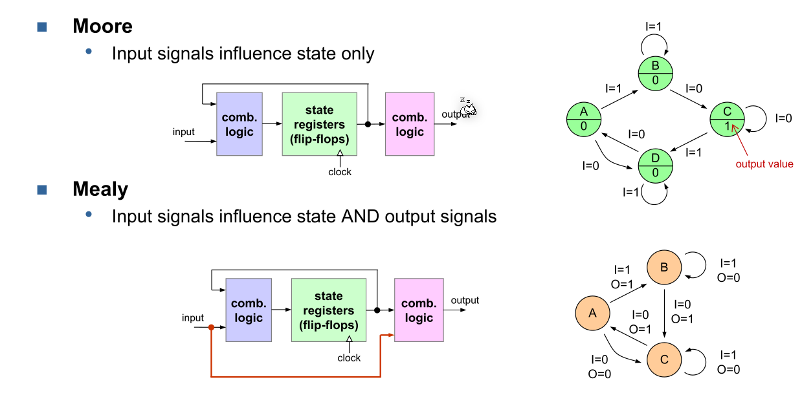
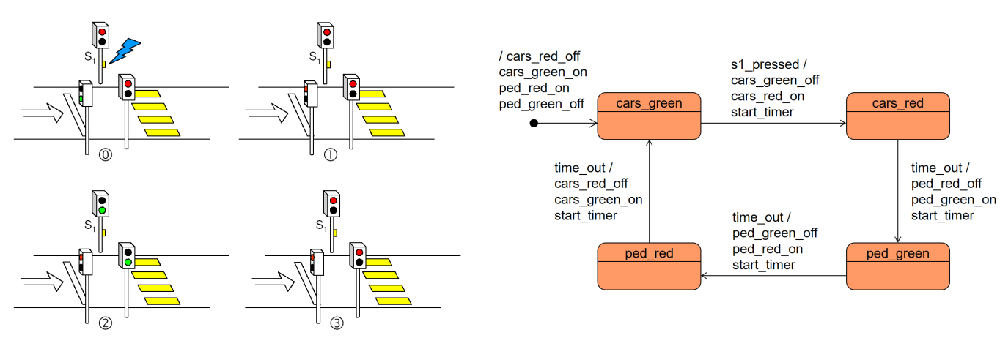
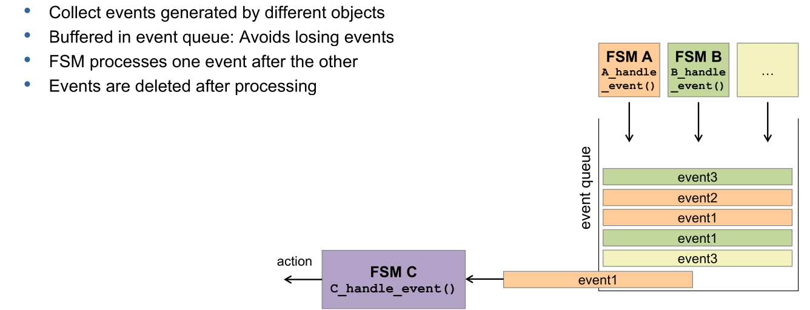

# State Machines

Finite state machines in hardware can run in parallel, since a large number of flip-flops can simultaneously change by a common clock signal. However, in software this parallelism doesn't exist. 

To optimise, a software finite state machine should only change when something changed. To enable this, an event based system can work well.

## Terminology

The **internal states** are the finite number of states the state machine can be in. An **action** is the effect a given state has on the outside world (e.g. enable the red light on a traffic line). Each event **may or may not** change the internal state  (a **transition**) or/and trigger actions.

## UML State Diagrams

In the transition `on / lamp_on`, `on` is the event which happend and `lamp_on` is the action which will occurre. The transition `/action` doesn't have an event, like the initial transition.

For a state machine to be valid, the following rules are violated:

* Every state machine must have an initial state
* Each state has to be reachable through a transition (but not every state needs a transition away from it, e.g. an error state)
* The state diagram has to be deterministic

The following is an example of a state machine for a traffic light:

*(Note: the transition between `cars_green` and `cars_red` starts a timer with `start_timer`. The next transition waits for this timer by listing the event to `time_out`)*

## Event Queue

