# Timer

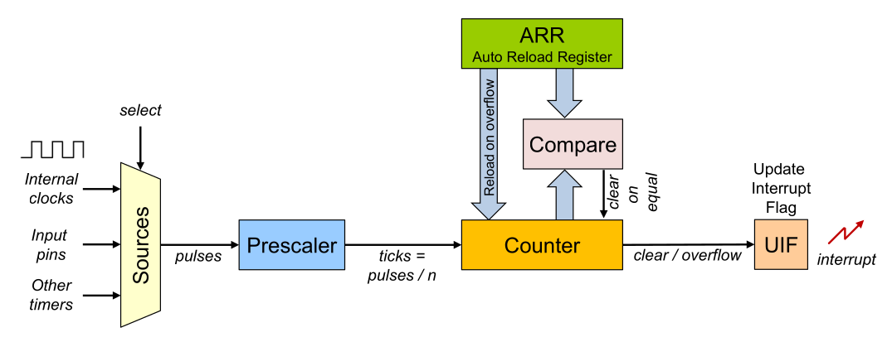

The counter counts up or down with every pulse it receives. If the counter hits `0`, then the `ARR` is loaded in the counter, and if the counter hits `ARR` then `0` is loaded into the counter. The counter **will** reach the value of the `ARR` registry, meaning that the timer counts from `0` to `ARR` inclusively.

The pulses from the CPU might still be too fast. To further slow down the counter, a prescaler can be used.

In the following example, the prescaler is set to `4` and the timer is configured as a countdown timer with the `ARR` registry set to `2546`:

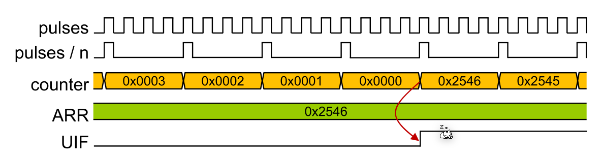

> Importantly, the UIF flag has to be reset in the interrupt service routine. Otherwise, the CPU will invoke the interrupt immediately afterwards.

The frequency can be calculated with:
$$
f_{end}=\frac{f_{initial}}{PreScaler \cdot (f_{ARR})}\\
f_{ARR}=\frac 1 {ARR + 1}\\
$$

## STM32F4xx

The `TIM2` and `TIM5` are 32-bit timers and the `TIM3` and `TIM4` are 16-bit timers. Both timer types can count up or down and can have a prescaler between 0 and 65536.

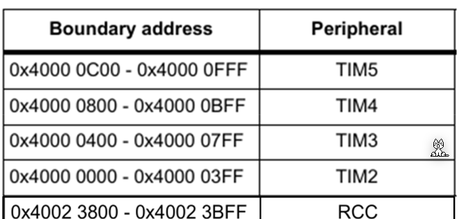

To enable the timers, the respective control bits need to be enabled in the `reset and clock control` (RCC) registry.

The following shows the RCC registry configuration:

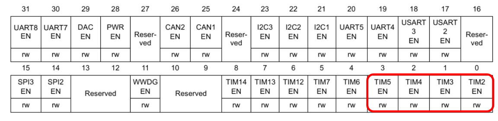

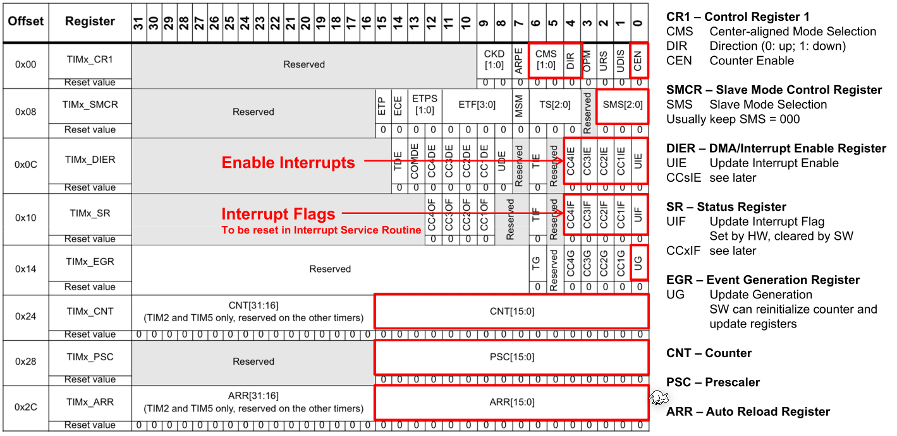

* `DIR`: Tells the timer if it should count up (`0`) or down (`1`)
* `UIE`: Enables the interrupt from the timer
* `CMS` (Center-alligned mode): should be set to `00` to use the `DIR`

In C, the structures `TIMx` can be used to configure it (e.g. `TIM2->ARR = 3200 - 1;`).

The `TIMx_ARR` (`TMx->ARR`) is the `ARR` flag, the `TIMx_CNT` (`TIMx->CNT`) is the counter variable and the `TIMx_PSC` (`TIMx->PSC`) is the prescaler.

When the center-aligned mode is enabled, the timer counts from `0` up to `ARR-1`, and then from `ARR` to `1`. This leads to the counter register having the following values: `[0, 1, 2, 3, 4, 3, 2, 1, ...]` for `ARR=4`.

The slave mode control register (`SMCR`) is usually set to `000` which causes the timer to use the internal clock as the clock source.

## Input Capture

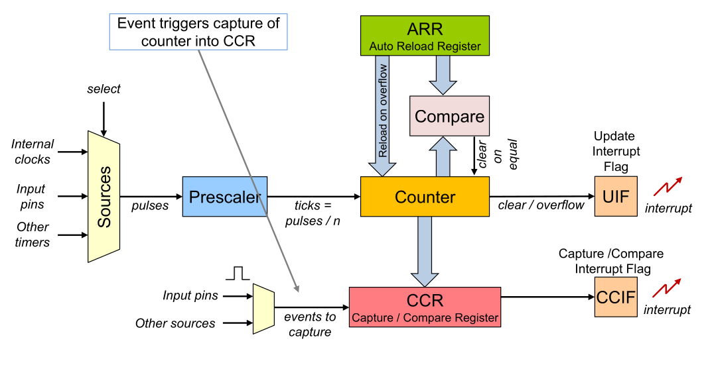

After the `CCR` captured a value it needs to be re-enabled before the next value is written into the `CCR` register.

In the `capture mode`, when the input triggers (can be configured) then the counter is stored to the `CCR` register and an interrupt is generated.

In the `compare mode`, when then `CCR` is equal to the `counter` then an interrupt is generated. 

## Pulse Width Modulation (`PWM`)

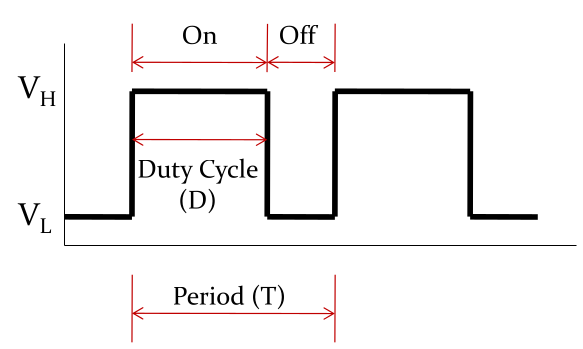
$$
V_{avg}=D\cdot V_H + (1-D)\cdot V_L\\
DutyCycle=\frac{On Time}{Period}\cdot 100\%
$$
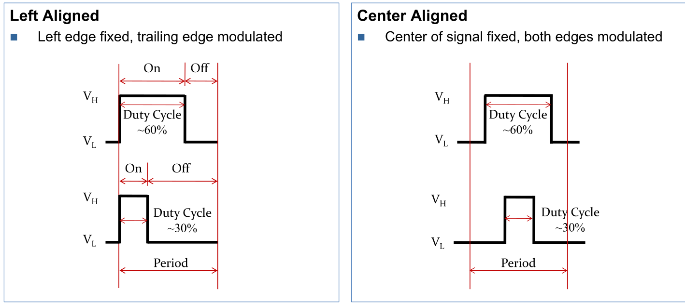

PWM signals can be generated by the timer hardware by setting the `CCR` register to the $1-DutyCycle$ or $DutyCacle$ (depending on the PWM mode). The compare output from the `CCR` (if the counter value is higher then the `CCR` register) is directly used as the PWM signal.

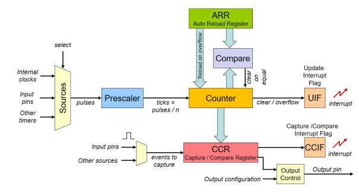

Depending on the PWM mode and if the counter counts up or down, CCR needs to be set to $DutyCycle$ or $1-DutyCycle$.

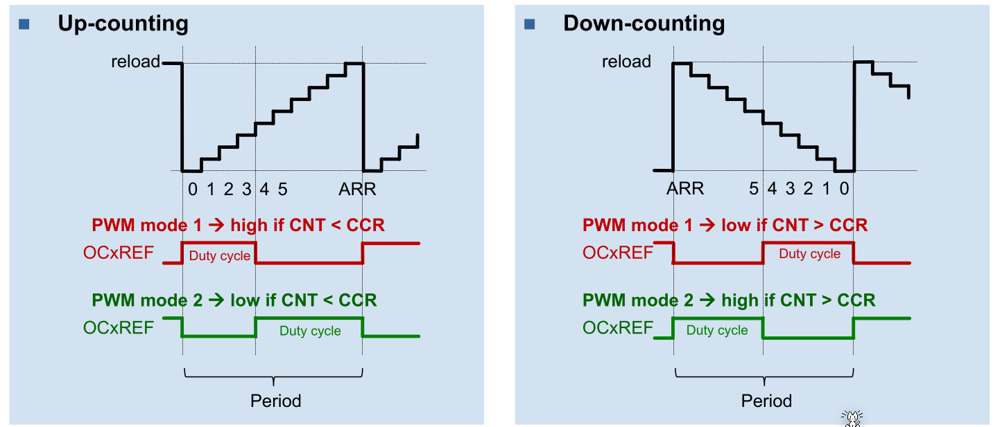

To calculate the CRR for a duty cycle:

* When up counting: then $(ARR + 1)\cdot DutyCycle$
* When down counting: then $(ARR + 1)\cdot DutyCycle-1$

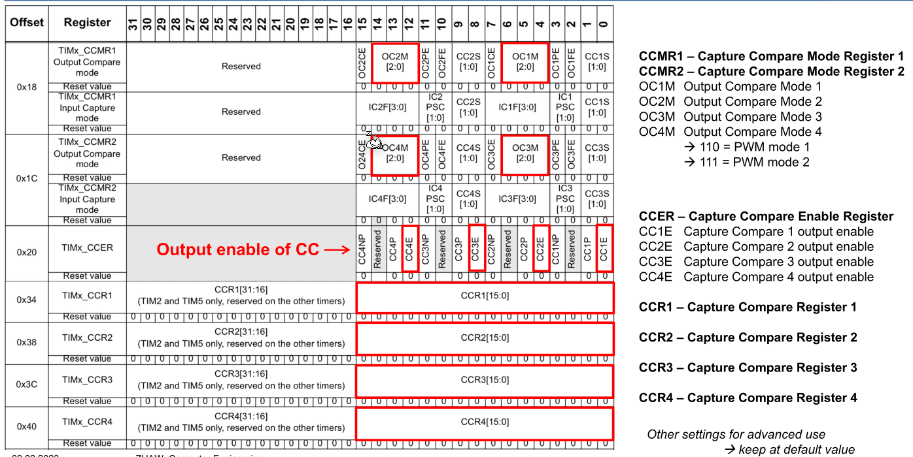

**TODO:  Calculate ARR and CCR from specifiction**
$$

$$
