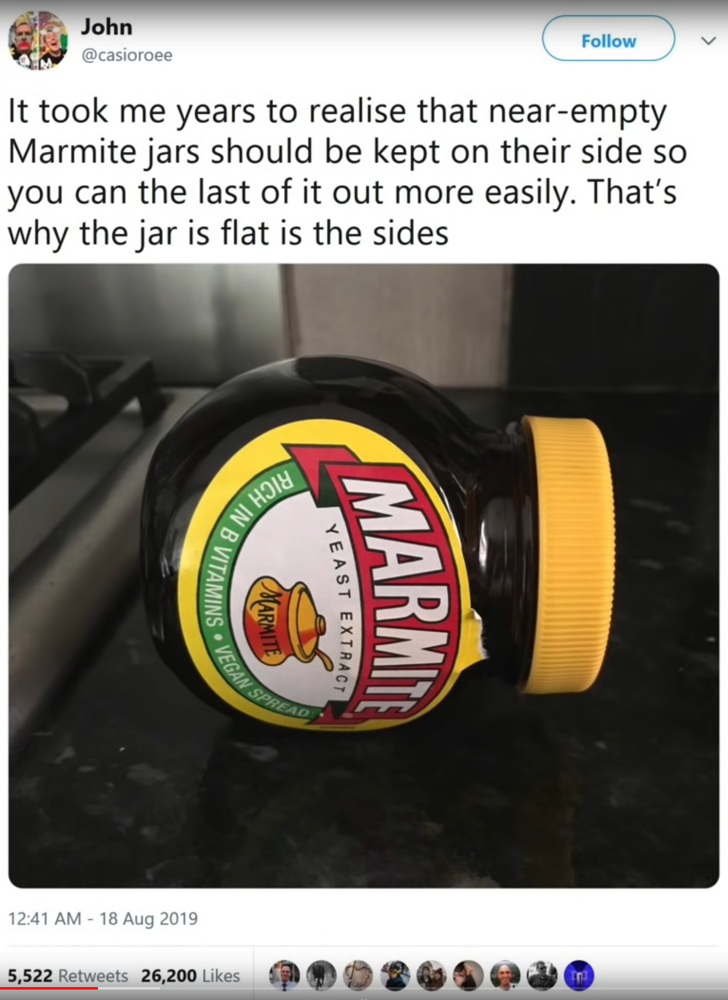
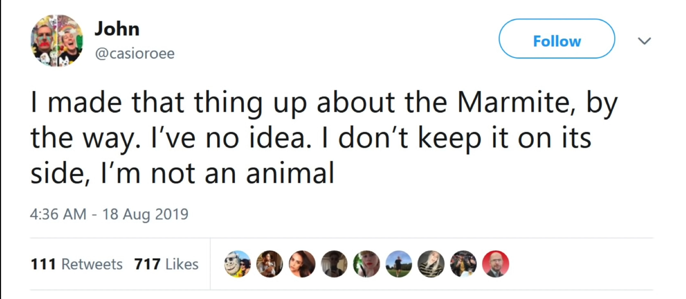
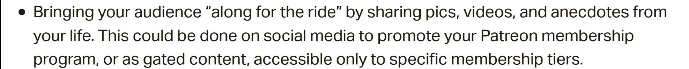
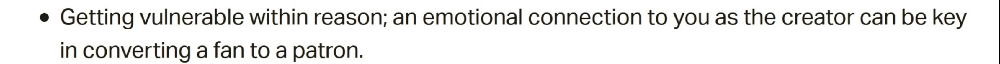
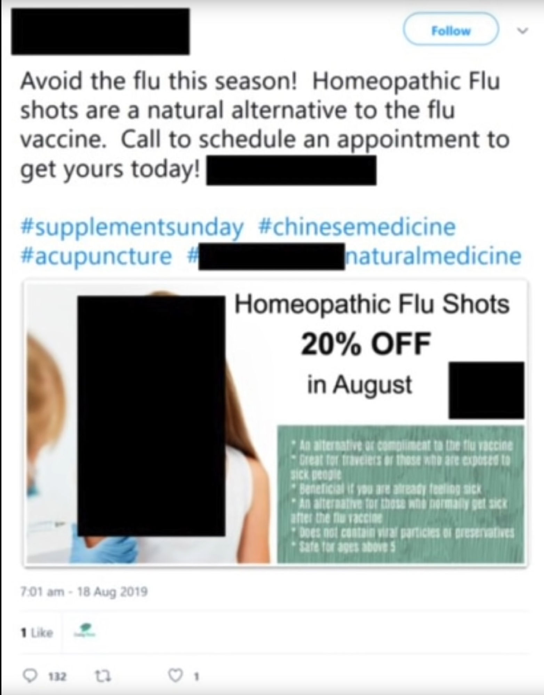

# Presentation

* A lot of caveats before the presentation started

## The Algorithm

> A black box of code which is given a list of human curated examples. It then devices a category-system those and learn from from them. Later completely new information can be given to the black box to be categorised.
>
> These categories do not need to be known to humans.

This can go wrong. 

An example being YouTube's ad-apocalypse, where YouTube created an algorithm to tell them, if a video is deemed safe for advertising. They gave the algorithm two sets of data: One with a list of completely safe videos, and one with videos definitely over the line. However, there was a bias in the training data. Creators talking about LGBTQ were more likely to talk explicitly about sex and the algorithm picked up on this. This manifested itself as the algorithm deeming LGBTQ content more unsafe for ads.

Creating a algorithms without bias is extremely difficult.

YouTube trains their recommending algorithm with the goal of recommending high quality video which keeps people on the platform. However, this incentives creators to produce click-baity videos and conspiracy theories. YouTube has to balance the algorithm between educational video and click-bait to retain the viewer, but also the advertiser. This means finding the least-worst solution.

YouTube's algorithm (accidentally) became very good at radicalising people. First a a-political video, then a bit political video, then a click-baity political video, and then straight misinformation. Or from jogging to running ultra-marathons. Or from vegetarianism to veganism.

### Marmite Example

> Falsehood flies and the truth comes limping after it.
>
> by Jonathan Swift

Everybody, who saw and retweeted the tweet, assumed that this statement has been fact-checked.

> On social media platforms, which ever way you want to make a decision, the platforms will have content in supporting that decision.

## The State of Science Communication

For content to be popular, an authoritative person it needed. People watch content not because the presenter is especially knowledgeable, but rather because they are popular/authoritative.

A hit does not make one successful. Rather to become that, one has to have several minor successes to build up and audience, to then pitch upwards to success.

## Parasocial

> The viewer is invested in the presenter, but the presenter doesn't know the viewer.

People watch hour long streams, not because they like the game, but because they like the person playing it. It feels like hanging out with their *"friend"*. But when bundled together with fund raising tools, like Patreon, Twitch Bits and YouTube memberships, it means **selling friendship** for the creator.

Streamers often shout out names of donators and recently joint subscribers to give them attention as a reward, maybe also depending on the amount of money that the thanked one gave.

The following screenshot shows advice from Patreon to raise more subscribers:

The line between being a fan of somebody's work and being a fan of somebody is blurry and can be (mis-)used for profit. For a lot of people there is no distinction between this.

> In essence: For somebody to be successful in communicating science, their background and knowledge does not matter. Much more important is, that they can tell a story about somebody, preferable about themselves.

In the days of TV, there were some standards that kept quality to a degree, but on the online world this isn't really the case.

## Echo Chambers and Nazi Bars

*https://youtu.be/leX541Dr2rU?t=2752*

These two content policy are at the opposite of the scale. One allows everything that is legal, while the other allow only agreement and no dissent.

### Nazi Bars

If you allow every speech that is legal, then the worst kind of people (like nazis) will move in and swing the conversation in their direction. This causes more careful people to leave. This cycle continuous.

This view on content policy can be seen on sites like Reddit.

### Echo Chambers

Everybody in a group has to agree on the opinion of the larger group. If one dissents (https://www.dictionary.com/browse/dissent) then they are mobbed out of the group. This causes a radicalisation of a group and the discussions will shift to more extreme topics.

### Cyberbullying and Misinformation

In the tweet above, a company advertised a "homeopathic flu shot" and the response of Twitter users was to reply a lot and *ratio* this tweet.

However, an algorithm cannot discern between this and cyberbullying of vulnerable persons. This means that every measure against cyberbullying will also help people who spread misinformation.

### Centralisation

In the real world, vastly different registers are used depending on where one is (e.g. the difference between an university and a scooter game). This also applies online but all of those subgroups live on the same platform and the same content policies need to apply to all of them. Additionally, the content policies also need to appease the advertisement companies.

These content policies are somewhere between Nazi bars and echo chambers.

Also noteworthy, when these groups live on more federated servers, like it is the case with discord, then bubbles can arise where misinformation spread. 

## There is no Algorithm for Truth

If there were such an algorithm, which would ban all posts with misinformation, the already misinformed people would go the comment sections (or similar) and comment their opinion. Other people would go there as well and see their own believes confirmed.

*Note: However, if these comments would be banned as well, wouldn't that help? Especially overtime*

There is currently no algorithm for truth. The only current existing alternative is ourselves. We have to fact check before we pass on knowledge

## Bottom Line

* Algorithm always have bias
* Bias can be useful
  * *My thought:* Telling the truth between where bias is useful and harmless and where it is imperative to only allow the truth is a blurry line (e.g. cat photos and vaccination shots)
* Companies need to decide were on the scale of content policy they land
* Banning a certain kind of content and recommending the "truth" can lead to people creating echo chambers at unexpected places
* The bias of the creator of the platforms (mostly from the bay area in America) also affects the platforms themselves. 
  * A potential solution is to hire a diverse group of people so there is a group with bias (which is probably impossible)

## Chat GPT?

*The following section wasn't from the talk*

* Large language models, like ChatGPT, can generate millions of authentic looking messages in a very little time. This can make it easier to create fake accounts that look real and are nearly indistinguishable from "real" accounts, even for real humans
  * Virtual, generated influencers are already a thing (https://www.theverge.com/23475447/digital-creators-avatars-diigitals-social-media-podcast-vergecast)
* 

## QA Section

### Algorithmic Bias can be Useful

Having an algorithm with your bias can be really useful. For example, when searching for cats, it is helpful when the algorithm shows you cats that you like.

### Battle against Bots

A similar conundrum exists requiring everybody on a platform to be identified and speak under their real name to battle bots. While this would reduce the amount of bots spreading misinformation by coordinating attacking certain groups, but on the other hand, it would also harm people who are afraid of speaking out (Because of their government, their gender or similar).

Additionally, when AI is used to find those accounts, similarly, AI will be used to circumvent these systems and fool the AI that they are real accounts.
