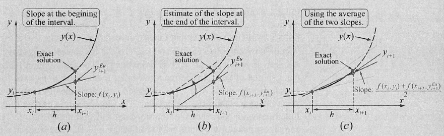

# Differentialgleichungen

Eine gewöhnliche Differentialgleichung ist eine Gleichung, welche nur nach einer Variable abgeleitet wird:
$$
\frac{\part y}{\part t} = f(t, y(t))
$$
Im oben Beispiel ist es eine gewöhnliche Differentialgleichung 1. Ordnung, da nur einmal Abgeleitet wurde.

Genereller ausgedrückt, folgendes ist eine gewöhnliche Differentialgleichung $n$-ter Ordnung:
$$
y^{(n)}(x) = f(x, y(x), y'(x), ..., y^{(n-1)}(x))
$$
Eine allgemeine Lösung für eine Differentialgleichung $n$-ter Ordnung hat $n$ unabhängige Parameter (von den Integrationskonstanten).

Differentialgleichungen, welche die folgende Form haben
$$
\frac{\part n}{\part t}=-\lambda n
$$
haben die Lösung $n(t)$:
$$
n(t)=n_0e^{-\lambda t}
$$

## Anfangswertproblem

Bei einem Anfangswertproblem wird, zusätzlich zu der Gleichung, den Funktionswert bei $x_0$, wie auch den Wert für jede benützte Ableitung bei dem selben Wert $x_0$.

Als Beispiel für folgende Funktion $s$ wird $C_1$ und $C_2$ benötigt, damit ein Resultat berechnet werden kann. Es wird also $s(t=0)$ und $s'(t=0)$ benötigt, um das Anfangswertproblem zu lösen.
$$
s''=g\\
s(t)=\frac 1 2 g t^2 + C_1t + C_2\\
s(t=0)=C_2\\
s'(t=0)=v(t=0)=C_1
$$

## Richtungsfelder

Ein Richtungsfeld stellt die Steigung als Pfeile dar. Dafür wurde in diesem Beispiel alle $y'$ für alle Punkte berechnet und eingezeichnet.

## Eulerverfahren

### Klassisch

Um eine Lösung für eine Differentialgleichung mit einem Richtungsfeld zu finden, kann eine Schrittweite $h$ definiert werden. Jeder Punkt $(x_i, y_i)$ soll nun den Pfeilen im Feld folgen. Dies kann folgendermassen für eine Differentialgleichung $y'=f(x, y)$ erledigt werden:
$$
\begin{align}
x_{i+1} &= x_i + h\\
y_{i+1} &= y_i + y' \cdot h \\
		&= y_i + f(x_i, y_i) \cdot h
\end{align}
$$
Zusätzlich wird auch noch ein Startpunkt $(x_0, y_0)$ benötigt.

### Mittelpunkt

Im Vergleich zum Eulerverfahren, wo die Steigung beim Punkt $(x_i, y_i)$ berechnet wird, wird beim Mittelpunkt-Verfahren die Steigung bei $(x_i+\frac h 2, y_i + \frac h 2)$ berechnet. 

Dafür muss aber der Punkt $(x_i+\frac h 2, y_i + \frac h 2)$ zuerst berechnet werden. Daher ergibt sich folgendes:
$$
\begin{align}
x_{h/2} &= x_i + \frac h 2\\
y_{h/2} &= y_i + \frac h 2 \cdot f(x_i, y_i)\\
\\
x_{i+1} &= x_i + h\\
y_{i+1} &= y_i + f(x_{h/2}, y_{h/2}) \cdot h
\end{align}
$$

### Modifiziert

Beim modifizierten Verfahren wird zuerst die Steigung bei $(x_i, y_i)$ und bei $(x_{i+1}, y_{i+1})$ berechnet. Danach wird der nächste Punkt mit dem Mittel zwischen den beiden Steigungen den nächsten Punkt berechnet.

## Fehler

Der **lokaler** Fehler ist definiert als:
$$
\varphi(x_i, h) := y(x_{i+1}) - y_{i+1}
$$
Wenn der lokaler Fehler folgendermassen schreiben kann, dann hat es  die **Konsistenzordnung** $p$:
$$
\varphi(x_i, h)\le C\cdot h^{p+1}
$$
Ebenfalls gibt es ein **globalen** Fehler, welcher definiert ist als:
$$
y(x_n)-y_n
$$
Wenn der globalen Fehler folgendermassen schreiben kann, dann hat es folgende **Konvergenzordnung** $p$:
$$
|y(x_n)-y_n| \le C\cdot h^p
$$
Wie auch an den Formeln von der Konsistenzordnung und Konvergenzordnung zu sehen ist, hängt dieser Fehler von der Schrittweite $h$ ab.

Es ist interesant ein Verfahren mit der Konvergenzordnung $p\ge 1$ und $h<1$, da dann $C\cdot h^p$ gegen $0$ strebt.

Für das Eulerverfahren gilt folgenden lokalen Fehler:
$$
\begin{align}
\varphi(x_n, h)=\frac{h^2}{2}y''(z) &&\text{, wobei } z \in [x_n, x_n+h]
\end{align}
$$
Das Mittelpunkt und modifizierte Eulerverfahren haben eine Konsistenz- und Konvergenzordnung $p=2$.

In der folgenden Abbildung ist der lokale Fehler für diverse Verfahren auf einem log-log Plot:

## Runge-Kutta Verfahren

Im Runge-Kutta-Verfahren wird zuerst die Steigung $k_1$ bei $x_i$ berechnet, dann $k_2$ in der Mitte zwischen $x_i$ und $x_{i+1}$, $k_3$ ist ebenfalls beim Mittelpunkt, aber mit der Steigung $k_2$. Zuletzt wird $k_4$ am Punkt $x_{i+1}$ berechnet.

Die Konsistenz- und Konvergenzordnung von Runge-Kutta ist $p=4$.

## Allgemeines s-stufiges Runge-Kutta-Verfahren

Das allgemeine s-stufige Runge-Kutta-Verfahren:
$$
\begin{align}
k_n&=f\left(x_i + c_nh, y+h \sum^{n-1}_{m=1}a_{nm}k_m\right) && \text{für } n=1,...,s\\
y_{i+1}&=y_i+h\sum^s_{n=1}b_nk_n
\end{align}
$$
Dabei ist $s\in \N$ die Stufenzahl und $a_{nm}$, $b_n$ und $c_n$ sind Konstante.

* Euler-Verfahren: $s=1$
  
* Mittelpunkt-Verfahren: $s=2$
  
* Modifiziertes Euler-Verfahren: $s=2$
  
* Klassisches Runge-Kutcd dfta Verfahren: $s=4$
  

## Differentialgleichung-System

Um ein Differentialgleichung-System zu lösen, kann $y(x)$ als vektorwertige Funktion geschrieben werden.

Das Euler-Verfahren kann folgendermassen für Vektoren angepasst werden:
$$
x_{i+1}=x_i + h\\
\vec y_{i+1}=\vec y_i + \vec f(x_i, y_i)\cdot h
$$
Oben ist es mit dem klassischen Eulerverfahren beschrieben. Dies kann aber mit allen Eulerverfahren gelöst werden.

### Beispiel

Das folgende Beispiel kommt aus dem nächsten Unterkapitel "Differentialgleichung k-ter Ordnung zu DGL-System".
$$
\begin{align}
z_1'&=z_2\\
z_2'&=z_3\\
z_3'&=10e^{−x} − 5z_3 − 8z_2 − 6z_3
\end{align}
$$
Zu dem gelten folgende Anfangswerte:
$$
\vec z(0)=\begin{pmatrix}2 \\ 0 \\ 0\end{pmatrix}
$$
Nun kommen die Iterationen:

### Differentialgleichung k-ter Ordnung zu DGL-System

Um eine Differentialgleichung mit Ableitungen höher als erster Ableitungen zu lösen gibt es einen Trick:
$$
y'''+5y''+ 8y' + 6y = 10e^{-x}
$$

1. Nachh der höchsten Ableitung umformen: 
   $y''' = 10e^{−x} − 5y'' − 8y' − 6y$

2. Alle Ableitungen von $y$ tiefer als die höchste Ableitungen durch $z_i$ ersetzen:
   $z_1=y, z_2=y', z_3=y''$

3. Und in der Gleichung einsetzen
   $y''' = 10e^{−x} − 5y'' − 8y' − 6y\Rightarrow z_3'=y''' = 10e^{−x} − 5z_3 − 8z_2 − 6z_3$

4. Es sind nun drei Gleichungen: 
   $z_1'=y'=z_2$
   $z_2'=y''=z_3$
   $z_3' = 10e^{−x} − 5z_3 − 8z_2 − 6z_3$

5. In diesem Fall können sie auch vektoriel geschrieben werden:
   $\begin{pmatrix}z_2 \\ z_3 \\ 10e^{−x} − 5z_3 − 8z_2 − 6z_3 \end{pmatrix}=\begin{pmatrix}z_1' \\ z_2' \\ z_3'\end{pmatrix}$

   Mit der Start-Bedingungen: $\vec z(0)=\begin{pmatrix}0 \\ 0 \\ 0\end{pmatrix}$
   
## Stabilität

Wie stabil eine Lösung einer DGL ist hängt von dem benutzten Verfahren, der Schrittbreite und dem spezifischen Anfangsproblem ab.

