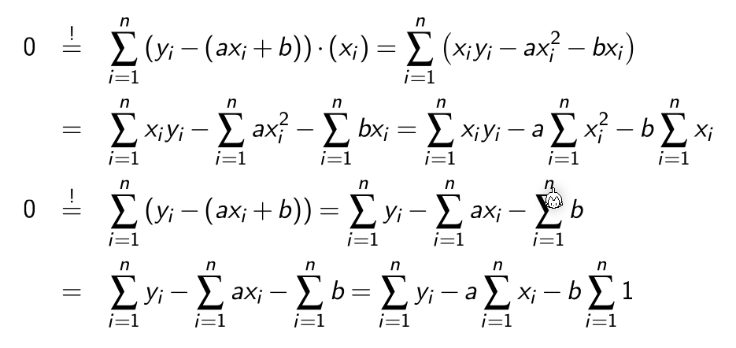
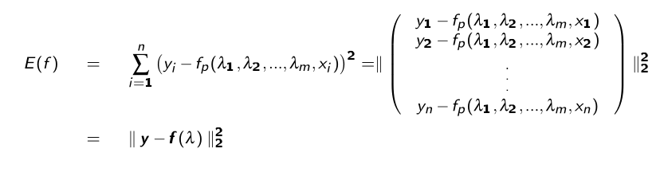

# Interpolation

Gegeben sind $n+1$ Stützpunkte/Wertpaare $(x_i, y_i)$, wobei $x_i \neq x_i$ für $i\neq j$ gelten muss. Gesucht ist nun eine stetige Funktion $g$ mit der Eigenschaft $g(x_i)=y_i$ für alle $i=0, ..., n$

## Polynominterpolation

Wenn $n+1$ Stützpunkte gegen sind, kann das Polynom $P_n(x)=a_0 + a_1x + a_2+x^2 + ... + a_nx^n$

Wenn $x$ ein Vektor ist, kann auch eine Vandermonde-Matrix gebildet werden:
$$
\begin{align}
a_0 + a_1x_0 + a_2+x_0^2 + ... &+ a_nx_0^n\\
a_0 + a_1x_1 + a_2+x_1^2 + ... &+ a_nx_1^n\\
...& \\
a_0 + a_1x_n + a_2+x_n^2 + ... &+ a_nx_n^n\\
\end{align}
$$

$$
\begin{pmatrix}
1 & x_0 & x_0^2 & ... & x_0^n\\
1 & x_1 & x_1^2 & ... & x_1^n\\
& & & ... \\
1 & x_n & x_n^2 & ... & x_n^n\\
\end{pmatrix} \cdot
\begin{pmatrix}
a_0 \\
a_1 \\
... \\
a_n\\
\end{pmatrix} =
\begin{pmatrix}
y_0 \\
y_1 \\
... \\
y_n\\
\end{pmatrix}
$$

Diese Rechnung ist allerdings oft schlecht Konditioniert und wird für $n> 20$ Stützpunkte instabil. Ein möglichen Ersatz ist das Lagrange Polynom

### Lagrange Interpolation

Das Lagrange Polynom kann für $n$ Stützpunkte berechnet werden und ergibt ein Polynom mit dem Rang $n-1$.
$$
P_n(x)=\sum^n_{i=0}I_i(x)y_i\\
I_i(x)=\prod^n_{\substack{j=0\\i\neq j}}\frac{x-x_j}{x_i-x_j}
$$
Der maximale absoluten Fehler der dabei entstehen kann ist:
$$
|f(x)-P_n(x)| \le \frac{|(x-x_0)(x-x_1)...(x-x_n)|}{(n+1)!}\cdot(\max_{x0\le \xi \le x_n}|f^{(x+1)}(\xi)|)
$$
*Als Bemerkung $f^{(x+1)}$ ist die $(x+1)$-te Ableitung*

Da für die Fehlerberechnung die eigentliche Funktion $f$ benötigt wird, ist dies recht nutzlos.

## Spline Interpolation

Es wird für jedes Intervall $[x_i, x_{i+1}]$ (für $i=0, 1, 2,, ..., n-1$) wird ein Polynom $s_i$ angesetzt. Das Polynom muss folgende Gleichungen erfüllen:

* Es muss durch alle Punkte im Intervall $[x_i, x_{i+1}]$ gehen
  $s_i(x_i)=y, s_i(x_{i+1})=y_{i+1}, ...$
* Der Übergang zwischen den Polynomen muss stetig sein
  $s_i(x_{i+1})=s_{i+1}(x_{i+1})$
* Es darf kein Knick beinhalten
  $s_i'(x_{i+1})=s_{i+1}'(x_{i+1})$
* Die Krümmung von zwei Splines soll auch gleich sein
  $s_i''(x_{i+1})=s_{i+1}''(x_{i+1})$

Um die Spline von oben zu berechnen, können nun folgende Polynome definiert werden:
$$
\begin{align}
S_0&=a_0+b_0(x-x_0)+c_0(x-x_0)^2 + d_0(x-x_0)^3 &, x\in [x_0, x_1] \\
S_1&=a_1+b_1(x-x_1)+c_1(x-x_1)^2 + d_1(x-x_1)^3 &, x\in [x_1, x_2]\\
S_2&=a_2+b_2(x-x_2)+c_2(x-x_2)^2 + d_2(x-x_2)^3 &, x\in [x_2, x_3]\\
\end{align}
$$
Aus diesen können nun folgendes Gleichungssytem aufgestellt werden:
$$
\begin{align}
S_0(x_0)&=y_0\\
S_1(x_1)&=y_1 \\
S_2(x_2)&=y_2 \\
S_2(x_3)&=y_3 \\
\\
S_0(x_1)&=S_1(x_1)\\
S_1(x_2)&=S_2(x_2)\\
\\
S_0'(x_1)&=S_1'(x_1)\\
S_1'(x_2)&=S_2'(x_2)\\
\\
S_0''(x_1)&=S_1''(x_1)\\
S_1'0(x_2)&=S_2''(x_2)\\
\end{align}
$$
Dies sind aber "nur" 10 Gleichungen, nicht die benötigten 12. Daher gibt es noch zusätzliche Bediungen:

* natürliche kubische Splinefunktion
  $S_0''(x_0)=0, S_2(x_3)''=0$
* peridodische kubische Splinefunktion
  $S_0'(x0)=S_2'(x_3), S_0''(x0)=S_2''(x_3)$$
* kubische Spliefunktion (mit not-a-knot Bedinungen)
  $S_0'''(x_1)=S_1'''(x_1), S_1'''(x_2)=S_2'''(x_2)$

### Algorithmus

Für $n+1$ Stützpunkte werden $n$ Gleichungen nach der Form $S_i=a_i+b_i(x-x_i)+c_i(x-x_i)^2 + d_i(x-x_i)^3, x\in [x_i, x_{i+1}]$ gesucht. Dafür kann folgender Algorithmus für jedes $S_i$ angewendet werden:

1. Wenn die natürliche kubische Splinefunktion gesucht ist, wird $c$ auf $0$ gesetzt damit die zweite Ableitung $0$ ergibt
   $c_0=0, c_n=0$
2. Für jedes Polynom $S_i$
   1. $a_i=y_i$
   2. Die Breite des Intervalles
      $h_i=x_{i+1}-x_i$
3. $c_i$ bestimmen
4. $b_i$ und $d_i$ für jedes $S_i$ bestimmen
   1. $b_i=\frac{y_{i+1}-y_i}{h_i}-\frac{h_i}{3}(c_{i+1}+2c_i)$
   2. $d_i=\frac 1{3h_i}(c_{i+1}-c_i)$

Für das Beispiel $...$:

| $i$   | 0    | 1    | 2    | 3    |
| ----- | ---- | ---- | ---- | ---- |
| $x_i$ | 0    | 1    | 2    | 3    |
| $y_i$ | 2    | 1    | 2    | 2    |
| $a_i$ | 2    | 1    | 2    | -    |
| $h_i$ | 1    | 1    | 1    | -    |
| $c_i$ | 0    | ?    | ?    | 0    |

Um $c_1$ und $c_2$ zu finden kann folgendes Gleichungssystem gelöst werden:
$$
A=\begin{pmatrix}
2(h_0+g_1) & h_1 \\
h_1 & 2(h_1+h_2)
\end{pmatrix} \\
A \cdot \begin{pmatrix}c_1 \\ c_2 \end{pmatrix} 
= \begin{pmatrix}

\end{pmatrix}
$$

## Lineare Ausgleichunsrechnung

Es wird eine Funktion gesucht, in der Form:
$$
f(x)=\lambda_1f_1(x)+... + \lambda_mf_m(x)
$$
Ein mögliches Beispiel wäre: $f(x)=\lambda_1 \cdot \underbrace{1}_{f_1(x)} + \lambda_2\cdot \underbrace x_{f_2(x)} + \lambda_3 \cdot \underbrace{x^2}_{f_3(x)}$

Um nun die $\lambda$s zu finden, damit $f(x)$ Datenpunkte nachgeht, muss der Fehler $E(f)$ zu den Datenpunkten minimieren:

$$
E(f)=w\cdot||y_f-(x)||_2^2 = \sum^n_{i=1}w_i\cdot (y_i - f(x_i))^2
$$
*Mit $w$ kann ein Punkt stärker oder schwächer gewichtet werden*

Um dies zu minimieren, wird die Ableitung von $E(f)=0$ gesetzt:

Aus dem folgt:

Dies funktioniert allerdings nur für eine Gerade. Die selbe Methode kann aber auch für höhere Polynomen verwendet werden:
$$
E(f)=||\vec y-f(\vec x)||_2^2=\sum^n_{i=1}(y_i-f(x_i))^2 = \sum^n_{i=1}\left(y_i - \sum^m_{j=1}\lambda_jf_j(x_i)\right)^2=||\vec y-A\lambda||_2^2
$$
Mit folgender Matrix $A$:
 

Die Gleichung $E(f)=0$ hat nur im Spezialfall eine Lösung, wenn $m=n$ und wenn die Funktion $f$ durch alle Punkte geht.

### Normalgleichungen

Um $E(f)$ zu minimieren muss die erste Ableitung von $E'(f)=0$ sein. Daher muss $E(f)$ nach jedem $\lambda$ abgeleitet werden:
$$
\frac{\part E(f)(\lambda_1, ..., \lambda_m)}{\part \lambda_j}=0 , j=0,...,m
$$
Dies nennt sich eine Normalgleichung und lässt sich als $A^TA\lambda=A^Ty$. 

*$A$ ist oft schlecht konditioniert und die Lösung sollte daher mit dem QR-Verfahren gelöst werden.* 

### Linearisieren

Falls eine $f$ Funktion auf den ersten Blick nicht linear erscheint, kann sie eventuell linearisiert werden.

Z.B. die Funktion $ae^{bx}$ kann mit $\log_e$ linearisiert werden.

## Nicht-Lineare Ausgleichsrechnung

$$
f(\lambda_1, \lambda_2, ..., \lambda_m, x)=...
$$

Das allgemeine Ausgleichsproblem besteht darin folgendes $E$ zu minimieren:

Die Ableitung von $E$ wird auf $E'(f)=0$ gesetzt. Dafür kann das Gauss-Newton-Verfahren.

## Gauss-Newton-Verfahren

Das Quadratmittelproblem ist es einen Vektor $x\in\R^m$ zu finden, welcher die Fehlerfunktional $E: \R^m \to \R:=||g(x)||_2^2$ minimiert. $E$ gehört zur Funktion $g: \R^m \to \R^n$

$g$ wird nun definiert als $g(\lambda):=y-f(\lambda)$.

Um nun für eine nicht lineare Funktionen $f$ eine Lösung zu finden, muss $f$ linearisiert werden:
$$
\begin{align}
g(\lambda)&\approx g(\lambda_0)+Dg(\lambda_0)\cdot(\lambda - \lambda_0)\\
\\
Df(x)&=\begin{pmatrix}
\frac{\partial f_1}{\partial x_1}(\vec x) & \frac{\partial f_1}{\partial x_2}(\vec x) & ... & \frac{\partial f_1}{\partial x_n}(\vec x) \\

\frac{\partial f_2}{\partial x_1}(\vec x) & \frac{\partial f_2}{\partial x_2}(\vec x) & ... & \frac{\partial f_2}{\partial x_n}(\vec x) \\

... & ... & ... & ... \\
\frac{\partial f_m}{\partial x_1}(\vec x) & \frac{\partial f_m}{\partial x_2}(\vec x) & ... & \frac{\partial f_m}{\partial x_n}(\vec x) \\
\end{pmatrix}
\end{align}
$$
$E$ kann nun folgendermassen definiert werden:
$$
\tilde E(\lambda) = ||\underbrace{g(\lambda_k)}_{\tilde y} + \underbrace{Dg(\lambda_k)}_{-\tilde A} \cdot \underbrace{(\lambda-\lambda_k)}_\delta||_2^2
$$
Wobei $k=0,1,...$ ist.  

Dies kann nun wie eine lineare Gleichung gelöst werden:
$$
Dg(\lambda_k)^TDg(\lambda_k)\delta_k=-Dg(\lambda_k)^T\cdot g(\lambda_k)
$$
Oder mit dem QR-Verfahren:
$$
Dg(\lambda_k)=Q_kR_k\\
R_k\lambda_k=-Q_k^Tg(\lambda_k)
$$
Für jedes $k$ wird nun $\tilde E$ minimiert, bzw. die obere Gleichung aufgelöst. 

Das nächste $\lambda$ kann wie folgt ausgerechnet wird:
$$
\lambda_{k+1}=\lambda_k+\delta_k
$$

## Gedämpftes Gauss-Newton-Verfahren

Das gedämpte Gauss-Netwon-Verfahren funktioniert gleich, wie das "normale" Verfahren, nur das $\delta_k$ verkleinert wird.

Um das $\delta_k$ für die nächste Iteration zu finden, soll folgende für folgende Formel das minimale $p\in{0, 1, ..., p_{max}}$ gefunden werden
$$
||g\left(\lambda_k+\frac{\delta_k}{2^p}\right)||_2^2 < ||g(\lambda_k)||_2^2
$$
$\lambda_{k+1}$ wird nun folgendermassen berechnet:
$$
\lambda_{k+1}=\lambda_k+\frac{\delta_k}{2^p}
$$
Falls kein minimales $p$ gefunden werden kan, wird mit $p=0$ gerechnet.
