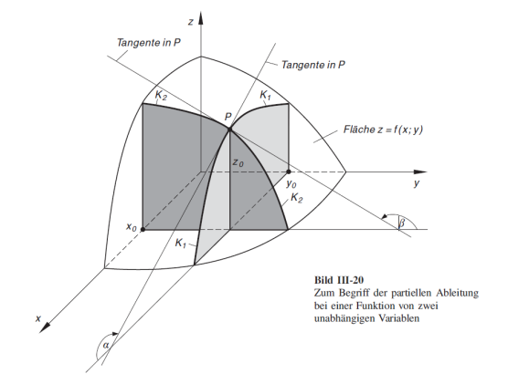

# Nichtlineare Gleichungssysteme

## Multivariate Funktionen

### Skalarwertige Funktion

Eine Funktion, welche mehrere $x$-Werte nimmt und ein $y$-Wert zurück gibt.
$$
f:  \mathbb R ^n \to \mathbb R \\
y = f(x_1, x_2, ..., x_n)
$$

### Vektorwertige Funktion

Eine Funktion, welche mehrere $x$-Werte nimmt und mehrere $y$-Werte zurück gegeben
$$
f: \mathbb R^n \to \mathbb R^m \\
(y_1, y_2, ..., y_m) = f(x_1, x_2, ..., x_n)
$$

## Explizite und implizite Funktionen

**Explizite Funktionen** haben die folgende Form: $y=f(x_1, x_2, ..., x_n)$

**Implizite Funktionen** haben die folgende Form: $F(x_1, x_2, ..., x_n, y)=0$

## Partielle Ableitung

Um die Funktion $z=f(x, y) = 2x^2 + 5 y$ abzuleiten, kann nach $x$ und $y$ separat abgeleitet werden:
$$
\begin{align}
\text{nach }x: \frac{\partial f}{\partial x} &= 4x + 0 \\
\text{nach }y: \frac{\partial f}{\partial y} &= 0 + 5 \\
\end{align}
$$
Diese Ableitung kann folgendermassen visualisiert werden:

## Jacobi-Matrix

Für die Funktion $f: \mathbb R^n \to \mathbb R^m$ mit $\vec y = f(\vec x)=\begin{pmatrix}y_1=f_1(\vec x) \\ y_2 = f_2(\vec x)\\ ... \\ y_m=f_m(\vec x)\end{pmatrix}$ und $\vec x = (x_1, x_2, ..., x_n)^T$ ist die Jacobi-Matrix das folgende:
$$
Df(x)=\begin{pmatrix}
\frac{\partial f_1}{\partial x_1}(\vec x) & \frac{\partial f_1}{\partial x_2}(\vec x) & ... & \frac{\partial f_1}{\partial x_n}(\vec x) \\

\frac{\partial f_2}{\partial x_1}(\vec x) & \frac{\partial f_2}{\partial x_2}(\vec x) & ... & \frac{\partial f_2}{\partial x_n}(\vec x) \\

... & ... & ... & ... \\
\frac{\partial f_m}{\partial x_1}(\vec x) & \frac{\partial f_m}{\partial x_2}(\vec x) & ... & \frac{\partial f_m}{\partial x_n}(\vec x) \\
\end{pmatrix}
$$
In dieser Matrix ist in einer Reihe alle möglichen partiellen Ableitungen für $f_1(\vec x)$

## Linearisierung

Eine Approximation für $y=f(x)$ kann mit $f(x)\approx f(x_0) + f'(x-x_0)$.

Dasselbe kann auch für eine multivariante Funktion mithilfe der Jacobi-Matrix getan werden: $g(\vec x)=f(\vec {x_0}) + Df(\vec {x_0})\cdot (\vec x-\vec {x_0})$

Nach dem Linearisieren wird ein nichtlineare Funktion lineare und kann mit bekannten Verfahren gelöst werde