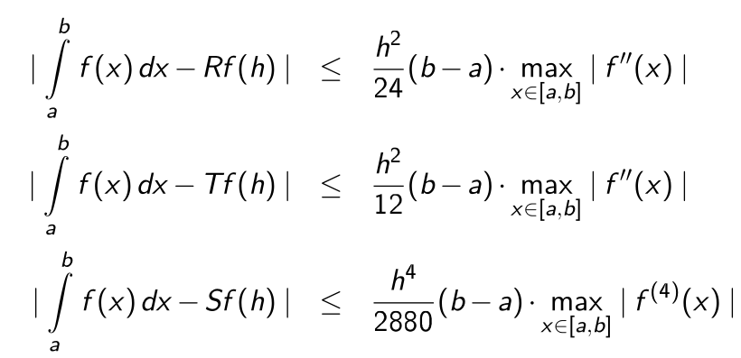
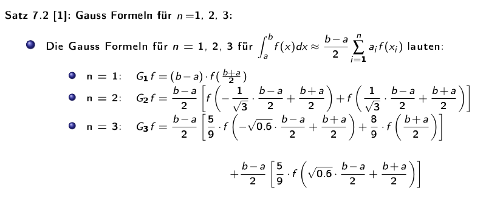
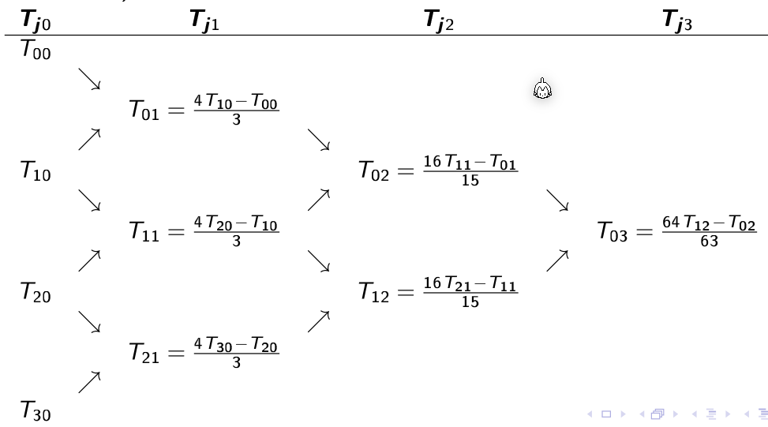
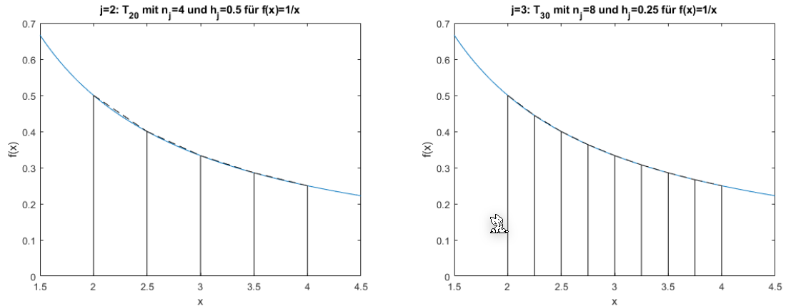

# Numerische Itegration

## Rechteck- & Trapezregel

Die folgenden formel ziehen ein Rechteck, bzw. Trapez über das ganze Integral. 

$$
\text{Das Integral}\\
\int_a^b f(x)\mathrm d x\\
\\
\text{kann folgendermassen approximiert werden}\\
Rf=f\left(\frac{a+b}{2}\right) \cdot (b - a)\\
Tf=\frac{f(a) + f(b)} 2 \cdot (b - a)
$$
*(Rf = Rechtecksregel, Tf = Trapezregel)*

Für die summierte Rechteck- & Trapezregel wird das Integral in kleinere Schritte mit der breite $h$ unterteilt.

$$
Rf(h)=h\cdot \sum^{n-1}_{i=0} f(x_i +\frac h 2)\\
Tf(h)=h\cdot \left(\frac{f(a) + f(b)}{2} +\sum^{n-1}_{i=1} f(x_i) \right)\\
\text{wobei gilt}
x_i=a+i\cdot h\\
h=\frac{b-a} n
$$

## Simpsonregel

Für das lösen eines Segments müssen folgende Formel ausgerechnet werden. Dabei wird das Polynom $p(x)=\alpha+\beta(x-a) + \gamma(x-a)(x-b)$ verwendet.

****

Da $f(x)\approx p(x)$ gilt, kann das Polynom integriert werden:

Die Regel oben haben nur ein Segment benutzt. Wie aber auch bei der Rechtecks- und Trapezregel, kann auch hier die summierte Simpsonregel verwendet werden.
$$
Sf(h)=\frac h 3 \left(\frac 1 2 f(a) + \sum^{n-1}_{i=1} f(x_i) 
+ 2 \sum^n_{i=1} f\left (\frac{x_{i-1}+x_i}{2} \right) + \frac 1 2 f(b) \right)
$$
Die Simpsonsregel kann auch mit dem Rechtecks- und Trapezregel berechnet werden:
$$
Sf(h)=\frac 1 3 (Tf(h) + 2 Rf(h))
$$

## Fehlerabschätzung

## Gaussformel

Die folgenden Formel bestimmen das Integral zwischen $a$ und $b$, wenn es $n$ Stützpunkte gibt. Dabei müssen die Stützpunkte nicht äquidistant sein.

## Romberg Extrapolation

Die Rekursion wird ausgerechnet bis $k=0$ wird, da dann die Formel $T_{j0}=Tf\left(\frac{b-a}{2^j}\right)$

Da die Werte von $f(...)$ immer in $T_{j0}$ wiederverwendet werden, kann dies mit der folgenden Formel vereinfacht werden:
$$
T_{j0}=\frac 1 2 T_{j-1,0}+h_j\sum^{n_{j-1}}_{i=1}f(a+(2i-1)h_j)
$$
 Die zweite Spalte $T_{j1}$ kann mit der Simpson-Regel berechnet werden:
$$

$$

Die folgende Graphik zeigt die oben abgebildete Rekursion:

Die folgenden zwei Graphen zeigen $T_{00}$ und $T_{10}$. Wenn $j$ um `1` höher wird, wird die X-Achse halbiert. Dasselbe gilt für $T_{30}$ und $T_{40}$

