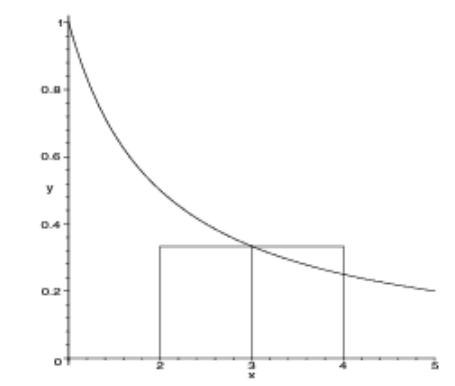

# Numerische Itegration

## Rechteck- & Trapezregel

Die folgenden formel ziehen ein Rechteck, bzw. Trapez über das ganze Integral.
$$
\text{Das Integral}\\
\int_a^b f(x)\mathrm d x\\
\\
\text{kann folgendermassen approximiert werden}\\
Rf=f\left(\frac{a+b}{2}\right) \cdot (b - a)\\
Tf=\frac{f(a) + f(b)} 2 \cdot (b - a)
$$
*(Rf = Rechtecksregel, Tf = Trapezregel)*

Für die summierte Rechteck- & Trapezregel wird das Integral in kleinere Schritte mit der breite $h$ unterteilt.
$$
Rf(h)=h\cdot \sum^{n-1}_{i=0} f(x_i +\frac h 2)\\
Tf(h)=h\cdot \left(\frac{f(a) + f(b)}{2} +\sum^{n-1}_{i=1} f(x_i) \right)\\
\text{wobei gilt}
x_i=a+i\cdot h\\
h=\frac{b-a} n
$$

## Simpsonregel

Für das lösen eines Segments müssen folgende Formel ausgerechnet werden. Dabei wird das Polynom $p(x)=\alpha+\beta(x-a) + \gamma(x-a)(x-b)$ verwendet.

****

Da $f(x)\approx p(x)$ gilt, kann das Polynom integriert werden:

Die Regel oben haben nur ein Segment benutzt. Wie aber auch bei der Rechtecks- und Trapezregel, kann auch hier die summierte Simpsonregel verwendet werden.
$$
Sf(h)=\frac h 3 \left(\frac 1 2 f(a) + \sum^{n-1}_{i=1} f(x_i) 
+ 2 \sum^n_{i=1} f\left (\frac{x_{i-1}+x_i}{2} \right) + \frac 1 2 f(b) \right)
$$
Die Simpsonsregel kann auch mit dem Rechtecks- und Trapezregel berechnet werden:
$$
Sf(h)=\frac 1 3 (Tf(h) + 2 Rf(h))
$$
