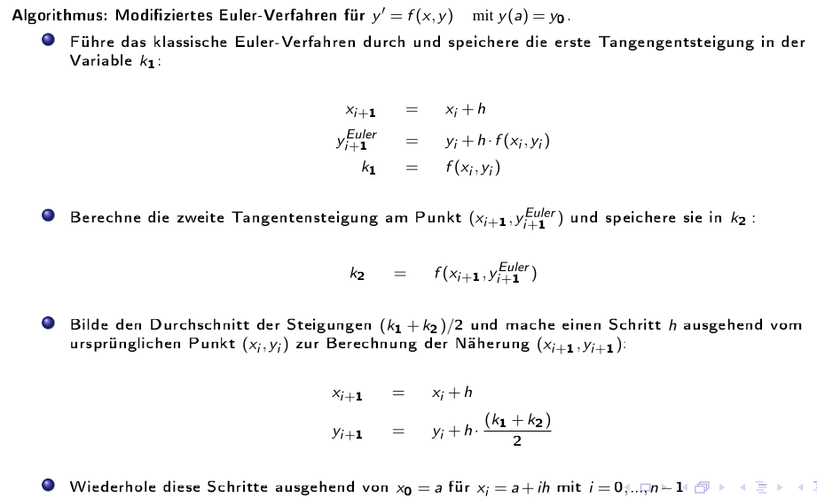
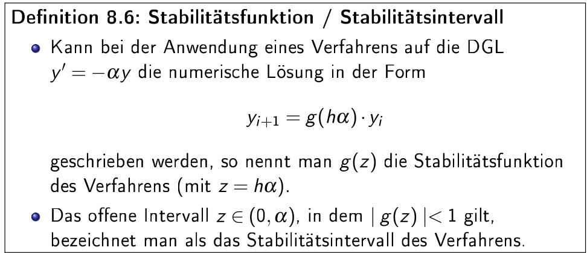
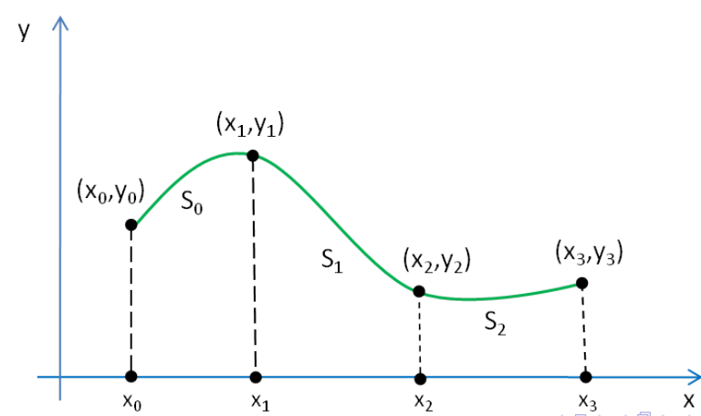
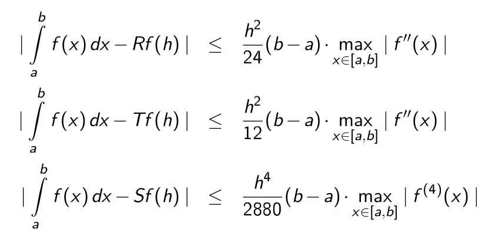
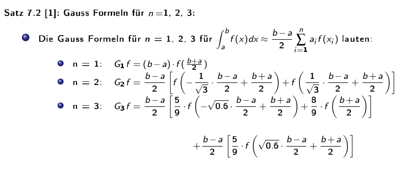
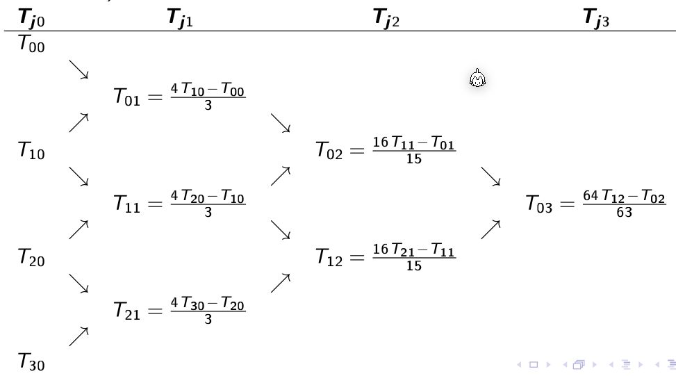
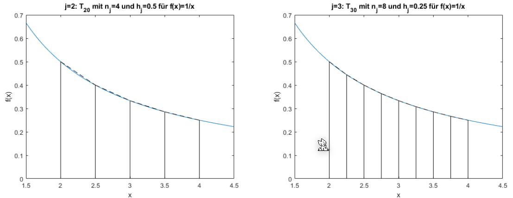

# Differentialgleichungen

Eine gewöhnliche Differentialgleichung ist eine Gleichung, welche nur nach einer Variable abgeleitet wird:
$$
\frac{\part y}{\part t} = f(t, y(t))
$$
Im oben Beispiel ist es eine gewöhnliche Differentialgleichung 1. Ordnung, da nur einmal Abgeleitet wurde.

Genereller ausgedrückt, folgendes ist eine gewöhnliche Differentialgleichung $n$-ter Ordnung:
$$
y^{(n)}(x) = f(x, y(x), y'(x), ..., y^{(n-1)}(x))
$$
Eine allgemeine Lösung für eine Differentialgleichung $n$-ter Ordnung hat $n$ unabhängige Parameter (von den Integrationskonstanten).

Differentialgleichungen, welche die folgende Form haben
$$
\frac{\part n}{\part t}=-\lambda n
$$
haben die Lösung $n(t)$:
$$
n(t)=n_0e^{-\lambda t}
$$

## Anfangswertproblem

Bei einem Anfangswertproblem wird, zusätzlich zu der Gleichung, den Funktionswert bei $x_0$, wie auch den Wert für jede benützte Ableitung bei dem selben Wert $x_0$.

Als Beispiel für folgende Funktion $s$ wird $C_1$ und $C_2$ benötigt, damit ein Resultat berechnet werden kann. Es wird also $s(t=0)$ und $s'(t=0)$ benötigt, um das Anfangswertproblem zu lösen.
$$
s''=g\\
s(t)=\frac 1 2 g t^2 + C_1t + C_2\\
s(t=0)=C_2\\
s'(t=0)=v(t=0)=C_1
$$

## Richtungsfelder

Ein Richtungsfeld stellt die Steigung als Pfeile dar. Dafür wurde in diesem Beispiel alle $y'$ für alle Punkte berechnet und eingezeichnet.

## Eulerverfahren

### Klassisch

Um eine Lösung für eine Differentialgleichung mit einem Richtungsfeld zu finden, kann eine Schrittweite $h$ definiert werden. Jeder Punkt $(x_i, y_i)$ soll nun den Pfeilen im Feld folgen. Dies kann folgendermassen für eine Differentialgleichung $y'=f(x, y)$ erledigt werden:
$$
\begin{align}
x_{i+1} &= x_i + h\\
y_{i+1} &= y_i + y' \cdot h \\
		&= y_i + f(x_i, y_i) \cdot h
\end{align}
$$
Zusätzlich wird auch noch ein Startpunkt $(x_0, y_0)$ benötigt.

### Mittelpunkt

Im Vergleich zum Eulerverfahren, wo die Steigung beim Punkt $(x_i, y_i)$ berechnet wird, wird beim Mittelpunkt-Verfahren die Steigung bei $(x_i+\frac h 2, y_i + \frac h 2)$ berechnet. 

Dafür muss aber der Punkt $(x_i+\frac h 2, y_i + \frac h 2)$ zuerst berechnet werden. Daher ergibt sich folgendes:
$$
\begin{align}
x_{h/2} &= x_i + \frac h 2\\
y_{h/2} &= y_i + \frac h 2 \cdot f(x_i, y_i)\\
\\
x_{i+1} &= x_i + h\\
y_{i+1} &= y_i + f(x_{h/2}, y_{h/2}) \cdot h
\end{align}
$$

### Modifiziert

Beim modifizierten Verfahren wird zuerst die Steigung bei $(x_i, y_i)$ und bei $(x_{i+1}, y_{i+1})$ berechnet. Danach wird der nächste Punkt mit dem Mittel zwischen den beiden Steigungen den nächsten Punkt berechnet.

## Fehler

Der **lokaler** Fehler ist definiert als:
$$
\varphi(x_i, h) := y(x_{i+1}) - y_{i+1}
$$
Wenn der lokaler Fehler folgendermassen schreiben kann, dann hat es  die **Konsistenzordnung** $p$:
$$
\varphi(x_i, h)\le C\cdot h^{p+1}
$$
Ebenfalls gibt es ein **globalen** Fehler, welcher definiert ist als:
$$
y(x_n)-y_n
$$
Wenn der globalen Fehler folgendermassen schreiben kann, dann hat es folgende **Konvergenzordnung** $p$:
$$
|y(x_n)-y_n| \le C\cdot h^p
$$
Wie auch an den Formeln von der Konsistenzordnung und Konvergenzordnung zu sehen ist, hängt dieser Fehler von der Schrittweite $h$ ab.

Es ist interesant ein Verfahren mit der Konvergenzordnung $p\ge 1$ und $h<1$, da dann $C\cdot h^p$ gegen $0$ strebt.

Für das Eulerverfahren gilt folgenden lokalen Fehler:
$$
\begin{align}
\varphi(x_n, h)=\frac{h^2}{2}y''(z) &&\text{, wobei } z \in [x_n, x_n+h]
\end{align}
$$
Das Mittelpunkt und modifizierte Eulerverfahren haben eine Konsistenz- und Konvergenzordnung $p=2$.

In der folgenden Abbildung ist der lokale Fehler für diverse Verfahren auf einem log-log Plot:

## Runge-Kutta Verfahren

Im Runge-Kutta-Verfahren wird zuerst die Steigung $k_1$ bei $x_i$ berechnet, dann $k_2$ in der Mitte zwischen $x_i$ und $x_{i+1}$, $k_3$ ist ebenfalls beim Mittelpunkt, aber mit der Steigung $k_2$. Zuletzt wird $k_4$ am Punkt $x_{i+1}$ berechnet.

Die Konsistenz- und Konvergenzordnung von Runge-Kutta ist $p=4$.

## Allgemeines s-stufiges Runge-Kutta-Verfahren

Das allgemeine s-stufige Runge-Kutta-Verfahren:
$$
\begin{align}
k_n&=f\left(x_i + c_nh, y+h \sum^{n-1}_{m=1}a_{nm}k_m\right) && \text{für } n=1,...,s\\
y_{i+1}&=y_i+h\sum^s_{n=1}b_nk_n
\end{align}
$$
Dabei ist $s\in \N$ die Stufenzahl und $a_{nm}$, $b_n$ und $c_n$ sind Konstante.

* Euler-Verfahren: $s=1$
  
* Mittelpunkt-Verfahren: $s=2$
  
* Modifiziertes Euler-Verfahren: $s=2$
  
* Klassisches Runge-Kutta Verfahren: $s=4$
  

## Differentialgleichung-System

Um ein Differentialgleichung-System zu lösen, kann $y(x)$ als vektorwertige Funktion geschrieben werden.

Das Euler-Verfahren kann folgendermassen für Vektoren angepasst werden:
$$
x_{i+1}=x_i + h\\
\vec y_{i+1}=\vec y_i + \vec f(x_i, y_i)\cdot h
$$
Oben ist es mit dem klassischen Eulerverfahren beschrieben. Dies kann aber mit allen Eulerverfahren gelöst werden.

### Beispiel

Das folgende Beispiel kommt aus dem nächsten Unterkapitel "Differentialgleichung k-ter Ordnung zu DGL-System".
$$
\begin{align}
z_1'&=z_2\\
z_2'&=z_3\\
z_3'&=10e^{−x} − 5z_3 − 8z_2 − 6z_3
\end{align}
$$
Zu dem gelten folgende Anfangswerte:
$$
\vec z(0)=\begin{pmatrix}2 \\ 0 \\ 0\end{pmatrix}
$$
Nun kommen die Iterationen:

### Differentialgleichung k-ter Ordnung zu DGL-System

Um eine Differentialgleichung mit Ableitungen höher als erster Ableitungen zu lösen gibt es einen Trick:
$$
y'''+5y''+ 8y' + 6y = 10e^{-x}
$$

1. Nachh der höchsten Ableitung umformen: 
   $y''' = 10e^{−x} − 5y'' − 8y' − 6y$

2. Alle Ableitungen von $y$ tiefer als die höchste Ableitungen durch $z_i$ ersetzen:
   $z_1=y, z_2=y', z_3=y''$

3. Und in der Gleichung einsetzen
   $y''' = 10e^{−x} − 5y'' − 8y' − 6y\Rightarrow z_3'=y''' = 10e^{−x} − 5z_3 − 8z_2 − 6z_3$

4. Es sind nun drei Gleichungen: 
   $z_1'=y'=z_2$  
   $z_2'=y''=z_3$  
   $z_3' = 10e^{−x} − 5z_3 − 8z_2 − 6z_3$  

5. In diesem Fall können sie auch vektoriel geschrieben werden:
   $\begin{pmatrix}z_2 \\ z_3 \\ 10e^{−x} − 5z_3 − 8z_2 − 6z_3 \end{pmatrix}=\begin{pmatrix}z_1' \\ z_2' \\ z_3'\end{pmatrix}$  

   Mit der Start-Bedingungen: $\vec z(0)=\begin{pmatrix}0 \\ 0 \\ 0\end{pmatrix}$
   
## Stabilität

Wie stabil eine Lösung einer DGL ist hängt von dem benutzten Verfahren, der Schrittbreite und dem spezifischen Anfangsproblem ab.

# Interpolation

Gegeben sind $n+1$ Stützpunkte/Wertpaare $(x_i, y_i)$, wobei $x_i \neq x_i$ für $i\neq j$ gelten muss. Gesucht ist nun eine stetige Funktion $g$ mit der Eigenschaft $g(x_i)=y_i$ für alle $i=0, ..., n$

## Polynominterpolation

Wenn $n+1$ Stützpunkte gegen sind, kann das Polynom $P_n(x)=a_0 + a_1x + a_2+x^2 + ... + a_nx^n$

Wenn $x$ ein Vektor ist, kann auch eine Vandermonde-Matrix gebildet werden:
$$
\begin{align}
a_0 + a_1x_0 + a_2+x_0^2 + ... &+ a_nx_0^n\\
a_0 + a_1x_1 + a_2+x_1^2 + ... &+ a_nx_1^n\\
...& \\
a_0 + a_1x_n + a_2+x_n^2 + ... &+ a_nx_n^n\\
\end{align}
$$

$$
\begin{pmatrix}
1 & x_0 & x_0^2 & ... & x_0^n\\
1 & x_1 & x_1^2 & ... & x_1^n\\
& & & ... \\
1 & x_n & x_n^2 & ... & x_n^n\\
\end{pmatrix} \cdot
\begin{pmatrix}
a_0 \\
a_1 \\
... \\
a_n\\
\end{pmatrix} =
\begin{pmatrix}
y_0 \\
y_1 \\
... \\
y_n\\
\end{pmatrix}
$$

Diese Rechnung ist allerdings oft schlecht Konditioniert und wird für $n> 20$ Stützpunkte instabil. Ein möglichen Ersatz ist das Lagrange Polynom

### Lagrange Interpolation

Das Lagrange Polynom kann für $n$ Stützpunkte berechnet werden und ergibt ein Polynom mit dem Rang $n-1$.
$$
P_n(x)=\sum^n_{i=0}I_i(x)y_i\\
I_i(x)=\prod^n_{\substack{j=0\\i\neq j}}\frac{x-x_j}{x_i-x_j}
$$
Der maximale absoluten Fehler der dabei entstehen kann ist:
$$
|f(x)-P_n(x)| \le \frac{|(x-x_0)(x-x_1)...(x-x_n)|}{(n+1)!}\cdot(\max_{x0\le \xi \le x_n}|f^{(x+1)}(\xi)|)
$$
*Als Bemerkung $f^{(x+1)}$ ist die $(x+1)$-te Ableitung*

Da für die Fehlerberechnung die eigentliche Funktion $f$ benötigt wird, ist dies recht nutzlos.

## Spline Interpolation

Es wird für jedes Intervall $[x_i, x_{i+1}]$ (für $i=0, 1, 2,, ..., n-1$) wird ein Polynom $s_i$ angesetzt. Das Polynom muss folgende Gleichungen erfüllen:

* Es muss durch alle Punkte im Intervall $[x_i, x_{i+1}]$ gehen
  $s_i(x_i)=y, s_i(x_{i+1})=y_{i+1}, ...$
* Der Übergang zwischen den Polynomen muss stetig sein
  $s_i(x_{i+1})=s_{i+1}(x_{i+1})$
* Es darf kein Knick beinhalten
  $s_i'(x_{i+1})=s_{i+1}'(x_{i+1})$
* Die Krümmung von zwei Splines soll auch gleich sein
  $s_i''(x_{i+1})=s_{i+1}''(x_{i+1})$

Um die Spline von oben zu berechnen, können nun folgende Polynome definiert werden:
$$
\begin{align}
S_0&=a_0+b_0(x-x_0)+c_0(x-x_0)^2 + d_0(x-x_0)^3 &, x\in [x_0, x_1] \\
S_1&=a_1+b_1(x-x_1)+c_1(x-x_1)^2 + d_1(x-x_1)^3 &, x\in [x_1, x_2]\\
S_2&=a_2+b_2(x-x_2)+c_2(x-x_2)^2 + d_2(x-x_2)^3 &, x\in [x_2, x_3]\\
\end{align}
$$
Aus diesen können nun folgendes Gleichungssytem aufgestellt werden:
$$
\begin{align}
S_0(x_0)&=y_0\\
S_1(x_1)&=y_1 \\
S_2(x_2)&=y_2 \\
S_2(x_3)&=y_3 \\
\\
S_0(x_1)&=S_1(x_1)\\
S_1(x_2)&=S_2(x_2)\\
\\
S_0'(x_1)&=S_1'(x_1)\\
S_1'(x_2)&=S_2'(x_2)\\
\\
S_0''(x_1)&=S_1''(x_1)\\
S_1'0(x_2)&=S_2''(x_2)\\
\end{align}
$$
Dies sind aber "nur" 10 Gleichungen, nicht die benötigten 12. Daher gibt es noch zusätzliche Bediungen:

* natürliche kubische Splinefunktion
  $S_0''(x_0)=0, S_2(x_3)''=0$
* peridodische kubische Splinefunktion
  $S_0'(x0)=S_2'(x_3), S_0''(x0)=S_2''(x_3)$
* kubische Spliefunktion (mit not-a-knot Bedinungen)
  $S_0'''(x_1)=S_1'''(x_1), S_1'''(x_2)=S_2'''(x_2)$

### Algorithmus

Für $n+1$ Stützpunkte werden $n$ Gleichungen nach der Form $S_i=a_i+b_i(x-x_i)+c_i(x-x_i)^2 + d_i(x-x_i)^3, x\in [x_i, x_{i+1}]$ gesucht. Dafür kann folgender Algorithmus für jedes $S_i$ angewendet werden:

1. Wenn die natürliche kubische Splinefunktion gesucht ist, wird $c$ auf $0$ gesetzt damit die zweite Ableitung $0$ ergibt
   $c_0=0, c_n=0$
2. Für jedes Polynom $S_i$
   1. $a_i=y_i$
   2. Die Breite des Intervalles
      $h_i=x_{i+1}-x_i$
3. $c_i$ bestimmen
4. $b_i$ und $d_i$ für jedes $S_i$ bestimmen
   1. $b_i=\frac{y_{i+1}-y_i}{h_i}-\frac{h_i}{3}(c_{i+1}+2c_i)$
   2. $d_i=\frac 1{3h_i}(c_{i+1}-c_i)$

Für das Beispiel $...$:

| $i$   | 0    | 1    | 2    | 3    |
| ----- | ---- | ---- | ---- | ---- |
| $x_i$ | 0    | 1    | 2    | 3    |
| $y_i$ | 2    | 1    | 2    | 2    |
| $a_i$ | 2    | 1    | 2    | -    |
| $h_i$ | 1    | 1    | 1    | -    |
| $c_i$ | 0    | ?    | ?    | 0    |

Um $c_1$ und $c_2$ zu finden kann folgendes Gleichungssystem gelöst werden:
$$
A=\begin{pmatrix}
2(h_0+g_1) & h_1 \\
h_1 & 2(h_1+h_2)
\end{pmatrix} \\
A \cdot \begin{pmatrix}c_1 \\ c_2 \end{pmatrix} 
= \begin{pmatrix}

\end{pmatrix}
$$

## Lineare Ausgleichunsrechnung

Es wird eine Funktion gesucht, in der Form:
$$
f(x)=\lambda_1f_1(x)+... + \lambda_mf_m(x)
$$
Ein mögliches Beispiel wäre: $f(x)=\lambda_1 \cdot \underbrace{1}_{f_1(x)} + \lambda_2\cdot \underbrace x_{f_2(x)} + \lambda_3 \cdot \underbrace{x^2}_{f_3(x)}$

Um nun die $\lambda$s zu finden, damit $f(x)$ Datenpunkte nachgeht, muss der Fehler $E(f)$ zu den Datenpunkten minimieren:

$$
E(f)=w\cdot||y_f-(x)||_2^2 = \sum^n_{i=1}w_i\cdot (y_i - f(x_i))^2
$$
*Mit $w$ kann ein Punkt stärker oder schwächer gewichtet werden*

Um dies zu minimieren, wird die Ableitung von $E(f)=0$ gesetzt:

Aus dem folgt:

Dies funktioniert allerdings nur für eine Gerade. Die selbe Methode kann aber auch für höhere Polynomen verwendet werden:
$$
E(f)=||\vec y-f(\vec x)||_2^2=\sum^n_{i=1}(y_i-f(x_i))^2 = \sum^n_{i=1}\left(y_i - \sum^m_{j=1}\lambda_jf_j(x_i)\right)^2=||\vec y-A\lambda||_2^2
$$
Mit folgender Matrix $A$:
 

Die Gleichung $E(f)=0$ hat nur im Spezialfall eine Lösung, wenn $m=n$ und wenn die Funktion $f$ durch alle Punkte geht.

### Normalgleichungen

Um $E(f)$ zu minimieren muss die erste Ableitung von $E'(f)=0$ sein. Daher muss $E(f)$ nach jedem $\lambda$ abgeleitet werden:
$$
\frac{\part E(f)(\lambda_1, ..., \lambda_m)}{\part \lambda_j}=0 , j=0,...,m
$$
Dies nennt sich eine Normalgleichung und lässt sich als $A^TA\lambda=A^Ty$. 

*$A$ ist oft schlecht konditioniert und die Lösung sollte daher mit dem QR-Verfahren gelöst werden.* 

### Linearisieren

Falls eine $f$ Funktion auf den ersten Blick nicht linear erscheint, kann sie eventuell linearisiert werden.

Z.B. die Funktion $ae^{bx}$ kann mit $\log_e$ linearisiert werden.

## Nicht-Lineare Ausgleichsrechnung

$$
f(\lambda_1, \lambda_2, ..., \lambda_m, x)=...
$$

Das allgemeine Ausgleichsproblem besteht darin folgendes $E$ zu minimieren:

Die Ableitung von $E$ wird auf $E'(f)=0$ gesetzt. Dafür kann das Gauss-Newton-Verfahren.

## Gauss-Newton-Verfahren

Das Quadratmittelproblem ist es einen Vektor $x\in\R^m$ zu finden, welcher die Fehlerfunktional $E: \R^m \to \R:=||g(x)||_2^2$ minimiert. $E$ gehört zur Funktion $g: \R^m \to \R^n$

$g$ wird nun definiert als $g(\lambda):=y-f(\lambda)$.

Um nun für eine nicht lineare Funktionen $f$ eine Lösung zu finden, muss $f$ linearisiert werden:
$$
\begin{align}
g(\lambda)&\approx g(\lambda_0)+Dg(\lambda_0)\cdot(\lambda - \lambda_0)\\
\\
Dg(x)&=\begin{pmatrix}
\frac{\partial g_1}{\partial x_1}(\vec x) & \frac{\partial g_1}{\partial x_2}(\vec x) & ... & \frac{\partial g_1}{\partial x_n}(\vec x) \\

\frac{\partial g_2}{\partial x_1}(\vec x) & \frac{\partial g_2}{\partial x_2}(\vec x) & ... & \frac{\partial g_2}{\partial x_n}(\vec x) \\

... & ... & ... & ... \\
\frac{\partial g_m}{\partial x_1}(\vec x) & \frac{\partial g_m}{\partial x_2}(\vec x) & ... & \frac{\partial g_m}{\partial x_n}(\vec x) \\
\end{pmatrix}
\end{align}
$$
$E$ kann nun folgendermassen definiert werden:
$$
\tilde E(\lambda) = ||\underbrace{g(\lambda_k)}_{\tilde y} + \underbrace{Dg(\lambda_k)}_{-\tilde A} \cdot \underbrace{(\lambda-\lambda_k)}_\delta||_2^2
$$
Wobei $k=0,1,...$ ist.  

Dies kann nun wie eine lineare Gleichung gelöst werden:
$$
Dg(\lambda_k)^TDg(\lambda_k)\delta_k=-Dg(\lambda_k)^T\cdot g(\lambda_k)
$$
Oder mit dem QR-Verfahren:
$$
Dg(\lambda_k)=Q_kR_k\\
R_k\lambda_k=-Q_k^Tg(\lambda_k)
$$
Für jedes $k$ wird nun $\tilde E$ minimiert, bzw. die obere Gleichung aufgelöst. 

Das nächste $\lambda$ kann wie folgt ausgerechnet wird:
$$
\lambda_{k+1}=\lambda_k+\delta_k
$$

## Gedämpftes Gauss-Newton-Verfahren

Das gedämpte Gauss-Netwon-Verfahren funktioniert gleich, wie das "normale" Verfahren, nur das $\delta_k$ verkleinert wird.

Um das $\delta_k$ für die nächste Iteration zu finden, soll folgende für folgende Formel das minimale $p\in{0, 1, ..., p_{max}}$ gefunden werden
$$
||g\left(\lambda_k+\frac{\delta_k}{2^p}\right)||_2^2 < ||g(\lambda_k)||_2^2
$$
$\lambda_{k+1}$ wird nun folgendermassen berechnet:
$$
\lambda_{k+1}=\lambda_k+\frac{\delta_k}{2^p}
$$
Falls kein minimales $p$ gefunden werden kann, wird mit $p=0$ gerechnet.
# Nichtlineare Gleichungssysteme

## Multivariate Funktionen

### Skalarwertige Funktion

Eine Funktion, welche mehrere $x$-Werte nimmt und ein $y$-Wert zurück gibt.
$$
f:  \mathbb R ^n \to \mathbb R \\
y = f(x_1, x_2, ..., x_n)
$$

### Vektorwertige Funktion

Eine Funktion, welche mehrere $x$-Werte nimmt und mehrere $y$-Werte zurück gegeben
$$
f: \mathbb R^n \to \mathbb R^m \\
(y_1, y_2, ..., y_m) = f(x_1, x_2, ..., x_n)
$$

## Explizite und implizite Funktionen

**Explizite Funktionen** haben die folgende Form: $y=f(x_1, x_2, ..., x_n)$

**Implizite Funktionen** haben die folgende Form: $F(x_1, x_2, ..., x_n, y)=0$

## Partielle Ableitung

Um die Funktion $z=f(x, y) = 2x^2 + 5 y$ abzuleiten, kann nach $x$ und $y$ separat abgeleitet werden:
$$
\begin{align}
\text{nach }x: \frac{\partial f}{\partial x} &= 4x + 0 \\
\text{nach }y: \frac{\partial f}{\partial y} &= 0 + 5 \\
\end{align}
$$
Diese Ableitung kann folgendermassen visualisiert werden:

## Jacobi-Matrix

Für die Funktion $f: \mathbb R^n \to \mathbb R^m$ mit $\vec y = f(\vec x)=\begin{pmatrix}y_1=f_1(\vec x) \\ y_2 = f_2(\vec x)\\ ... \\ y_m=f_m(\vec x)\end{pmatrix}$ und $\vec x = (x_1, x_2, ..., x_n)^T$ ist die Jacobi-Matrix das folgende:
$$
Df(x)=\begin{pmatrix}
\frac{\partial f_1}{\partial x_1}(\vec x) & \frac{\partial f_1}{\partial x_2}(\vec x) & ... & \frac{\partial f_1}{\partial x_n}(\vec x) \\

\frac{\partial f_2}{\partial x_1}(\vec x) & \frac{\partial f_2}{\partial x_2}(\vec x) & ... & \frac{\partial f_2}{\partial x_n}(\vec x) \\

... & ... & ... & ... \\
\frac{\partial f_m}{\partial x_1}(\vec x) & \frac{\partial f_m}{\partial x_2}(\vec x) & ... & \frac{\partial f_m}{\partial x_n}(\vec x) \\
\end{pmatrix}
$$
In dieser Matrix ist in einer Reihe alle möglichen partiellen Ableitungen für $f_1(\vec x)$

## Linearisierung

Eine Approximation für $y=f(x)$ kann mit $f(x)\approx f(x_0) + f'(x-x_0)$.

Dasselbe kann auch für eine multivariante Funktion mithilfe der Jacobi-Matrix getan werden: $g(\vec x)=f(\vec {x_0}) + Df(\vec {x_0})\cdot (\vec x-\vec {x_0})$ 

($Df(\vec x)$ ist die Jacobi-Matrix)

Nach dem Linearisieren wird ein nichtlineare Funktion lineare und kann mit bekannten Verfahren gelöst werde

## Newton-Verfahre

>  Das Newton-Verfahren erwartet, dass $f(\vec x_n)=\vec 0$ gilt.

$$
\vec x_{n+1}=\vec x_n-(Df(\vec x_n))^{-1}\cdot f(\vec x_n)
$$

Um nicht die Jacobi-Matrix invertieren zu müssen, kann folgender Trick angewendet werden:
$$
\vec \delta_n :=-(Df(\vec x_n))^{-1}\cdot f(\vec x_n)\\
\text{Dies kann in folgendes Umgewandlet werden:}\\
Df(\vec x_n)\cdot \vec\delta x_n = -f(\vec x_n)
$$
Die Gleichung $Df(\vec x_n)\cdot \vec\delta x_n = -f(\vec x_n)$ ist ein lineares Gleichungssystem, welches relativ einfach gelöst werden kann. Danach kann $\vec \delta _n$ anstelle von $-(Df(\vec x_n))^{-1}\cdot f(\vec x_n)$ verwendet werden: $\vec x_{n+1}=\vec x_n+\vec \delta_n$

Das Newton-Verfahren konvergiert quadratisch für nah genug an einer Nullstelle $\overline x$ liegende Startwerte, wenn $Df(\overline x)$ regulär und $f$ dreimal stetig differenzierbar ist.

> Für eine Nichtreguläre Matrix A gilt $\det(A)\ne 0$

Mögliche Abbruchskriterien sind:

* $n > n_{max}$
* $||\vec x_{n+1}-\vec x_n||\le ||\vec x_{n+1}||\cdot \varepsilon$
* $||\vec x_{n+1}-\vec x_n||\le \varepsilon$
* $||f(\vec x_{n+1})||\le \varepsilon$$

## Vereinfachtes Newton-Verfahren

Beim regulären Newton-Verfahren muss bei jeden Iterationsschritt die Jacobi-Matrix $Df(\vec x)$ neuberechnen. Beim vereinfachten Newton-Verfahren wird $Df(\vec x)$ nur für den Startvektor berechnet.
$$
\vec x_{n+1}=\vec x_n-(Df(\vec x_0))^{-1}\cdot f(\vec x_n)\\
Df(\vec x_0)\cdot \vec\delta x_n = -f(\vec x_n)
$$
Wegen dieser Vereinfachung kovergiert das Verfahren nur noch linear gegen die Nullstelle, wenn $Df(\overline x)$ nicht regulär ist.

## Gedämptes Newton-Verfahren

Wenn $Df(\vec x_n)$ schlecht konvergiert, dann kann nicht generell erwartet werden, dass $\vec x_{n+1}=\vec x_n + \vec \delta_n$ nicht gilt.

Für das gedämpfte Newton-Verfahren werden folgende Schritte angewendet:

1. Berechne $\delta_n$ mit $Df(\vec x_n)\delta_n=-f(\vec x_n)$ ausgerechnet
2. Finde das minimale $k\in \{0, 1, ...\}$ für das gilt: $||f(\vec x_n + \frac{\vec \delta_n}{2^k})||_2 < ||f(\vec x_n)||_2$
3. Wenn kein $k$ gefunden wird, soll mit $k=0$ weiter gerechnet werden
4. Nun soll die Iterationsgleichung $\vec x_{n+1}=\vec x_n + \frac{\vec \delta_n}{2^k}$ verwendet werden# Numerische Itegration

## Rechteck- & Trapezregel

Die folgenden formel ziehen ein Rechteck, bzw. Trapez über das ganze Integral.
$$
\text{Das Integral}\\
\int_a^b f(x)\mathrm d x\\
\\
\text{kann folgendermassen approximiert werden}\\
Rf=f\left(\frac{a+b}{2}\right) \cdot (b - a)\\
Tf=\frac{f(a) + f(b)} 2 \cdot (b - a)
$$
*(Rf = Rechtecksregel, Tf = Trapezregel)*

Für die summierte Rechteck- & Trapezregel wird das Integral in kleinere Schritte mit der breite $h$ unterteilt.
$$
Rf(h)=h\cdot \sum^{n-1}_{i=0} f(x_i +\frac h 2)\\
Tf(h)=h\cdot \left(\frac{f(a) + f(b)}{2} +\sum^{n-1}_{i=1} f(x_i) \right)\\
\text{wobei gilt}
x_i=a+i\cdot h\\
h=\frac{b-a} n
$$

## Simpsonregel

Für das lösen eines Segments müssen folgende Formel ausgerechnet werden. Dabei wird das Polynom $p(x)=\alpha+\beta(x-a) + \gamma(x-a)(x-b)$ verwendet.

****

Da $f(x)\approx p(x)$ gilt, kann das Polynom integriert werden:

Die Regel oben haben nur ein Segment benutzt. Wie aber auch bei der Rechtecks- und Trapezregel, kann auch hier die summierte Simpsonregel verwendet werden.
$$
Sf(h)=\frac h 3 \left(\frac 1 2 f(a) + \sum^{n-1}_{i=1} f(x_i) 
+ 2 \sum^n_{i=1} f\left (\frac{x_{i-1}+x_i}{2} \right) + \frac 1 2 f(b) \right)
$$
Die Simpsonsregel kann auch mit dem Rechtecks- und Trapezregel berechnet werden:
$$
Sf(h)=\frac 1 3 (Tf(h) + 2 Rf(h))
$$

## Fehlerabschätzung

## Gaussformel

Die folgenden Formel bestimmen das Integral zwischen $a$ und $b$, wenn es $n$ Stützpunkte gibt. Dabei müssen die Stützpunkte nicht äquidistant sein.

## Romberg Extrapolation

Die Rekursion wird ausgerechnet bis $k=0$ wird, da dann die Formel $T_{j0}=Tf\left(\frac{b-a}{2^j}\right)$

Da die Werte von $f(...)$ immer in $T_{j0}$ wiederverwendet werden, kann dies mit der folgenden Formel vereinfacht werden:
$$
T_{j0}=\frac 1 2 T_{j-1,0}+h_j\sum^{n_{j-1}}_{i=1}f(a+(2i-1)h_j)
$$
 Die zweite Spalte $T_{j1}$ kann mit der Simpson-Regel berechnet werden:
$$

$$

Die folgende Graphik zeigt die oben abgebildete Rekursion:

Die folgenden zwei Graphen zeigen $T_{00}$ und $T_{10}$. Wenn $j$ um `1` höher wird, wird die X-Achse halbiert. Dasselbe gilt für $T_{30}$ und $T_{40}$

