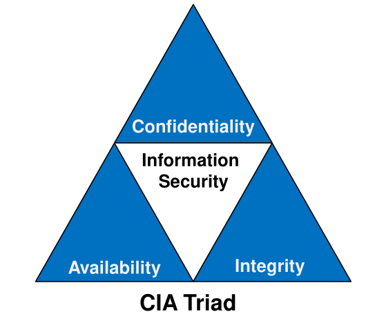
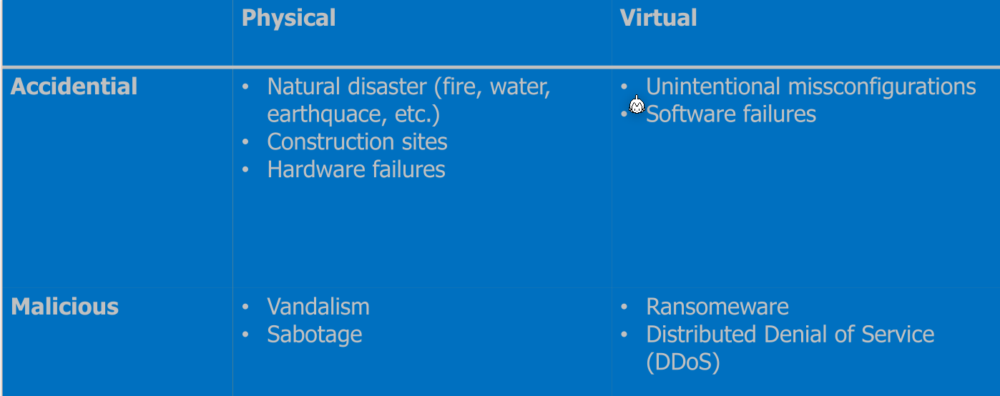
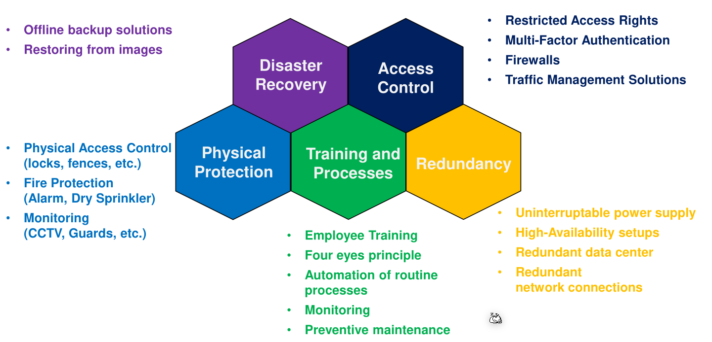
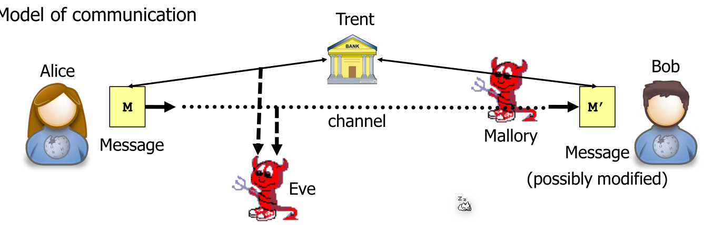
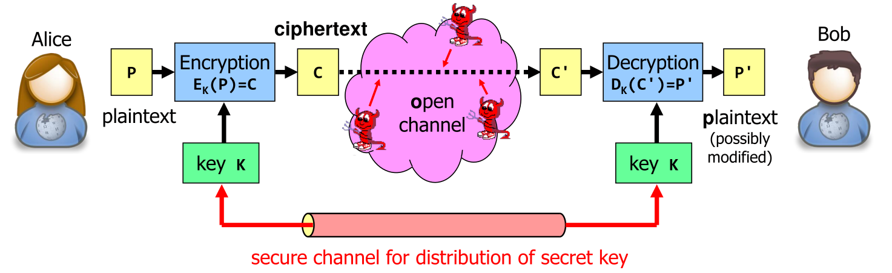
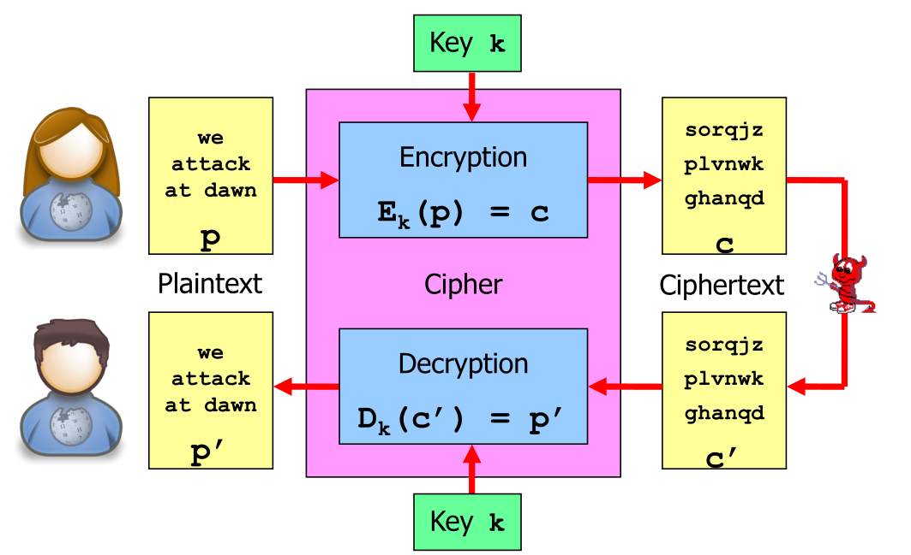
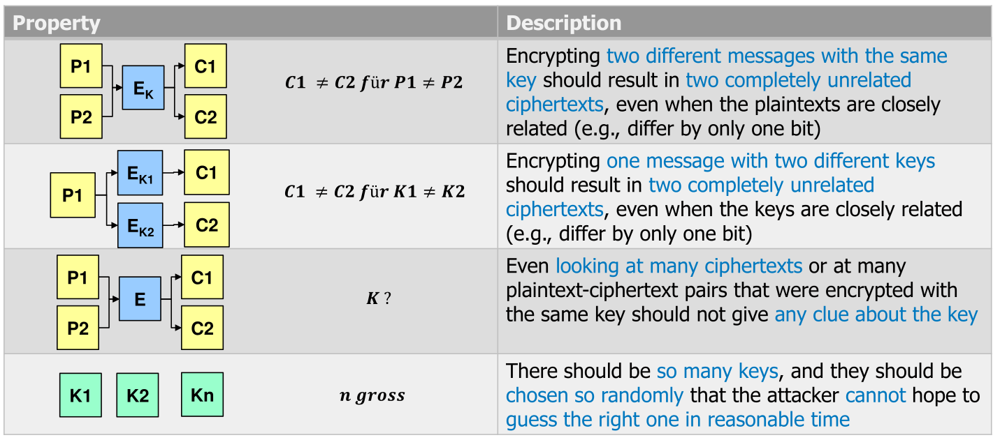
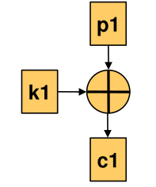

# Basics

## CIA Triad

Most measures in IT security have one of these three high-level goal.

The availability category is further subdivided.

The following counter meassures can be used:

## Business Continuity Management

 

## Model of Communication

| Name       | Goal                                     | Capabilities                                |
| ---------- | ---------------------------------------- | ------------------------------------------- |
| Alice, Bob | Communiacte securerly                    | send, receive messages, perform computation |
| Eve        | Read messages (eavesdrop)                | intercept messages                          |
| Mallory    | Manipulates messages (man-in-the-middle) | intercept, delete, modify, replay messages  |
| Trent      | Help Alice and Bob (trusted thirt-party) | send, receive messages, perform computation |

When using secret-key cryptography then the open channel is secured by a key $k$ .

## Goals of Cryptography

* Confidentiality: Only Alice and Bob can read the message they sent
* Integrity: Ensure that data was not tampered with during transit
* Authenticity: Ensure that the sender is actually Alice
* Freshness:  Ensure that the received message from Alice is not a reply attack
* Non-repudiation: Alice and Bob cannot deny they received a message (in this case they are the attackers)

## Math Terms

## Kerckhoff's Principal

Kerckhoff's principal says, that the security of a cipher must only relay on the key being a secret, **NOT** the cipher itself. Security-by-obscurity does not work!

## Properties of good encryption methods

## Cryptocraphic Work Factor

This factor describes how many keys one has to try on average before they guess the right one. This depends on the distribution of the keys and assumes that the right key can be detected. If every key is equally likely then the work factor is maximised. Additionally, when choosing a key it is vital to choose randomly so every key is equally likely.

## Perfect Secrecy/Information-Theoretically Secure

> The probability that a plaintext produced a given ciphertext c under key k is independent of c and k.

This has the effect that if even if an attacker guessed the correct key, they can't verify that, since all messages "look the same".

An example is the following: A system which the two keys `1` and `0`. The attacker intercepts a message and when decrypting it with the key `0`, the result is `I have thrown a coin and it came up heads`. If the attacker decrypts it with the key `1`, the result is `I have thrown a coin and it came up tails`. Which one is now correct?

Shanon calls this "perfect secrecy".

However, no modern encryption algorithm has this property.

## Computationally Secure

A cipher has to have the following properties:

* Only the correct key results in an intelligable result
* The work factor is $\frac 1 2$ of the key space

However, there is no known algorithm to this day.

## One-Time Pad

In one-time pad (vernam cipher) the plain text and key are xored. They key has to consists out of bits where both `1` and `0` are equally likely and each bit is independent of each other.

It has the following properties:

* The key length is equal to the plain text length
* Has perfect secrecy (, since every result is equally likely)
* Key must not be reused and would lead to catastrophic loss of security
