# Block Ciphers

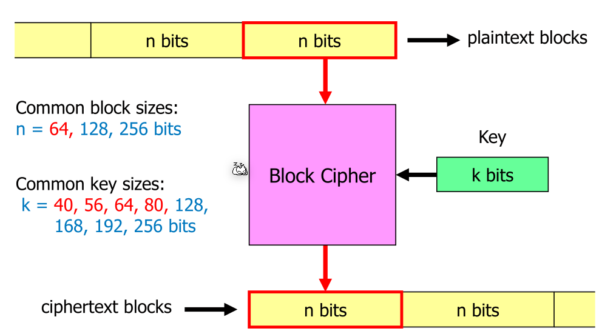

A block cipher always operates on fixed sized blocks, which gets encrypted to a cipher text block with the same size.

The block size needs to be large enough to ensure that the cipher is random enough. In the extreme case, where $n=1 bit$,  the block cipher produces either the same bit or the inverted bit.

Usually the plain text's length isn't a multiple of the block size. To still use a block cipher, padding is introduced. Today usually PKCS7 is used

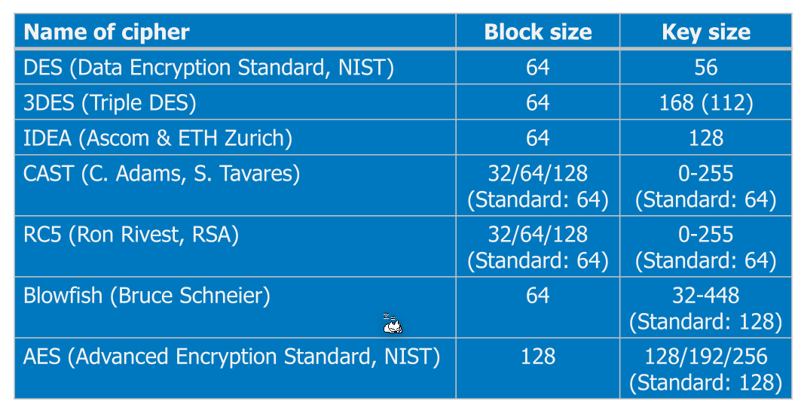

## PKCS7 Padding

If the block size is $n$ bytes, and the final block consists of $k \le n$ data bytes then,

* If $k < n$, the padding data fills up the last block with $n - k$ bytes with the value $n - k$
  Example: 
* If $k=n$, the padding data consists of a new block of $n$ bytes with the value $n$
  Example: 

## DES (Data Encryption Standard)

DES was published by the National Institute of Standards and Technology (NIST) which is controlled by the NSA. This leads to the public not totally trusting as the NSA might had meddled with.

Today, DES is totally insecure because the key size of **56** is too small. Apart from this, the cipher is secure and the NSA probably didn't interfere with the design. 

Until today, brute force attack is still the best way to attack DES.

### Double DES and Meet-in-the-middle Attack

One idea to increase the work factor was to encrypt a text twice with a different key.

A possible know-plain-text attack

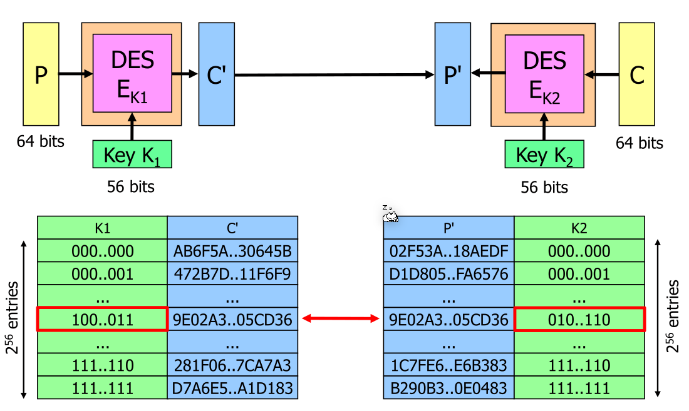

## Tripple DES

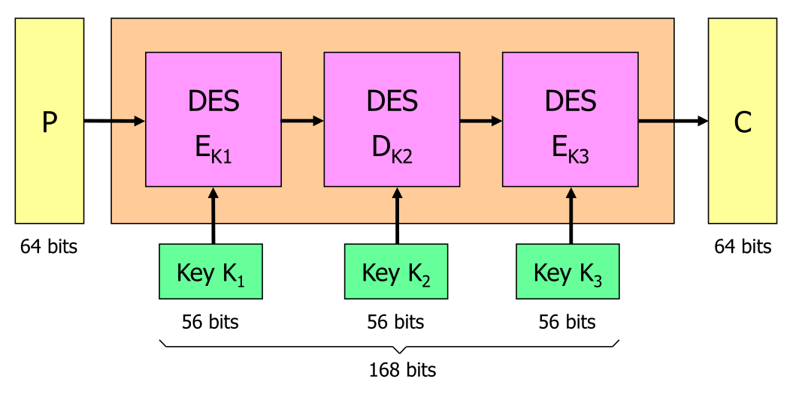

The second stage $D_{K2}$ decrypts the result of $E_{K1}$. Because in DES encrypting and decrypting have different algorithms, this results in an actual work factor of 112 bits.

The 112 come from the application of the attack above, but the hash map size grows to 112 bits.

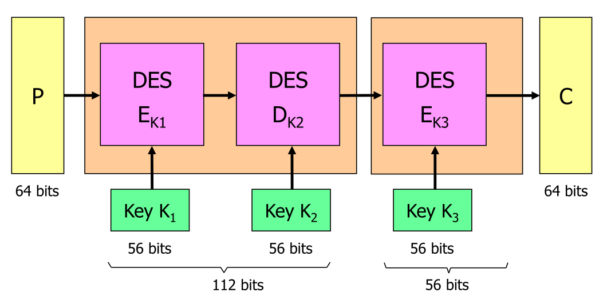

## AES (Advanced Encryption Standard)

There was

## Block Cipher Mode

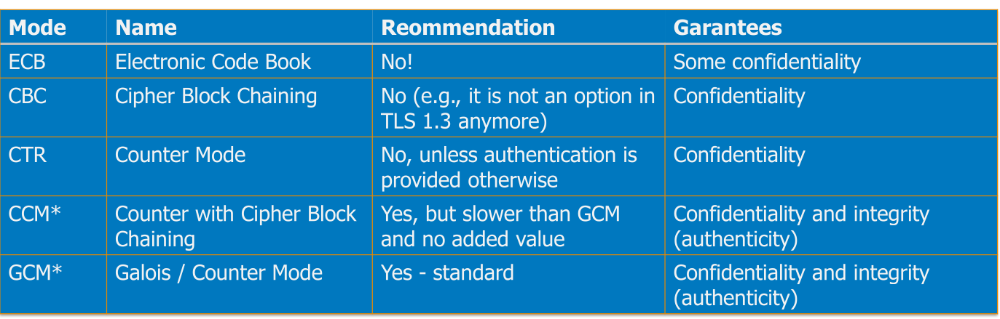

### ECB (Electronic Code-Book) Mode

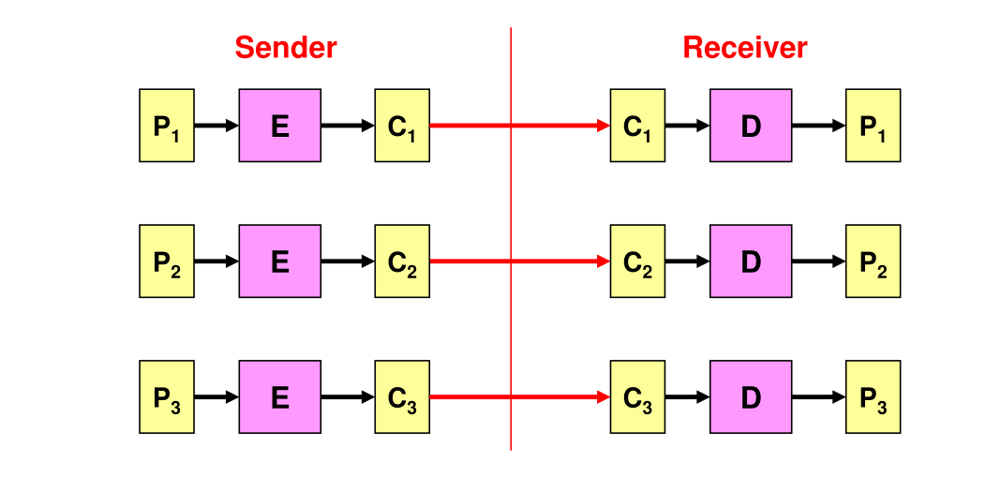

Each block is processed by the encryption algorithm $E$.

A problem with ECB is that when $P_1$ and $P_2$ is the same, then $C_1$ and $C_2$ will be the same as well. 

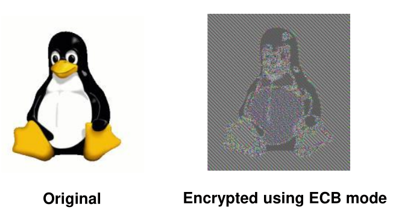

When ECB is used, then individual blocks can be substituted to other blocks from the same data:

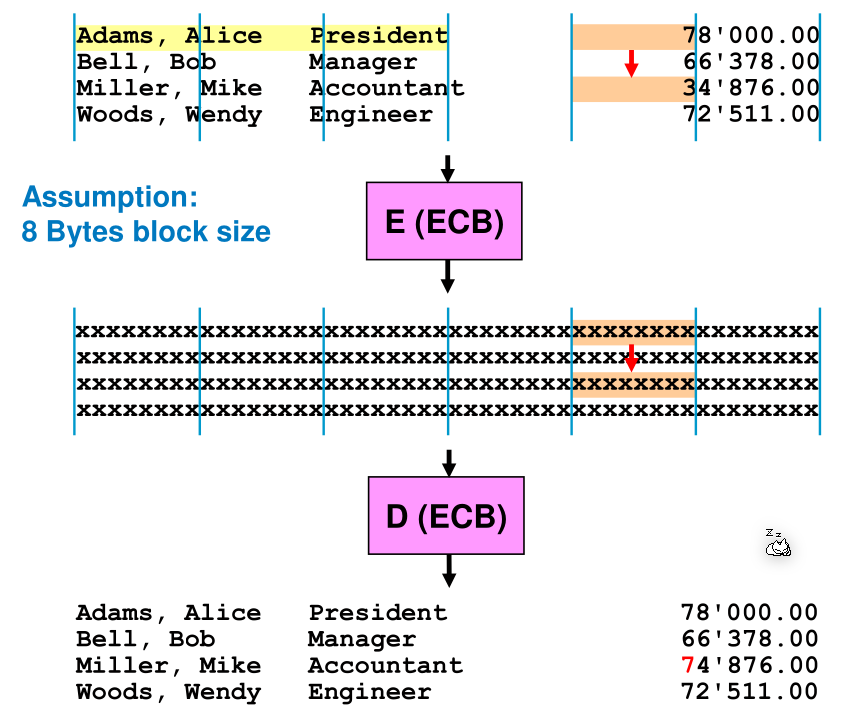

### Cipher Block Chaining (CBC) Mode

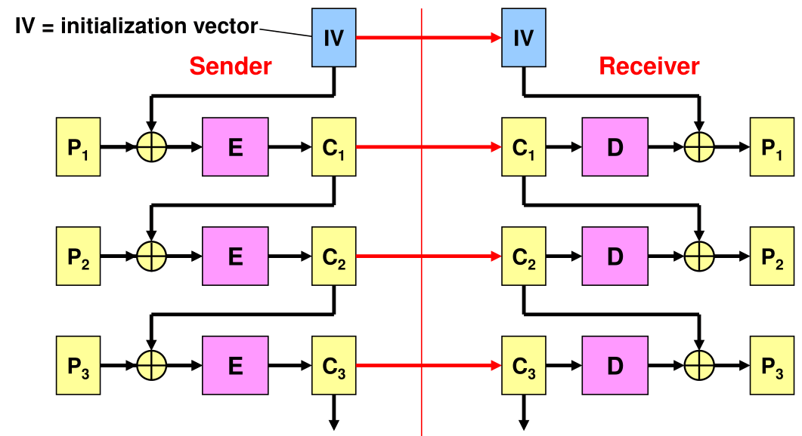

When using CBC, the result of an encryption is used in the next encryption. This means that even if $P_1$ and $P_2$ are equal to each other, $C_1$ and $C_2$ won't be.

However, if the initialisation vector is reused then the first blocks of two plain text will have the same problem as with ECB.

The IV does not need to be kept secret but needs to be different for every transmission.

A possible modification attack to CBC is the following:

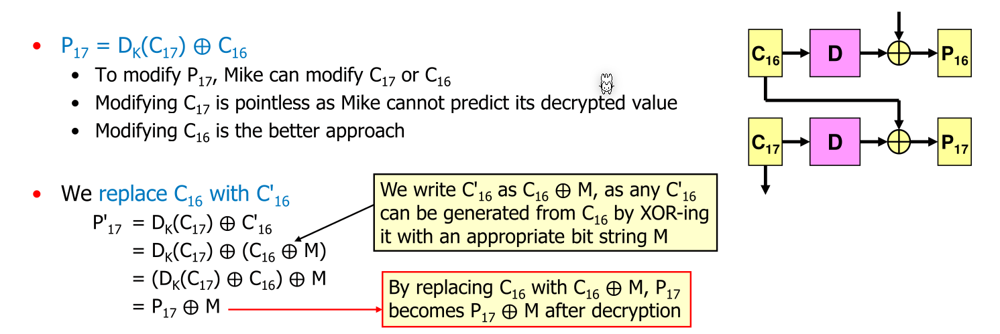

Now all what Mike has to do is choose $M$ in a way that $P_{17} \oplus M$ equals to the desired result:

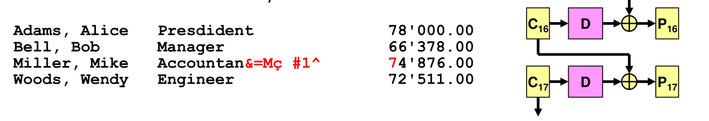
