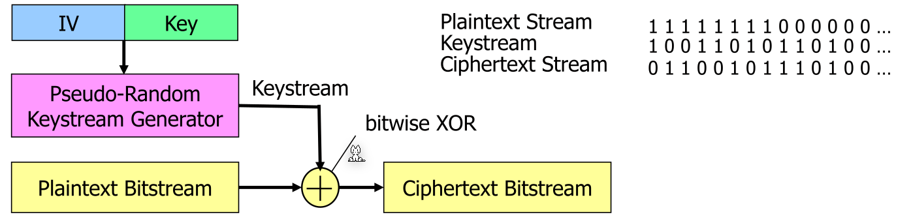
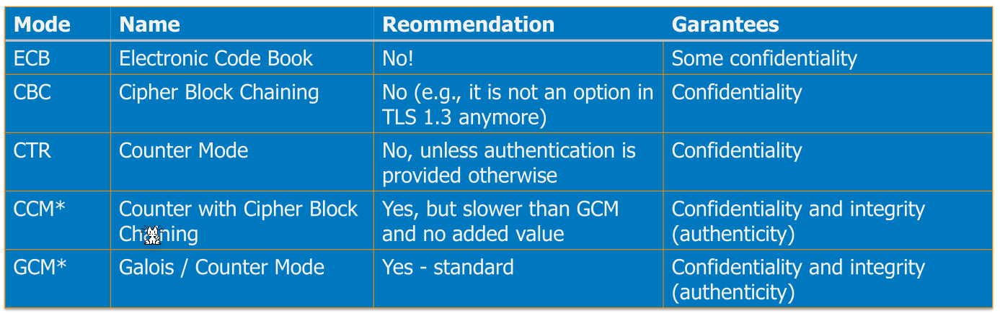
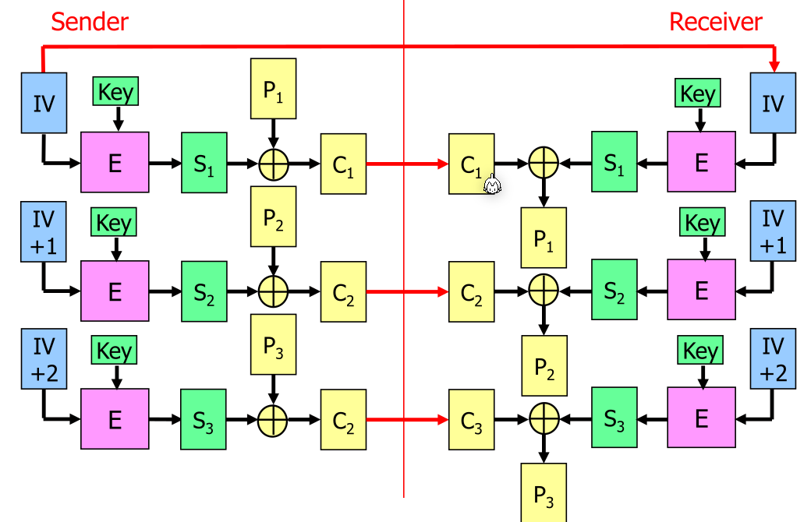

# Stream Ciphers

Stream ciphers work by generating a random stream of bytes which are xored with the plain text. This is advantageous when having high performance requirements, as the key stream can be pre-generated when idling. Later, when data is available then the generated bytes are xored with the plain text.

## Counter (CTR) Mode

The CTR mode can be used to use a block cipher as a stream cipher. For this, an initialisation vector is used together with a key to generate the key stream. Each block uses the last initialisation vector + 1 to generate the next block of the key stream. The key stream is then xored with the plain text.

Important is to use each initialisation vector only once.  