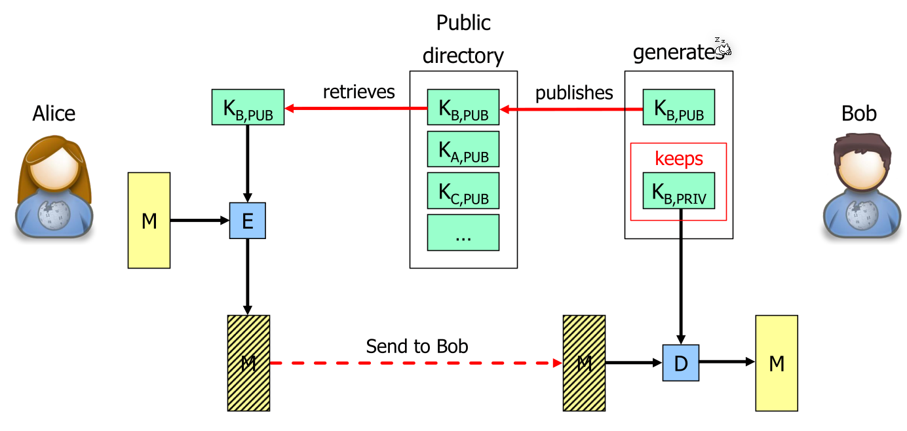
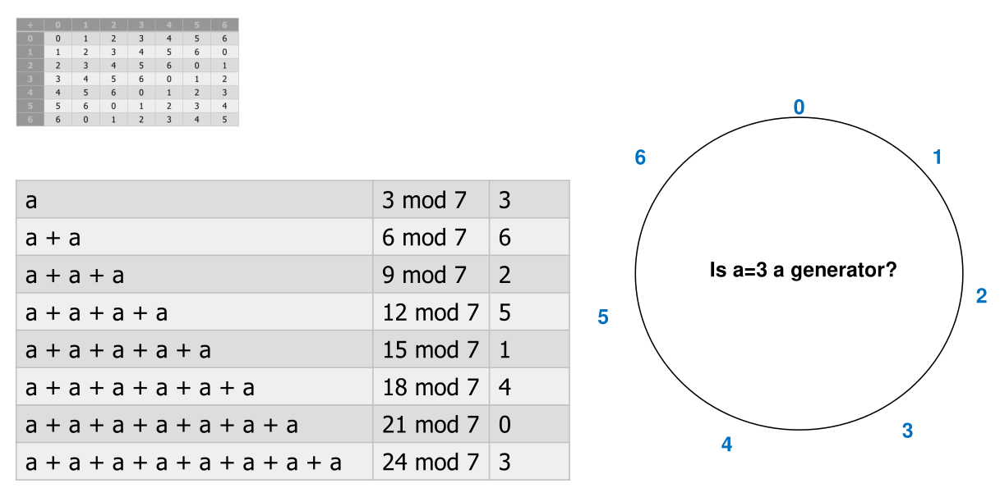
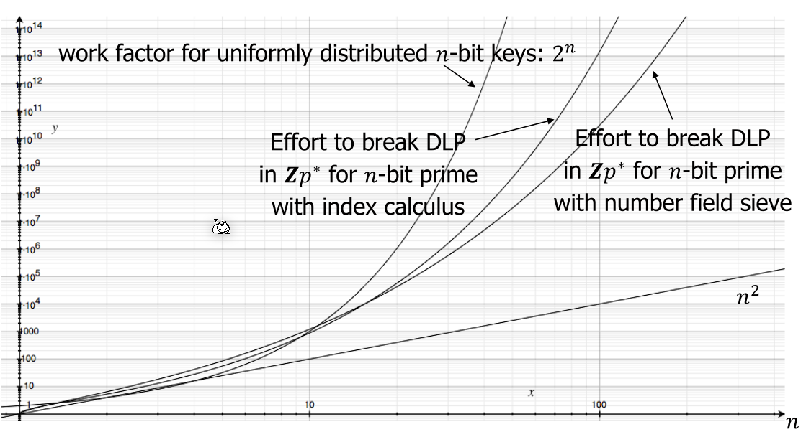
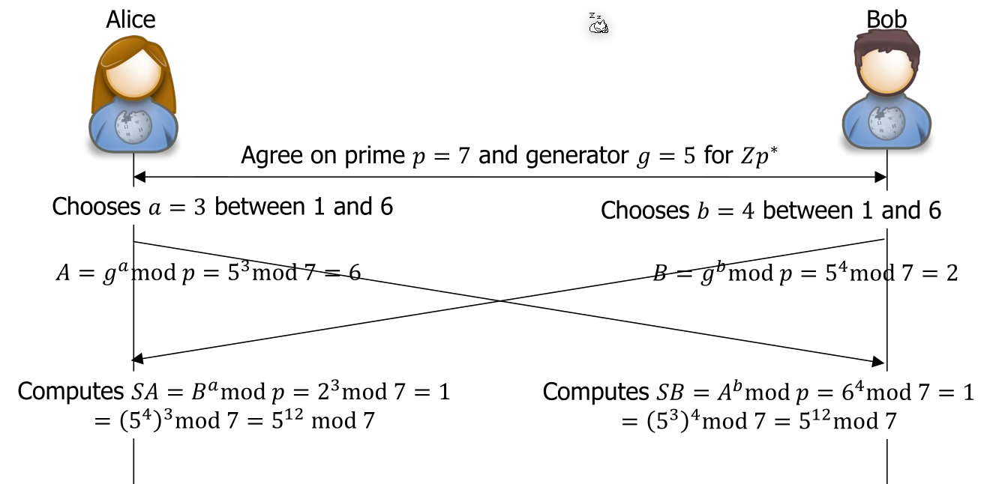
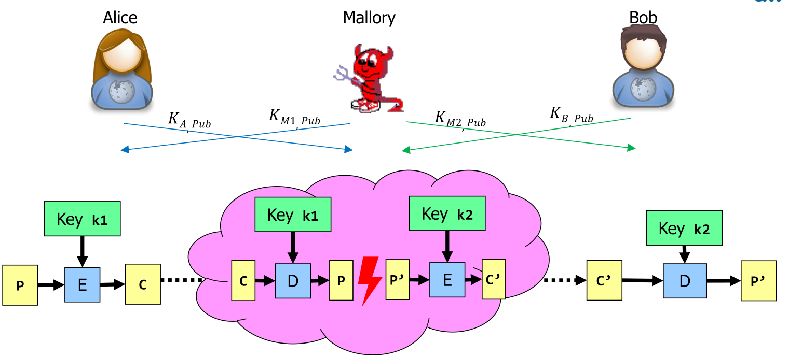
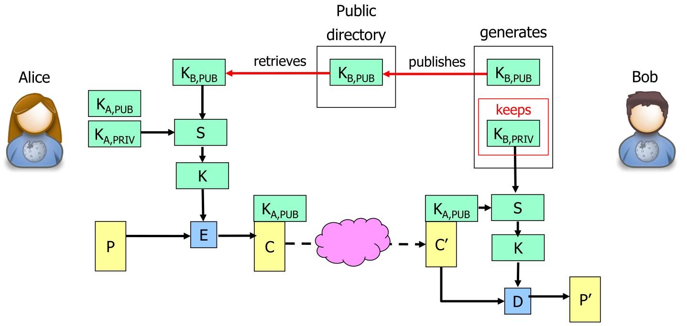

# Public Key Cryptography

In public key cryptography, Bob generates a public-private key pair and publishes **only** the public key (**not** the private key). Alice will retrieve this public key and encrypts  her message with this key. Because messages, which were encrypted using the public key, can only be decrypted with its corresponding private key, Bob is the only one who is able to read the sent message.

## Groups

A set $G$ with an operator $\circ$ is a group if and only if

* $\circ$ is associative (like $+$ and $\cdot$): for all $a, b, c \in G$, we have $(a \circ b) \circ c = a \circ (b \circ c)$
* There exists a neutral element $e$ so that for all  $a \in G$, we have $e \circ a = a \circ e = a$
* For each $a \in G$ there exists an inverse element $a' \in G$ so that $a' \circ a = e$

The order of a group is $|G|$. A group is called a cyclic group, if there is a generator $a\in G$ and $\{[n]a\vert n\}=G$  (With $a[n]$ can the whole group be created).

The following notation can be used:

* $[n]a = a\circ ... \circ a$ (n times)
* $[-n]a=(a \circ ... \circ a)'=a' \circ ... \circ a'=[n]a'$ (n times)
* $[m]a \circ [n]a = [m+n]a$
* $[m]([n]a)=[mn]a$

A possible example is residual group (Rest Gruppe) $Zp*=\{1, ..., p-1\}; G=(Zp*, \times)$, where $p$ is a prime is a cyclic group. Because of the modulo $[k]a=a \times a \times ... \times a=a^k \mod p$. 

The group is also abelian as for each element $a+b=b+a$ and $a\times b = b \times a$ is valid.

## Discrete Logarithm Problem (DLP)

For the discrete logarithm problem, we have a finite cyclic group $(G, \circ)$ with the generator $g$ (any $a\in G$ can be generated with $[k]g$, where $1\le k \le |G|$)

The problem is to find $k$, when given $a\in G$ and a generator $g\in G$, for $a=[k]g$

For $(Zn, +)$ with Euclid's extended algorithm, $k$ can be found in $O(\log n)$, but for $(Zp*, \times)$ no fast algorithm is known and can be solved in $O((\log n)^k)$

Essentially, the problem comes down to the following formula: $g^n\mod a = x$. Calculating $n$ if $x$, $g$ and $a$ is known can only be done with brute force and as such this is a one-way function.

## Diffie-Hellman

Alice and Bob agree on cyclic group $G$ with a difficult-to-solve DLP and a generator $g$ for $G$. $g$ and $G$ are not secrets and this can be done in public.

1. Alice and Bob choose as their private keys a random number $a$ and $b$ with $1 < a,b < |G|$
2. Alice sends her public key $A=[a]g$
3. Bob sends his public key $B = b[g]$
4. Alice computes $SA=[a]B=[a]([b]g)=[ab]g$
5. Bob computes $SB=[b]A=[b]([a]g)=[ba]g$

After this $SA=SB$. Alice and Bob can now use $SA$ or $SB$ to generate a key. This is necessary as:

* Some bits may always be zero or easily guessed
* $SA$ or $SB$ may not be uniformly distributed
* $SA$ or $SB$ may not be long enough

To solve this, $SA$ is put through a key derivation function (KDF). For a Dieffie-Hellman based key exchange, a hash based key derivation function (HKDF) can be used.

### Man-in-the-Middle

This is possible when Alice and Bob can't check their respective identity. To solve this, Bob and Alice have to check each others identity before starting data.

## Integrated Encryption Scheme (IES)

IES works if the receiver isn't online.

## Elliptic-Curve Cryptography

Let $F$ be a set with the operations $\times$ and $+$, so that

* $(F, +)$ is a commutative group
* $(F\setminus\{0\}, \times)$ is a commutative group
* $\times$ distributes over +: $a\times (a+b)=a\times b + a \times c$

For right choice of curve, recommend 256-bit-size field for 128-bit work factor.
