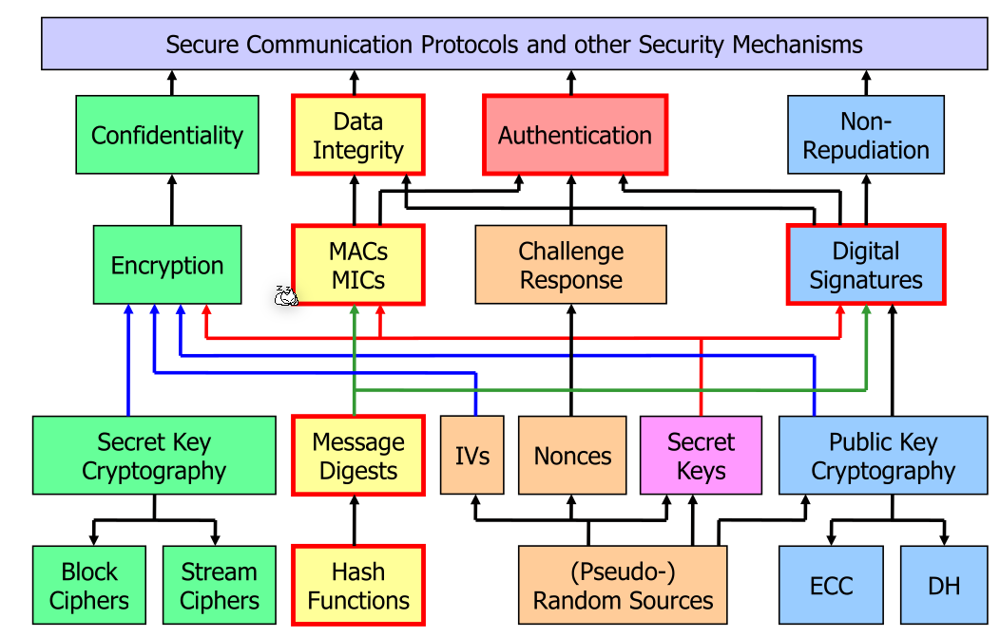
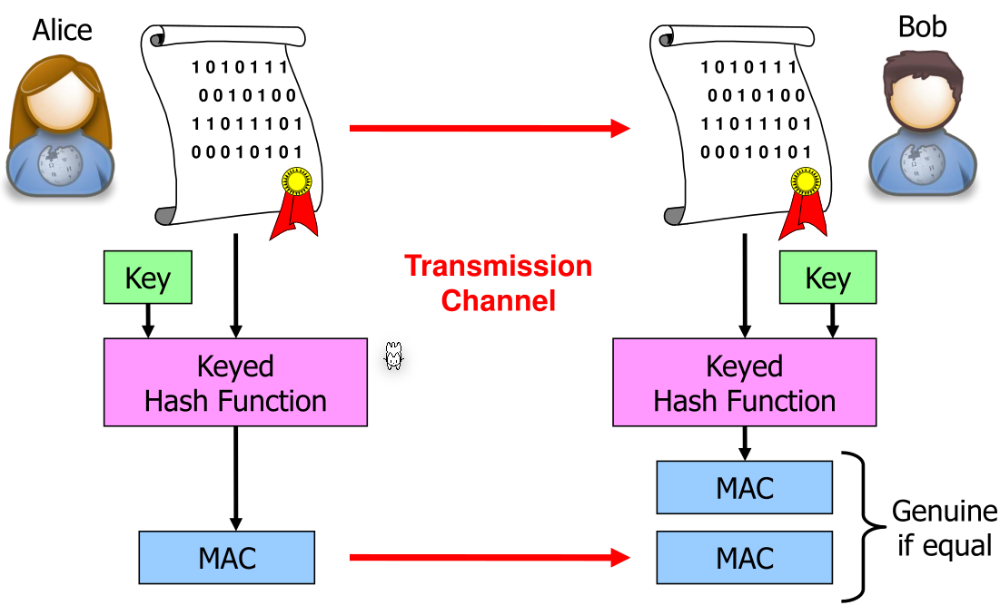
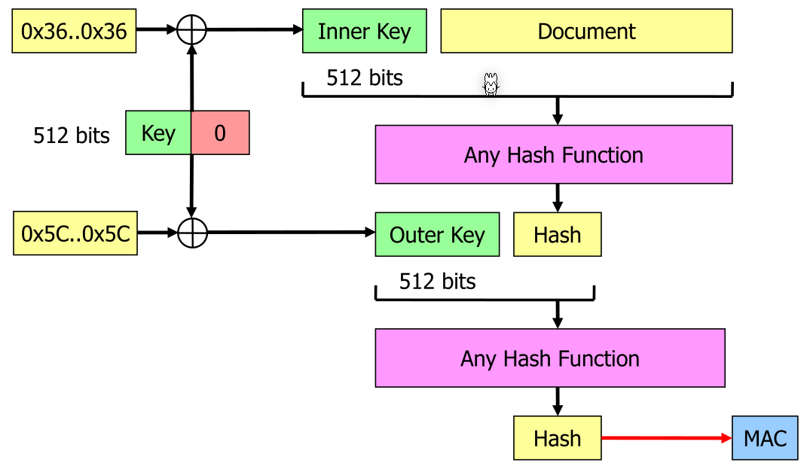
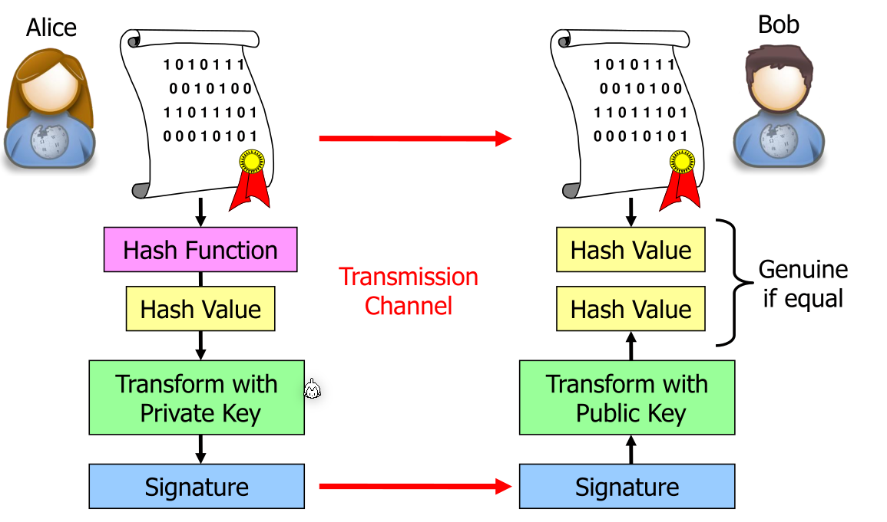
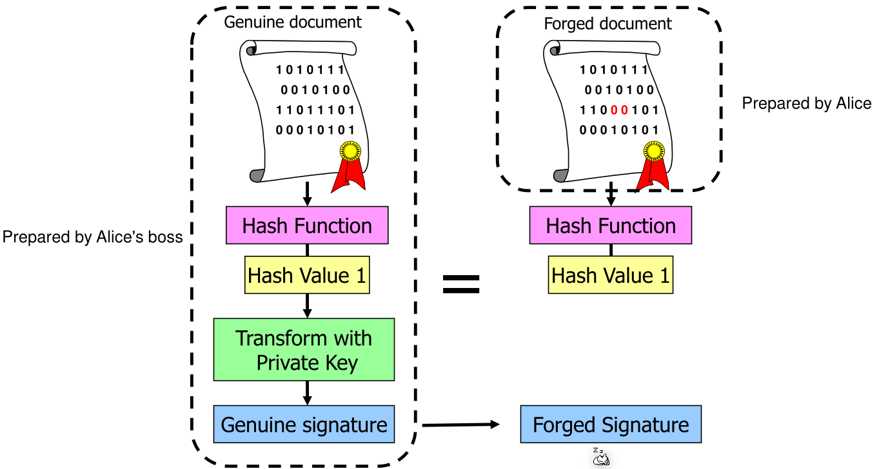
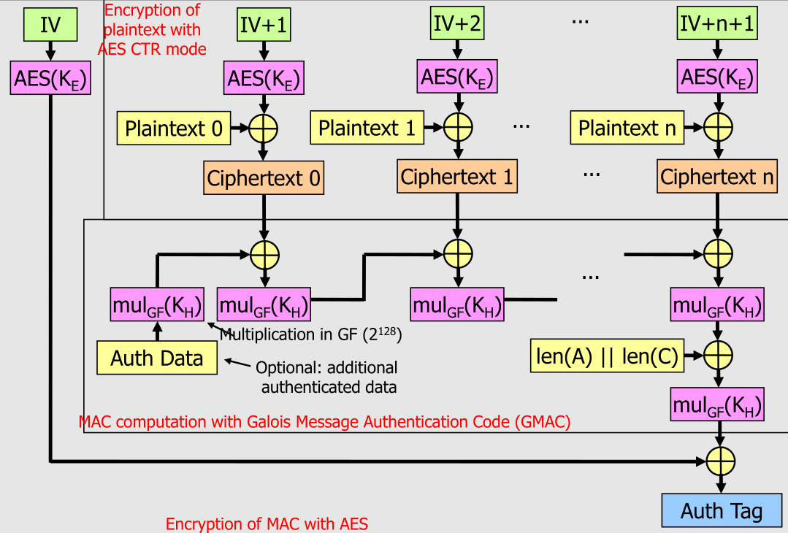
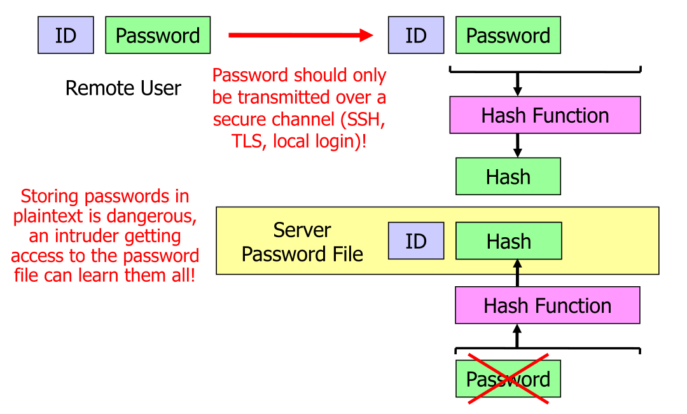
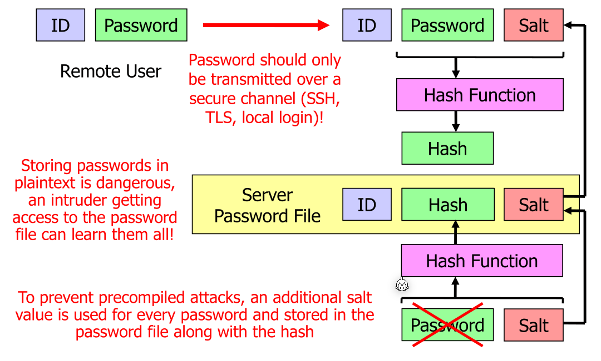
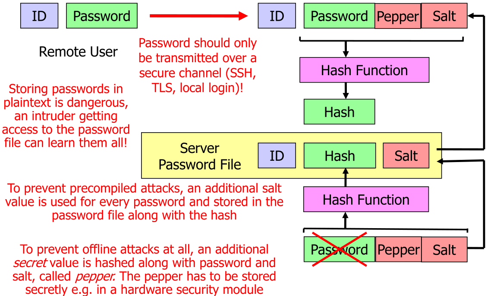
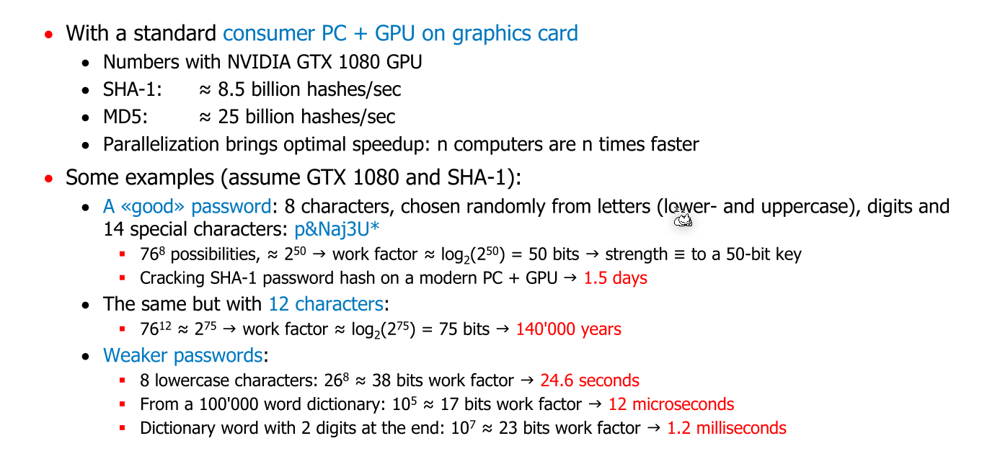

# Integrity and Authentication

In this chapter, errors during transit aren't important and are usually already handled by the hardware. These hash functions are used to prevent malicious modifications of messages.

## Cryptographic Hash Function

A cryptographic hash function maps a variable-length input bits to a fixed-size output string. Typically, the output size is `128`, `160`, `256` or `512` (today only `256` bits and upwards should be used).

Important properties are:

* The hash can be efficiently computed
* The mapping should be pseudo-random. No connection between the message and its hash should exist. Usually, this means one bit in the input should change half of the output bits.
* Given a hash, I should be practically impossible to find a message that produces the hash (**preimage resistance**).
* It should be practically impossible to find two messages that map to one hash (**collision resistance**).

If an algorithm fulfils all of these properties, a hash can be used as a stand-in for a message.

These are some popular hash functions:

* MD5 (128-bits, **broken**)
* SHA-1 (160-bits, **broken**)
* SHA-2 (224-512-bits, considered secure)
  There are no known attacks. However, the NSA was involved in the design. It is considerable faster than SHA-3 and BLAKE.
* SHA-3 (224-512-bits, considered secure)
  Was a winning algorithm in a contest and uses a completely different construction as SHA-2. It significantly slower than SHA-2
* BLAKE (224-512-bits, considered secure)
  Was another finalist, but SHA-3 won. It is a bit faster than SHA-3, but less known and less tested.

## Possibilities

One case is, if one wants to detect accidental errors during data transmission. To do this, when sending a message, the corresponding hash is computed and appended. The receiver will check the received hash.

This helps against accidental changes, but not against malicious attacker, as the attacker can just replace the hash.

Possible solutions are

* Adding secrets to hash functions (Message Authentication Code (MAC))
* Use a hash function together with digital signatures

## Message Authentication Code (MAC)

A popular example for a MAC is HMAC. The inner hash function does not need to be collision resistance, only the pseudo-random mapping is necessary. The inner and outer key must be different.

The key is padded with `0` if it is not 512 bits long.

## Digital Signatures

The hash value is encrypted with the private key and sent to the receiver. The receiver will decrypt the hash with the public key and check the hash value.

This is done, over just encrypting the message, for performance reasons. Hashing a gigabyte of data is a lot faster then encrypting it. There is also the added complexity of having to use a cipher mode for the public-cryptographic encryption.

Popular digital signature schemes are:

* RSA (recommended key length: 3072 bits)
* DSA (recommended key length:  256 bits)

## Forging Documents

To brake a digital signatures, the following options exists:

* Brake the digital signature scheme by obtaining the Boss' private key
* Prepare the real letter first, let it be signed and then a fake reference letter that has the same hash as the original one (preimage).
* Prepare both the real letter and the fake letter at the same time. 

The following image shows a preimage attack:

To find a collision for a given hash value, on average, halve of the hashes need to be tried: $2^{h-1}$ ($h$ is the length of the hash)

To create two documents with the same hash, on average, $2^{\frac h 2}$ hashes are needed.

To still have a a work factor of 128 bits, a hash needs to have at least 256 bits.

## MAC-then-encrypt (MtE) and encrypt-then-MAC (EtM)

In MtE, first a MAC is created and then it is encrypted. In EtM, first it is encrypted and then the MAC is built.

An advantage for EtM is that if an bug in the encryption is found (like a buffer overflow), then this can be taken advantage of. If the MAC fails, then the file won't be decrypted. 

## Authenticated Encryption with Additional Data (AEAD)

One example for AEAD is AES-CGM.

* Advantages:
  * Good performance, as the encrpytion of the blocks can be done in parallel and the multiplication in $GF(2^{128})$ requires relatively little computing power
  * It is an official NIST standard
  * It follows the Encrypt-then-MAC approach
* Disadvantages:
  * Much more complicated than straight-up CBC with MAC in EtM
  * Can lose all of its security with a very small mistake, like reusing the initialisation vector $IV$

## Authentication with Passwords

There are two security problems with passwords:

* Sniffing
  If the password is sent over the network, others can sniff the password. To prevent this, the password needs to be encrypted with TLS or similar
* Physhing
  The user is directed to a fake login screen where the password can be phished.
* Online Attacks
  Attackers can guess passwords directly on the target systems. The site should slow the process down, if multiple wrong passwords were found. The website should never report if the user or the password was wrong, only that both was wrong
* Offline Attacks
  The attacker compromises the system itself and gets the password files
* Password Re-Use
  User often re-use the passwords. If passwords were comprimised at a website, crackers can try them on other websites

### Hashed Passwords

Password should only be store hashed. 

This can be cracked by:

* Using rainbow-tables (precompiled attack)
* Dictionary attack

To protect against those attacks, **salting** should be used. When hashing a password a random 64 - 128 bits value is added. This value, also called salt, can be stored in plain text. It should be different for every password. This means that the attacker would need to store 64 - 128 bits more per password.

There is also peppering, where an additional secret is added to the password before hashing. This secret is the same for all the password, but is stored in an hardware security module.

Another trick is to do "key-streching" where when hashing the password is hashed multiple times. This results in the hashing taking longer.

To store passwords, Argon2d and Argon2id should be used

### Computational effort to crack a Password

