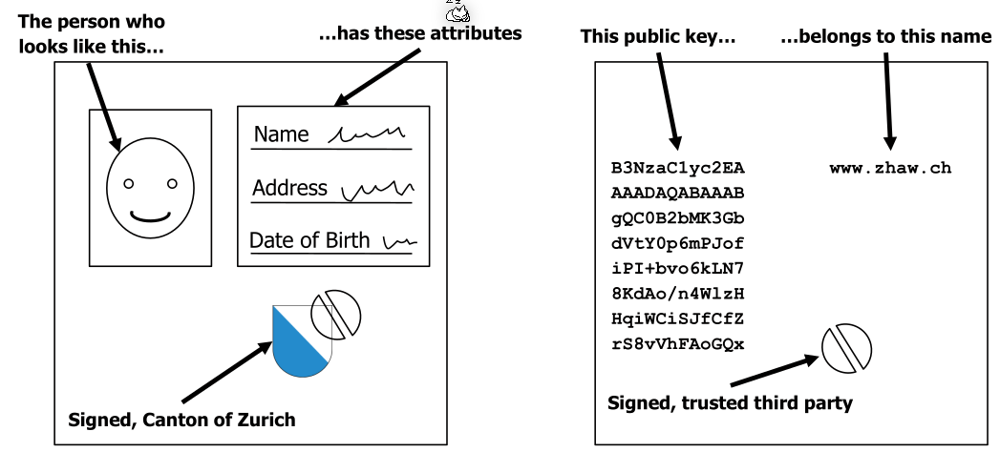
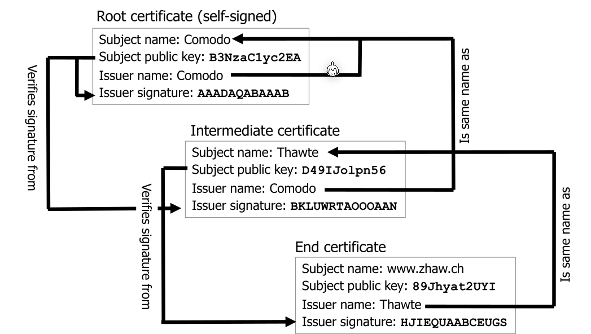
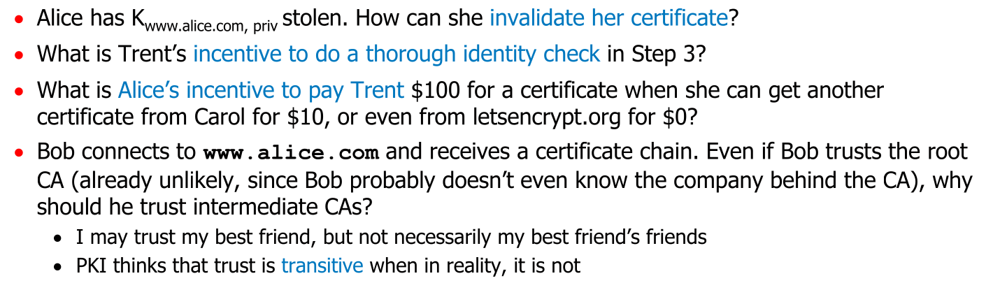
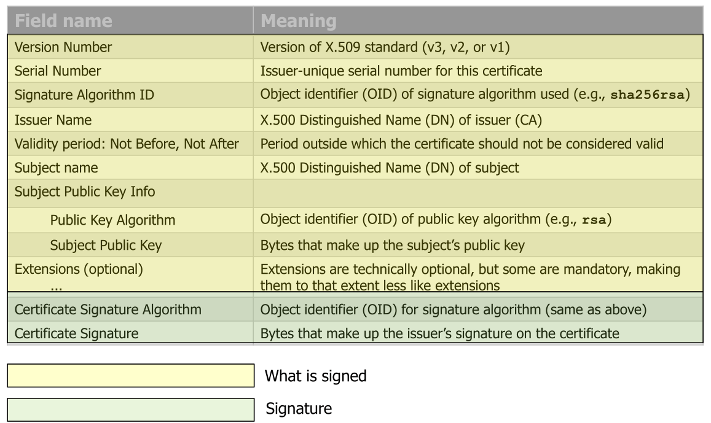
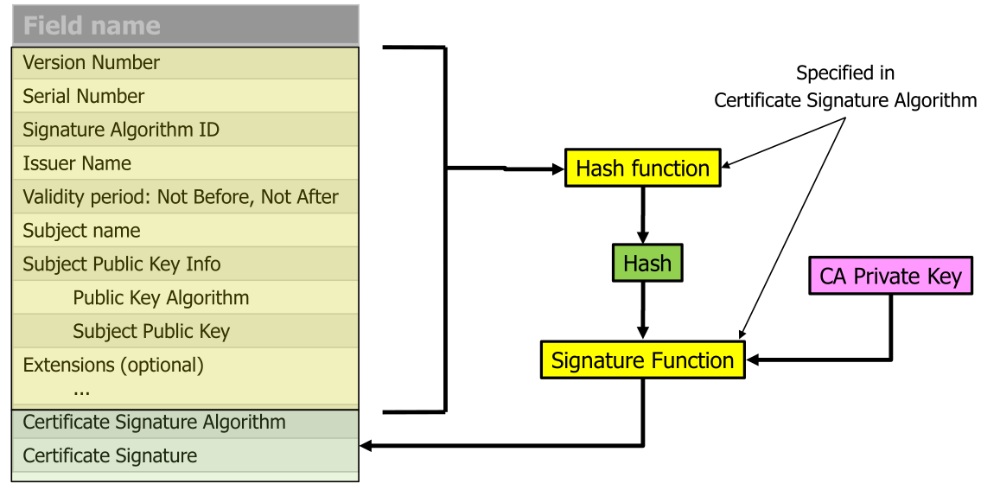
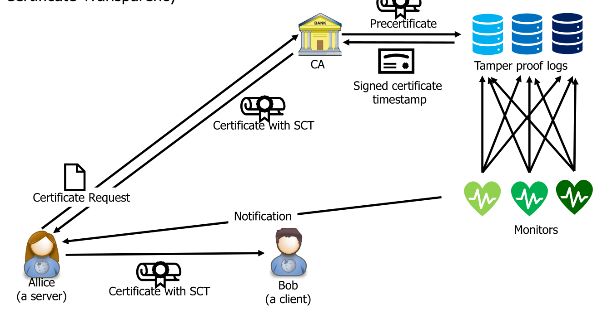
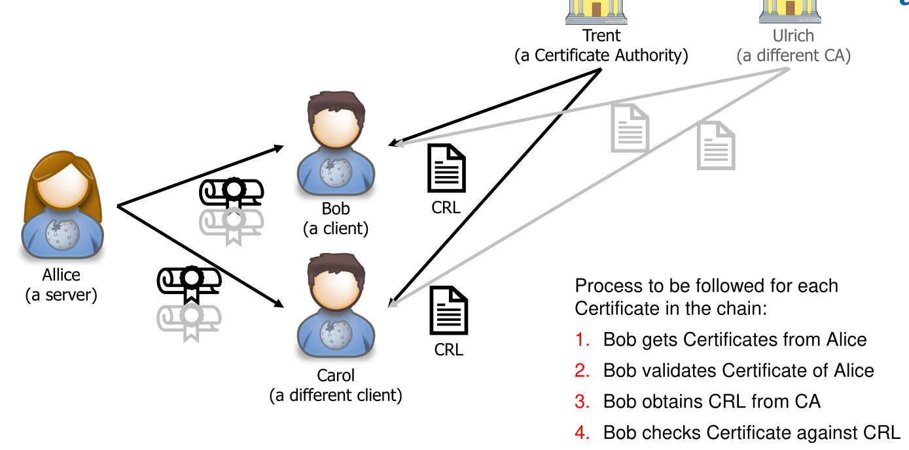
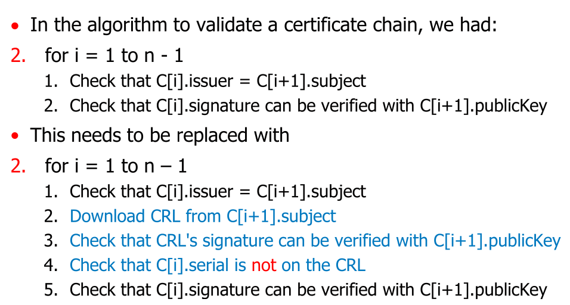
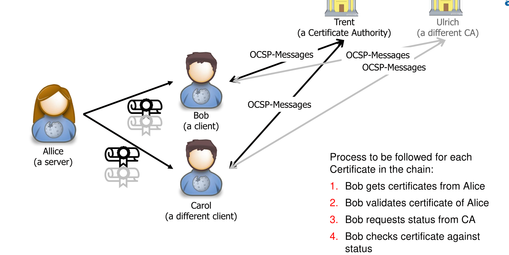
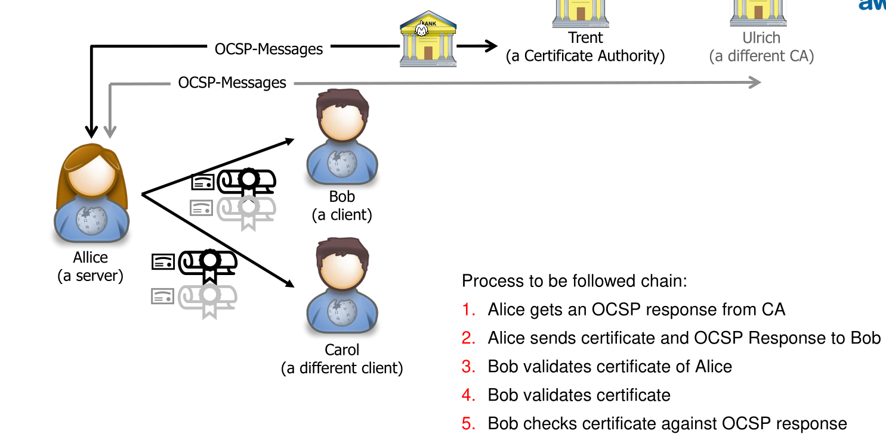

# Certificates

## Certificate Chains

All certificates, except the root certificate, are sent by the web server. Each certificates authority can be checked by verifying it with the previous certificate in the chain. 

Root certificates are self-signed as they are signed with itself.

The root certificates are prepacked with the browser or the OS. If there is a breach of a CA, the browser or OS needs an update.

## Obtaining a Certificate

1. Alice creates a key pair ($K_{www.alice.com, pub}$, $K_{www.alice.com, priv}$)
2. Alice sends a Certifficate Signing Request (CSR) containing (www.alice.com, $K_{www.alice.com, pub}$, $K_{www.alice.com, priv}$) to her CA of choice
3. The CA verifies that Alice really owns www.alice.com
4. The CA signes Alice's CSR  giving the signature $S=\mathrm{sign}(CSR, K_{Trent, priv})$
5. The CA now puts the following together into a certificate:
   1. The subject name: www.alice.com
   2. The subject public key $K_{www.alice.com, pub}$
   3. The issuer name: The name of the CA
   4. The issuer signature $S$
6. Alice pays the CA and the CA sends the certificate to Alice

## Veryfing a certificate

To very the signature of a certificate, one needs to have the public key of the certificate authority (CA). However, this certificate needs to be verified as well.

1. Bob connects to www.alice.com
2. The server sends the certificate chain to Bob (except the root certificate)
3. Chain has certs $C[1], ..., C[n]$
4. Check that $C[1].name = www.alice.com$
5. for i = 1 to $n-1$
   1. Check that $C[i].issuer = C[i+1].subject$
   2. Check that $C[i].signature$ can be verified with $C[i+1].publicKey$
6. **TODO**

## What can go wrong?

## X.509

The yellow part is signed with the green part.

### Types

* TLS certificate
  * Domain Validation
    Only validates the domain, but not who operates it
  * Organization Validation
    Verifies the data of the organization
  * Extended Validation
    Verifies additional things about the domain.
* Code signing certificate
  Confirms authenticity of software or files
* Client certificates
  * Digital ID that identifies individual user/machine
  * Used for email signatures or access control

## Certificate Transparency

## Certification Revocation

If the private key of a certificate is stolen, it needs to be revoke. However, the subject can't change their own certificate. Instead it needs to be marked as revoked. CA has a list of all revoked certificate (the Certificate Revocation List - CRL) and the browser needs to check if a certificate is on this list.

To check the validity, for each certificate in the chain a CRL needs to be downloaded and checked if the certificate is not on it.

However, the CRL is downloaded with HTTP, not **HTTPS**

* CRLs are updated only every couple of days; there is a
  time window between revoking a certificate and finding
  it on the list
* Can’t remove a cert from CRL, even when it is expired,
  since you may need to check if a signature was made
  with a key that was revoked even though it was still valid
  (e.g., last will and testament)
* Sometimes, many certs go onto a CRL in a short amount
  of time, e.g., Heartbleed
* CRLs only get larger, delay / scalability issue for CRL
  download
* Due to these limitations, support for CRL downloading is getting smaller, CAs not provide them
  anymore, many programs no longer use them

Alternatively there is the Online Certification Status Protocol (OCSP). Every certificate comes with an URL where the browser can check if the certificate is still valid. This is done over HTTP, but the answer is signed with the private key of the CA and can be trusted.

* Advantages compared to CRL:
  * Fresh status information about a certificate
  * Only little information is exchanged
* Disadvantages
  * There is a privacy issue as the CA can see who vists which server
  * The OCSP must always be available
  * Most client implement a soft fail. If OCSP response is not received in time then a certificate is treated as good

Those issues were tried to be fixed with OCSP Stapling. Here the server queries the OCSP-Responder and caches the answer. The client will receive the OCSP-response from the server itself. This has a timestamp in it and is signed with the private key of the CA.

Benefits of this are:

* Less dependent on the availability of the OCSP-responder as if it cannot be reached, the server can still use the cached copy
* Scalability
* The privacy issue is solved

Issues of this are:

* There is a validity period of a OCSP response
* If no valid OCSP response is cached, the server won't include one. If the client can't reach the OCSP endpoint it will default to a soft fail.

There is a third alternative, OCSP must-stable, in which the certificate is rejected if no stable is included (hard fail). This reintroduces the DOS problem of OCSP (without stable).

With **Browser-Summarized CRLs**, where browser vendors download CRLs centrally and compress this with a bloom filter. The browser vendor push regular updates (every 6h) to the client.

### Root Certificate Revocation

To revoke a root certificate, every library and application, which bundles root certificates, need to be updated.

##  