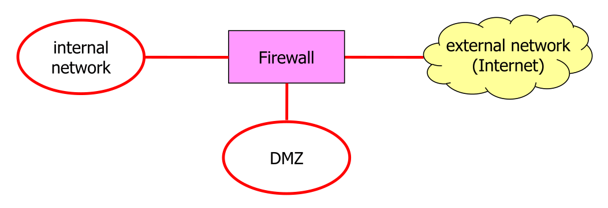
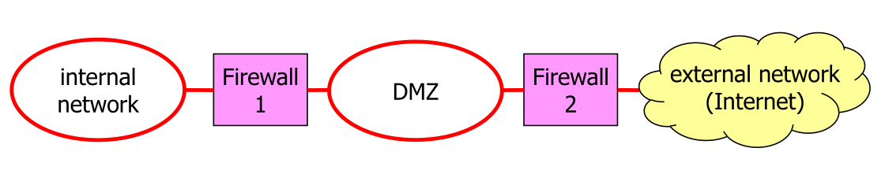
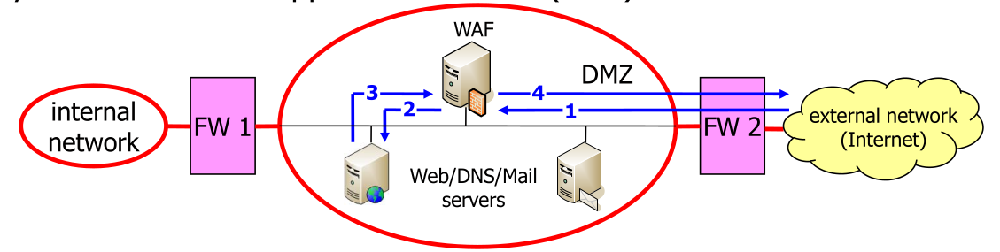
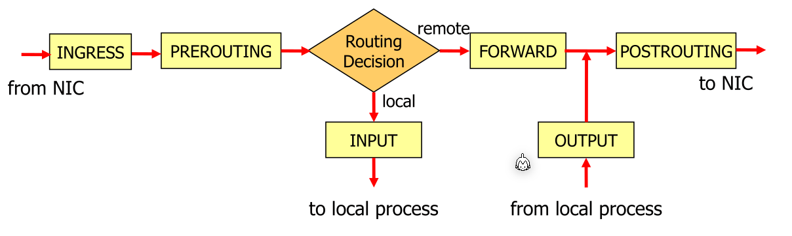
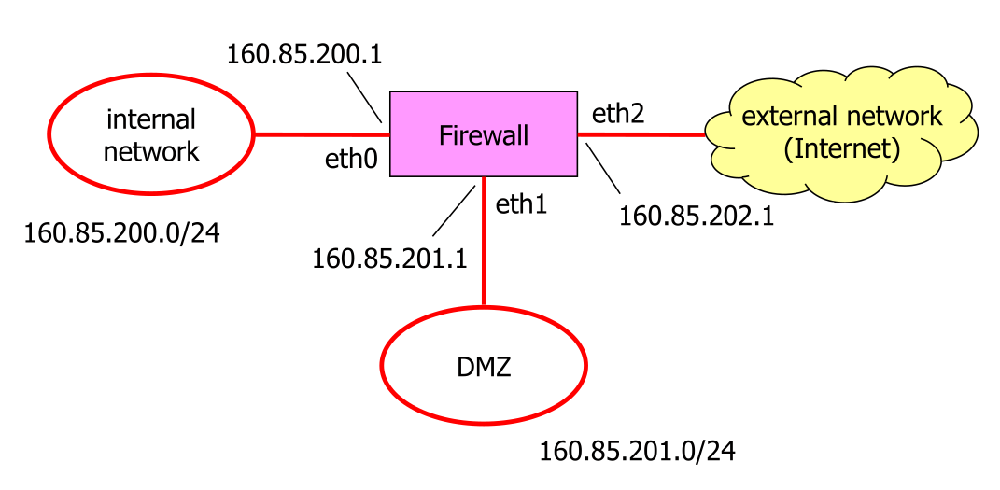
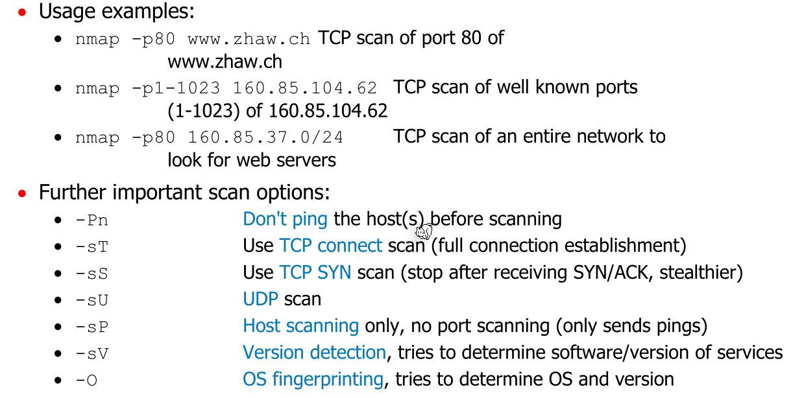
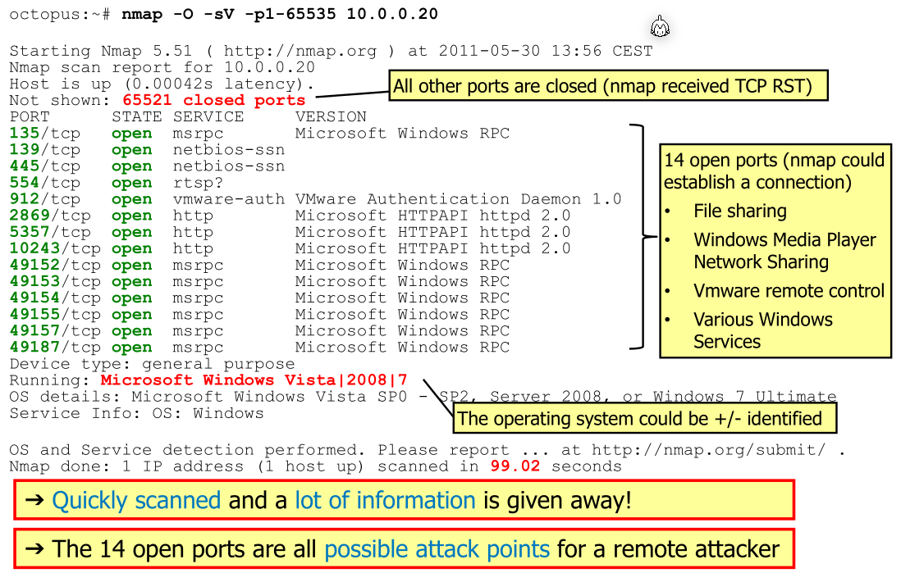

# Firewall

>  A firewall is a device that sits between two or more networks to control the packet flow between them.

A firewall can:

* Control access from the internal (company) network to the internet
* Control access from the internet to the internal computers
* Block malicious incoming web traffic
* ...

## Packet Filtering Firewall

This firewall operates on the network and transport layer and packets (with IPs and ports). However, application data is not inspected.

An advantage is how fast those firewalls are, but the content of the traffic is not inspected.

## Stateful Packet Filtering Firewalls

A stateful packet filtering firewall tracks TCP connections and UDP sessions. The firewall stores information about the session, like protocol, source/destination address, ports, session duration, protocol phase in TCP and many more.

## Application-Layer Firewall

This firewall operates on the application layer. To do this, they split the end-to-end connection. This results in a connection between the server and the firewall and the firewall and the client.

While this allows deep inspection data, it is relatively slow, encrypted data can be a limit and this firewall are usually optimised for one specific protocol. Additionally, the security depends on how up-to-day the firewall is.

## Typical Scenario



All traffic from the internet has to go through the firewall and usually a connection can only be initiated from the internal network.

The purpose of the DMZ is to provide a space for externally accessible server. From the internal network and the internet can a connection be initiated to the DMZ. If a server in the DMZ gets hacked, the traffic still has to go through a firewall.



This provides largely the same benefits



The diagram above shows a diagram with a Web Application Firewall (WAF), which is in front of the server accessible from the external network.

## Limitations

Firewalls create a perimeter around the internal network and can control the access to this internal network. However, if a hacker can circumvent the firewall somehow, the firewall becomes entirely useless.

Additionally, most firewall can't inspect the application data.

## Netfilter/Nftables



The diagram above shows how the Linux kernel handles network packages and what hooks are called during the processing of a packet.

### Nftable Rules

A rule has a classification part and an action part. The classification says to which packet this rule applies and the action what to do with this package. Typical rules are:

* Accept
  Continue to process the packet

* Drop
  Stop processing the packet

* Reject

  Stop processing the packet and tell the sender with an ICMP "port unreachable" packet

* Jump
  Continue processing the packet somewhere else

Here are some examples for rules:

```bash
ip daddr 8.8.8.8 drop # daddr = destination address

ip daddr 8.8.8.8 counter drop # counts all packets to 8.8.8.8 and then drops it

ip daddr 8.8.8.8 reject # rejects all packets to the ip 8.8.8.8

# does the same thing, but sends a ICMP host-prohibited message
ip daddr 8.8.8.8 reject with icmp type host-prohibited 

ip6 nexthdr tcp accept # accept all IPv6 packets carrying TCP (nexthdr=next header)

ip6 nexthdr != tcp accept # accept all IPV6 packets which don't carry TCP

# (iifname = input interface name) accept all packets comming on the innterface eth2
iifname eth2 accept 

# Accept a max of 10 ICMP echo messages per second
icmp type echo-request limit rate 10/second accept

# Reject packets from multiple ip addresses
ip daddr { 8.8.8.8, 1.1.1.1 } reject

# Accept packets going to port 80 and 443
tcp dport { http, https } accept

# Accept ICMPv6 neighbour-discovery packets
icmpv6 type { nd-neighbor-solicit, nd-neighbor-advert, nd-router-solicit, nd-router-advert } accept

# combine multiple conditions. The order matters
ip saddr 10.0.0.0/8 tcp dport ssh accept
# (saddr 10.0.0.0/8) (tcp dport ssh) 
```

### Chains

A chain contains rules and a default policy. By default policy is **accept** if not changed. A chain which is called on a hook are **Base-Chain** and chains which are not associated with a hook are called **non-base-chain**.

Linux goes through the chain top-down until a rule matches.

Chains have types, but we only have looked at `filter`. Similarly, chains also have a priority.

These are some examples for chains:

```bash
# name ssh-traffic is just a name used to refer to this chain
chain ssh-traffic {
	# specifies the type=filter and the used hook is INPUT
	# the priority is 0 and the default policy is drop
    type filter hook input priority 0; policy drop;
    # one filter in the chain
    tcp dport ssh count accept
}
```

```bash
chain tcp-traffic {
    type filter hook input priority 0; policy drop;
    # if this rule matches, go to http-traffic chain
    tcp dport { https, http } jump http-traffic
}
chain http-traffic { # non-base-chain
	# no input hook -> non-base-chain
    type filter; policy drop;
    # no condition, matches everything
    count accept
}
```

### Tables

Chains must be wrapped in a **table** directive. Tables have a packet family for which they are used. `ip` = IPv4, `ip6` = IPv6 and `inet` = IPv4 and IPv6

```bash
#!/usr/sbin/nft -f
flush ruleset # clear all tables and chains

# inet = ipv4 and ipv6
table inet myinput {
    chain tcp-traffic {
        type filter hook input priority 0; policy drop;
        tcp dport { https, http } jump http-traffic
    }
    chain http-traffic { # non-base-chain
        type filter; policy drop;
        count accept
    }
}
```

By using the `#!/usr/sbin/nft -f` , this can be executed as a shell script. All changes will be done in an atomic fashion.

### Variables

These scripts can also use variables:

```bash
#!/usr/sbin/nft -f
define ifc = eth1
define svcs = { ssh, http, https }
define net6 = 2001:db8:2:c::/64
table inet myfilter {
    chain myinput {
        type filter hook input priority 0; policy drop;
        iifname $ifc ip6 saddr $net6 jump ip6-input
        tcp dport $svcs accept
    }
}
```

### Example



```bash
#!/usr/sbin/nft -f
define iifc = eth0 # Interface to internal network
define difc = eth1 # Interface to DMZ network
define eifc = eth2 # interface to external network
define inet = 160.85.200.0/24 # Internal network
define dnet = 160.85.201.0/24 # DMZ network
#define enet = # Not defined
define iaddr = 160.85.200.1 # FW address on internal net
define daddr = 160.85.201.1 # FW address on DMZ
define eaddr = 160.85.202.1 # FW address on external net

table ip myfilter {
	# chain to local processes
    chain myinput {
    	type filter hook input priority 0; policy drop;
    	# allow internal host to ping the firewall
    	iifname $iifc ip saddr $inet ip daddr $iaddr icmp type echo-request accept
    }
    # chain from local processes
    chain myoutput {
    	type filter hook output priority 0; policy drop;
    	# allow the firewall to reply to ICMP echo request from the internal network
    	oifname $iifc ip daddr $inet ip saddr $iaddr icmp type echo-reply accept
    }
    
    # chain for forwarded packages
    chain myforward {
    	type filter hook forward priority 0; policy drop;
    	# allow hosts from external network to communicate the DNS server in the DMZ
    	iifname $eifc oifname $difc ip daddr 160.85.201.67 udp dport domain accept
    	# allow the DNS server to send packets outwards (to reply)
    	iifname $difc oifname $eifc ip saddr 160.85.201.67 udp sport domain accept
    	
    	# allow internal hosts to connect to the web server on the external network
    	iifname $iifc oifc $eifc ip saddr $inet tcp dport http accept
    	# filter packets from the external network to the internal connected
    	# with a sync flag set (used to initiated the tcp connection)
		iifname $eifc oifc $iifc ip daddr $inet tcp sport http tcp flags != syn accept
    }
}
```

### Stateful Chains

To enable connection tracking, `ct` has to be specified.

```bash
chain myinput {
	type filter hook input priority 0; policy drop;
	# enables connection tracking
	# This means, if there is an already established connection or a connection 
	# related to an existing connection, this packet should be accepted.
    ct state established,related accept
    # the "ct state new accept" creates an established connection in the tracker
    iifname $iifc ip saddr $inet icmp type echo-request ct state new accept
}

chain myoutput {
    type filter hook output priority 0; policy drop;
    # This accepts all packages with an already established or related connection
    ct state established,related accept
}

chain myforward {
    type filter hook forward priority 0; policy drop;
    ct state established,related accept
    iifname $eifc oifname $difc ip daddr 160.85.201.67 udp dport domain \
    	ct state new accept
    iifcname $iifc oifname $eifc ip saddr $inet tcp dport { http, https } \
    	ct state new accept
}
```

## Port Scanning

With port scanning, an actor can determine the services running on a host.

The following steps are usually done:

1. Check if the host is available by pinging it
2. Establishing a TCP connections to the ports
3. If a connection can be stablished, then a service is available
4. If the server responds with a TCP RST, then no service is available

There are also UDP scans, which sends datagram to the ports and receive either and answer or an ICMP port unreachable message (or nothing).

### `nmap`



