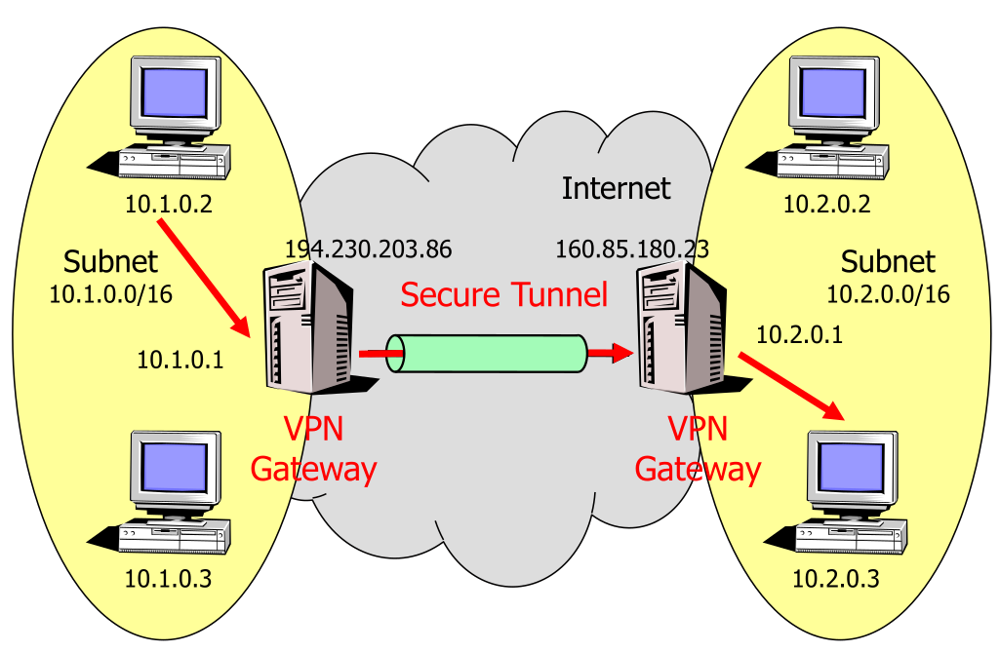
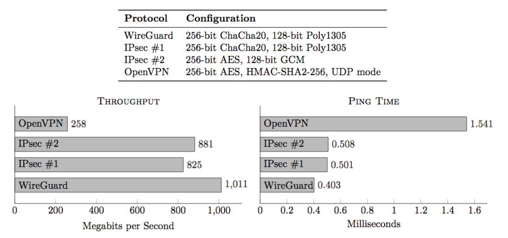
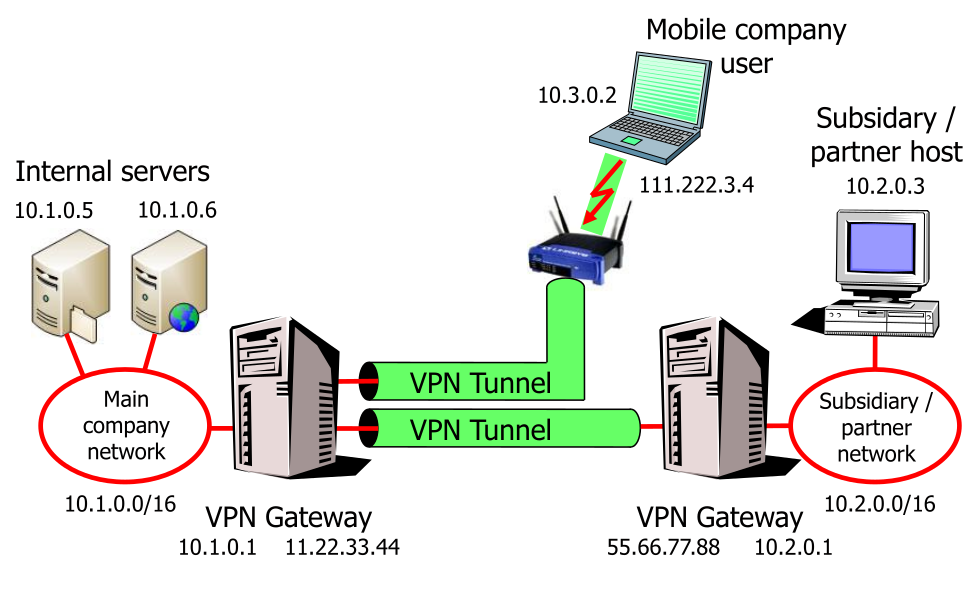
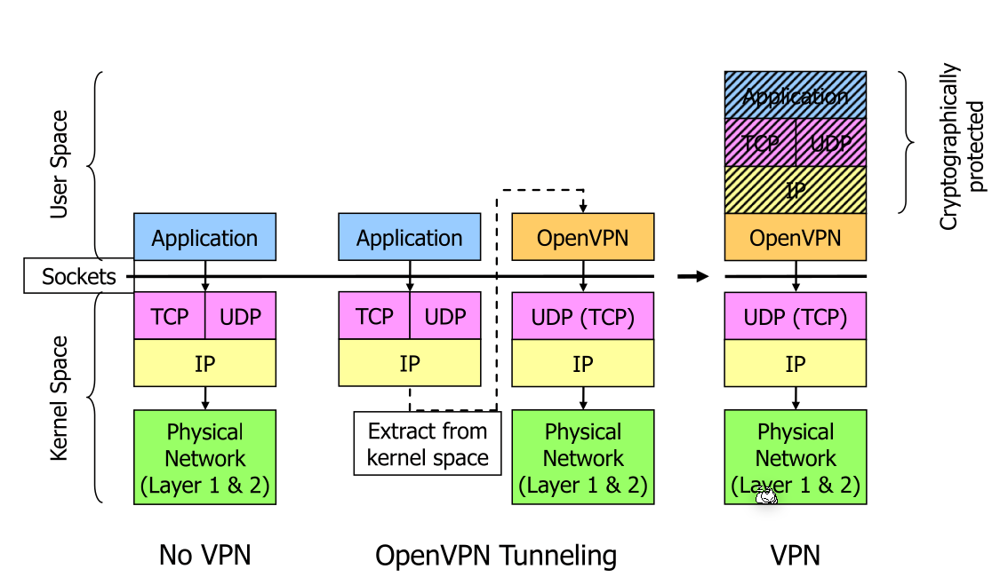
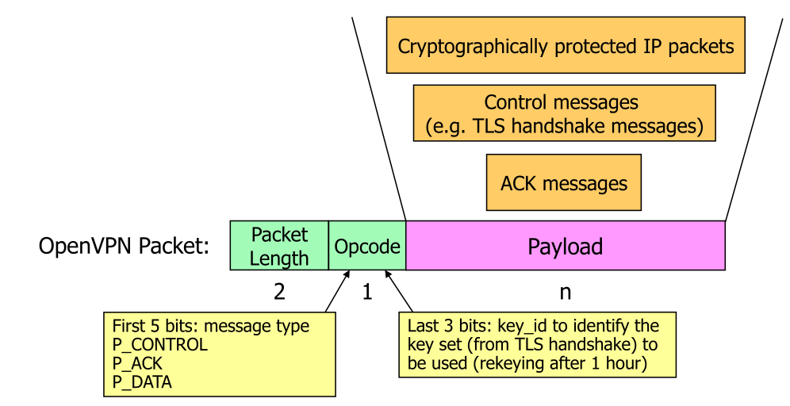
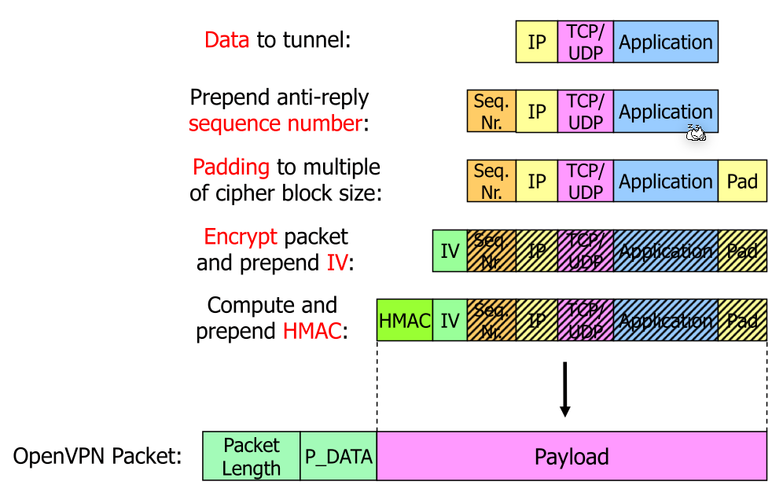
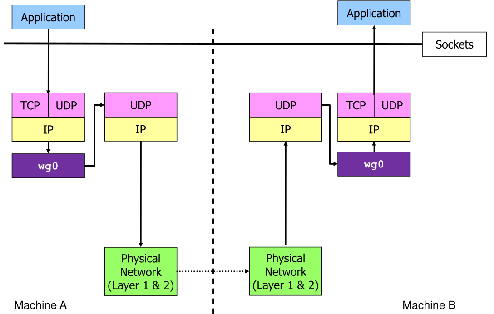
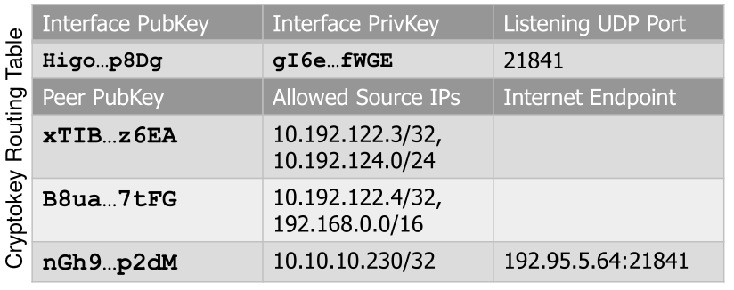
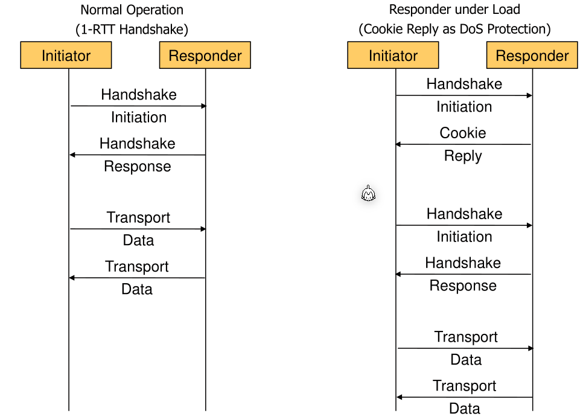

# VPN

## Performance

## Scenarios

VPNs are often used to allow other subsidiaries/partners or mobile/work from hose users to access company internal networks.

This can be a problem if the client uses a dynamic IP, since a firewall can't do reliable access control via the source IP.

## IPSec

See [Secure Communication/IPSec.md](Secure Communication/IPSec.md])

## OpenVPN

OpenVPN operates a virtual network card as an application in user space and packages IP packets into UDP packets. OpenVPN usually is used over UDP since TCP over TCP can lead to very poor performance.

### Packets

`P_ACK` has the same function as the TCP ACK package.

For `P_DATA` a packet looks like the following:

Note the `Seq. Nr`: this prevents replay attacks since the attacker can't just reply an already sent package. The `Pad` field is to match the block size for the block cipher.

## WireGuard

WireGuard can be very little configured  since miss-configured systems are an often cause. Like IPSec, it works on layer 3 and uses the ChaCha20 cipher with the Curve25519  curve.

WireGuard has perfect forward secrecy (PFS), meaning if an endpoint is compromised and old messages were recoreded, then these old messages can't be decrypted.

WireGuard needs a kernel module, since it doesn't has an user space application.

Wireguard has a crypto routing table:

This table shows one wireguard interface, which has a public key, private key and an udp port. There are allowed source IPs (of the tunnled device), to which the interface is allowed to receive packets. With each source IP is a public key associated which is selected depending on the source IP. 

These are used to verify the integrity of a received packet. When a packet is received, it is decrypted with the interface's private key and then the source IP is read and checked with the associated public key.

Internet endpoint is the equivalent of gateways.

WireGuard has DoS mitigation by sending a cookie reply under load. The client has to do some work to actually do a successful handshake. This means more work for a potential flooder.

