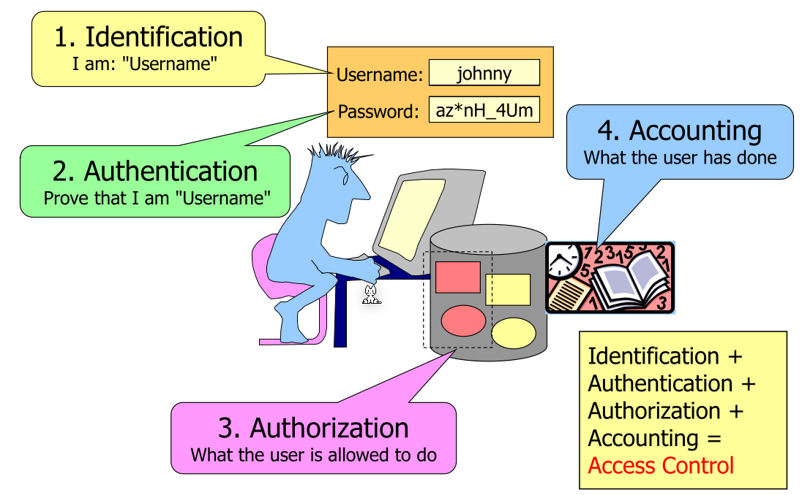
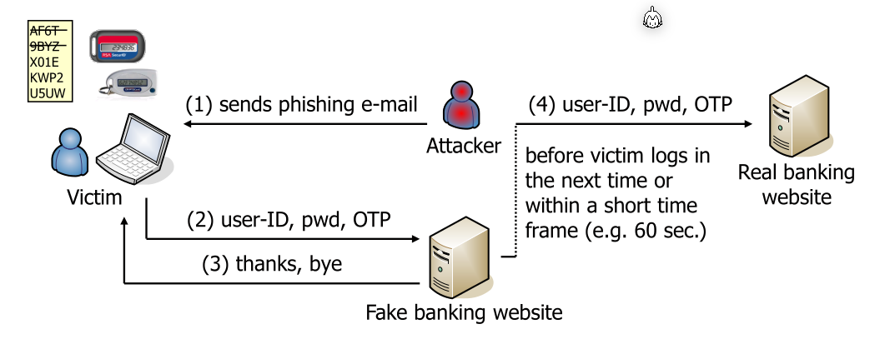
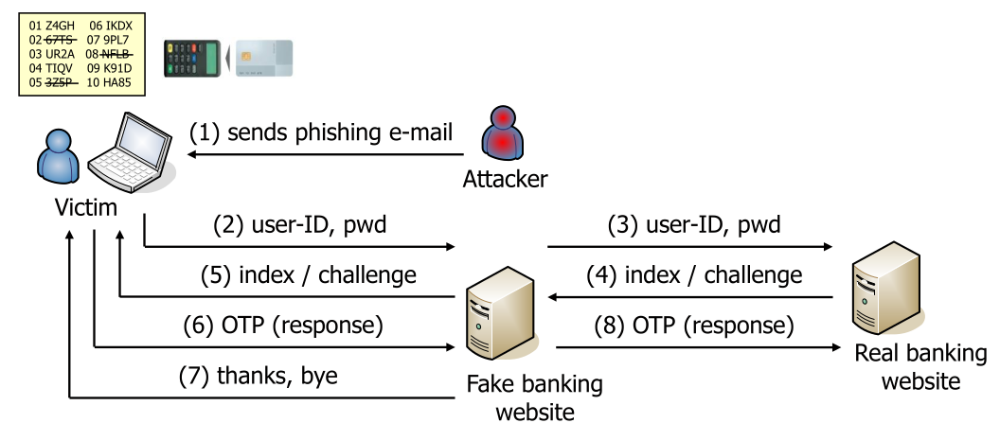
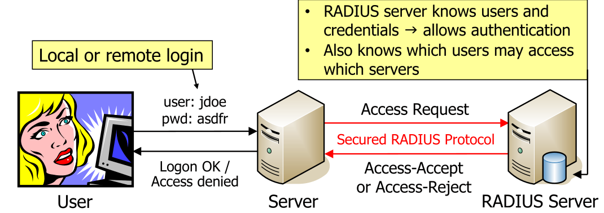
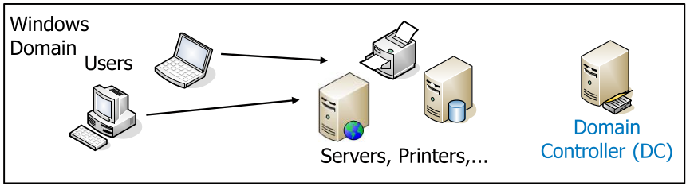
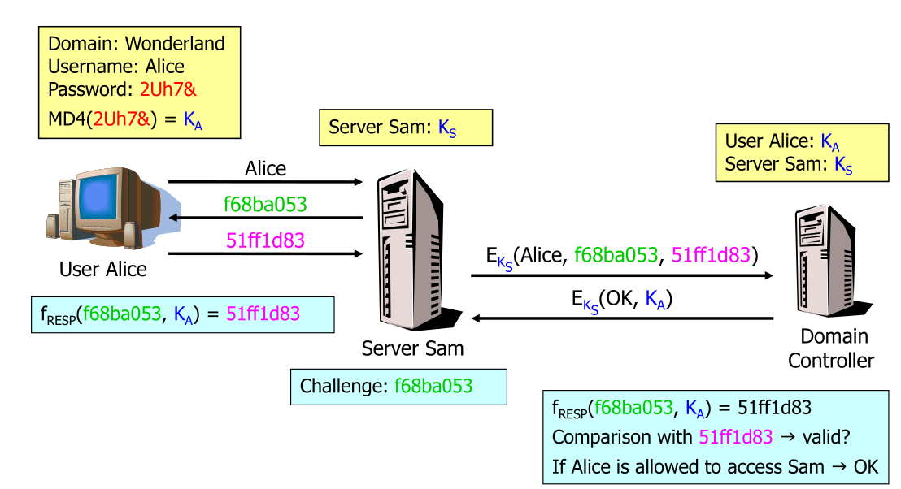
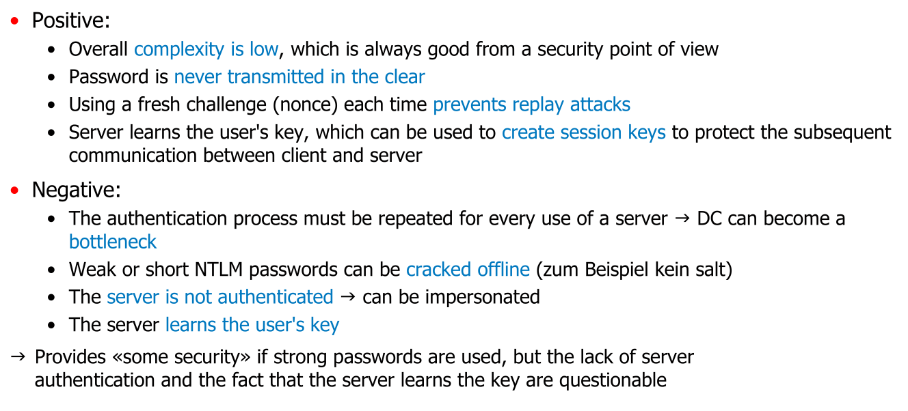
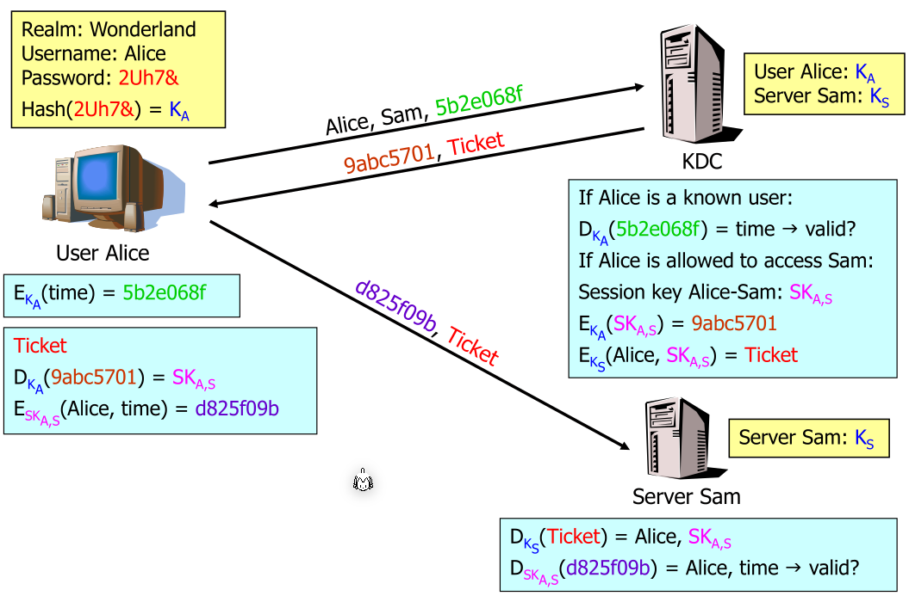
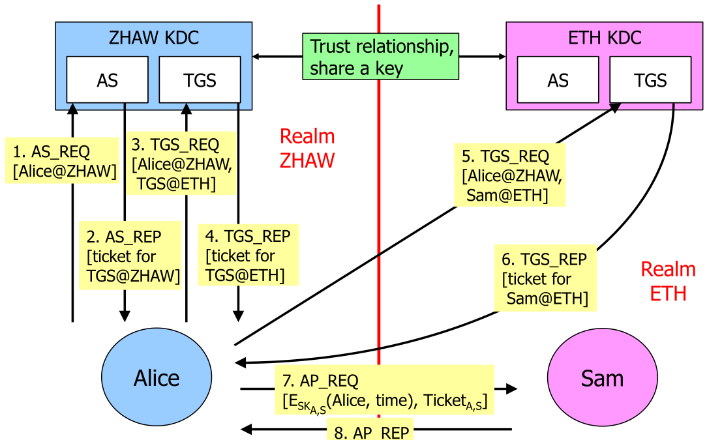
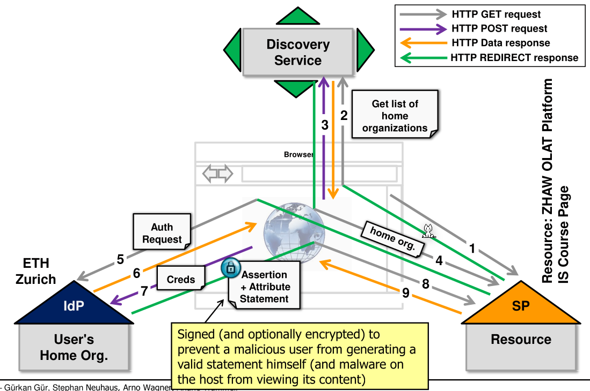

# Authentication Protocol

* Identification: 
  The user says they are `xy`
* Authentication
  The service checks if the user is actually `xy` by authenticating the user e.g. via a password or other means. More general one proofs who they are by something that only they know (passwords), only they have (hardware token) or they are (e.g. fingerprint, faceID, ...)
* Authorisation
  The service checks if the user has permissions to access some page or service
* Accounting
  The logging trail to later reconstruct log ins or attacks

## Two-Factor Authentication (2FA)

2FA should protect the user in case the password was leaked, a potential attacker still needs a second factor. Most prominent today, this is archived by a password and a one-time password (OTP)

One attack is, that an attacker creates a fake web site and phishes the user.

To prevent this, a challenge-response based approach can be used (e.g. like what post finance used). However, this can still be attacked with a phishing-attack:

This sometimes is also done on the smartphone. This, however, doesn't improve security.

Another, still popular approach, is mobile TAN (mTAN), where a message via SMS is sent to the user which the user then enters on the web site.

## Indirect User Authentication

The user logins are stored and managed by one centralised server. 

Direct user authentication would be if the user directly logged in in the server without the server asking a RADIUS server (or similar).

### Windows NT LAN Manager (NTLM)

A windows domain is a collection of users and services, with the access being controlled by a domain controller (DC). Each user has only one account per domain. Users can be assigned to groups.

All users and servers must trust the domain controller, since the domain controller decides if a user/group has access. (A server one has to trust, is one that can attack you!)

When starting the computer, the user enters the domain, username and password. The client computes the MD4-hash and forgets the password. The server sends the user a challenge, to which the user computes the response with the MD4-hash which is returned to the server. The server sends the domain, username, challange and response to the domain controller which checks the access. The server and domain controller have a shared secret.

### Kerberos

In kerberos, each participant is called a principal. Each principal shares a common seccret with a centralised server, the key distribution centre (KDC) (this is the equivalent to the domain controller).

All principals trust the KDC.

Kerberos uses tickets, which are issued by the KDC, and proof to a server the authentication.

Kerberos allows federated acccess across realms:

## Shibboleth

