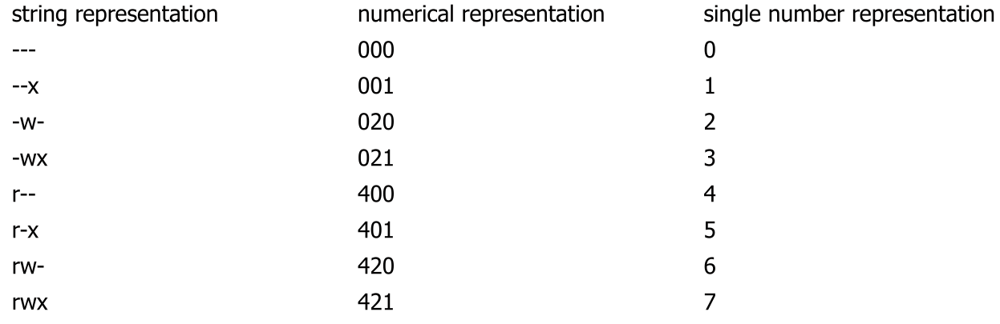

# Authorization


## Security Policy

The security policy defines who is allowed to do what and often is role based. The security policy is defined by the business requirement. The security administrator then reads and implements this document.

A problem can be authorisation creep when users change roles and their security roles grow and grow. Alternatively, an old role might also be extended. Employees are usually trustworthy. However, these roles become important if an account gets hacked.

ITIL defines the following process for managing the access control:


## Discretionary Access Control (DAC)

The user and group of a file has full discretion who can do what.  DAC can be implemented in multiple ways, like ACL or user-group-other schema.

Usually there is a bypass, like the root user, as described in the following table:


## Access Control List (ACL)

ACL is a list of permissions for each subject. 

The standard Linux permissions can be implemented with ACL (but rarely are since they are just bitmasks).

### Posix ACL

ACL in Linux are implemented as an extension on the existing DAC permission model. It must be explicitly be enabled in `/etc/fstab` or while mounting with the `acl` mount option.

If one mounts a disk with ACL permissions without the `acl` flag, they might get **more** permission.

With `getfacl <file>` the ACL permissions of a file can be read, which outputs the following:

```
# file: meetings/
# owner: root
# group: management
user::rwx
group::r-x
other::---
```

This is the minimal ACL and is what is outputted if no additional ACL rules are set. `user::` represents the owner, `group::` is the group and `other::` represents the other group.

With `setfacl -m user:$user:$permission $file` new user roles can be set. Equally with `setfacl -m group:$user:$permission  $file` new group roles can be set. The same is true for `other`. 

For example: `sudo setfacl -m group:development:rwx meetings`

In the following example, the directory `normal` the group `root` has `rwx`, while the normal group has `r-x`. The mask is equal to all permissions ored and represents the effective permission present on the file system: `drwxrwxr-x+ 2 sebi sebi 40 Jun 18 21:42 normal/`. The `+` tells the user that additional ACL permissions are set.

```
# file: normal/
# owner: sebi
# group: sebi
user::rwx
group::r-x
group:root:rwx
mask::rwx
other::r-x
```

## Standard Linux Permission Model

`rwxrwxrwx` is often displayed as an three octal numbers

* `x` = 1
* `w` = 2
* `r` = 4



On a directory:

* `r` allows you to get the file names in the directory (but not to read it)
* `w` allows you to modify the file name, as well as create and delete the file. To write to the file `w` on the file is required
* `x` allows you to read the inodes of the files and change in the directory

To change the permission of a file, the user needs to be the owner of the file.

Additionally to the three `rwx`, there are setuid, setgid and the sticky bit

* `Setuid` bit (SUID): If set and the file is executed by any user, the process will have the same rights as the owner of the file. If set, an `s` appears after the user portion: `rwsr-xr-x`. It can be set by `chmod u+s`
* `Setguid` bit (SGID): If set and the file is executed by any user, the process will have the same rights as the group. If a directory has the SGID bit set, it may mean (depending on the system), that newly created file in that directory inherit the group of the directory instead of the user creating it.  If set, an `s` appears after the group portion: `rwr-xsr-x`. It can be set by `chmod g+s`
* `Sticky` bit: If the sticky bit is set on a directory, a file contained by the directory can only be deleted or renamed by the root or the owner of the file. If set, a `t` appears instead of the last `x`  (`T` if other doesn't have `x` permissions). It can be set by `chmod +t`

## Linux vs Windows


## Capability

A capability is a unforgeable token owned by a subject the contains all the granted permissions (e.g. `[ (port 80, {read,write}), (/var/www, {read,write}) ,… ]`).

Tokens can be given to other subjects/processes which then "inherit" those permissions.


## Confused Deputy Problem


One problem with ACL implementation is when a user delegates something to an other process (a deputy) with higher privileges. The deputy then needs to do authorisation.


Capabilities solves this problem since Alice would give the compiling service her token which is then used by the compilation service. This is called Confused Deputy Problem


One problem with ACL implementation is when a user delegates something to an other process (a deputy) with higher privileges. The deputy then needs to do authorisation.


Capabilities solves this problem since Alice would give the compiling service her token which is then used by the compilation service.  This is called **Principle of Least Authority or Principle of Least Privilege**.

## Mandatory Access Control (MAC)

MAC allows a system administrator to specify system-wide policies. Importantly, these can't be altered by a normal user in comparison to DAC.

Concrete implementations are SELinux and AppArmor.

### Windows


*(MIC = Mandatory Integrity Control)*

Windows has integrity levels (IL), which are:

* Installer
* System (OS Processes)
* High (administrators)
* Medium (non-administrators)
* Low (temporary internet files)
* Untrusted (logged on anonymously)

These are assigned to objects and processes. Processes inherit their IL from their parent. However, a process can start a process with a reduced IL. The goal of this system is to enforce the **no write-up** rule (e.g. prevent a process started by a user to make arbitrary modifications to the user's files).

The following are some commands used for Windows administration:


## Role-Based Access Control (RBAC)


Role based access control can be a natural way for "normal" users to express what permissions a user has (e.g. a user should have the role of a developer).

RBAC can support the following three security principles: 

* Principle of least privilege (or authority)
  By defining the roles and associated permissions of these roles in an organisation and then associate each user one ore more roles
* Separation of duty
  For example, requiring an accounting clerk and account manager to participate in issuing a check. These two roles must be mutually exclusive
* Data abstraction
  Administrating permissions on a high level instead of the lower-level access control mechanisms (like ACL or capabilities) on an object-by-object basis.

However, RBAC is not typically supplied by the OS. Additionally, RBAC doesn't allows for roles based on attributes (e.g. Allows an employee to access a file, if he is at their desk).

## Attribute Based Access Control (ABAC)


