# Authorization

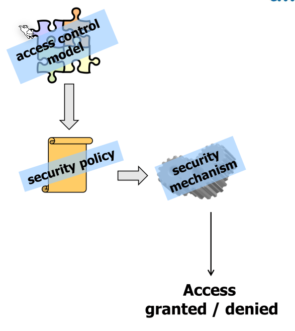

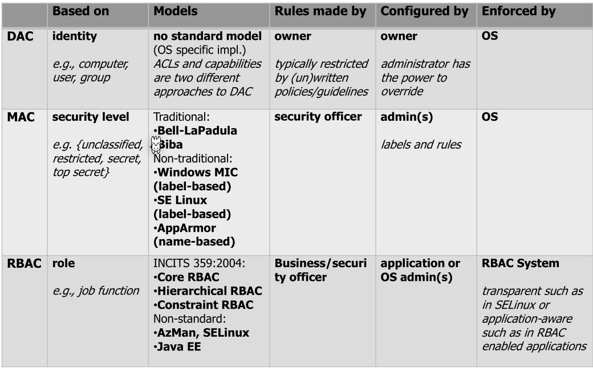

## Security Policy

The security policy defines who is allowed to do what and often is role based. The security policy is defined by the business requirement. The security administrator then reads and implements this document.

A problem can be authorisation creep when users change roles and their security roles grow and grow. Alternatively, an old role might also be extended. Employees are usually trustworthy. However, these roles become important if an account gets hacked.

ITIL defines the following process for managing the access control:

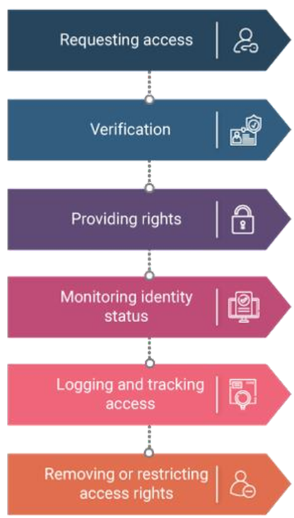

## Discretionary Access Control (DAC)

The user and group of a file has full discretion who can do what.  DAC can be implemented in multiple ways, like ACL or user-group-other schema.

Usually there is a bypass, like the root user, as described in the following table:

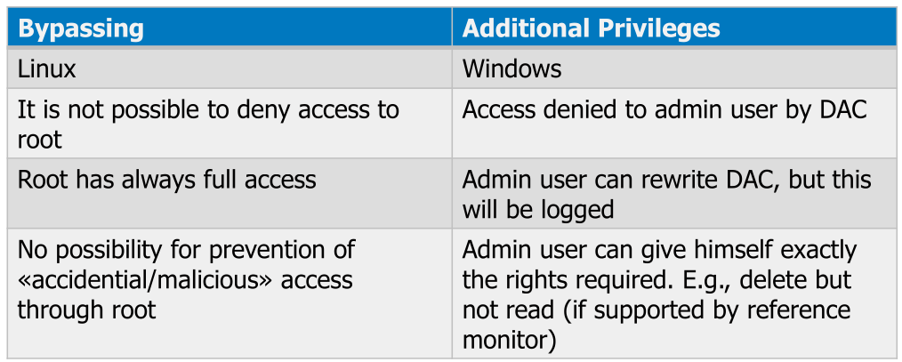

## Access Control List (ACL)

ACL is a list of permissions for each subject. 

The standard Linux permissions can be implemented with ACL (but rarely are since they are just bitmasks).

## Standard Linux Permission Model

### Linux vs Windows

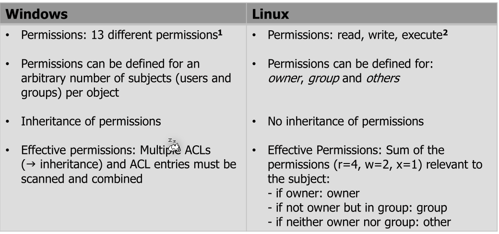

## Capability

A capability is a unforgeable token owned by a subject the contains all the granted permissions (e.g. `[ (port 80, {read,write}), (/var/www, {read,write}) ,… ]`).

Tokens can be given to other subjects/processes which then "inherit" those permissions.

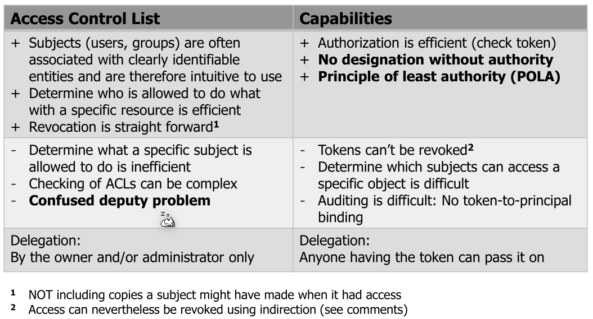

## Confused Deputy Problem

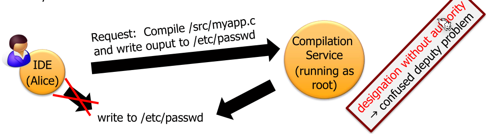

One problem with ACL implementation is when a user delegates something to an other process (a deputy) with higher privileges. The deputy then needs to do authorisation.

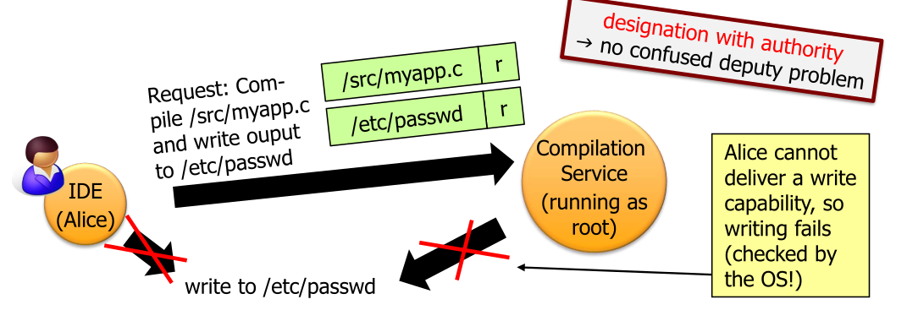

Capabilities solves this problem since Alice would give the compiling service her token which is then used by the compilation service. This is called Confused Deputy Problem

One problem with ACL implementation is when a user delegates something to an other process (a deputy) with higher privileges. The deputy then needs to do authorisation.

Capabilities solves this problem since Alice would give the compiling service her token which is then used by the compilation service.  This is called **Principle of Least Authority or Principle of Least Privilege**.

## Mandatory Access Control (MAC)

MAC allows a system administrator to specify system-wide policies. Importantly, these can't be altered by a normal user in comparison to DAC.

Concrete implementations are SELinux and AppArmor.

### Windows

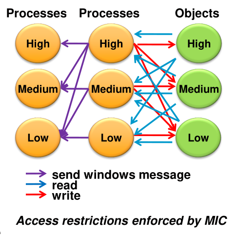

Windows has integrity levels (IL), which **TODO**

The following are some commands used for Windows administration:

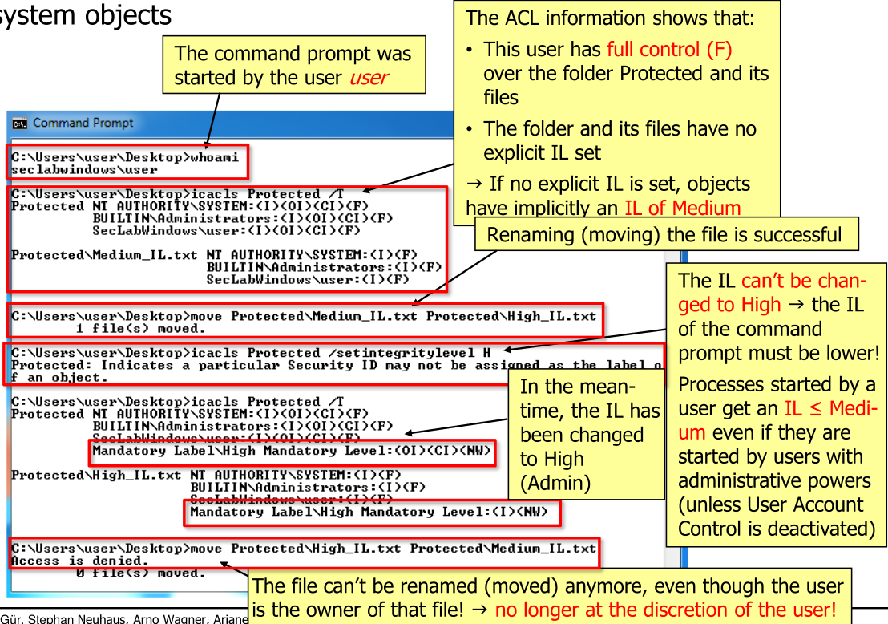

## Role-Based Access Control (RBAC)

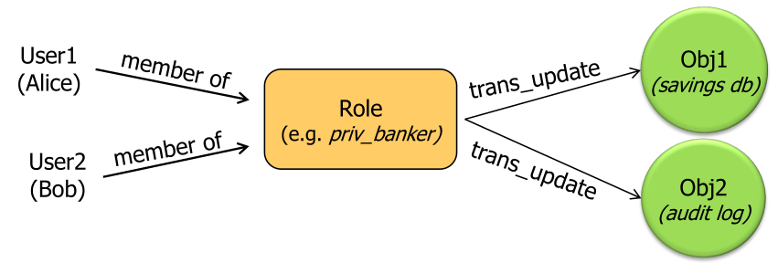

Role based access control can be a natural way for "normal" users to express what permissions a user has (e.g. a user should have the role of a developer).

RBAC can support the following three security principles: **TODO details of principles**

* Principle of least privilege (or authority)
  By defining the roles and associated permissions of these roles in an organisation and then associate each user one ore more roles
* Separation of duty
  
* Data abstraction
  

## Attribute Based Access Control (ABAC)

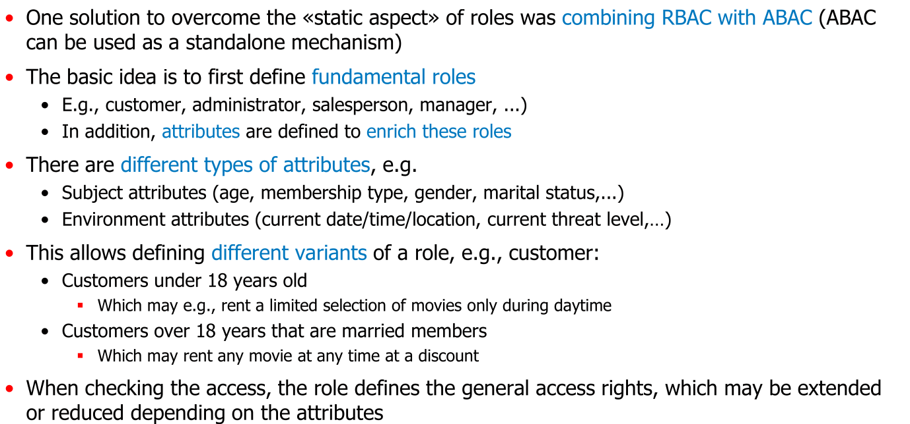
