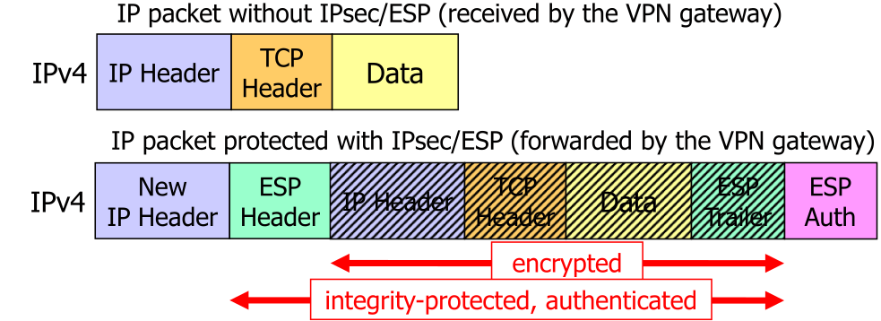

# IPSec

IPSec enables secure end-to-end communication at the network IP layer. This means all protocols on top of IP, like TCP, UDP, ICMP, ... are protected. However, this also means that IPSec needs to be supported by the kernel and all application on the host have access to the tunnel, since it is not application specific.

IPSec functions similar to a VPN, like OpenVPN.

In the following diagram is shown how a IP packet is wrapped in an ESP IPSec packet.

If IPsec receives a duplicate `SeqNr`, then the second packet is dropped.

## Tunnel Mode

IPsec can be used in a tunnel mode, where the whole IP-Packet is packaged in the IPsec packet. This allows IPsec to be used as a VPN-protocol