# Layer 2 - Data Link

Except in wireless networks, layer 2 security is uncommon, since layer 2 security only secures hop-to-hop communication, rather then end-to-end. 

## Extensible Authentication Protocol (EAP)

EAP is an extensible **authentication** protocol implemented on layer 2.

EAP sends the following packates:

There are multiple types defined for the authentication protocol. The following list is not exhaustive.

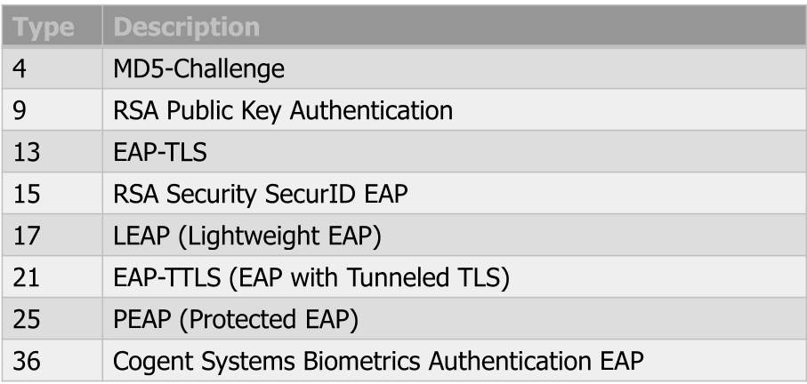

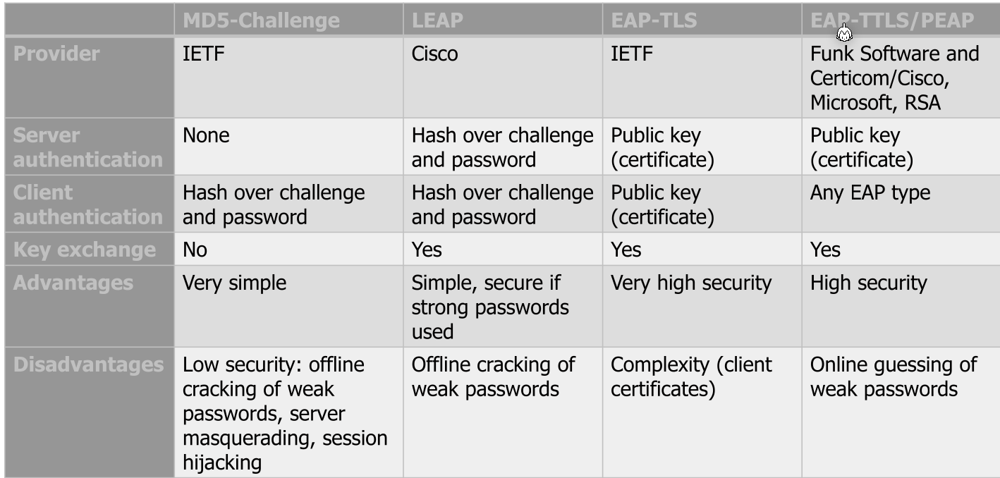

## IEEE 802.1X

This is a port-based (as in Ethernet jacks) acccess control for LANs. By default the LAN port is not open. If a client connects to it, it first has to authenticate itself. For the authentication part, EAP is used.

However, IEEE 802.1X is not very effective. It protects against an attacker which has physical hardware access. But with the following steps, it can be circumvent:

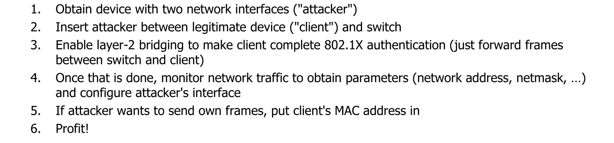

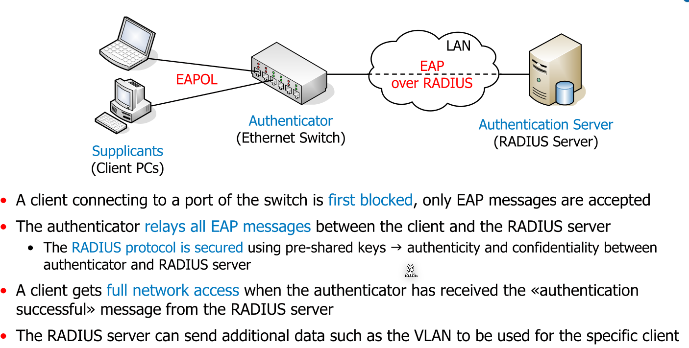

The actual flow of communication looks the following:

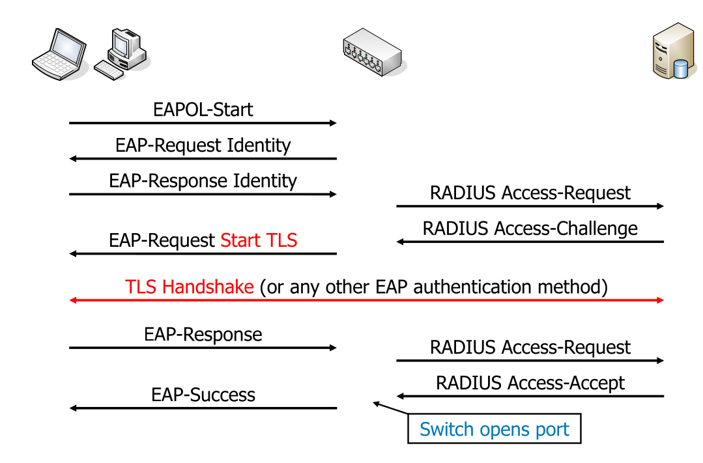

## WLAN

Because there is no cable and everything is sent as broadcast, it becomes trivial to sniff packets. 

### WEP

In WEP every AP and client shares the **same** preconfigured long-term key. Since all clients use the same key, everybody who knows the key can read everything on the network.

An additional problem is that the key is only either 40bits or 104 bits and uses RC4 encryption (which is broken).

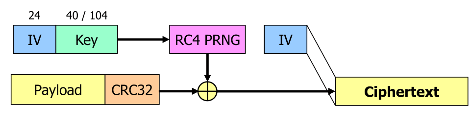

The following issues exist:

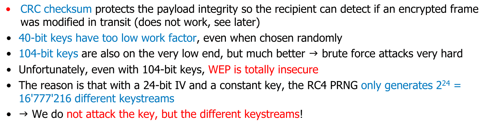

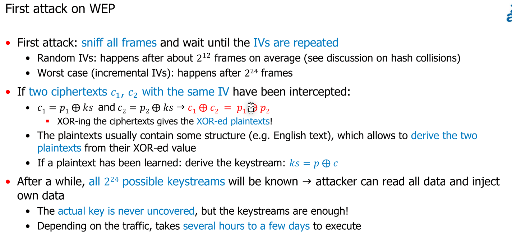

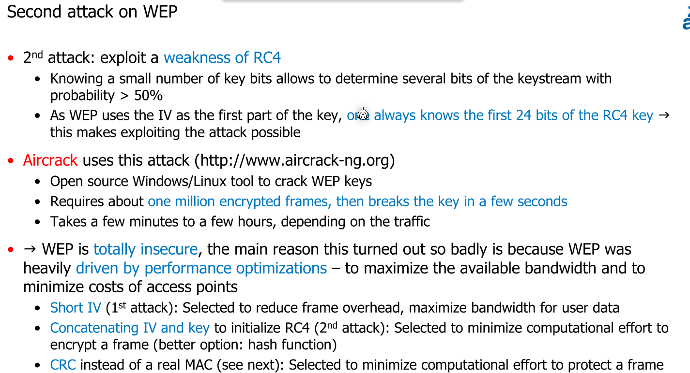

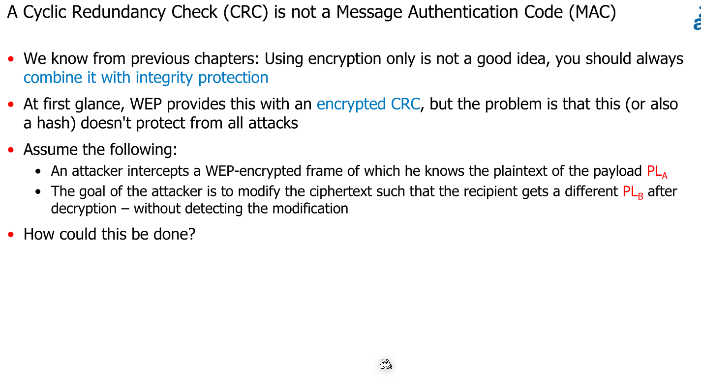

### WPA (WiFi Protected Access)

In WPA clients have to first authenticate themselves at the access point. This can be done with IEEE 802.1X either with EAP and a RADIUS Server or WPA-Enterprise. Alternatively, pre-shared keys (PKS) can be used.

Compared to WEP, every client gets its own key and different clients cannot listen in on each other. To still enable broadcast functionality, two sets of 128 bit keys are needed:

1. For unicast communication (This key is unique per device and session)
2. For broadcast communication (This key is the same for all clients)

To avoid the IV-wrap around issue, the keys are periodically exchanged.

#### Key Exchange

To communicate in a WPA/WPA2 WLAN, a client needs the master key, which can be obtained by either with IEEE 802.1X (based on EAP) or with pre-shared keys (PKS).

When using IEEE, 802.1X the following describes the flow of information (assuming EAP-TLS is used):

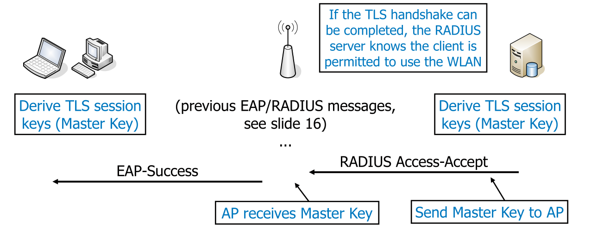

If pre-shared keys (PKS) is used, then following diagram describes the flow:

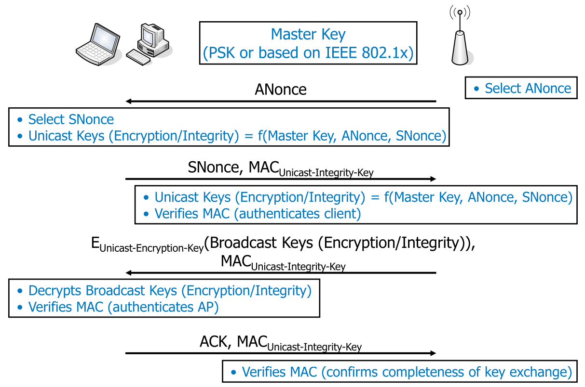

#### Temporary Key Integrity Protection (TKIP)

TKIP uses a MAC to protect against the integrity vulnerabilities of WEP. 

TKIP has the following weaknesses:

* The MAC, Micheal, is a two-way function, which enables attackers to learn the integrity key if they know both the plaintext and the MAC
* RC4 has significant weakness

*(This algorithms were chosen for their performance and backwards compatibility with WEP)*

Because of these weaknesses TKIP shouldn't be used today as it is insecure.

#### CBC-MAC Protocol (CCMP)

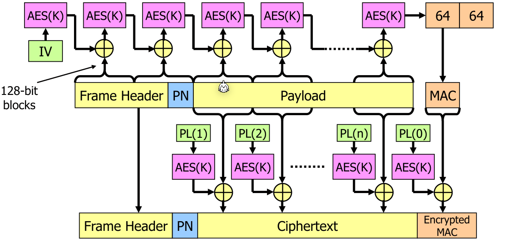

In the packet, there are headers, a packet number (PN) to prevent replay attacks and the actual payload. $PL(x)$ is based on $PN$ and a block counter $x$ and is unique p

This also protects the header from modification, which is important to protect against attacker redirecting packets to them self. 