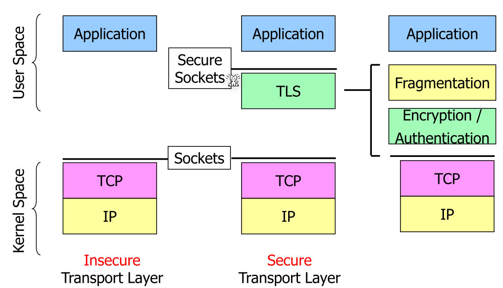
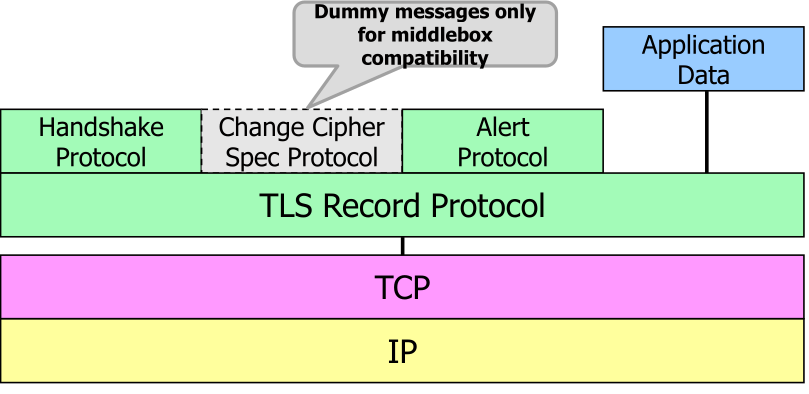
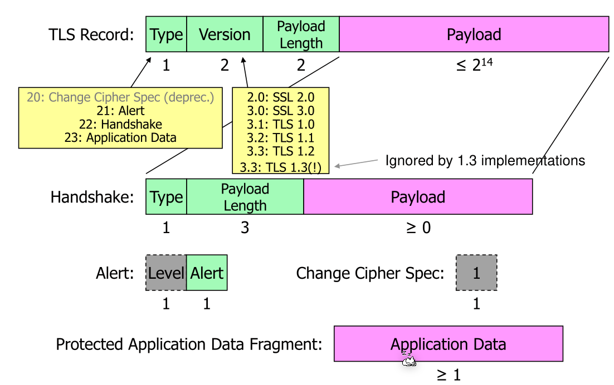
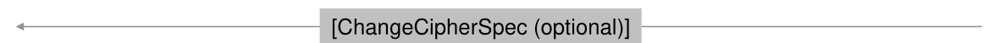
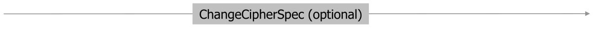
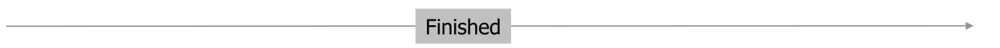
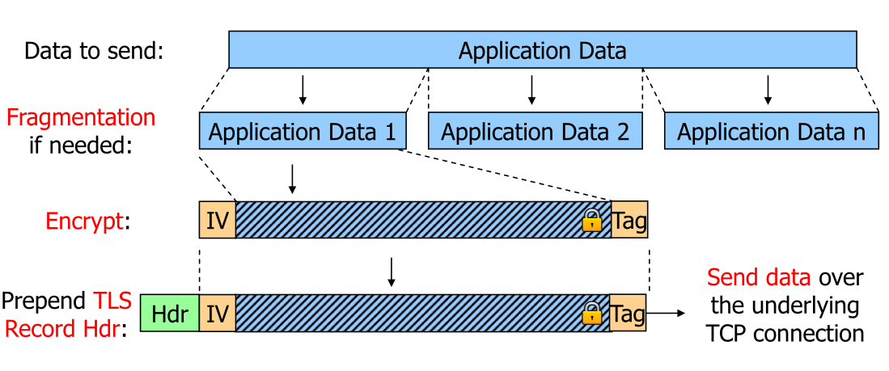

# TLS (Transport Layer Security)

TLS works on top of TCP and can be implemented in user mode. Each application can use their own implementation independent of the OS. Additionally, TLS doesn't has to worry about lost and re-transmitted data, since this is already handled by the TCP.

TLS provides authenticated, integrity-protected and confidential data exchange in addition to disallowing replaying and deleting of messages.

There are numerous usage of TLS in different protocols: HTTPS, POS3S, SMTPS, FTPS (not SFTP which is over SSH), IMAPS, ...

TLS operates in three phases:

1. Handshake
   Both party authenticate and exchange cryptographic algorithms and key material
2. Data Exchange
3. Connection Tear Down

TLS implements its own fragmentation. This can also be seen in the diagram above.

## TLS Record

TLS defines multiple "protocols" for different purposes. Each of those protocols send a TLS message in the following format:

The payload can be a handshake package, an alert package or a change cipher spec. 

## TLS Handshake

When the server and client first communicate, neither have a previous association or shared secret. Only the root certificate is known to the client.

To bootstrap the connection, the following steps are executed:

1. Negotiate the algorithms used
2. Client and server perform a Diffie-Hellman
3. Client and Server generate handshake keys
4. Server authenticates to client
5. Client and server proof to each other that the previous messages weren't tampered with
6. Client and server generate data keys

The following messages can be transmitted with only 3 IP datagrams by sending the following:

1. Client->Server: `ClientHello`
2. Server->Client: `ServerHello, authentication messages, Finished`
3. Client->Server: `Finished`

First the used algorithms are negotiated. To do this, the client sends a `ClientHello` message with the supported TLS versions, encryption algorithms (e.g. AES, 128bit keys, with CGM, and SHA-256 for HKDF), the groups for the Diffie-Hellman key exchange (e.g. X25519, P256, ...). If X25519 or P-256 is supported, the public key of the client are sent as well.

Notable is, that all lists are sorted by the preference of the client, meaning that the server should choose the first algorithm which it also supports.

The server response with a `ServerHello` which contains the chosen algorithms. For example: TLS 1.3 with "AES 128-bit keys, GCM, SHA-256 for HKDF", X25519 with the following server public key.

Similar, if X25519 or P-256 is used, the public key of the server is sent back.

From this point on all traffic is **encrypted**. 

The server sents back the certificate chain in `Certificate`, which gets validated by the client. 

In `CertificateVerify` is a signature over the previous handshake messages with the private key of the server certificate. This allows the client to verify that the previously received messages are legit.

By this point, the server is **authenticated**.

In `Finished`, the sever sends a hash over all handshake messages. The client does the same and compares. If the hashes match, both have received what the other has sent.

The client will **encrypt** everything from now on.

The client sends a hash over all handshake messages which gets checked by the server.

If this passes, both the server and client have proven that the handshakes weren't tampered with.

Afterwards, use the HKDF (hashed based key derivation function) algorithm to derive a data key from the exchanged handshake keys.

### TLS Client Authentication

The server can request that the client has to authenticate them self by sending a `CertificateRequest` during the handshake.

The client response with a `Certificate` and a `CertificateVery` message of its own (similar to what the server sends to the client to authenticate itself).

## TLS Session Resumption

To  reduce the load on a server, a TLS session can be resumed.

After the `Finished` message, the server **may** send a `NewSessionTicket` message, encrypted by the handshake keys. The contents are a preshared key-**identifier** with which the client can find the preshared key from the last session. Only one session can be opend per `NewSessionTicket`. However, the server can send multiple `NewSessionTickets`.

The client response with a preshared key identifier itself.

Everything is fine... connection established

## Application Data

The tag functions as a signature which ensures that nobody tampered with the data (by e.g. removing some bytes blindly). Both the server and client count each fragment and the counter is an input for the calculation of the tag. This mitigates replay attacks.

The fragmentation on TLS level is needed as the client needs the tag to ensure the body is actually valid. This ensures that the client gets the data in a timely fashioned.

## TLS Tear Down

**TODO**

## Security Analysis

## DTLS

With DTLS one can use TLS over UDP. Using "normal" TLS over UDP doesn't work as TLS assumes that if packets are duplicated, reordered or don't make it, then this is an attack.

DTLS re-implements TCP's reliability for the handshake (things like re-transmissions and reordering).

For the actual data frames, sequence numbers are in the message itself.

